# Technical Specification: Advanced Filtering & Screening System

**Issue**: #2  
**Epic**: #1  
**Status**: Draft  
**Author**: Solution Architect Agent  
**Date**: 2026-02-14  
**Related ADR**: [ADR-2.md](../adr/ADR-2.md)  
**Related UX**: [UX-2.md](../ux/UX-2.md)

> **Acceptance Criteria**: Defined in the PRD user stories — see [PRD-options-scanner-v2.md](../prd/PRD-options-scanner-v2.md#5-user-stories--features). Engineers should track AC completion against the originating Story issue (US-1.1 through US-1.5).

---

## Table of Contents

1. [Overview](#1-overview)
2. [Architecture Diagrams](#2-architecture-diagrams)
3. [API Design](#3-api-design)
4. [Data Model Diagrams](#4-data-model-diagrams)
5. [Service Layer Diagrams](#5-service-layer-diagrams)
6. [Security Diagrams](#6-security-diagrams)
7. [Performance](#7-performance)
8. [Testing Strategy](#8-testing-strategy)
9. [Implementation Notes](#9-implementation-notes)
10. [Rollout Plan](#10-rollout-plan)
11. [Risks & Mitigations](#11-risks--mitigations)
12. [Monitoring & Observability](#12-monitoring--observability)

---

## 1. Overview

Build a multi-parameter filtering and screening system for the Options Scanner frontend that enables traders to filter scan results by IV Percentile, Volume/OI Ratio, Delta, DTE, Theta, and Vega using dual-handle range sliders and quick-select chips. Includes a preset management system (save/load up to 5 filter configurations) and responsive layouts (table for desktop, cards for mobile).

**Scope:**
- In scope: Filter UI components (RangeSlider, FilterChip, PresetChip, ResultsTable, ResultsCards, FilterPanel, PresetsBar), FilterContext state management, debounced API integration with `/api/scan`, localStorage preset storage, responsive breakpoints, accessibility (WCAG 2.1 AA), URL filter serialization
- Out of scope: Backend filter logic changes (assumed `/api/scan` accepts query params), user authentication for preset sync, alert system integration, strategy builder integration

**Success Criteria:**
- Filter response time <2 seconds (P90) for 500+ ticker results
- All 6 filter parameters functional with range selection
- Save/load 5 presets with one-click activation
- WCAG 2.1 AA keyboard navigation and screen reader support
- Responsive layout switches at 768px and 1024px breakpoints

---

## 2. Architecture Diagrams

### 2.1 High-Level Component Architecture

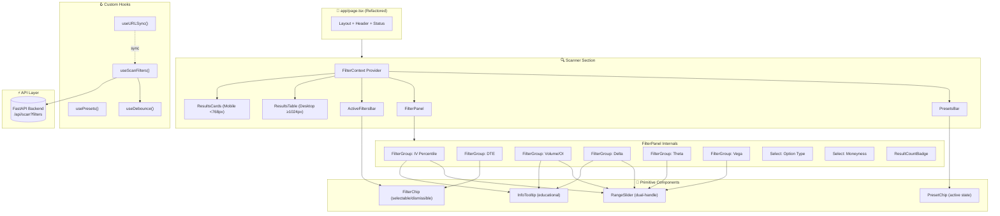

### 2.2 Sequence Diagram: Filter Change Flow

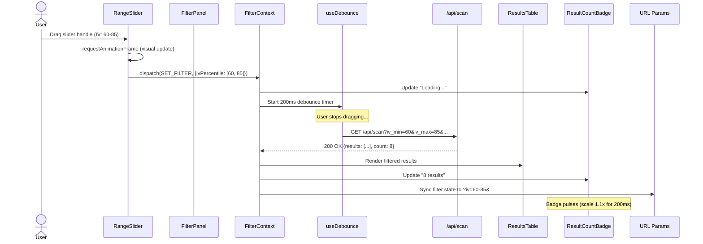

### 2.3 Sequence Diagram: Preset Save/Load Flow

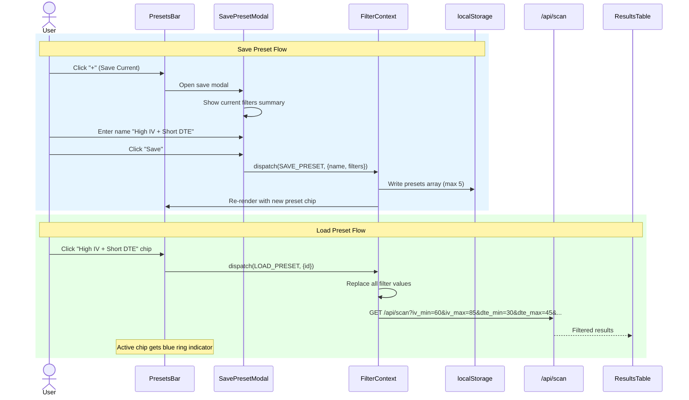

### 2.4 Component Tree Diagram

```mermaid
graph TD
    subgraph Root["app/page.tsx"]
        H["Header + RunScan Button"]
        S["Status Section (unchanged)"]
        SP["Scanner Section"]
        P["Portfolio Section (unchanged)"]
        W["Watchlist Section (unchanged)"]
        ML["Multi-Leg Section (unchanged)"]
        AT["Active Trades (unchanged)"]
        DG["Diagnostics (unchanged)"]
    end

    subgraph ScannerProvider["FilterProvider wrapper"]
        SP --> PBR["PresetsBar"]
        SP --> FPL["FilterPanel"]
        SP --> AFR["ActiveFiltersBar"]
        SP --> RTB["ResultsTable / ResultsCards"]
    end

    subgraph PresetsBarDetail["PresetsBar"]
        PBR --> PC1["PresetChip × N"]
        PBR --> ADDB["Add Preset Button"]
        PBR --> SPML["SavePresetModal"]
    end

    subgraph FilterPanelDetail["FilterPanel"]
        FPL --> TGL["Toggle Button (expand/collapse)"]
        FPL --> FGIV["FilterGroup: IV Percentile + RangeSlider + InfoTooltip"]
        FPL --> FGDTE["FilterGroup: DTE + ChipGroup + NumberInput"]
        FPL --> FGVOI["FilterGroup: Volume/OI + RangeSlider + InfoTooltip"]
        FPL --> FGD["FilterGroup: Delta + RangeSlider + InfoTooltip"]
        FPL --> FGT["FilterGroup: Theta + RangeSlider"]
        FPL --> FGV["FilterGroup: Vega + RangeSlider"]
        FPL --> OTD["Select: Option Type"]
        FPL --> MND["Select: Moneyness"]
        FPL --> RCBT["ResultCountBadge"]
    end

    subgraph ActiveFiltersDetail["ActiveFiltersBar"]
        AFR --> DFC["DismissibleFilterChip × N"]
        AFR --> CLR["Clear All Button"]
    end
```

---

## 3. API Design

### 3.1 Endpoints

The filtering feature uses the existing `/api/scan` endpoint with new query parameters. No new endpoints are required.

| Method | Endpoint | Description | Auth | Rate Limit |
|--------|----------|-------------|------|------------|
| GET | `/api/scan` | Scan with optional filter parameters | No (MVP) | 30/min (existing) |

### 3.2 Request/Response Contract

#### GET /api/scan (with filter params)

**Query Parameters:**

| Parameter | Type | Default | Description |
|-----------|------|---------|-------------|
| `iv_min` | float | 0 | IV Percentile minimum (0-100) |
| `iv_max` | float | 100 | IV Percentile maximum (0-100) |
| `dte_min` | int | 0 | Days to expiration minimum |
| `dte_max` | int | 365 | Days to expiration maximum |
| `vol_oi_min` | float | 0 | Volume/OI ratio minimum |
| `vol_oi_max` | float | 999 | Volume/OI ratio maximum |
| `delta_min` | float | -1.0 | Delta minimum |
| `delta_max` | float | 1.0 | Delta maximum |
| `theta_min` | float | -10.0 | Theta minimum |
| `theta_max` | float | 0 | Theta maximum |
| `vega_min` | float | 0 | Vega minimum |
| `vega_max` | float | 10.0 | Vega maximum |
| `option_type` | string | "all" | "all", "call", or "put" |
| `moneyness` | string | "all" | "all", "itm", "atm", "otm" |
| `min_volume` | int | 0 | Minimum daily volume |
| `sort_by` | string | "iv_percentile" | Sort field |
| `sort_dir` | string | "desc" | "asc" or "desc" |
| `limit` | int | 100 | Max results (1-500) |
| `offset` | int | 0 | Pagination offset |

**Example Request:**
```
GET /api/scan?iv_min=60&iv_max=85&dte_min=30&dte_max=45&vol_oi_min=1.5&delta_min=0.2&delta_max=0.4&option_type=call&sort_by=volume_oi&sort_dir=desc&limit=50
```

**Response (200 OK):**

```
┌─────────────────────────────────────────────────────────┐
│ {                                                       │
│   "results": [                                          │
│     {                                                   │
│       "symbol": "AAPL",                                 │
│       "option_type": "call",                            │
│       "strike": 185.00,                                 │
│       "expiration": "2026-03-21",                       │
│       "dte": 35,                                        │
│       "iv_percentile": 72.5,                            │
│       "volume": 12500,                                  │
│       "open_interest": 3900,                            │
│       "volume_oi_ratio": 3.21,                          │
│       "delta": 0.35,                                    │
│       "theta": -0.12,                                   │
│       "vega": 0.45,                                     │
│       "gamma": 0.02,                                    │
│       "bid": 4.20,                                      │
│       "ask": 4.35,                                      │
│       "last": 4.28,                                     │
│       "underlying_price": 182.50                        │
│     }                                                   │
│   ],                                                    │
│   "total_count": 42,                                    │
│   "filtered_count": 8,                                  │
│   "cache_age_seconds": 15,                              │
│   "data_delay_minutes": 15                              │
│ }                                                       │
└─────────────────────────────────────────────────────────┘
```

### 3.3 Error Responses

| Status | Condition | Response Body |
|--------|-----------|---------------|
| 400 | Invalid filter param (e.g., `iv_min=abc`) | `{"error": "Validation", "message": "iv_min must be a number between 0 and 100"}` |
| 429 | Rate limit exceeded | `{"error": "RateLimit", "message": "Too many requests", "retryAfter": 60}` |
| 500 | Backend/Yahoo Finance error | `{"error": "Internal", "message": "Scan failed", "cache_available": true}` |
| 503 | Yahoo Finance API down | `{"error": "Unavailable", "message": "Data source unavailable", "last_cache": "2026-02-14T10:30:00Z"}` |

---

## 4. Data Model Diagrams

### 4.1 TypeScript Interface Diagram

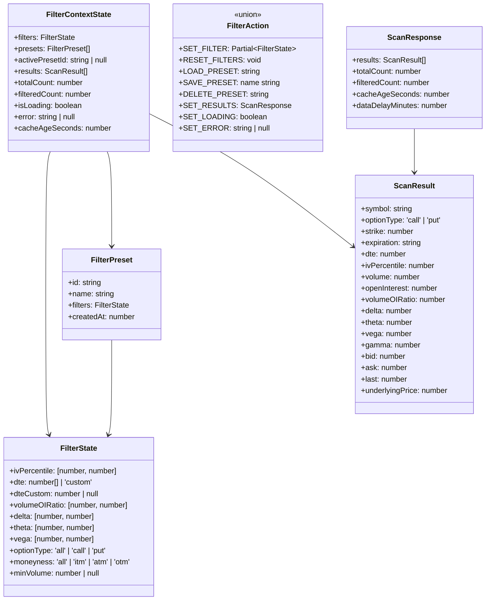

### 4.2 Default Filter Values

| Filter | Type | Default Min | Default Max | Step | Unit |
|--------|------|-------------|-------------|------|------|
| IV Percentile | Range | 0 | 100 | 1 | % |
| DTE | Chips + Custom | 0 | 365 | 1 | days |
| Volume/OI Ratio | Range | 0.5 | 10.0 | 0.1 | × |
| Delta | Range | -1.0 | 1.0 | 0.05 | Δ |
| Theta | Range | -0.50 | 0 | 0.01 | $/day |
| Vega | Range | 0 | 2.0 | 0.05 | $/1%IV |
| Option Type | Select | — | — | — | enum |
| Moneyness | Select | — | — | — | enum |
| Min Volume | Number | 0 | — | 1 | contracts |

### 4.3 Preset Storage Schema (localStorage)

```
┌─────────────────────────────────────────────────────────────┐
│ Key: "options-scanner-filter-presets"                        │
│ Value: JSON array (max 5 items)                             │
│                                                             │
│ [                                                           │
│   {                                                         │
│     "id": "uuid-v4",                                        │
│     "name": "High IV + Short DTE",                          │
│     "filters": { ...FilterState },                          │
│     "createdAt": 1708000000000                              │
│   },                                                        │
│   ...                                                       │
│ ]                                                           │
│                                                             │
│ Constraints:                                                │
│   - Max 5 presets (reject save if full, show "3 of 5")     │
│   - Preset name: 1-50 characters, trimmed                  │
│   - Unique names enforced (case-insensitive)               │
│   - Invalid JSON gracefully handled (reset to [])          │
└─────────────────────────────────────────────────────────────┘
```

---

## 5. Service Layer Diagrams

### 5.1 Custom Hooks Architecture

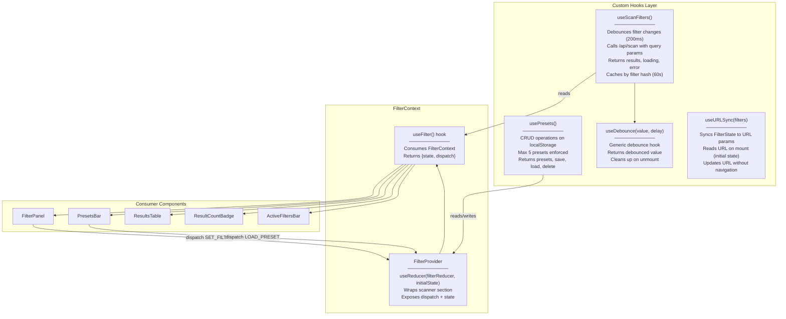

### 5.2 Filter Reducer State Machine

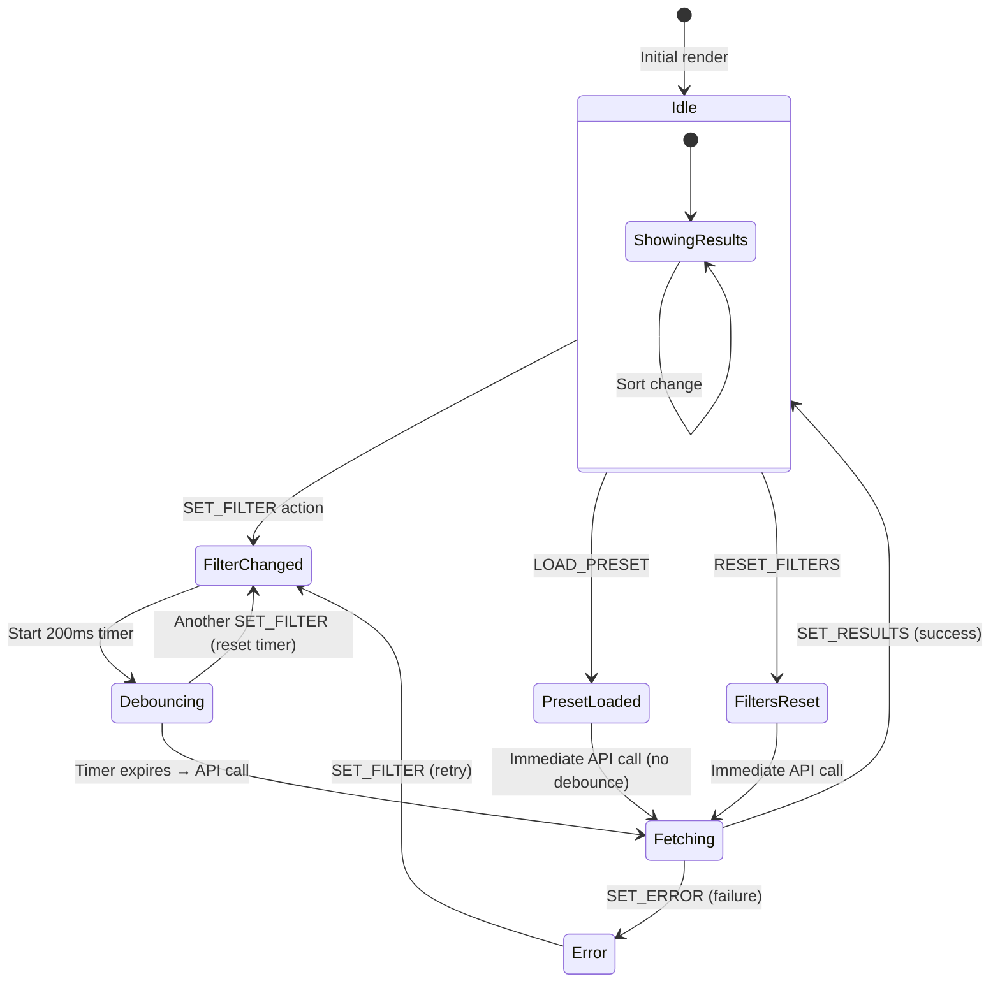

---

## 6. Security Diagrams

### 6.1 Client-Side Security Model

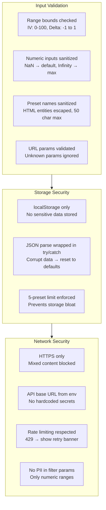

### 6.2 XSS Prevention

```
┌─────────────────────────────────────────────────────────┐
│ XSS Prevention Strategy                                  │
├─────────────────────────────────────────────────────────┤
│                                                         │
│ 1. React auto-escapes JSX output (default protection)   │
│ 2. No dangerouslySetInnerHTML usage                     │
│ 3. Preset names: strip HTML tags before save            │
│ 4. URL params: parsed with URLSearchParams (safe)       │
│ 5. API responses: typed interfaces prevent injection    │
│ 6. Tooltip content: static strings, not user input      │
│                                                         │
└─────────────────────────────────────────────────────────┘
```

---

## 7. Performance

### 7.1 Caching Strategy

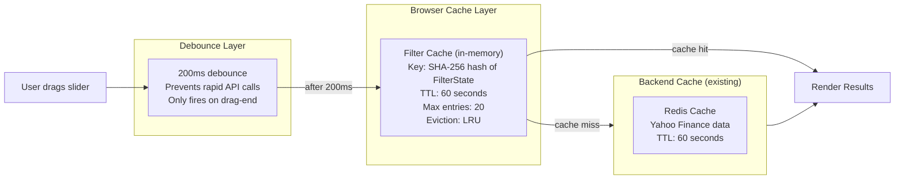

### 7.2 Performance Requirements

| Metric | Target | Measurement |
|--------|--------|-------------|
| Filter-to-results (cached) | <100ms | Time from filter change to results render (cache hit) |
| Filter-to-results (API call) | <2,000ms | P90 time including API round-trip |
| Slider frame rate | 60fps | requestAnimationFrame visual updates |
| Initial page load (LCP) | <2,500ms | Largest Contentful Paint |
| Results table render (100 rows) | <50ms | React render + DOM paint |
| Results table render (500 rows) | <100ms | With react-window virtualization |
| Preset load (localStorage) | <10ms | Read + parse + state update |
| Memory (500 results) | <5MB | Heap snapshot |

### 7.3 Optimization Strategies

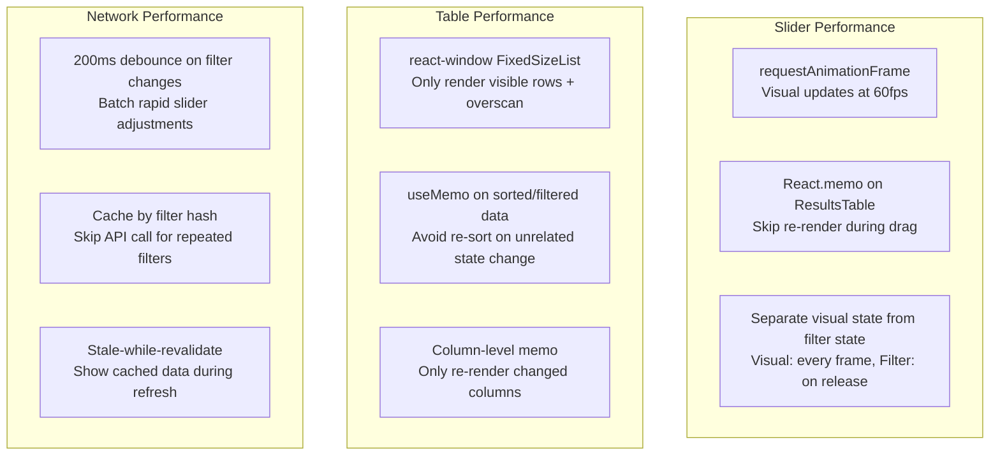

---

## 8. Testing Strategy

### 8.1 Test Pyramid

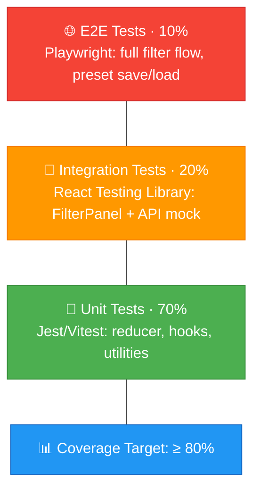

### 8.2 Test Scope by Component

| Component | Test Type | Key Scenarios |
|-----------|-----------|---------------|
| `filterReducer` | Unit | SET_FILTER updates state, RESET restores defaults, LOAD_PRESET replaces all values, SAVE_PRESET enforces 5-max |
| `useDebounce` | Unit | Debounces value changes, cleans up timer on unmount, fires immediately when delay=0 |
| `useScanFilters` | Unit + Integration | Serializes FilterState to query params, handles 200/400/429/500 responses, caches by hash |
| `usePresets` | Unit | Read/write localStorage, handle corrupt JSON, enforce 5-preset limit, unique names |
| `RangeSlider` | Unit + Integration | Keyboard: Arrow ±1, Shift+Arrow ±5, Home/End min/max; Touch: 44px target; ARIA: valuemin/max/now/text |
| `FilterChip` | Unit | Toggle selected state, dismiss callback, keyboard Space/Enter |
| `FilterPanel` | Integration | Expand/collapse toggle, all filter groups render, result count updates |
| `ResultsTable` | Integration | Sort by column, expand row, render 500 rows without lag |
| `ResultsCards` | Integration | Card layout renders, Track button fires callback |
| `PresetsBar` | Integration | Load preset updates all filters, save modal validates name, delete with confirmation |
| Full filter flow | E2E (Playwright) | Set IV 60-85 → DTE 30-45 → verify result count → save preset → reload page → load preset → verify same results |

### 8.3 Accessibility Testing

| Test | Tool | Criteria |
|------|------|----------|
| Keyboard navigation order | Manual + Playwright | Tab order: Presets → Toggle → IV → DTE → Vol/OI → Delta → Theta → Vega → Type → Moneyness → Results |
| Slider keyboard control | Jest + RTL | ArrowRight/Left ±1, Shift+Arrow ±5, Home→min, End→max |
| Screen reader announcements | axe-core + manual | "Filters updated. 8 results match." on filter change |
| Color contrast | axe-core | All text ≥4.5:1 against dark background |
| ARIA attributes | Jest + RTL | `role="slider"`, `aria-valuemin/max/now/text` on all sliders |

---

## 9. Implementation Notes

### 9.1 Directory Structure

```
app/
  page.tsx                         # Refactored — imports ScannerSection
  components/
    scanner/
      ScannerSection.tsx           # FilterProvider + composed layout
      FilterContext.tsx            # Context + reducer + types
      FilterPanel.tsx              # Collapsible filter panel container
      PresetsBar.tsx               # Preset chips + save button
      SavePresetModal.tsx          # Name input + filter summary
      ActiveFiltersBar.tsx         # Dismissible filter chips + Clear All
      ResultsTable.tsx             # Desktop table (≥1024px) with sort + expand
      ResultsCards.tsx             # Mobile card layout (<768px)
      FilterGroup.tsx              # Label + tooltip + filter control wrapper
    primitives/
      RangeSlider.tsx              # Dual-handle range slider (generic)
      FilterChip.tsx               # Selectable/dismissible chip (generic)
      PresetChip.tsx               # Preset chip with active state
      InfoTooltip.tsx              # Educational tooltip with hover/focus
      ResultCountBadge.tsx         # Live result count with pulse animation
      Select.tsx                   # Styled select dropdown
      NumberInput.tsx              # Numeric input with validation
  hooks/
    useScanFilters.ts              # Debounced API fetch with cache
    usePresets.ts                  # localStorage preset CRUD
    useDebounce.ts                 # Generic debounce hook
    useURLSync.ts                  # Filter ↔ URL param sync
  types/
    scanner.ts                     # FilterState, ScanResult, Preset, etc.
  utils/
    filterSerializer.ts            # FilterState → query params + hash
    filterDefaults.ts              # Default values, DTE_RANGES constant
  styles/
    scanner.module.css             # Component styles (CSS Modules)
```

### 9.2 Style Architecture

```
┌──────────────────────────────────────────────────────────────┐
│ Styling Approach: CSS Modules (*.module.css)                  │
├──────────────────────────────────────────────────────────────┤
│                                                              │
│ Why CSS Modules:                                             │
│  - Scoped class names (no conflicts with existing inline)    │
│  - Zero runtime cost (compiled at build time)                │
│  - IDE autocomplete support                                  │
│  - Existing globals.css variables still accessible           │
│  - No new dependency (Next.js built-in)                      │
│                                                              │
│ Migration strategy:                                          │
│  - New components use CSS Modules exclusively                │
│  - Existing page.tsx inline styles remain unchanged          │
│  - Shared design tokens in globals.css (:root variables)     │
│                                                              │
│ File convention:                                             │
│  - ComponentName.tsx → ComponentName.module.css              │
│  - Import: import styles from './ComponentName.module.css'   │
│                                                              │
└──────────────────────────────────────────────────────────────┘
```

### 9.3 Design Tokens (CSS Custom Properties)

Extend existing `globals.css` with new filter-specific tokens:

```
┌──────────────────────────────────────────────────────────────┐
│ :root (additions to globals.css)                             │
├──────────────────────────────────────────────────────────────┤
│                                                              │
│  /* Filter colors */                                         │
│  --filter-active: #1976d2                                    │
│  --filter-active-bg: rgba(25, 118, 210, 0.12)               │
│  --filter-active-border: rgba(25, 118, 210, 0.3)            │
│  --filter-active-text: #64b5f6                               │
│                                                              │
│  /* Unusual activity */                                      │
│  --amber-unusual: #f5a623                                    │
│  --amber-unusual-bg: rgba(245, 166, 35, 0.15)               │
│  --amber-unusual-border: rgba(245, 166, 35, 0.3)            │
│                                                              │
│  /* IV coloring */                                           │
│  --iv-high: #ef5350                                          │
│  --iv-low: #66bb6a                                           │
│                                                              │
│  /* Slider */                                                │
│  --slider-track: rgba(255, 255, 255, 0.15)                  │
│  --slider-fill: #1976d2                                      │
│  --slider-thumb: #e6edf7                                     │
│  --slider-thumb-size: 20px                                   │
│  --slider-track-height: 4px                                  │
│                                                              │
│  /* Spacing (formalized from existing) */                    │
│  --space-xs: 4px                                             │
│  --space-sm: 8px                                             │
│  --space-md: 12px                                            │
│  --space-lg: 16px                                            │
│  --space-xl: 24px                                            │
│  --space-xxl: 32px                                           │
│                                                              │
│  /* Z-index scale */                                         │
│  --z-base: 0                                                 │
│  --z-sticky: 10                                              │
│  --z-tooltip: 50                                             │
│  --z-modal: 100                                              │
│  --z-toast: 200                                              │
│                                                              │
└──────────────────────────────────────────────────────────────┘
```

### 9.4 Development Workflow

1. Create `app/types/scanner.ts` — all TypeScript interfaces
2. Create `app/utils/filterDefaults.ts` and `filterSerializer.ts` — pure functions
3. Create `app/hooks/useDebounce.ts` — generic, fully tested before use
4. Create `app/components/scanner/FilterContext.tsx` — reducer + provider + hook
5. Build primitives (RangeSlider, FilterChip, PresetChip, InfoTooltip, ResultCountBadge) — each with CSS Module + unit tests
6. Compose `FilterPanel.tsx` and `PresetsBar.tsx` from primitives
7. Build `ResultsTable.tsx` (desktop) and `ResultsCards.tsx` (mobile)
8. Create `useScanFilters.ts` — debounced API integration
9. Create `usePresets.ts` — localStorage CRUD
10. Compose `ScannerSection.tsx` — wraps everything in FilterProvider
11. Refactor `page.tsx` — replace scanner section with `<ScannerSection />`
12. Add `useURLSync.ts` — optional URL parameter synchronization
13. Accessibility pass — ARIA, keyboard, screen reader testing
14. Performance pass — React.memo, useMemo, react-window integration

---

## 10. Rollout Plan

### Phase 2a: Foundation (Week 5)
**Stories**: US-1.1 (IV Percentile Filter), US-1.5 (DTE Filter)
- TypeScript interfaces and utility functions
- FilterContext with reducer
- RangeSlider and FilterChip primitives
- FilterPanel with IV Percentile and DTE filter groups
- Unit tests for reducer, hooks, and primitives

**Deliverable**: Working filter panel with 2 filter types, no API integration

### Phase 2b: Full Filters + Results (Week 6)
**Stories**: US-1.2 (Volume/OI Filter), US-1.3 (Greeks Filter)
- Remaining filter groups (Volume/OI, Delta, Theta, Vega, Option Type, Moneyness)
- `useScanFilters` hook with debounced API calls
- ResultsTable (desktop) with sortable columns and expandable rows
- ResultsCards (mobile) with card layout
- ActiveFiltersBar with dismissible chips
- ResultCountBadge with real-time updates
- Integration tests for FilterPanel + API mock

**Deliverable**: Full filtering with results display, responsive layout

### Phase 2c: Presets + Polish (Week 7)
**Stories**: US-1.4 (Filter Presets)
- PresetsBar and SavePresetModal
- `usePresets` hook with localStorage
- `useURLSync` for shareable filter URLs
- Accessibility pass (ARIA, keyboard, screen reader)
- Performance optimization (React.memo, react-window)
- E2E tests (Playwright)
- CSS polish matching UX spec colors and animations

**Deliverable**: Production-ready filtering feature

---

## 11. Risks & Mitigations

| Risk | Impact | Probability | Mitigation |
|------|--------|-------------|------------|
| Backend `/api/scan` doesn't accept filter query params | High | Medium | Verify backend endpoint supports params before Week 5; if not, implement client-side filtering from cached full scan results as fallback |
| RangeSlider touch interaction jank on mobile | Medium | Medium | Use `touch-action: none` on slider track, test on real devices (iOS Safari, Android Chrome), fall back to native `<input type="range">` if custom slider is too complex |
| react-window integration complexity with expandable rows | Medium | Low | Use `VariableSizeList` instead of `FixedSizeList`; pre-calculate expanded row heights; fallback: skip virtualization until >200 results observed |
| Filter state desynchronization between URL, Context, and localStorage | Medium | Medium | URL sync is read-only on mount, write-only on filter change (single source of truth is Context); add consistency validation on preset load |
| Monolith refactor breaks existing sections | High | Low | Refactor only the scanner section; wrap existing Portfolio, Watchlist, Multi-Leg, Trades, Diagnostics sections in unchanged `<section>` tags; visual regression test with screenshots |
| CSS Modules conflict with existing globals.css | Low | Low | CSS Modules are scoped by default; only add new custom properties to `:root`; test that existing card/header styles are unaffected |

---

## 12. Monitoring & Observability

### 12.1 Client-Side Metrics

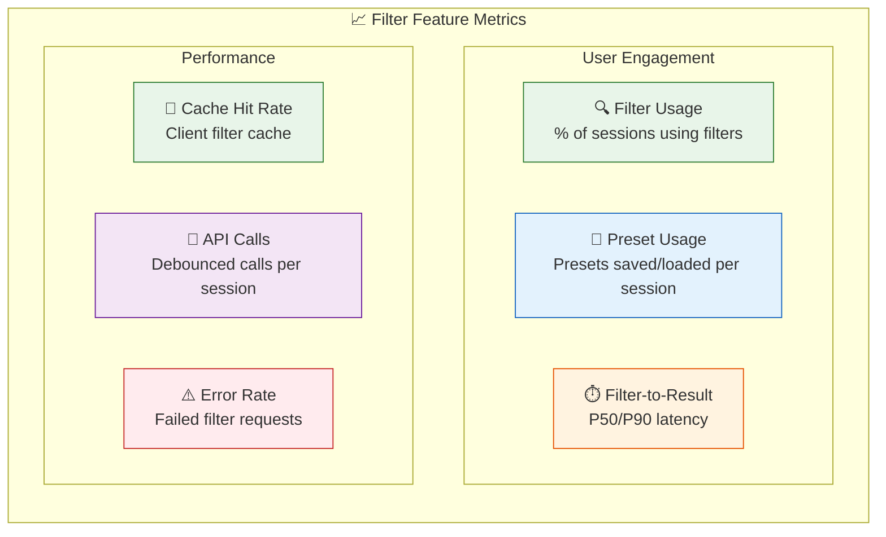

### 12.2 Logging Strategy

```
┌──────────────────────────────────────────────────────────────┐
│ Client-Side Logging (console + future analytics)             │
├──────────────────────────────────────────────────────────────┤
│                                                              │
│ filter:change    - Filter type + old/new values              │
│ filter:api_call  - Query params + response time + count      │
│ filter:cache_hit - Filter hash + cache age                   │
│ filter:error     - Error type + status code + retry flag     │
│ preset:save      - Preset name + filter count                │
│ preset:load      - Preset ID + result count                  │
│ preset:delete    - Preset ID                                 │
│ ui:panel_toggle  - Expand/collapse + filter count            │
│ ui:row_expand    - Symbol + option details                   │
│ ui:sort_change   - Column + direction                        │
│                                                              │
│ Privacy: No PII logged. Filter values are numeric ranges.   │
│ Volume: Estimated 5-10 events per filter session.            │
│                                                              │
└──────────────────────────────────────────────────────────────┘
```

### 12.3 Health Indicators

| Indicator | Healthy | Warning | Critical |
|-----------|---------|---------|----------|
| Filter API response time (P90) | <2s | 2-5s | >5s |
| Client cache hit rate | >60% | 30-60% | <30% |
| Filter error rate | <1% | 1-5% | >5% |
| Zero-result rate | <20% | 20-40% | >40% (suggest filter widening) |

---

## Cross-Cutting Concerns

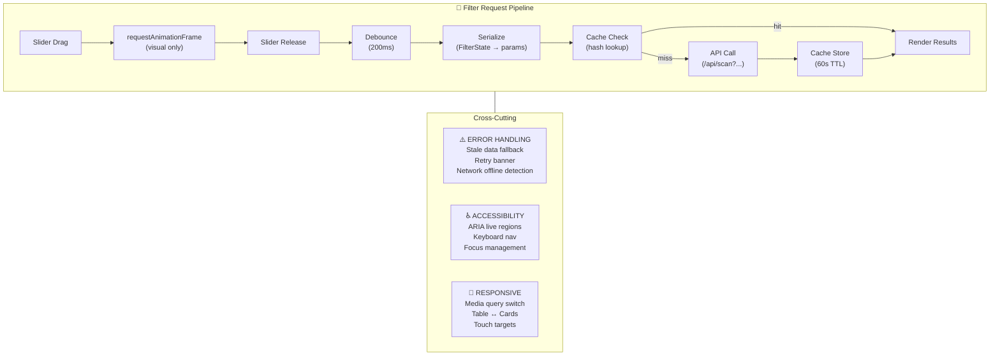

---

**Generated by AgentX Architect Agent**  
**Last Updated**: 2026-02-14  
**Version**: 1.0
