# Technical Specification: Multi-Leg Strategy Builder

**Issue**: #3  
**Epic**: #1  
**Status**: Draft  
**Author**: Solution Architect Agent  
**Date**: 2026-02-15  
**Related ADR**: [ADR-3.md](../adr/ADR-3.md)  
**Related UX**: [UX-3.md](../ux/UX-3.md)

> **Acceptance Criteria**: Defined in the PRD user stories — see [PRD-options-scanner-v2.md](../prd/PRD-options-scanner-v2.md#5-user-stories--features). Engineers should track AC completion against the originating Story issue (US-2.1 through US-2.5).

---

## Table of Contents

1. [Overview](#1-overview)
2. [Architecture Diagrams](#2-architecture-diagrams)
3. [API Design](#3-api-design)
4. [Data Model Diagrams](#4-data-model-diagrams)
5. [Service Layer Diagrams](#5-service-layer-diagrams)
6. [Security Diagrams](#6-security-diagrams)
7. [Performance](#7-performance)
8. [Testing Strategy](#8-testing-strategy)
9. [Implementation Notes](#9-implementation-notes)
10. [Rollout Plan](#10-rollout-plan)
11. [Risks & Mitigations](#11-risks--mitigations)
12. [Monitoring & Observability](#12-monitoring--observability)

---

## 1. Overview

Build a guided Multi-Leg Strategy Builder that enables traders to construct, visualize, and track 2-4 leg options strategies. The builder provides a wizard-style flow (template selection → underlying/expiration → leg configuration), real-time P&L visualization via client-side Black-Scholes, and integration with portfolio tracking.

**Scope:**
- In scope: Strategy wizard UI (TemplateSelector, LegEditor, PayoffChart, BreakevenDisplay, StrategyMetrics), StrategyContext state management, client-side Black-Scholes pricing, 5 strategy templates, Canvas-based payoff chart, strategy validation, portfolio tracking integration, responsive layout, accessibility (WCAG 2.1 AA)
- Out of scope: Server-side P&L calculation, backtesting engine, real-time streaming prices, user-defined template storage, strategy sharing/export, side-by-side strategy comparison (deferred to Phase 5+)

**Success Criteria:**
- P&L chart re-renders within 200ms of any leg change
- Black-Scholes calculation completes in <100ms for 4-leg strategy
- Canvas chart frame render <16ms (60fps during slider interaction)
- 5 strategy templates functional with sensible default leg configurations
- WCAG 2.1 AA keyboard navigation and screen reader support
- Responsive layout: 2-column desktop (≥1024px), stacked mobile (<768px)

---

## 2. Architecture Diagrams

### 2.1 High-Level Component Architecture

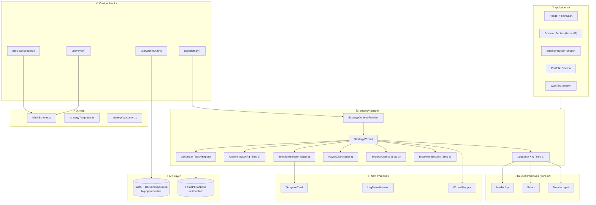

### 2.2 Sequence Diagram: Build Vertical Spread Flow

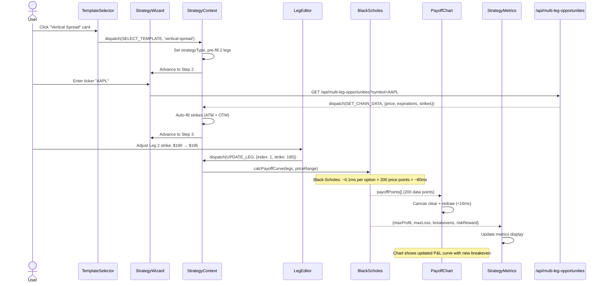

### 2.3 Sequence Diagram: Track Strategy in Portfolio

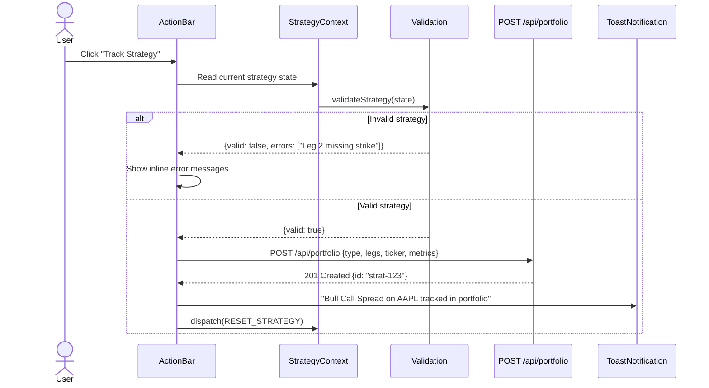

### 2.4 Component Tree Diagram

```mermaid
graph TD
    subgraph Root["app/page.tsx"]
        H["Header"]
        S["Scanner (Issue #2)"]
        SB["Strategy Builder Section"]
        P["Portfolio"]
        W["Watchlist"]
    end

    subgraph StrategyProvider["StrategyProvider wrapper"]
        SB --> WZ["StrategyWizard"]
    end

    subgraph WizardDetail["StrategyWizard"]
        WZ --> WST["WizardStepper (Step 1/2/3 indicator)"]
        WZ --> S1["Step 1: TemplateSelector"]
        WZ --> S2["Step 2: UnderlyingConfig"]
        WZ --> S3["Step 3: BuilderView"]
    end

    subgraph TemplateSelectorDetail["TemplateSelector"]
        S1 --> TC1["TemplateCard: Vertical Spread"]
        S1 --> TC2["TemplateCard: Iron Condor"]
        S1 --> TC3["TemplateCard: Straddle/Strangle"]
        S1 --> TC4["TemplateCard: Butterfly"]
        S1 --> TC5["TemplateCard: Calendar Spread"]
        S1 --> TC6["TemplateCard: Custom"]
    end

    subgraph UnderlyingDetail["UnderlyingConfig"]
        S2 --> TI["TickerInput (autocomplete)"]
        S2 --> EP["ExpirationPicker (date chips)"]
        S2 --> PI["PriceInfo (current price + change)"]
    end

    subgraph BuilderDetail["BuilderView (2-column)"]
        S3 --> LP["Left Panel: Leg Configuration"]
        S3 --> RP["Right Panel: Visualization"]
    end

    subgraph LegPanel["Left Panel"]
        LP --> LE1["LegEditor #1"]
        LP --> LE2["LegEditor #2"]
        LP --> LE3["LegEditor #3 (if 3-4 leg)"]
        LP --> LE4["LegEditor #4 (if 4 leg)"]
        LP --> ALB["Add Leg Button (Custom mode)"]
        LP --> MET["StrategyMetrics Panel"]
        LP --> ACT["ActionBar (Track / Export)"]
    end

    subgraph LegEditorDetail["LegEditor (per leg)"]
        LE1 --> BSD["Buy/Sell Select"]
        LE1 --> CPD["Call/Put Select"]
        LE1 --> STK["Strike Select (from chain)"]
        LE1 --> QTY["Quantity Input"]
        LE1 --> GRK["Greeks Display (Δ Θ Γ Vega IV)"]
        LE1 --> RMV["Remove Leg Button"]
    end

    subgraph VisPanel["Right Panel"]
        RP --> POC["PayoffChart (Canvas)"]
        RP --> BED["BreakevenDisplay"]
        RP --> VTG["ViewToggle (At Expiry / Now)"]
        RP --> EXP["ExportButton (PNG)"]
    end
```

### 2.5 Data Flow Diagram

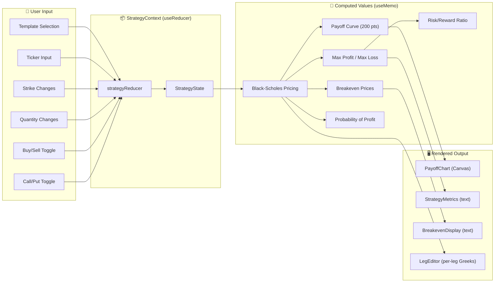

---

## 3. API Design

### 3.1 Endpoints

The Strategy Builder consumes existing endpoints. No new backend endpoints are required for MVP.

| Method | Endpoint | Description | Auth | Rate Limit |
|--------|----------|-------------|------|------------|
| GET | `/api/multi-leg-opportunities` | Fetch option chain + suggested strategies | No (MVP) | 30/min |
| POST | `/api/portfolio` | Track a built strategy in portfolio | No (MVP) | 10/min |

### 3.2 GET /api/multi-leg-opportunities

**Query Parameters:**

| Parameter | Type | Required | Description |
|-----------|------|----------|-------------|
| `symbol` | string | Yes | Ticker symbol (e.g., `AAPL`) |
| `expiration` | string | No | Target expiration date (`YYYY-MM-DD`) |

**Response (200 OK):**

```
┌─────────────────────────────────────────────────────────────┐
│ {                                                           │
│   "symbol": "AAPL",                                         │
│   "underlying_price": 185.40,                               │
│   "price_change_pct": 0.8,                                  │
│   "expirations": [                                          │
│     "2026-03-21", "2026-04-18", "2026-05-16"                │
│   ],                                                        │
│   "chain": [                                                │
│     {                                                       │
│       "strike": 180.00,                                     │
│       "expiration": "2026-03-21",                           │
│       "call": {                                             │
│         "bid": 7.20, "ask": 7.45, "last": 7.30,            │
│         "volume": 8500, "open_interest": 12400,             │
│         "iv": 0.324, "delta": 0.65, "theta": -0.18,        │
│         "gamma": 0.025, "vega": 0.42                        │
│       },                                                    │
│       "put": {                                              │
│         "bid": 2.10, "ask": 2.25, "last": 2.15,            │
│         "volume": 3200, "open_interest": 8900,              │
│         "iv": 0.318, "delta": -0.35, "theta": -0.12,       │
│         "gamma": 0.025, "vega": 0.40                        │
│       }                                                     │
│     }                                                       │
│   ],                                                        │
│   "suggestions": [                                          │
│     {                                                       │
│       "type": "bull_call_spread",                           │
│       "legs": [...],                                        │
│       "max_profit": 320,                                    │
│       "max_loss": 180,                                      │
│       "breakevens": [187.50]                                │
│     }                                                       │
│   ]                                                         │
│ }                                                           │
└─────────────────────────────────────────────────────────────┘
```

### 3.3 POST /api/portfolio (Track Strategy)

**Request Body:**

```
┌─────────────────────────────────────────────────────────────┐
│ {                                                           │
│   "type": "bull_call_spread",                               │
│   "symbol": "AAPL",                                         │
│   "underlying_price": 185.40,                               │
│   "legs": [                                                 │
│     {                                                       │
│       "direction": "buy",                                   │
│       "optionType": "call",                                 │
│       "strike": 185.00,                                     │
│       "expiration": "2026-03-21",                           │
│       "quantity": 1,                                        │
│       "premium": 4.28                                       │
│     },                                                      │
│     {                                                       │
│       "direction": "sell",                                  │
│       "optionType": "call",                                 │
│       "strike": 195.00,                                     │
│       "expiration": "2026-03-21",                           │
│       "quantity": 1,                                        │
│       "premium": 1.48                                       │
│     }                                                       │
│   ],                                                        │
│   "metrics": {                                              │
│     "maxProfit": 280,                                       │
│     "maxLoss": 220,                                         │
│     "breakevens": [187.80],                                 │
│     "netDebit": 2.80,                                       │
│     "riskRewardRatio": 1.27                                 │
│   }                                                         │
│ }                                                           │
└─────────────────────────────────────────────────────────────┘
```

**Response (201 Created):**

```
┌──────────────────────────────────────────────┐
│ {                                            │
│   "id": "strat-uuid-123",                   │
│   "status": "tracked",                       │
│   "created_at": "2026-02-15T10:30:00Z"      │
│ }                                            │
└──────────────────────────────────────────────┘
```

### 3.4 Error Responses

| Status | Condition | Response Body |
|--------|-----------|---------------|
| 400 | Invalid leg data (missing strike, invalid type) | `{"error": "Validation", "message": "Leg 2 missing strike price"}` |
| 404 | Symbol not found | `{"error": "NotFound", "message": "No option chain for XYZZ"}` |
| 429 | Rate limit exceeded | `{"error": "RateLimit", "message": "Too many requests", "retryAfter": 60}` |
| 500 | Backend/Yahoo Finance error | `{"error": "Internal", "message": "Chain fetch failed"}` |
| 503 | Yahoo Finance unavailable | `{"error": "Unavailable", "message": "Data source unavailable"}` |

---

## 4. Data Model Diagrams

### 4.1 TypeScript Interface Diagram

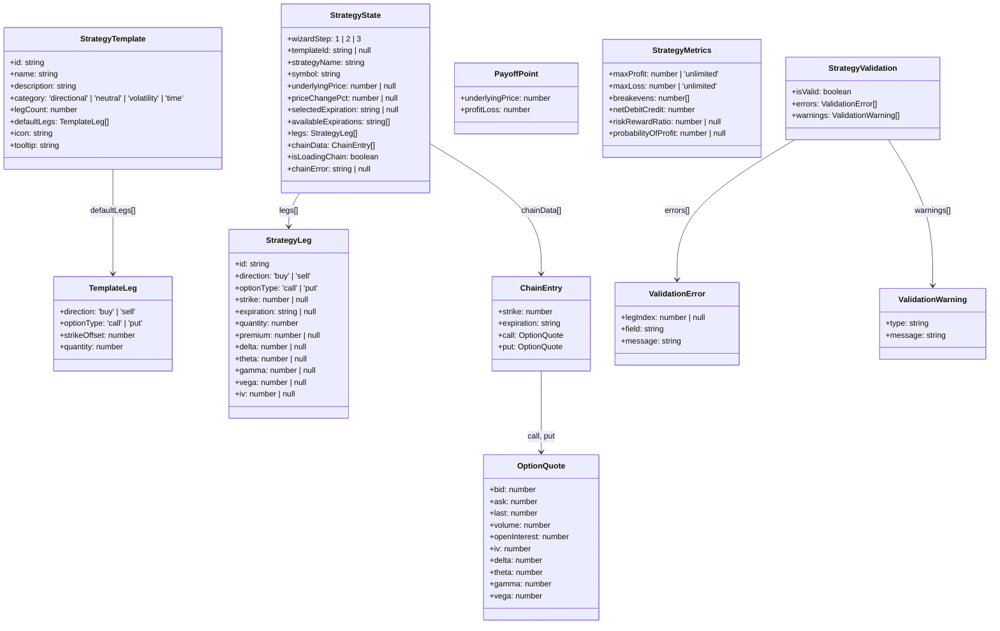

### 4.2 Strategy Action Union Type

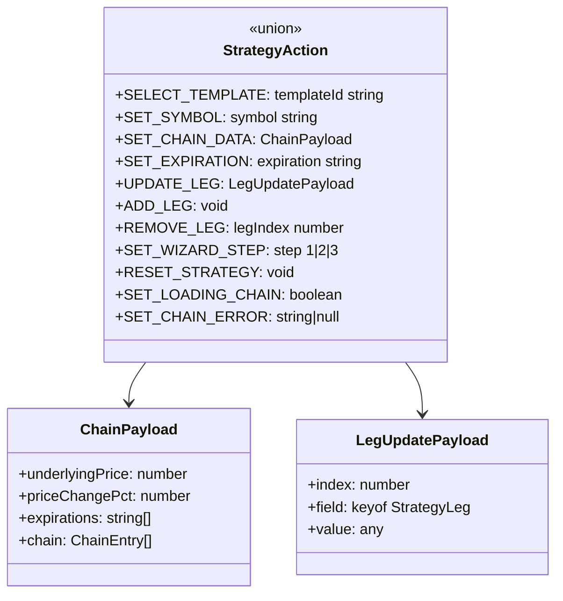

### 4.3 Strategy Template Definitions

| Template | ID | Legs | Default Configuration | Category |
|----------|----|----|----------------------|----------|
| Vertical Spread | `vertical-spread` | 2 | Buy Call ATM, Sell Call OTM (+$5) | Directional |
| Iron Condor | `iron-condor` | 4 | Buy Put OTM (−$10), Sell Put OTM (−$5), Sell Call OTM (+$5), Buy Call OTM (+$10) | Neutral |
| Straddle/Strangle | `straddle-strangle` | 2 | Buy Call ATM, Buy Put ATM | Volatility |
| Butterfly | `butterfly` | 3 | Buy Call ITM (−$5), Sell 2× Call ATM, Buy Call OTM (+$5) | Neutral |
| Calendar Spread | `calendar-spread` | 2 | Sell Call ATM (near exp), Buy Call ATM (far exp) | Time |

Strike offsets are relative to ATM (current underlying price). Actual strikes snap to nearest available chain strike on ticker selection.

### 4.4 Black-Scholes Calculation Model

```
┌─────────────────────────────────────────────────────────────────┐
│ Black-Scholes European Option Pricing                           │
├─────────────────────────────────────────────────────────────────┤
│                                                                 │
│ Inputs:                                                         │
│   S  = Current underlying price                                 │
│   K  = Strike price                                             │
│   T  = Time to expiration (years)                               │
│   r  = Risk-free rate (default: 0.05)                           │
│   σ  = Implied volatility (from chain data)                     │
│                                                                 │
│ Call Price:                                                     │
│   C = S·N(d₁) − K·e^(−rT)·N(d₂)                               │
│                                                                 │
│ Put Price:                                                      │
│   P = K·e^(−rT)·N(−d₂) − S·N(−d₁)                             │
│                                                                 │
│ Where:                                                          │
│   d₁ = [ln(S/K) + (r + σ²/2)·T] / (σ·√T)                      │
│   d₂ = d₁ − σ·√T                                               │
│   N() = Standard normal CDF                                     │
│                                                                 │
│ Payoff at Expiration (no time value):                           │
│   Call: max(S − K, 0) × quantity × direction                    │
│   Put:  max(K − S, 0) × quantity × direction                    │
│   Net P&L = Σ(leg payoffs) − net premium paid                   │
│                                                                 │
│ Assumptions:                                                    │
│   - European-style exercise (acceptable approximation)          │
│   - No dividends (simplified — note in UI)                      │
│   - Constant volatility per leg (from chain IV)                 │
│   - Risk-free rate = US 10Y Treasury (hardcoded 5% for MVP)     │
│                                                                 │
│ Performance:                                                    │
│   - Single option: ~0.05ms                                      │
│   - 4-leg × 200 price points = ~40ms (well under 100ms target) │
│                                                                 │
└─────────────────────────────────────────────────────────────────┘
```

---

## 5. Service Layer Diagrams

### 5.1 Custom Hooks Architecture

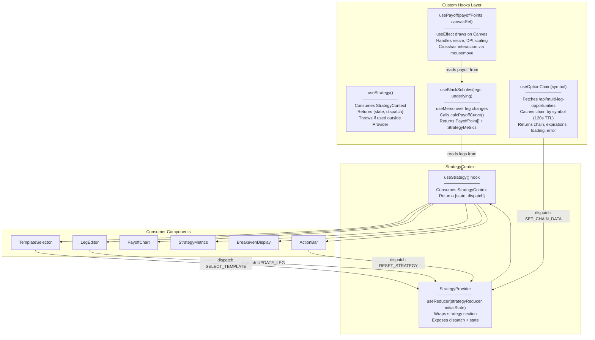

### 5.2 Strategy Reducer State Machine

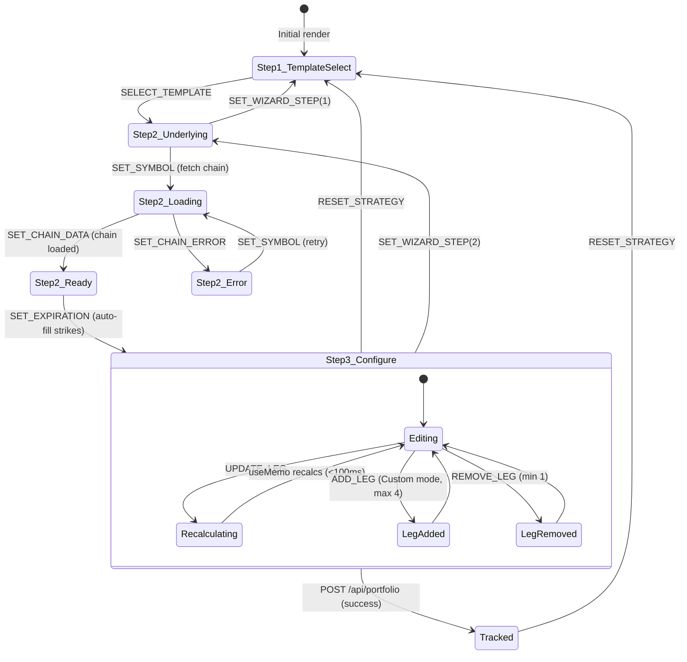

### 5.3 Black-Scholes Calculation Pipeline

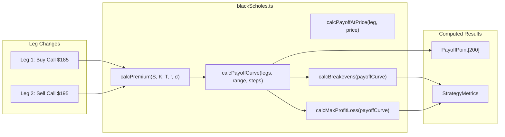

---

## 6. Security Diagrams

### 6.1 Client-Side Security Model

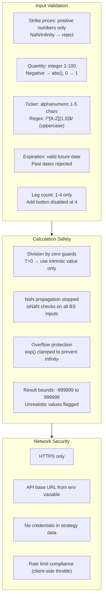

### 6.2 Strategy Validation Rules

```
┌─────────────────────────────────────────────────────────────────┐
│ Validation Layer (strategyValidation.ts)                        │
├─────────────────────────────────────────────────────────────────┤
│                                                                 │
│ ERRORS (block Track action):                                    │
│  1. Missing strike on any leg                                   │
│  2. Missing expiration on any leg                               │
│  3. Quantity = 0 on any leg                                     │
│  4. No ticker selected                                          │
│  5. Iron condor: expirations must match across all 4 legs       │
│  6. Butterfly: middle leg quantity must be 2× wing quantity      │
│  7. Calendar spread: must have 2 different expirations           │
│  8. Duplicate legs (same direction + type + strike + expiry)     │
│                                                                 │
│ WARNINGS (show but don't block):                                │
│  1. Width asymmetry in iron condor (call side ≠ put side width) │
│  2. Deep ITM legs (delta > 0.9) — likely unintended             │
│  3. Very short DTE (< 7 days) — rapid time decay warning        │
│  4. Large quantity mismatch between legs                         │
│  5. Net debit > $1,000 per contract — capital risk warning      │
│                                                                 │
│ AUTO-FIX (applied silently):                                    │
│  1. Ticker → uppercase                                          │
│  2. Quantity → Math.abs(Math.round(value))                      │
│  3. Strike snap to nearest available chain strike                │
│                                                                 │
└─────────────────────────────────────────────────────────────────┘
```

---

## 7. Performance

### 7.1 Performance Requirements

| Metric | Target | Measurement |
|--------|--------|-------------|
| Black-Scholes per option | <0.1ms | Single `calcPremium()` call |
| Full payoff curve (4 legs × 200 pts) | <100ms | `calcPayoffCurve()` with useMemo |
| Canvas chart render | <16ms | Single `drawPayoff()` call (60fps) |
| P&L update (leg change → chart) | <200ms | Total: reducer + BS + canvas |
| Option chain fetch (API) | <2,000ms | P90 GET /api/multi-leg-opportunities |
| Template selection → legs rendered | <50ms | Template dispatch + leg init |
| Strategy validation | <10ms | `validateStrategy()` call |
| Track strategy (POST) | <1,000ms | POST /api/portfolio round-trip |

### 7.2 Optimization Strategies

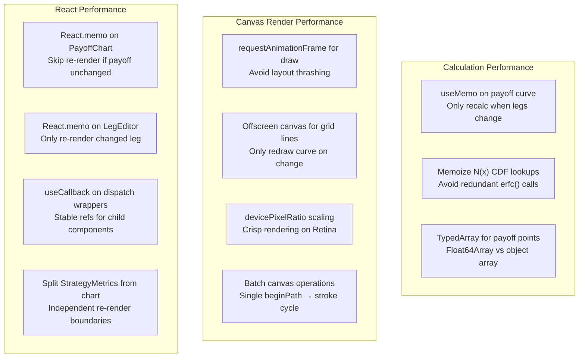

### 7.3 Canvas Rendering Pipeline

```
┌─────────────────────────────────────────────────────────────────┐
│ PayoffChart Canvas Render Pipeline                              │
├─────────────────────────────────────────────────────────────────┤
│                                                                 │
│ 1. CLEAR canvas (fillRect #0d1b2a background)         ~0.1ms   │
│ 2. DRAW grid lines (price axis, P&L axis)             ~0.5ms   │
│ 3. DRAW zero line (dashed, white 30% opacity)         ~0.2ms   │
│ 4. DRAW payoff curve (lineTo × 200 points)            ~1.0ms   │
│    - Green fill above zero (profit zone)                        │
│    - Red fill below zero (loss zone)                            │
│ 5. DRAW breakeven markers (vertical dashed lines)     ~0.3ms   │
│ 6. DRAW current price marker (vertical solid line)    ~0.2ms   │
│ 7. DRAW labels (max profit, max loss, breakevens)     ~0.5ms   │
│ 8. DRAW crosshair (if mouse over canvas)              ~0.3ms   │
│                                                                 │
│ TOTAL: ~3.1ms (well under 16ms budget)                          │
│                                                                 │
│ Color scheme (from UX-3.md):                                    │
│   Background: #0d1b2a (dark navy)                               │
│   Profit zone: #4caf50 (green) with 20% fill                   │
│   Loss zone: #f44336 (red) with 20% fill                       │
│   Breakeven: #ff9800 (amber) dashed line                        │
│   Current price: #1976d2 (blue) solid line                      │
│   Grid: rgba(255,255,255,0.1)                                   │
│   Text: #e6edf7 (light blue-white)                              │
│   Crosshair: rgba(255,255,255,0.5)                              │
│                                                                 │
└─────────────────────────────────────────────────────────────────┘
```

---

## 8. Testing Strategy

### 8.1 Test Pyramid

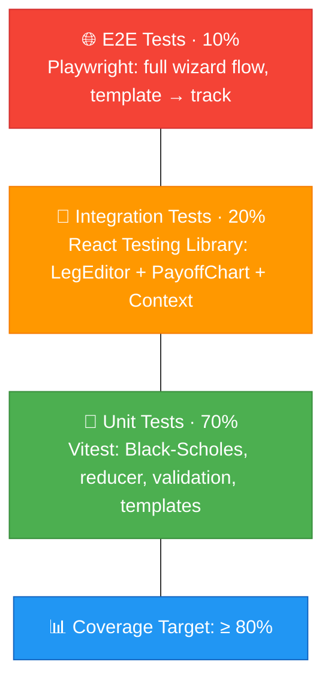

### 8.2 Test Scope by Component

| Component | Test Type | Key Scenarios |
|-----------|-----------|---------------|
| `blackScholes.ts` | Unit | Call/put pricing matches known values (AAPL $185C at 32% IV = ~$4.28), edge cases (T=0 → intrinsic only, σ=0 → deterministic), NaN/Infinity guards |
| `calcPayoffCurve` | Unit | 2-leg vertical spread P&L correct at all price points, 4-leg iron condor max profit/loss bounds, breakeven accuracy ±$0.01 |
| `calcBreakevens` | Unit | Single breakeven for vertical spread, two breakevens for iron condor/strangle, zero breakevens for deep ITM |
| `strategyReducer` | Unit | SELECT_TEMPLATE pre-fills correct leg count, UPDATE_LEG updates single leg, ADD_LEG respects 4-leg max, REMOVE_LEG respects 1-leg min, RESET clears all |
| `strategyValidation.ts` | Unit | Missing strike → error, mismatched expiry in IC → error, wing width mismatch → warning, deep ITM → warning |
| `strategyTemplates.ts` | Unit | Each template has correct legCount, defaultLegs match template type, strike offsets are reasonable |
| `useOptionChain` | Unit + Integration | Fetches chain on symbol change, caches for 120s, handles 404/500, loading state during fetch |
| `useBlackScholes` | Unit | Returns correct metrics for known strategy, recalcs only on leg change (useMemo), handles null strikes gracefully |
| `TemplateSelector` | Integration | 6 cards rendered (5 templates + Custom), click dispatches SELECT_TEMPLATE, keyboard Enter/Space selects |
| `LegEditor` | Integration | Buy/Sell toggle dispatches UPDATE_LEG, strike dropdown populates from chain, quantity input validates 1-100 |
| `PayoffChart` | Integration | Canvas receives correct payoff data, resize handler updates dimensions, crosshair shows P&L at hover price |
| `StrategyMetrics` | Integration | Max profit/loss/breakevens display correctly, risk/reward ratio formatted, net debit/credit labeled |
| `StrategyWizard` | Integration | Step navigation (1→2→3), back button works, validation gates prevent forward with missing data |
| Full wizard flow | E2E (Playwright) | Select Vertical Spread → enter AAPL → adjust strikes → verify chart renders → track strategy → verify toast |
| Iron condor flow | E2E (Playwright) | Select IC → enter SPY → verify 4 legs → adjust wings → verify 2 breakevens → track |

### 8.3 Black-Scholes Validation Test Cases

| Scenario | S | K | T (years) | r | σ | Expected Call | Expected Put |
|----------|---|---|-----------|---|---|---------------|--------------|
| ATM, moderate IV | 185 | 185 | 0.096 | 0.05 | 0.32 | ~$4.28 | ~$3.39 |
| OTM call | 185 | 195 | 0.096 | 0.05 | 0.34 | ~$1.48 | — |
| Deep ITM call | 185 | 170 | 0.096 | 0.05 | 0.30 | ~$15.80 | — |
| At expiration (T=0) | 185 | 180 | 0 | 0.05 | 0.32 | $5.00 | $0.00 |
| Zero IV | 185 | 185 | 0.096 | 0.05 | 0 | ~$0.89 | $0.00 |

### 8.4 Accessibility Testing

| Test | Tool | Criteria |
|------|------|----------|
| Wizard keyboard navigation | Manual + Playwright | Tab through template cards → Enter to select → Tab to ticker → Tab through legs |
| Leg editor keyboard control | Jest + RTL | Tab order: Buy/Sell → Call/Put → Strike → Quantity → next leg |
| Screen reader announcements | axe-core + manual | "Bull Call Spread selected. 2 legs pre-filled." on template select |
| Chart accessibility | Manual | Canvas has `role="img"` + `aria-label` with P&L summary text |
| Color contrast | axe-core | All text ≥4.5:1 against dark backgrounds |
| Focus management | Manual | Focus moves to ticker input after template select, to first leg after expiration select |

---

## 9. Implementation Notes

### 9.1 Directory Structure

```
app/
  page.tsx                              # Add Strategy Builder section
  components/
    strategy/
      StrategyContext.tsx                # Context + reducer + useStrategy hook
      StrategyWizard.tsx                 # Top-level wizard (step management)
      TemplateSelector.tsx              # Strategy template card grid (Step 1)
      UnderlyingConfig.tsx              # Ticker input + expiration picker (Step 2)
      BuilderView.tsx                    # 2-column layout: legs + chart (Step 3)
      LegEditor.tsx                      # Single leg row (Buy/Sell, Call/Put, Strike, Qty)
      PayoffChart.tsx                    # Canvas-based P&L chart
      StrategyMetrics.tsx               # Max profit/loss/breakeven/risk-reward panel
      BreakevenDisplay.tsx              # Breakeven price markers + labels
      ActionBar.tsx                      # Track Strategy + Export buttons
    primitives/
      TemplateCard.tsx                  # Clickable template card with icon + description
      WizardStepper.tsx                 # Step 1-2-3 progress indicator
      TickerInput.tsx                    # Text input with uppercase transform
      ExpirationChip.tsx               # Selectable expiration date chip
      LegStrikeSelector.tsx            # Strike price dropdown from chain
  hooks/
    useStrategy.ts                      # Re-export of useStrategy from Context
    useBlackScholes.ts                  # useMemo wrapper for BS calculations
    usePayoff.ts                        # Canvas draw effect hook
    useOptionChain.ts                   # Fetch + cache option chain data
  types/
    strategy.ts                         # StrategyLeg, StrategyTemplate, StrategyState, etc.
  utils/
    blackScholes.ts                     # BS pricing, payoff curve, breakevens, metrics
    strategyTemplates.ts               # 5 template definitions (pure data)
    strategyValidation.ts              # Validation rules (errors + warnings)
  styles/
    strategy.module.css                 # Strategy builder component styles
```

### 9.2 TypeScript Interface Definitions

```
┌─────────────────────────────────────────────────────────────────┐
│ app/types/strategy.ts                                           │
├─────────────────────────────────────────────────────────────────┤
│                                                                 │
│ /** Single leg in a multi-leg strategy */                       │
│ interface StrategyLeg {                                         │
│   id: string;              // uuid for React key                │
│   direction: 'buy' | 'sell';                                    │
│   optionType: 'call' | 'put';                                  │
│   strike: number | null;   // null until chain loaded           │
│   expiration: string | null;                                    │
│   quantity: number;        // 1-100, always positive            │
│   premium: number | null;  // mid price from chain              │
│   delta: number | null;                                         │
│   theta: number | null;                                         │
│   gamma: number | null;                                         │
│   vega: number | null;                                          │
│   iv: number | null;       // implied volatility decimal        │
│ }                                                               │
│                                                                 │
│ /** Template definition for pre-built strategies */             │
│ interface StrategyTemplate {                                    │
│   id: string;                                                   │
│   name: string;                                                 │
│   description: string;                                          │
│   category: 'directional' | 'neutral' | 'volatility' | 'time'; │
│   legCount: number;                                             │
│   defaultLegs: TemplateLeg[];                                   │
│   icon: string;            // emoji or icon class               │
│   tooltip: string;         // educational text                  │
│ }                                                               │
│                                                                 │
│ /** Template leg defaults (before chain data) */                │
│ interface TemplateLeg {                                         │
│   direction: 'buy' | 'sell';                                    │
│   optionType: 'call' | 'put';                                  │
│   strikeOffset: number;    // relative to ATM in dollars        │
│   quantity: number;                                             │
│ }                                                               │
│                                                                 │
│ /** Full strategy builder state */                              │
│ interface StrategyState {                                       │
│   wizardStep: 1 | 2 | 3;                                       │
│   templateId: string | null;                                    │
│   strategyName: string;    // auto-detected or user-set         │
│   symbol: string;                                               │
│   underlyingPrice: number | null;                               │
│   priceChangePct: number | null;                                │
│   selectedExpiration: string | null;                            │
│   availableExpirations: string[];                               │
│   legs: StrategyLeg[];                                          │
│   chainData: ChainEntry[];                                      │
│   isLoadingChain: boolean;                                      │
│   chainError: string | null;                                    │
│ }                                                               │
│                                                                 │
│ /** Single price point on the payoff curve */                   │
│ interface PayoffPoint {                                         │
│   underlyingPrice: number;                                      │
│   profitLoss: number;                                           │
│ }                                                               │
│                                                                 │
│ /** Computed strategy risk/reward metrics */                    │
│ interface ComputedMetrics {                                     │
│   maxProfit: number | 'unlimited';                              │
│   maxLoss: number | 'unlimited';                                │
│   breakevens: number[];                                         │
│   netDebitCredit: number;  // positive = debit, negative = credit│
│   riskRewardRatio: number | null;                               │
│   probabilityOfProfit: number | null;                           │
│ }                                                               │
│                                                                 │
└─────────────────────────────────────────────────────────────────┘
```

### 9.3 Style Architecture

```
┌──────────────────────────────────────────────────────────────┐
│ Styling: CSS Modules (consistent with Issue #2)              │
├──────────────────────────────────────────────────────────────┤
│                                                              │
│ strategy.module.css — single CSS Module file for all         │
│ strategy components (scoped class names, no conflicts)       │
│                                                              │
│ Design tokens (extend globals.css):                          │
│   --strategy-bg: #132046                                     │
│   --strategy-card-bg: #1a2a4a                                │
│   --strategy-card-hover: #1e3260                             │
│   --strategy-card-selected: #1976d2                          │
│   --profit-green: #4caf50                                    │
│   --loss-red: #f44336                                        │
│   --breakeven-amber: #ff9800                                 │
│   --chart-bg: #0d1b2a                                        │
│   --leg-border: rgba(255,255,255,0.1)                        │
│   --leg-buy: #4caf50                                         │
│   --leg-sell: #f44336                                        │
│                                                              │
│ Breakpoints (same as #2):                                    │
│   Mobile: <768px (stacked layout, chart above legs)          │
│   Tablet: 768-1023px (stacked with wider charts)             │
│   Desktop: ≥1024px (2-column: legs left, chart right)        │
│                                                              │
└──────────────────────────────────────────────────────────────┘
```

### 9.4 Development Workflow

1. Create `app/types/strategy.ts` — all TypeScript interfaces (StrategyLeg, StrategyTemplate, StrategyState, PayoffPoint, ComputedMetrics, StrategyAction)
2. Create `app/utils/blackScholes.ts` — pure functions: `normalCDF()`, `calcOptionPrice()`, `calcPayoffAtPrice()`, `calcPayoffCurve()`, `calcBreakevens()`, `calcMaxProfitLoss()`. Full unit test suite against known option prices.
3. Create `app/utils/strategyTemplates.ts` — 5 template definitions as typed constant array
4. Create `app/utils/strategyValidation.ts` — `validateStrategy()` returning `{isValid, errors[], warnings[]}`
5. Create `app/components/strategy/StrategyContext.tsx` — reducer + provider + useStrategy hook
6. Build `TemplateCard.tsx` primitive → compose into `TemplateSelector.tsx` (Step 1)
7. Build `TickerInput.tsx`, `ExpirationChip.tsx` → compose into `UnderlyingConfig.tsx` (Step 2)
8. Build `LegEditor.tsx` with per-leg controls and inline Greeks display
9. Build `PayoffChart.tsx` with Canvas rendering + crosshair interaction
10. Build `StrategyMetrics.tsx` and `BreakevenDisplay.tsx`
11. Build `ActionBar.tsx` with "Track Strategy" + validation integration
12. Compose `BuilderView.tsx` (2-column layout with LegEditor + PayoffChart)
13. Build `WizardStepper.tsx` → compose into `StrategyWizard.tsx` (step management)
14. Create `useOptionChain.ts` — fetch chain data with caching
15. Create `useBlackScholes.ts` — useMemo wrapper for payoff calculations
16. Create `usePayoff.ts` — Canvas draw effect hook
17. Create `strategy.module.css` — component styles
18. Integration: add `<StrategyWizard />` section to `page.tsx`
19. Accessibility pass — ARIA, keyboard, focus management, screen reader
20. Mobile responsive pass — stacked layout, touch targets

---

## 10. Rollout Plan

### Phase 3a: Foundation (Week 8)

**Stories**: US-2.1 (Template Selection), US-2.2 (Leg Configuration)
- TypeScript interfaces (`app/types/strategy.ts`)
- Black-Scholes utility with full unit tests (`app/utils/blackScholes.ts`)
- Strategy templates definitions (`app/utils/strategyTemplates.ts`)
- Strategy validation module (`app/utils/strategyValidation.ts`)
- StrategyContext with reducer (`app/components/strategy/StrategyContext.tsx`)
- TemplateSelector with 6 template cards
- Unit tests for all utilities and reducer (target: 90% coverage on utils)

**Deliverable**: Template selection working, strategy state management functional, BS calculations verified

### Phase 3b: Builder UI (Week 9)

**Stories**: US-2.3 (P&L Visualization), US-2.4 (Strategy Metrics)
- UnderlyingConfig with ticker input + expiration picker
- LegEditor with Buy/Sell, Call/Put, Strike, Quantity controls
- PayoffChart with Canvas rendering (profit/loss zones, breakeven markers, current price)
- StrategyMetrics panel (max profit/loss, breakevens, risk/reward)
- BreakevenDisplay with labeled price markers
- WizardStepper progress indicator
- StrategyWizard step management and navigation
- `useOptionChain` hook with API integration
- `useBlackScholes` and `usePayoff` hooks
- Integration tests for LegEditor + PayoffChart + Context interaction

**Deliverable**: Full wizard flow working end-to-end: template → ticker → configure legs → see live P&L chart

### Phase 3c: Integration + Polish (Week 10)

**Stories**: US-2.5 (Portfolio Tracking)
- ActionBar with "Track Strategy" button + POST /api/portfolio integration
- Toast notification on successful track
- Strategy validation gates (errors block track, warnings shown)
- Crosshair interaction on PayoffChart (hover to see P&L at any price)
- "At Expiration" / "Now" toggle on chart (time-value vs. intrinsic)
- Export PNG functionality for chart
- Mobile responsive layout (stacked view, touch-optimized)
- Accessibility pass (ARIA, keyboard navigation, focus management)
- CSS polish matching UX-3.md colors and spacing
- E2E tests (Playwright) for full wizard flows
- Performance profiling (BS calc <100ms, canvas <16ms)

**Deliverable**: Production-ready Strategy Builder with portfolio integration

---

## 11. Risks & Mitigations

| Risk | Impact | Probability | Mitigation |
|------|--------|-------------|------------|
| Black-Scholes accuracy insufficient for real trading decisions | Medium | Medium | Display disclaimer "Estimated P&L — uses simplified Black-Scholes (European, no dividends). Actual results may vary." in StrategyMetrics panel. Sufficient for educational/preview use case per PRD. |
| Option chain API returns incomplete data (missing strikes/expirations) | High | Medium | Graceful degradation: show available strikes, disable unavailable ones, show "Limited chain data" banner. Fall back to manual strike entry if chain empty. |
| Canvas chart not accessible to screen readers | Medium | High (inherent) | Add `role="img"` with `aria-label` summarizing P&L: "Bull call spread P&L chart. Max profit $280 above $195. Max loss $220 below $185. Breakeven at $187.80." Update aria-label on every recalc. |
| Complex wizard step validation confuses users | Medium | Low | Clear validation messages inline with failing field (not just top-of-form). "Next" button disabled with tooltip explaining what's missing. Back button always available. |
| PayoffChart re-renders on unrelated Context changes | Medium | Medium | Wrap PayoffChart in `React.memo` with custom comparator checking only `payoffPoints` reference equality. Use `useMemo` for payoff calculation to ensure stable references. |
| Yahoo Finance rate limit hit during rapid ticker changes | Medium | Low | Debounce ticker input (500ms), cache chain data per symbol (120s TTL), show "Loading chain..." during fetch, queue concurrent requests. |
| Mobile touch interactions conflict with chart gestures | Low | Medium | Disable chart touch scrolling (`touch-action: none` on canvas), use tap for crosshair instead of drag. On mobile, chart sits above legs (no horizontal conflict). |

---

## 12. Monitoring & Observability

### 12.1 Client-Side Metrics

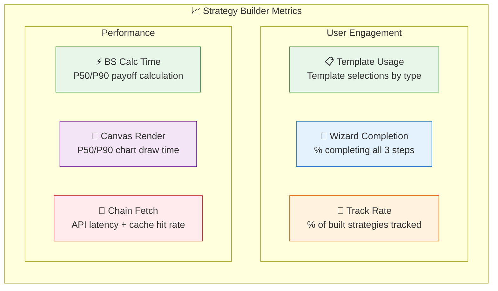

### 12.2 Logging Strategy

```
┌──────────────────────────────────────────────────────────────┐
│ Client-Side Logging (console + future analytics)             │
├──────────────────────────────────────────────────────────────┤
│                                                              │
│ strategy:template_select - Template ID + name                │
│ strategy:symbol_set      - Ticker + chain size               │
│ strategy:leg_update      - Leg index + field + old/new value │
│ strategy:payoff_calc     - Leg count + calc time (ms)        │
│ strategy:chart_render    - Render time (ms) + point count    │
│ strategy:validate        - Errors count + warnings count     │
│ strategy:track           - Strategy type + leg count + result│
│ strategy:track_error     - Error type + status code          │
│ strategy:wizard_step     - Step number + direction (fwd/back)│
│ strategy:wizard_abandon  - Last step + time spent (seconds)  │
│ strategy:chain_fetch     - Symbol + response time + cache    │
│ strategy:chain_error     - Symbol + error type               │
│                                                              │
│ Privacy: No PII logged. Only numeric values + enum types.   │
│ Volume: Estimated 10-15 events per strategy session.         │
│                                                              │
└──────────────────────────────────────────────────────────────┘
```

### 12.3 Health Indicators

| Indicator | Healthy | Warning | Critical |
|-----------|---------|---------|----------|
| BS calculation time (P90) | <100ms | 100-500ms | >500ms |
| Canvas render time (P90) | <16ms | 16-33ms | >33ms (drops below 30fps) |
| Chain API response (P90) | <2s | 2-5s | >5s |
| Chain cache hit rate | >50% | 20-50% | <20% |
| Wizard completion rate | >60% | 30-60% | <30% (UX issue) |
| Track success rate | >95% | 80-95% | <80% (API issue) |
| Validation error rate | <10% | 10-30% | >30% (UX/template issue) |

---

## Cross-Cutting Concerns

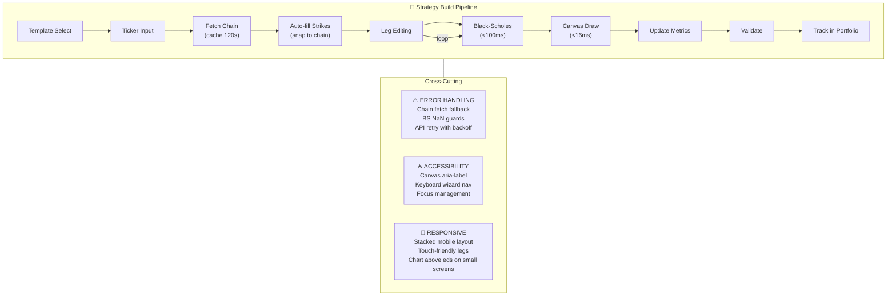

---

**Generated by AgentX Architect Agent**  
**Last Updated**: 2026-02-15  
**Version**: 1.0
