# Technical Specification: Modular Data Provider Architecture

**Issue**: #4  
**Epic**: #1  
**Status**: Draft  
**Author**: Solution Architect Agent  
**Date**: 2026-02-15  
**Related ADR**: [ADR-4.md](../adr/ADR-4.md)  
**Related UX**: [UX-4.md](../ux/UX-4.md)

> **Acceptance Criteria**: Defined in the PRD user stories — see [PRD-options-scanner-v2.md](../prd/PRD-options-scanner-v2.md#5-user-stories--features) (US-9.1 – US-9.4). Engineers should track AC completion against the originating Story issue.

---

## Table of Contents

1. [Overview](#1-overview)
2. [Architecture Diagrams](#2-architecture-diagrams)
3. [Type Definitions](#3-type-definitions)
4. [Service Layer](#4-service-layer)
5. [State Management](#5-state-management)
6. [Hooks](#6-hooks)
7. [Component Specifications](#7-component-specifications)
8. [API Integration](#8-api-integration)
9. [Performance](#9-performance)
10. [Testing Strategy](#10-testing-strategy)
11. [File Structure](#11-file-structure)
12. [Risks & Mitigations](#12-risks--mitigations)

---

## 1. Overview

Build a modular data provider system for the Options Scanner frontend that enables admins to configure multiple market data providers (Yahoo Finance, Alpaca, Tradier, Custom), define failover priority, and monitor provider health — all from a frontend Settings page. The system introduces a TypeScript `IDataProvider` interface abstraction, a client-side `ProviderManager` for failover orchestration, and a `ProviderContext` for UI state management.

**Scope:**
- In scope: `IDataProvider` interface and factory, `ProviderManager` (failover + circuit breaker), `ProviderContext` + `useReducer`, Settings page components (ProviderSettingsPage, ProviderCard, ProviderFormModal, ConnectionTestButton, RateLimitGauge, FailoverBanner, ProviderMetricsPanel, ProviderPriorityList), REST integration with `/api/providers`, client-side metrics tracking
- Out of scope: Backend provider proxy implementation (FastAPI), server-side metrics aggregation, WebSocket real-time updates, OAuth flows for Alpaca/Tradier, provider billing integration

**Success Criteria:**
- Failover switch completes in < 500ms (user sees shimmer, not blank screen)
- Settings page loads in < 200ms (skeleton → hydrated content)
- Connection test round-trip < 10 seconds (with user-visible timeout)
- All Settings page components WCAG 2.1 AA compliant (keyboard reorder, screen reader announcements)
- Support 2–5 concurrent providers with independent circuit breakers

---

## 2. Architecture Diagrams

### 2.1 High-Level Component Architecture

```mermaid
graph TD
    subgraph App["📄 app/layout.tsx"]
        PC["ProviderContext Provider"]
    end

    subgraph SettingsPage["⚙ Settings Page"]
        PSP["ProviderSettingsPage"]
        PSP --> PPL["ProviderPriorityList"]
        PSP --> PMP["ProviderMetricsPanel"]
        PSP --> MCS["MonthlyCostSummary"]
        PPL --> PCard["ProviderCard (×N)"]
        PCard --> CTB["ConnectionTestButton"]
        PCard --> RLG["RateLimitGauge"]
        PSP --> PFM["ProviderFormModal"]
    end

    subgraph Scanner["🔍 Scanner Page"]
        FB["FailoverBanner"]
        FC["FilterContext"]
        FC --> FP["FilterPanel"]
        FC --> RT["ResultsTable"]
    end

    subgraph Services["⚡ Service Layer"]
        PM["ProviderManager"]
        PM --> PF["ProviderFactory"]
        PF --> YP["YahooProvider"]
        PF --> AP["AlpacaProvider"]
        PF --> TP["TradierProvider"]
        PF --> CP["CustomProvider"]
    end

    subgraph Hooks["🪝 Custom Hooks"]
        UP["useProviders()"]
        UPM2["useProviderMetrics()"]
    end

    subgraph API["🌐 Backend API"]
        BE[("FastAPI\n/api/providers")]
    end

    PC --> SettingsPage
    PC --> Scanner
    UP --> PM
    UP --> BE
    UPM2 --> PM
    PM --> BE
```



### 2.2 IDataProvider Class Diagram


### 2.3 Failover Sequence Diagram


### 2.4 Component Tree Diagram


### 2.5 Data Flow Diagram


---

## 3. Type Definitions

All types are defined in `app/types/provider.ts`.

### 3.1 ProviderType Enum

```
Enum: ProviderType
Values: YAHOO_FINANCE = "yahoo_finance", ALPACA = "alpaca", TRADIER = "tradier", CUSTOM = "custom"
```

### 3.2 ProviderConfig Interface

| Field | Type | Required | Description |
|-------|------|----------|-------------|
| `id` | `string` | Yes | UUID assigned by backend on creation |
| `name` | `string` | Yes | Display name (1–50 chars) |
| `type` | `ProviderType` | Yes | Provider type enum value |
| `apiKeyMasked` | `string` | Yes | Masked API key (e.g., `****a1b2`) — backend never sends plaintext |
| `baseUrl` | `string` | Yes | API base URL (auto-populated per type, editable for CUSTOM) |
| `enabled` | `boolean` | Yes | Whether provider is active in failover queue |
| `priority` | `number` | Yes | Priority order (1 = highest). Used by `ProviderManager` for failover |
| `rateLimit` | `RateLimitConfig` | Yes | Rate limit configuration |
| `createdAt` | `string` (ISO 8601) | Yes | Creation timestamp |
| `updatedAt` | `string` (ISO 8601) | Yes | Last update timestamp |

### 3.3 RateLimitConfig Interface

| Field | Type | Required | Description |
|-------|------|----------|-------------|
| `maxPerHour` | `number` | Yes | Maximum API calls per hour |
| `maxPerDay` | `number` | Yes | Maximum API calls per day |
| `costPerCall` | `number` | Yes | Estimated cost per API call in USD (e.g., 0.0001) |

### 3.4 ProviderStatus Interface

| Field | Type | Required | Description |
|-------|------|----------|-------------|
| `state` | `ProviderState` | Yes | Current connection state |
| `lastHealthCheck` | `string \| null` | Yes | ISO timestamp of last health check |
| `lastError` | `string \| null` | Yes | Last error message (null if healthy) |
| `circuitBreaker` | `CircuitBreakerState` | Yes | Circuit breaker state |
| `consecutiveErrors` | `number` | Yes | Count of consecutive errors (resets on success) |
| `cooldownUntil` | `string \| null` | Yes | ISO timestamp when cooldown expires (null if not in cooldown) |

### 3.5 ProviderState Enum

```
Enum: ProviderState
Values: CONNECTED = "connected", DEGRADED = "degraded", DISCONNECTED = "disconnected",
        AUTH_FAILED = "auth_failed", RATE_LIMITED = "rate_limited"
```

### 3.6 CircuitBreakerState Enum

```
Enum: CircuitBreakerState
Values: CLOSED = "closed" (normal), OPEN = "open" (tripped), HALF_OPEN = "half_open" (testing recovery)
```

### 3.7 ProviderMetrics Interface

| Field | Type | Required | Description |
|-------|------|----------|-------------|
| `providerId` | `string` | Yes | References `ProviderConfig.id` |
| `totalCalls` | `number` | Yes | Lifetime call count (since page load) |
| `successCount` | `number` | Yes | Successful call count |
| `errorCount` | `number` | Yes | Failed call count |
| `avgLatencyMs` | `number` | Yes | Rolling average latency in milliseconds |
| `p95LatencyMs` | `number` | Yes | 95th percentile latency |
| `callsThisHour` | `number` | Yes | Calls in the current clock hour |
| `callsToday` | `number` | Yes | Calls since midnight UTC |
| `errorRatePercent` | `number` | Yes | `(errorCount / totalCalls) * 100` |
| `lastCallAt` | `string \| null` | Yes | ISO timestamp of most recent call |
| `latencyHistory` | `number[]` | Yes | Last 100 latency samples (for sparkline rendering) |

### 3.8 ConnectionTestResult Interface

| Field | Type | Required | Description |
|-------|------|----------|-------------|
| `success` | `boolean` | Yes | Whether the connection test passed |
| `latencyMs` | `number` | Yes | Round-trip time in milliseconds |
| `message` | `string` | Yes | Human-readable result ("Connection verified" or error detail) |
| `errorCode` | `string \| null` | No | Machine-readable error code (e.g., `AUTH_FAILED`, `TIMEOUT`, `DNS_ERROR`) |

### 3.9 ProviderState (Context) Interface

This is the `useReducer` state shape held in `ProviderContext`:

| Field | Type | Description |
|-------|------|-------------|
| `providers` | `ProviderConfig[]` | Ordered list of all configured providers |
| `activeProviderId` | `string \| null` | ID of the currently active provider |
| `failoverState` | `FailoverState \| null` | Non-null when a failover is in progress or recently occurred |
| `metrics` | `Record<string, ProviderMetrics>` | Metrics keyed by provider ID |
| `isLoading` | `boolean` | True while fetching provider list from backend |
| `error` | `string \| null` | Error message from last failed operation |

### 3.10 FailoverState Interface

| Field | Type | Description |
|-------|------|-------------|
| `fromProviderId` | `string` | ID of the provider that failed |
| `toProviderId` | `string` | ID of the provider switched to |
| `reason` | `string` | Reason for failover (e.g., "Rate limited after 3 consecutive errors") |
| `timestamp` | `string` | ISO timestamp when failover occurred |
| `isRestored` | `boolean` | True when the original provider has recovered |

### 3.11 ProviderAction Union Type

Actions dispatched to the `ProviderContext` reducer:

| Action Type | Payload | Description |
|-------------|---------|-------------|
| `SET_PROVIDERS` | `{ providers: ProviderConfig[] }` | Initial load from backend |
| `ADD_PROVIDER` | `{ provider: ProviderConfig }` | After successful POST to `/api/providers` |
| `UPDATE_PROVIDER` | `{ id: string; updates: Partial<ProviderConfig> }` | After successful PUT |
| `REMOVE_PROVIDER` | `{ id: string }` | After successful DELETE |
| `REORDER_PROVIDERS` | `{ orderedIds: string[] }` | After drag-reorder updates priority |
| `SET_ACTIVE` | `{ providerId: string }` | When `ProviderManager` selects active provider |
| `SET_FAILOVER_STATE` | `{ failoverState: FailoverState \| null }` | On failover or recovery |
| `UPDATE_METRICS` | `{ providerId: string; metrics: Partial<ProviderMetrics> }` | Periodic metrics update |
| `SET_LOADING` | `{ isLoading: boolean }` | Loading state toggle |
| `SET_ERROR` | `{ error: string \| null }` | Error state |

---

## 4. Service Layer

### 4.1 ProviderFactory

**File**: `app/services/providerFactory.ts`

**Responsibility**: Maps `ProviderType` to concrete `IDataProvider` implementations. Centralizes instantiation logic so the rest of the app never uses `new YahooProvider()` directly.

**Interface:**

| Method | Signature | Description |
|--------|-----------|-------------|
| `create` | `(config: ProviderConfig) => IDataProvider` | Instantiate a provider from config |
| `getSupportedTypes` | `() => ProviderType[]` | List all registered provider types |

**Factory map:**

| ProviderType | Class | Module |
|-------------|-------|--------|
| `YAHOO_FINANCE` | `YahooProvider` | `app/services/providers/yahooProvider.ts` |
| `ALPACA` | `AlpacaProvider` | `app/services/providers/alpacaProvider.ts` |
| `TRADIER` | `TradierProvider` | `app/services/providers/tradierProvider.ts` |
| `CUSTOM` | `CustomProvider` | `app/services/providers/customProvider.ts` |

**Error handling**: Throws `UnsupportedProviderError` if `config.type` is not in the factory map.

### 4.2 Concrete Provider Implementations

Each provider class implements `IDataProvider`. All implementations are thin wrappers around `fetch()` calls to the backend's proxy endpoint. They do **not** call external APIs directly — the backend injects API keys.

**Common pattern per provider:**

| Method | Backend Endpoint | Description |
|--------|------------------|-------------|
| `getOptionsChain(symbol, expiration?)` | `GET /api/providers/{id}/proxy/options?symbol=X&exp=Y` | Fetch options chain for a symbol |
| `getQuote(symbol)` | `GET /api/providers/{id}/proxy/quote?symbol=X` | Fetch current quote |
| `testConnection()` | `POST /api/providers/{id}/test` | Health check round-trip |
| `getStatus()` | Returns local `ProviderStatus` object | No network call — reads from circuit breaker state |

**Provider-specific differences:**

| Provider | Base URL (default) | Rate Limit (default) | Notes |
|----------|-------------------|---------------------|-------|
| Yahoo Finance | Auto-configured | 2,000/hr | Free tier, 15–20 min delayed |
| Alpaca | `https://data.alpaca.markets` | 200/hr (free), 10,000/hr (paid) | OAuth or API key |
| Tradier | `https://api.tradier.com` | 120/hr (free), 1,200/hr (paid) | API key required |
| Custom | User-provided | User-configured | Must match expected response schema |

### 4.3 ProviderManager

**File**: `app/services/providerManager.ts`

**Responsibility**: Orchestrates failover across providers. Maintains a priority queue, independent circuit breakers per provider, and executes data requests with automatic fallback.

**Key methods:**

| Method | Signature | Description |
|--------|-----------|-------------|
| `getActiveProvider` | `() => IDataProvider \| null` | Returns the highest-priority provider with a CLOSED circuit breaker |
| `executeWithFailover` | `<T>(fn: (provider: IDataProvider) => Promise<T>) => Promise<T>` | Executes a function against the active provider; on failure, retries with the next provider in priority |
| `addProvider` | `(config: ProviderConfig) => void` | Registers a provider in the priority queue |
| `removeProvider` | `(id: string) => void` | Removes a provider from the queue |
| `reorderPriority` | `(orderedIds: string[]) => void` | Updates the priority order |
| `getMetrics` | `(id: string) => ProviderMetrics` | Returns metrics for a specific provider |
| `getAllMetrics` | `() => ProviderMetrics[]` | Returns metrics for all providers |
| `onFailover` | `(callback: (state: FailoverState) => void) => void` | Registers a callback for failover events |

**Circuit breaker logic per provider:**

| State | Behavior | Transition |
|-------|----------|------------|
| `CLOSED` | Normal operation. Requests go to this provider. | → `OPEN` after 3 consecutive errors |
| `OPEN` | Provider is bypassed. Requests go to next in priority. | → `HALF_OPEN` after 5 min cooldown expires |
| `HALF_OPEN` | Single test request sent to provider. | → `CLOSED` on success, → `OPEN` on failure (reset cooldown) |

**Failover execution flow:**

1. Select highest-priority provider with `circuitBreaker === CLOSED`
2. Execute the requested function against selected provider
3. On success: reset `consecutiveErrors` to 0, record metrics, return result
4. On error: increment `consecutiveErrors`
5. If `consecutiveErrors >= 3`: trip circuit breaker to `OPEN`, set cooldown timer
6. Recursively attempt next provider in priority order
7. If all providers exhausted: throw `AllProvidersFailedError`

**Metrics tracking (per call):**

- Record `startTime` before call, `endTime` after
- On success: push latency to `latencyHistory` (capped at 100 samples), increment `successCount`, recalculate `avgLatencyMs` and `p95LatencyMs`
- On error: increment `errorCount`, recalculate `errorRatePercent`
- Increment `callsThisHour` and `callsToday` (reset on clock-hour / midnight UTC boundary)

---

## 5. State Management

### 5.1 ProviderContext

**File**: `app/contexts/ProviderContext.tsx`

Follows the same pattern as `FilterContext` (ADR-2): React Context + `useReducer` with typed actions.

**Context value shape:**

| Property | Type | Description |
|----------|------|-------------|
| `state` | `ProviderContextState` | Current reducer state (see §3.9) |
| `dispatch` | `React.Dispatch<ProviderAction>` | Action dispatcher |
| `providerManager` | `ProviderManager` | Singleton reference for service-layer operations |

**Provider wrapping:**

`ProviderContext.Provider` wraps the app root in `app/layout.tsx` (not a single page section like `FilterContext`). This is necessary because:
- `FailoverBanner` renders at the top of every page
- The scanner page and settings page both need access to provider state
- `ProviderManager` is a singleton that persists across page navigations

**Reducer logic:**

```
State transitions:
SET_PROVIDERS     → replaces providers array, sets isLoading=false
ADD_PROVIDER      → appends to providers array, updates priority ordering
UPDATE_PROVIDER   → merges updates into matching provider by id
REMOVE_PROVIDER   → filters out provider by id, re-calculates priorities
REORDER_PROVIDERS → reorders providers array to match orderedIds, updates priority field
SET_ACTIVE        → sets activeProviderId
SET_FAILOVER_STATE → sets failoverState (null to clear)
UPDATE_METRICS    → merges partial metrics into metrics[providerId]
SET_LOADING       → sets isLoading
SET_ERROR         → sets error
```

### 5.2 Initial State

| Field | Initial Value |
|-------|---------------|
| `providers` | `[]` |
| `activeProviderId` | `null` |
| `failoverState` | `null` |
| `metrics` | `{}` |
| `isLoading` | `true` |
| `error` | `null` |

### 5.3 Initialization Flow


---

## 6. Hooks

### 6.1 useProviders

**File**: `app/hooks/useProviders.ts`

**Responsibility**: Provides CRUD operations for provider management, wrapping REST calls to `/api/providers` and dispatching actions to `ProviderContext`.

**Returned API:**

| Method / Property | Type | Description |
|-------------------|------|-------------|
| `providers` | `ProviderConfig[]` | Current list of providers (from context state) |
| `activeProvider` | `ProviderConfig \| null` | Currently active provider config |
| `isLoading` | `boolean` | Loading state |
| `error` | `string \| null` | Last error message |
| `addProvider` | `(input: AddProviderInput) => Promise<ProviderConfig>` | POST to `/api/providers`, dispatch `ADD_PROVIDER` |
| `updateProvider` | `(id: string, updates: UpdateProviderInput) => Promise<void>` | PUT to `/api/providers/{id}`, dispatch `UPDATE_PROVIDER` |
| `removeProvider` | `(id: string) => Promise<void>` | DELETE to `/api/providers/{id}`, dispatch `REMOVE_PROVIDER` |
| `testConnection` | `(id: string) => Promise<ConnectionTestResult>` | POST to `/api/providers/{id}/test` |
| `testNewConnection` | `(input: TestNewInput) => Promise<ConnectionTestResult>` | POST to `/api/providers/test` (pre-save test) |
| `reorderProviders` | `(orderedIds: string[]) => Promise<void>` | PUT to `/api/providers/priority`, dispatch `REORDER_PROVIDERS` |
| `toggleProvider` | `(id: string, enabled: boolean) => Promise<void>` | Shorthand for `updateProvider(id, { enabled })` |

**AddProviderInput:**

| Field | Type | Required |
|-------|------|----------|
| `name` | `string` | Yes |
| `type` | `ProviderType` | Yes |
| `apiKey` | `string` | Yes (plaintext — sent only on create, backend encrypts) |
| `baseUrl` | `string` | No (auto-populated per type) |
| `rateLimit` | `Partial<RateLimitConfig>` | No (defaults per type) |

**Error handling**: All methods catch fetch errors, dispatch `SET_ERROR`, and re-throw for the UI to handle (toast notification). Network errors are retried once with a 1-second delay.

### 6.2 useProviderMetrics

**File**: `app/hooks/useProviderMetrics.ts`

**Responsibility**: Subscribes to `ProviderManager` metrics events and dispatches `UPDATE_METRICS` actions to keep context state in sync. Provides derived metrics for UI rendering.

**Returned API:**

| Method / Property | Type | Description |
|-------------------|------|-------------|
| `metrics` | `Record<string, ProviderMetrics>` | All provider metrics keyed by ID |
| `getMetrics` | `(id: string) => ProviderMetrics \| null` | Metrics for a specific provider |
| `getRateLimitPercent` | `(id: string) => number` | `(callsThisHour / rateLimit.maxPerHour) * 100` |
| `getEstimatedMonthlyCost` | `(id: string) => number` | `callsToday * 30 * costPerCall` (rough estimate) |
| `getTotalMonthlyCost` | `() => number` | Sum of all providers' estimated monthly cost |
| `getLatencyTrend` | `(id: string) => 'improving' \| 'stable' \| 'degrading'` | Compare last 10 vs. previous 10 samples |

**Update interval**: Metrics are dispatched to context every 5 seconds (batched to avoid excessive re-renders). `ProviderManager` tracks metrics per-call internally; the hook polls `ProviderManager.getMetrics()` on a 5-second `setInterval`.

**Cleanup**: Clears interval on unmount. Resets hourly counters on clock-hour boundary (checks `Date.getMinutes() === 0`).

---

## 7. Component Specifications

### 7.1 ProviderSettingsPage

**File**: `app/components/settings/ProviderSettingsPage.tsx`  
**Style**: `app/styles/settings.module.css`

**Responsibility**: Main container for the Data Providers tab on the Settings page. Renders the provider list, add button, and monthly cost summary.

| Prop | Type | Default | Description |
|------|------|---------|-------------|
| — | — | — | No props. Uses `useProviders()` and `useProviderMetrics()` hooks. |

**Layout:**
- Page header: "Data Providers" title + "Configure and manage market data sources" subtitle + "+ Add Provider" button (top-right)
- Provider list: `ProviderPriorityList` rendering `ProviderCard` instances
- Footer: `MonthlyCostSummary` card

**States:**
- Loading: Skeleton cards (3 placeholders with pulse animation)
- Empty: "No providers configured" message with prominent "+ Add Provider" CTA
- Error: Error banner with "Retry" button
- Populated: Provider cards sorted by priority

---

### 7.2 ProviderCard

**File**: `app/components/settings/ProviderCard.tsx`

**Responsibility**: Displays a single provider's summary: name, type, status, mini-metrics, and action buttons.

| Prop | Type | Required | Description |
|------|------|----------|-------------|
| `provider` | `ProviderConfig` | Yes | Provider configuration to display |
| `metrics` | `ProviderMetrics \| null` | No | Metrics for this provider |
| `rateLimitPercent` | `number` | No | Rate limit consumption percentage |
| `isActive` | `boolean` | No | Whether this is the currently active provider |
| `onEdit` | `(id: string) => void` | Yes | Callback when "Edit" button clicked |
| `onDelete` | `(id: string) => void` | Yes | Callback when "Delete" selected from overflow menu |
| `onToggle` | `(id: string, enabled: boolean) => void` | Yes | Callback to enable/disable |
| `onViewMetrics` | `(id: string) => void` | Yes | Callback when "View Metrics" clicked |

**Visual elements:**
- Priority number badge (left edge, acts as drag handle)
- Status dot: 🟢 `CONNECTED`, 🟡 `DEGRADED` / `RATE_LIMITED`, 🔴 `DISCONNECTED` / `AUTH_FAILED`
- Provider name + type label + "Primary" / "Secondary" / "Disabled" badge
- Mini-metrics row: 4 stat boxes (Latency avg, Error rate %, Calls/hr, Rate limit gauge)
- Action buttons: [Edit] [⋮ overflow menu with Delete, Disable/Enable, Test Connection]
- "View Metrics" link (bottom-right) — expands `ProviderMetricsPanel` below the card
- Error state: collapsed body replaced with error banner + [Fix Now] button

**Interactions:**
- Hover: Subtle border highlight (`border-color: var(--color-border-hover)`)
- Drag: Card lifts with shadow on drag-start, ghost placeholder in original position
- Keyboard: `Space` or `Enter` on drag handle initiates keyboard reorder mode (arrow keys to move, `Escape` to cancel)

---

### 7.3 ProviderFormModal

**File**: `app/components/settings/ProviderFormModal.tsx`

**Responsibility**: Slide-in modal for adding or editing a provider. Contains form fields, validation, and connection testing.

| Prop | Type | Required | Description |
|------|------|----------|-------------|
| `isOpen` | `boolean` | Yes | Controls visibility |
| `onClose` | `() => void` | Yes | Close callback |
| `provider` | `ProviderConfig \| null` | No | If provided, modal is in edit mode |
| `onSave` | `(input: AddProviderInput \| UpdateProviderInput) => Promise<void>` | Yes | Save callback |

**Form fields:**

| Field | Type | Validation | Notes |
|-------|------|------------|-------|
| Provider Name | `text` | Required, 1–50 chars | Free text |
| Provider Type | `select` | Required | Options: Yahoo Finance, Alpaca, Tradier, Custom |
| API Key | `password` | Required on add, optional on edit | Shows masked value in edit mode; reveal toggle |
| Base URL | `url` | Required for CUSTOM; auto-populated for others | Editable for all types |
| Max Calls/Hour | `number` | Min 1 | Pre-filled with type default |
| Max Calls/Day | `number` | Min 1 | Pre-filled with type default |
| Cost per Call ($) | `number` | Min 0, step 0.0001 | Pre-filled with type default |

**Dynamic behavior:**
- Selecting provider type auto-fills Base URL, rate limit defaults, and shows type-specific help text
- "Test Connection" button (see §7.4) appears below form fields — must pass before "Save" is enabled
- In edit mode: API key field shows `****xxxx` placeholder; leaving it blank keeps existing key

**Animations:**
- Open: Slide in from right (300ms ease-out)
- Close: Slide out to right (200ms ease-in)
- Backdrop: Semi-transparent overlay with click-to-close

---

### 7.4 ConnectionTestButton

**File**: `app/components/settings/ConnectionTestButton.tsx`

**Responsibility**: Button that triggers a connection test and displays the result inline.

| Prop | Type | Required | Description |
|------|------|----------|-------------|
| `onTest` | `() => Promise<ConnectionTestResult>` | Yes | Async test function |
| `disabled` | `boolean` | No | Disable when form is incomplete |

**States:**

| State | Visual |
|-------|--------|
| Idle | Button: "Test Connection" (outline style) |
| Testing | Button: spinner + "Testing..." (disabled) |
| Success | Green checkmark + "Connection verified (142ms)" |
| Error | Red X + error message ("401 Unauthorized — check API key") |

**Timeout**: 10-second timeout on the test call. If exceeded, show "Timeout — provider did not respond within 10 seconds."

---

### 7.5 RateLimitGauge

**File**: `app/components/settings/RateLimitGauge.tsx`

**Responsibility**: Horizontal progress bar showing rate-limit consumption percentage.

| Prop | Type | Required | Description |
|------|------|----------|-------------|
| `current` | `number` | Yes | Current calls this hour |
| `max` | `number` | Yes | Maximum calls per hour |
| `label` | `string` | No | Custom label (default: `"{current} / {max} per hr"`) |

**Color thresholds:**
- 0–74%: `var(--color-success)` (green)
- 75–89%: `var(--color-warning)` (amber)
- 90–100%: `var(--color-error)` (red)

**Accessibility:**
- `role="progressbar"`, `aria-valuenow`, `aria-valuemin=0`, `aria-valuemax={max}`
- `aria-label="Rate limit: {current} of {max} calls used this hour"`

---

### 7.6 FailoverBanner

**File**: `app/components/primitives/FailoverBanner.tsx`

**Responsibility**: Global notification banner displayed at the top of the page when a failover event occurs.

| Prop | Type | Required | Description |
|------|------|----------|-------------|
| — | — | — | No props. Reads `failoverState` from `ProviderContext`. |

**Behavior:**
- Renders nothing when `failoverState === null`
- **Amber banner** (failover active): "⚠ Data source switched to {toProvider} ({fromProvider} unavailable). Retrying in {countdown}."
  - Actions: [Dismiss] [View Provider Status] (links to Settings page)
- **Green banner** (restored): "✅ {fromProvider} restored. Data source switched back."
  - Auto-dismisses after 10 seconds
  - Action: [Dismiss]

**Animation:**
- Slide down from top (200ms ease-out)
- Slide up to dismiss (150ms ease-in)

**Accessibility:**
- `role="alert"`, `aria-live="assertive"` for failover event
- `aria-live="polite"` for restoration
- Dismiss button: `aria-label="Dismiss notification"`

---

### 7.7 ProviderMetricsPanel

**File**: `app/components/settings/ProviderMetricsPanel.tsx`

**Responsibility**: Expandable detail panel below a provider card showing charts and detailed metrics.

| Prop | Type | Required | Description |
|------|------|----------|-------------|
| `providerId` | `string` | Yes | Provider to show metrics for |
| `metrics` | `ProviderMetrics` | Yes | Current metrics data |
| `rateLimit` | `RateLimitConfig` | Yes | Rate limit config for cost calculations |

**Sections:**
1. **Calls / Hour chart**: Bar or sparkline showing `callsThisHour` over last 24 data points (simulated from `latencyHistory` length proxy). In v1, shows current-hour count as a single stat with sparkline of latency.
2. **Error rate trend**: Percentage display + trend indicator (arrow up/down)
3. **Latency percentiles**: avg / P95 display with sparkline from `latencyHistory`
4. **Cost estimator**: "Calls this month (projected): X" / "Projected cost: $Y.YY" / Rate limit gauge

**Expand/collapse animation**: Height transition (300ms ease-in-out) with `overflow: hidden`.

---

### 7.8 ProviderPriorityList

**File**: `app/components/settings/ProviderPriorityList.tsx`

**Responsibility**: Drag-sortable list of provider cards. Manages drag-and-drop reordering and dispatches priority changes.

| Prop | Type | Required | Description |
|------|------|----------|-------------|
| `providers` | `ProviderConfig[]` | Yes | Ordered list of providers |
| `onReorder` | `(orderedIds: string[]) => void` | Yes | Callback with new ID order after drag |

**Drag implementation:**
- Native HTML Drag and Drop API (no external library — consistent with zero-dependency pattern)
- `draggable="true"` on the priority badge/drag handle
- Visual feedback: dragged card has elevated shadow + 0.7 opacity; drop target shows 2px blue top-border
- On drop: calls `onReorder` with new ordering, which triggers `useProviders().reorderProviders()`

**Keyboard reorder:**
- Focus drag handle → `Enter` or `Space` to enter reorder mode
- `ArrowUp` / `ArrowDown` to move card in list
- `Enter` to confirm, `Escape` to cancel
- Screen reader announcement: "Provider {name} moved to position {n} of {total}"

---

## 8. API Integration

### 8.1 Endpoint Summary

All endpoints are backed by the FastAPI backend. The frontend uses `fetch()` with JSON payloads.

| Method | Endpoint | Description | Request Body | Response |
|--------|----------|-------------|--------------|----------|
| `GET` | `/api/providers` | List all configured providers | — | `ProviderConfig[]` |
| `POST` | `/api/providers` | Add a new provider | `AddProviderInput` | `ProviderConfig` (with generated `id`) |
| `PUT` | `/api/providers/{id}` | Update an existing provider | `UpdateProviderInput` | `ProviderConfig` |
| `DELETE` | `/api/providers/{id}` | Remove a provider | — | `204 No Content` |
| `POST` | `/api/providers/{id}/test` | Test connection for an existing provider | — | `ConnectionTestResult` |
| `POST` | `/api/providers/test` | Test connection before saving (new provider) | `{ type, apiKey, baseUrl }` | `ConnectionTestResult` |
| `PUT` | `/api/providers/priority` | Update priority ordering | `{ orderedIds: string[] }` | `200 OK` |

### 8.2 Error Responses

| Status | Meaning | Frontend Handling |
|--------|---------|-------------------|
| `400` | Validation error (e.g., missing name) | Show field-level validation errors |
| `401` | Unauthorized (session expired) | Redirect to login |
| `404` | Provider not found | Show "Provider not found" toast, refresh list |
| `409` | Conflict (duplicate name) | Show "A provider with this name already exists" |
| `429` | Rate limited | Show "Too many requests, try again in {n} seconds" |
| `500` | Server error | Show "Server error. Please try again." toast |

### 8.3 Request/Response Examples

**GET /api/providers** response:

```json
[
  {
    "id": "550e8400-e29b-41d4-a716-446655440000",
    "name": "Yahoo Finance",
    "type": "yahoo_finance",
    "apiKeyMasked": "****a1b2",
    "baseUrl": "https://query1.finance.yahoo.com",
    "enabled": true,
    "priority": 1,
    "rateLimit": { "maxPerHour": 2000, "maxPerDay": 48000, "costPerCall": 0.0 },
    "createdAt": "2026-01-15T10:00:00Z",
    "updatedAt": "2026-02-10T14:30:00Z"
  }
]
```

**POST /api/providers** request:

```json
{
  "name": "Alpaca Markets",
  "type": "alpaca",
  "apiKey": "PKXXXXXXXXXXXXXXXX",
  "baseUrl": "https://data.alpaca.markets",
  "rateLimit": { "maxPerHour": 200, "maxPerDay": 4800, "costPerCall": 0.0001 }
}
```

**POST /api/providers/{id}/test** response:

```json
{
  "success": true,
  "latencyMs": 142,
  "message": "Connection verified",
  "errorCode": null
}
```

---

## 9. Performance

### 9.1 Performance Targets

| Metric | Target | Measurement |
|--------|--------|-------------|
| Failover switch | < 500ms | Time from primary failure detection to secondary response delivered |
| Settings page load | < 200ms | Time from navigation to skeleton visible; < 500ms to full hydration |
| Connection test feedback | < 100ms to spinner | Time from click to visual spinner appearance |
| Connection test timeout | 10 seconds | Maximum wait before showing timeout error |
| Provider card render | < 16ms per card | Must not drop frames during drag-reorder (60fps) |
| Metrics update cycle | 5-second interval | Batched dispatch to avoid per-call re-renders |
| Context re-render scope | Settings page only | `React.memo` on `ProviderCard` prevents cascade re-renders |

### 9.2 Optimization Strategies

| Strategy | Component | Implementation |
|----------|-----------|----------------|
| `React.memo` | `ProviderCard` | Memoize with shallow prop comparison; metrics update only if values change |
| Skeleton loading | `ProviderSettingsPage` | 3 skeleton cards on initial load (pulse animation via CSS) |
| Debounced metrics dispatch | `useProviderMetrics` | Batch metrics updates every 5 seconds instead of per-call |
| Priority queue (array) | `ProviderManager` | O(n) lookup for next healthy provider — n ≤ 5, no optimization needed |
| Lazy import | `ProviderSettingsPage` | `React.lazy()` + `Suspense` — Settings page not needed on scanner load |
| CSS Modules | All settings components | Scoped styles, no runtime style injection |
| Latency history cap | `ProviderMetrics` | Cap `latencyHistory` at 100 samples to bound memory |

### 9.3 Bundle Impact

| Addition | Estimated Size |
|----------|----------------|
| `app/types/provider.ts` | ~0 KB (types are erased at compile) |
| `app/services/` (all providers + manager + factory) | ~8 KB minified |
| `app/contexts/ProviderContext.tsx` | ~3 KB minified |
| `app/hooks/useProviders.ts` + `useProviderMetrics.ts` | ~4 KB minified |
| `app/components/settings/` (all components) | ~15 KB minified |
| **Total** | **~30 KB** (< 1% of typical Next.js bundle) |

---

## 10. Testing Strategy

### 10.1 Unit Tests

| Test Target | Test Cases | Framework |
|-------------|------------|-----------|
| `ProviderFactory.create()` | Creates correct provider type; throws on unknown type | Jest |
| `ProviderManager.executeWithFailover()` | Returns data from primary; fails over to secondary on error; trips circuit breaker after 3 errors; recovers after cooldown | Jest |
| `ProviderManager` circuit breaker | CLOSED → OPEN after 3 errors; OPEN → HALF_OPEN after cooldown; HALF_OPEN → CLOSED on success; HALF_OPEN → OPEN on failure | Jest |
| `providerReducer` | All 10 action types produce correct state transitions | Jest |
| `useProviders` hook | CRUD operations dispatch correct actions; error handling sets error state | React Testing Library |
| `useProviderMetrics` hook | Metrics update on interval; cleanup on unmount; rate limit percent calculation | React Testing Library |
| Provider implementations | `getOptionsChain` constructs correct URL; `testConnection` handles success/failure; `getStatus` returns local state | Jest |

### 10.2 Component Tests

| Component | Test Cases | Framework |
|-----------|------------|-----------|
| `ProviderCard` | Renders all states (connected, degraded, error, disabled); click handlers fire; status dot color matches state | React Testing Library |
| `ProviderFormModal` | Form validation (required fields, character limits); type selection auto-fills fields; save disabled until test passes | React Testing Library |
| `ConnectionTestButton` | Shows spinner during test; shows success/error states; respects disabled prop | React Testing Library |
| `RateLimitGauge` | Renders correct percentage; color changes at thresholds (75%, 90%); ARIA attributes present | React Testing Library |
| `FailoverBanner` | Renders amber for active failover; renders green for restoration; auto-dismisses after 10s; dismiss button works | React Testing Library |
| `ProviderPriorityList` | Drag-and-drop reorders cards; keyboard reorder works; calls `onReorder` with correct order | React Testing Library |

### 10.3 Integration Tests

| Scenario | Steps | Expected |
|----------|-------|----------|
| Add provider end-to-end | Open modal → fill form → test connection → save → verify card appears | New provider card in list with correct data |
| Failover end-to-end | Mock primary provider failure (3 errors) → verify banner appears → verify data loads from secondary | Amber banner + data rendered within 500ms |
| Priority reorder | Drag provider from position 2 to position 1 → verify API call → verify new order persists | PUT `/api/providers/priority` called with new order |
| Delete provider | Click delete → confirm → verify card removed → verify provider removed from manager | Card removed, manager queue updated |

### 10.4 Coverage Target

- **Unit tests**: ≥ 80% line coverage on `app/services/`, `app/contexts/`, `app/hooks/`
- **Component tests**: All interactive states and accessibility attributes
- **Integration tests**: All user flows from UX-4 Section 3

---

## 11. File Structure

```
app/
├── types/
│   └── provider.ts                        # All provider type definitions (§3)
├── services/
│   ├── providerFactory.ts                 # ProviderFactory (§4.1)
│   ├── providerManager.ts                 # ProviderManager with failover + circuit breaker (§4.3)
│   └── providers/
│       ├── yahooProvider.ts               # Yahoo Finance IDataProvider implementation
│       ├── alpacaProvider.ts              # Alpaca IDataProvider implementation
│       ├── tradierProvider.ts             # Tradier IDataProvider implementation
│       └── customProvider.ts              # Custom IDataProvider implementation
├── contexts/
│   └── ProviderContext.tsx                # ProviderContext + useReducer (§5)
├── hooks/
│   ├── useProviders.ts                    # Provider CRUD + test operations (§6.1)
│   └── useProviderMetrics.ts              # Metrics tracking + derived stats (§6.2)
├── components/
│   ├── settings/
│   │   ├── ProviderSettingsPage.tsx        # Main settings container (§7.1)
│   │   ├── ProviderCard.tsx               # Single provider summary card (§7.2)
│   │   ├── ProviderFormModal.tsx           # Add/Edit modal with form (§7.3)
│   │   ├── ConnectionTestButton.tsx       # Test connection button (§7.4)
│   │   ├── RateLimitGauge.tsx             # Rate limit progress bar (§7.5)
│   │   ├── ProviderMetricsPanel.tsx       # Expandable metrics detail (§7.7)
│   │   ├── ProviderPriorityList.tsx       # Drag-sortable provider list (§7.8)
│   │   └── MonthlyCostSummary.tsx         # Cost summary footer card
│   └── primitives/
│       └── FailoverBanner.tsx             # Global failover notification (§7.6)
├── styles/
│   └── settings.module.css                # CSS Modules for all settings components
└── settings/
    └── page.tsx                           # Next.js Settings page route
```

---

## 12. Risks & Mitigations

| Risk | Probability | Impact | Mitigation |
|------|-------------|--------|------------|
| Backend `/api/providers` endpoint not ready when frontend starts | High | Blocks integration testing | Mock API with MSW (Mock Service Worker) during development; define contract via OpenAPI spec upfront |
| Circuit breaker state lost on page refresh | Medium | User sees repeated failovers | Persist circuit breaker state to `sessionStorage`; rehydrate on mount |
| Client-side metrics drift from actual backend usage | Medium | Misleading rate-limit gauges | Add disclaimer "Metrics are approximate (client-side only)"; plan server-side metrics for Phase 6 |
| Drag-and-drop not accessible with all screen readers | Medium | WCAG compliance gap | Implement keyboard reorder as primary method; test with NVDA, JAWS, VoiceOver |
| API key exposure via browser dev tools | Low | Security breach | API keys are never sent to the frontend in plaintext — only masked values. All provider calls go through backend proxy that injects real keys |
| Two admins reorder simultaneously | Low | Priority conflict | Last-write-wins on the backend; frontend refreshes provider list after reorder PUT succeeds |
| ProviderContext at app root causes unnecessary re-renders | Medium | Performance regression on non-settings pages | `React.memo` on all scanner components; `useMemo` on context value; metrics dispatch is batched (5s interval) |
| Custom provider schema mismatch | Medium | Broken data display | Validate custom provider responses against expected schema; show "Schema validation failed" error with field details |

---

**Author**: Solution Architect Agent  
**Last Updated**: 2026-02-15
