# Technical Specification: Real-Time Yahoo Finance Data Integration

**Issue**: #5  
**Epic**: #1  
**Status**: Draft  
**Author**: Solution Architect Agent  
**Date**: 2026-02-15  
**Related ADR**: [ADR-5.md](../adr/ADR-5.md)  
**Related UX**: [UX-5.md](../ux/UX-5.md)

> **Acceptance Criteria**: Defined in the PRD user stories — see [PRD-options-scanner-v2.md](../prd/PRD-options-scanner-v2.md#5-user-stories--features). Engineers should track AC completion against the originating Story issue (US-3.1 through US-3.6).

---

## Table of Contents

1. [Overview](#1-overview)
2. [Architecture Diagrams](#2-architecture-diagrams)
3. [API Design](#3-api-design)
4. [Data Model Diagrams](#4-data-model-diagrams)
5. [Service Layer Diagrams](#5-service-layer-diagrams)
6. [Security Diagrams](#6-security-diagrams)
7. [Performance](#7-performance)
8. [Testing Strategy](#8-testing-strategy)
9. [Implementation Notes](#9-implementation-notes)
10. [Rollout Plan](#10-rollout-plan)
11. [Risks & Mitigations](#11-risks--mitigations)
12. [Monitoring & Observability](#12-monitoring--observability)

---

## 1. Overview

Build a real-time data integration layer for the Options Scanner frontend that provides connection health monitoring, circuit breaker protection, configurable auto-refresh polling, rate limit awareness, data freshness indicators, and a per-contract options chain table with Greeks (Δ, Γ, Θ, ν, IV). This feature extends the existing scanner architecture from Issue #2 with real-time data concerns.

**Scope:**
- In scope: DataContext provider, CircuitBreaker class, useOptionsChain / useConnectionStatus / useRateLimit hooks, ConnectionStatusBadge, DataFreshnessBar, StaleDataBanner, OptionsChainTable, RateLimitIndicator, GreekTooltip components, tab visibility management, data normalization pipeline
- Out of scope: Backend endpoint changes (assumes `/api/options-chain/{ticker}` exists), WebSocket/SSE implementation, premium data feed integration, historical Greeks charting, options chain spread visualization

**Success Criteria:**
- Auto-refresh polling at 30s/60s/120s intervals with user toggle
- Circuit breaker opens after 3 consecutive failures, 5-minute cooldown, half-open test
- Connection status badge reflects actual API health within 2 seconds of state change
- Data freshness timestamp and countdown visible at all times
- Stale data banner appears at 1-min / 5-min / 15-min thresholds with escalating severity
- Rate limit indicator shows usage and auto-throttles at 80% capacity
- Options chain table renders 100 contracts in <1 second with per-contract Greeks
- Data normalization completes in <200ms for a full options chain response
- WCAG 2.1 AA compliant (ARIA live regions for status changes, keyboard navigation)

---

## 2. Architecture Diagrams

### 2.1 High-Level Component Architecture


### 2.2 Data Flow Diagram

```mermaid
flowchart LR
    subgraph User["👤 User"]
        SEL["Select ticker"]
        INT["Set refresh interval"]
        RET["Click Retry"]
    end

    subgraph Polling["⏱ Polling Engine"]
        TMR["setInterval timer"]
        VIS["Visibility API check"]
        THR["Throttle check"]
    end

    subgraph CB["🔌 Circuit Breaker"]
        CL["CLOSED ✅"]
        HO["HALF-OPEN 🟡"]
        OP["OPEN 🔴"]
    end

    subgraph Cache["💾 Cache Layer"]
        MC["Map<ticker:exp, data>"]
        TTL["60s TTL check"]
    end

    subgraph API["🌐 API"]
        EP["/api/options-chain/{ticker}"]
        RL["Rate Limit Headers"]
    end

    subgraph Normalize["🔄 Normalize"]
        SC["snake_case → camelCase"]
        GK["Flatten Greeks object"]
    end

    subgraph State["📦 DataContext"]
        RED["useReducer"]
        CS["connectionStatus"]
        OD["optionsChainData"]
        RLS["rateLimitState"]
        DF["dataFreshness"]
    end

    subgraph UI["🖥 UI Components"]
        CSB["ConnectionStatusBadge"]
        DFB["DataFreshnessBar"]
        SDB["StaleDataBanner"]
        OCT["OptionsChainTable"]
        RLI["RateLimitIndicator"]
    end

    SEL --> TMR
    INT --> TMR
    RET --> TMR
    TMR --> VIS
    VIS -->|visible| THR
    VIS -->|hidden| TMR
    THR -->|under limit| CB
    THR -->|over limit| RLI
    CL -->|allow| MC
    HO -->|test| EP
    OP -->|block| SDB
    MC -->|miss| EP
    MC -->|hit| Normalize
    EP -->|200| Normalize
    EP -->|error| CB
    RL --> RLS
    Normalize --> SC --> GK --> RED
    RED --> CS --> CSB
    RED --> OD --> OCT
    RED --> RLS --> RLI
    RED --> DF --> DFB
    DF -->|stale| SDB
```



### 2.3 Circuit Breaker State Machine


### 2.4 Polling Sequence Diagram

```mermaid
sequenceDiagram
    actor User
    participant TMR as setInterval Timer
    participant VIS as Visibility API
    participant CB as CircuitBreaker
    participant CACHE as Map Cache
    participant API as /api/options-chain/{ticker}
    participant NORM as Data Normalizer
    participant CTX as DataContext
    participant UI as UI Components

    User->>TMR: Select AAPL, interval=60s
    TMR->>VIS: Check document.visibilityState
    VIS-->>TMR: "visible"
    TMR->>CB: canRequest()
    CB-->>TMR: true (state=CLOSED)
    TMR->>CACHE: get("AAPL:2026-03-21")
    CACHE-->>TMR: miss (or TTL expired)
    TMR->>API: GET /api/options-chain/AAPL?expiration=2026-03-21
    API-->>TMR: 200 OK {options_chain: {...}}
    TMR->>NORM: mapOptionsChain(rawData)
    NORM-->>TMR: OptionsChain (camelCase)
    TMR->>CACHE: set("AAPL:2026-03-21", data, Date.now())
    TMR->>CB: recordSuccess()
    TMR->>CTX: dispatch(SET_OPTIONS_CHAIN, data)
    TMR->>CTX: dispatch(SET_CONNECTION_STATUS, "connected")
    CTX->>UI: Re-render with fresh data

    Note over TMR: 60 seconds later...

    TMR->>VIS: Check visibility
    VIS-->>TMR: "visible"
    TMR->>CB: canRequest()
    CB-->>TMR: true
    TMR->>CACHE: get("AAPL:2026-03-21")
    CACHE-->>TMR: hit (age=45s < TTL=60s)
    Note over TMR: Skip API call, use cached data

    Note over TMR: 60 seconds later...

    TMR->>API: GET /api/options-chain/AAPL
    API-->>TMR: 500 Internal Server Error
    TMR->>CB: recordFailure() → count=1
    TMR->>CTX: dispatch(SET_CONNECTION_STATUS, "degraded")
    CTX->>UI: Show 🟡 Degraded badge

    Note over TMR: Next poll fails again...

    TMR->>API: GET /api/options-chain/AAPL
    API-->>TMR: 503 Service Unavailable
    TMR->>CB: recordFailure() → count=2

    Note over TMR: Third consecutive failure...

    TMR->>API: GET /api/options-chain/AAPL
    API-->>TMR: Timeout
    TMR->>CB: recordFailure() → count=3 → OPEN
    TMR->>CTX: dispatch(SET_CONNECTION_STATUS, "offline")
    CTX->>UI: Show 🔴 Offline + StaleDataBanner

    Note over CB: 5-minute cooldown timer...

    CB->>CB: Cooldown expires → HALF_OPEN
    CB->>API: Single test request
    API-->>CB: 200 OK
    CB->>CB: → CLOSED (reset failures)
    CB->>CTX: dispatch(SET_CONNECTION_STATUS, "connected")
    CTX->>UI: Show 🟢 Connected
```



### 2.5 Component Tree Diagram


---

## 3. API Design

### 3.1 Endpoints

This feature consumes the existing `/api/options-chain/{ticker}` endpoint on the FastAPI backend. No new endpoints are created by the frontend.

| Method | Endpoint | Description | Auth | Rate Limit |
|--------|----------|-------------|------|------------|
| GET | `/api/options-chain/{ticker}` | Fetch options chain with Greeks for a specific ticker | No (MVP) | ~2,000/hr (Yahoo Finance free tier) |

### 3.2 Request/Response Contract

#### GET /api/options-chain/{ticker}

**Path Parameters:**

| Parameter | Type | Description |
|-----------|------|-------------|
| `ticker` | string | Stock ticker symbol (e.g., "AAPL") |

**Query Parameters:**

| Parameter | Type | Default | Description |
|-----------|------|---------|-------------|
| `expiration` | string | nearest | Expiration date (YYYY-MM-DD) or "all" |
| `option_type` | string | "all" | "all", "call", or "put" |
| `strike_min` | float | — | Minimum strike price |
| `strike_max` | float | — | Maximum strike price |
| `include_greeks` | bool | true | Include Greeks data per contract |

**Example Request:**
```
GET /api/options-chain/AAPL?expiration=2026-03-21&option_type=call&include_greeks=true
```

**Response (200 OK):**

```
┌─────────────────────────────────────────────────────────────────┐
│ {                                                               │
│   "ticker": "AAPL",                                            │
│   "underlying_price": 182.50,                                  │
│   "last_updated": "2026-02-15T14:30:00Z",                     │
│   "data_delay_minutes": 15,                                    │
│   "expirations": ["2026-02-21", "2026-02-28", "2026-03-21"],  │
│   "options_chain": [                                            │
│     {                                                           │
│       "contract_symbol": "AAPL260321C00185000",                │
│       "option_type": "call",                                    │
│       "strike": 185.00,                                         │
│       "expiration": "2026-03-21",                               │
│       "dte": 34,                                                │
│       "bid": 4.20,                                              │
│       "ask": 4.35,                                              │
│       "last_price": 4.28,                                       │
│       "volume": 12500,                                          │
│       "open_interest": 3900,                                    │
│       "implied_volatility": 0.32,                               │
│       "greeks": {                                               │
│         "delta": 0.42,                                          │
│         "gamma": 0.03,                                          │
│         "theta": -0.15,                                         │
│         "vega": 0.28,                                           │
│         "rho": 0.07                                             │
│       },                                                        │
│       "in_the_money": false                                     │
│     }                                                           │
│   ],                                                            │
│   "rate_limit": {                                               │
│     "remaining": 1753,                                          │
│     "limit": 2000,                                              │
│     "reset_at": "2026-02-15T15:00:00Z"                         │
│   }                                                             │
│ }                                                               │
└─────────────────────────────────────────────────────────────────┘
```

**Response Headers:**

| Header | Value | Description |
|--------|-------|-------------|
| `X-RateLimit-Remaining` | `1753` | Requests remaining this hour |
| `X-RateLimit-Limit` | `2000` | Total hourly limit |
| `X-RateLimit-Reset` | `1708012800` | Unix timestamp when limit resets |
| `Cache-Control` | `max-age=60` | Backend cache TTL |

### 3.3 Error Responses

| Status | Condition | Response Body |
|--------|-----------|---------------|
| 400 | Invalid ticker symbol | `{"error": "Validation", "message": "Invalid ticker: XYZ123"}` |
| 404 | Ticker not found / no options | `{"error": "NotFound", "message": "No options chain available for XYZ"}` |
| 429 | Yahoo Finance rate limit exceeded | `{"error": "RateLimit", "message": "Rate limit exceeded", "retry_after": 3600, "rate_limit": {"remaining": 0, "limit": 2000, "reset_at": "..."}}` |
| 500 | Backend / Yahoo Finance error | `{"error": "Internal", "message": "Failed to fetch options chain", "cache_available": true}` |
| 503 | Yahoo Finance API unreachable | `{"error": "Unavailable", "message": "Yahoo Finance API unavailable", "last_cache": "2026-02-15T14:25:00Z"}` |

---

## 4. Data Model Diagrams

### 4.1 TypeScript Interface Diagram


### 4.2 DataContext Action Types

```
┌──────────────────────────────────────────────────────────────────┐
│ DataAction (union type)                                          │
├──────────────────────────────────────────────────────────────────┤
│                                                                  │
│ SET_TICKER              { ticker: string }                       │
│ SET_EXPIRATION          { expiration: string }                   │
│ SET_OPTIONS_CHAIN       { data: OptionsChain }                   │
│ SET_CONNECTION_STATUS   { status: ConnectionState }              │
│ SET_RATE_LIMIT          { rateLimit: RateLimitState }            │
│ SET_FRESHNESS           { freshness: Partial<DataFreshnessState>}│
│ SET_REFRESH_INTERVAL    { intervalMs: number }                   │
│ TOGGLE_AUTO_REFRESH     (no payload)                             │
│ SET_LOADING             { isLoading: boolean }                   │
│ SET_ERROR               { error: string | null }                 │
│ RESET_DATA              (no payload)                             │
│                                                                  │
└──────────────────────────────────────────────────────────────────┘
```

### 4.3 Cache Storage Schema

```
┌──────────────────────────────────────────────────────────────────┐
│ Options Chain Cache (in-memory Map)                              │
├──────────────────────────────────────────────────────────────────┤
│                                                                  │
│ Type: Map<string, { data: OptionsChain; timestamp: number }>    │
│                                                                  │
│ Key format: "${ticker}:${expiration}"                            │
│ Examples:   "AAPL:2026-03-21"                                   │
│             "TSLA:2026-02-28"                                   │
│             "AAPL:all"                                           │
│                                                                  │
│ TTL: 60 seconds (CACHE_TTL_MS = 60_000)                        │
│ Max entries: 10 (MAX_CHAIN_CACHE_ENTRIES)                       │
│ Eviction: LRU (oldest entry removed when over max)              │
│                                                                  │
│ Cache hit: Return data if age < TTL, skip API call              │
│ Cache miss: Fetch from API, store result with Date.now()        │
│ Stale-while-revalidate: Return stale cache immediately,         │
│   fetch in background, update on success                        │
│                                                                  │
│ Invalidation:                                                    │
│   - Ticker change: flush all entries for previous ticker        │
│   - Manual refresh (user clicks Retry): bypass cache            │
│   - Circuit breaker recovery: fetch fresh, update cache         │
│                                                                  │
└──────────────────────────────────────────────────────────────────┘
```

### 4.4 Connection Status Derivation

| Consecutive Failures | Circuit Breaker | Connection Status | UI Badge |
|----------------------|-----------------|-------------------|----------|
| 0 | CLOSED | `connected` | 🟢 Connected |
| 1 | CLOSED | `degraded` | 🟡 Degraded |
| 2 | CLOSED | `degraded` | 🟡 Degraded |
| ≥3 | OPEN | `offline` | 🔴 Offline |
| — | HALF_OPEN | `degraded` | 🟡 Reconnecting... |

### 4.5 Staleness Thresholds

| Data Age | Staleness Level | Banner | Color |
|----------|-----------------|--------|-------|
| 0-60s | `fresh` | None | — |
| 60s-5min | `stale` | Informational (ⓘ) | Blue border |
| 5min-15min | `warning` | Warning (⚠) | Amber border |
| >15min | `critical` | Critical (🔴) | Red border, pulsing |

---

## 5. Service Layer Diagrams

### 5.1 Custom Hooks Architecture

```mermaid
graph TD
    subgraph Hooks["Custom Hooks Layer"]
        UOC["useOptionsChain(ticker, expiration)<br/>─────────────────────<br/>Polling with configurable interval<br/>CircuitBreaker integration<br/>Cache check before API call<br/>Data normalization pipeline<br/>Tab visibility pause/resume"]

        UCS["useConnectionStatus()<br/>─────────────────────<br/>Derives 3-state from failure count<br/>Provides cooldown timer value<br/>Returns: status, lastSuccess, cooldownRemaining"]

        URL["useRateLimit()<br/>─────────────────────<br/>Parses X-RateLimit-* headers<br/>Maintains local request counter<br/>Auto-throttle at 80% capacity<br/>Returns: remaining, limit, isThrottled, resetAt"]

        UDF["useDataFreshness(lastFetchedAt)<br/>─────────────────────<br/>Countdown timer (requestAnimationFrame)<br/>Staleness level derivation<br/>Returns: secondsAgo, nextRefreshIn, staleness"]
    end

    subgraph Context["DataContext"]
        DP["DataProvider<br/>─────────────────────<br/>useReducer(dataReducer, initialState)<br/>Wraps scanner section<br/>Nested inside FilterProvider<br/>Exposes state + dispatch"]

        UDC["useData() hook<br/>─────────────────────<br/>Consumes DataContext<br/>Returns {state, dispatch}"]
    end

    subgraph Utils["Utility Classes"]
        CB["CircuitBreaker<br/>─────────────────────<br/>canRequest(): boolean<br/>recordSuccess(): void<br/>recordFailure(): void<br/>getState(): CircuitBreakerState<br/>getCooldownRemaining(): number"]

        NZ["mapOptionsChain(raw)<br/>─────────────────────<br/>snake_case → camelCase<br/>Flatten greeks object<br/>Parse dates, coerce numbers"]
    end

    subgraph Components["Consumer Components"]
        C1["ConnectionStatusBadge"]
        C2["DataFreshnessBar"]
        C3["StaleDataBanner"]
        C4["OptionsChainTable"]
        C5["RateLimitIndicator"]
        C6["AutoRefreshToggle"]
    end

    DP --> UDC
    UDC --> C1
    UDC --> C2
    UDC --> C3
    UDC --> C4
    UDC --> C5
    UDC --> C6
    UOC --> CB
    UOC --> NZ
    UOC -->|dispatch| DP
    UCS -->|reads| CB
    URL -->|reads API headers| UOC
    UDF -->|reads| UDC
```



### 5.2 CircuitBreaker Class Specification

```
┌──────────────────────────────────────────────────────────────────┐
│ class CircuitBreaker                                             │
├──────────────────────────────────────────────────────────────────┤
│                                                                  │
│ Constructor Options:                                             │
│   failureThreshold: number  (default: 3)                        │
│   cooldownMs: number        (default: 300_000 = 5 min)          │
│   onStateChange?: (state: CircuitBreakerState) => void          │
│                                                                  │
│ Private State:                                                   │
│   _state: CircuitBreakerState = 'CLOSED'                        │
│   _failureCount: number = 0                                     │
│   _lastFailureAt: number | null = null                          │
│   _cooldownEndsAt: number | null = null                         │
│                                                                  │
│ Public Methods:                                                  │
│   canRequest(): boolean                                          │
│     CLOSED → true                                                │
│     OPEN → false (unless cooldown expired → transition HALF_OPEN)│
│     HALF_OPEN → true (one request allowed)                      │
│                                                                  │
│   recordSuccess(): void                                          │
│     Reset _failureCount to 0                                    │
│     Set _state to CLOSED                                        │
│     Clear _cooldownEndsAt                                       │
│     Fire onStateChange if state changed                         │
│                                                                  │
│   recordFailure(): void                                          │
│     Increment _failureCount                                     │
│     Set _lastFailureAt to Date.now()                            │
│     If _failureCount >= threshold:                              │
│       Set _state to OPEN                                        │
│       Set _cooldownEndsAt to Date.now() + cooldownMs            │
│       Fire onStateChange                                        │
│                                                                  │
│   getState(): CircuitBreakerState                               │
│   getFailureCount(): number                                     │
│   getCooldownRemaining(): number (ms remaining, 0 if not open)  │
│   reset(): void (force back to CLOSED)                          │
│                                                                  │
└──────────────────────────────────────────────────────────────────┘
```

### 5.3 useOptionsChain Hook Flow

```mermaid
flowchart TD
    A["useOptionsChain(ticker, expiration)"] --> B{ticker provided?}
    B -->|No| C["Return null, idle"]
    B -->|Yes| D["Start polling interval"]
    D --> E{Tab visible?}
    E -->|No| F["Skip tick, wait"]
    E -->|Yes| G{circuitBreaker.canRequest()?}
    G -->|No OPEN| H["Return cached data\n+ offline status"]
    G -->|Yes| I{Cache hit & fresh?}
    I -->|Hit| J["Return cached data\nSkip API call"]
    I -->|Miss/Stale| K{rateLimit.isPaused?}
    K -->|Yes| L["Return stale cache\n+ rate limit warning"]
    K -->|No| M["Fetch /api/options-chain/{ticker}"]
    M --> N{Response status?}
    N -->|200| O["circuitBreaker.recordSuccess()"]
    O --> P["mapOptionsChain(rawData)"]
    P --> Q["Store in cache"]
    Q --> R["dispatch(SET_OPTIONS_CHAIN)"]
    R --> S["dispatch(SET_CONNECTION_STATUS, connected)"]
    S --> T["Parse rate limit headers"]
    T --> U["dispatch(SET_RATE_LIMIT)"]
    N -->|429| V["dispatch(SET_RATE_LIMIT, paused)"]
    V --> W["Extend interval to 120s"]
    N -->|4xx/5xx| X["circuitBreaker.recordFailure()"]
    X --> Y{CB state changed?}
    Y -->|OPEN| Z["dispatch(SET_CONNECTION_STATUS, offline)"]
    Y -->|Still CLOSED| AA["dispatch(SET_CONNECTION_STATUS, degraded)"]
    N -->|Timeout| X

    F --> D
    H --> D
    J --> D
    L --> D
```

### 5.4 Data Normalization Pipeline

```
┌──────────────────────────────────────────────────────────────────┐
│ mapOptionsChain(raw: Record<string, unknown>): OptionsChain     │
├──────────────────────────────────────────────────────────────────┤
│                                                                  │
│ Step 1: Top-level field mapping                                  │
│   raw.ticker              → ticker                              │
│   raw.underlying_price    → underlyingPrice                     │
│   raw.last_updated        → lastUpdated                         │
│   raw.data_delay_minutes  → dataDelayMinutes                    │
│   raw.expirations         → expirations (string[])              │
│   raw.rate_limit          → rateLimit (RateLimitInfo)           │
│                                                                  │
│ Step 2: Contract array mapping (raw.options_chain[])             │
│   contract_symbol         → contractSymbol                      │
│   option_type             → optionType                          │
│   strike                  → strike (Number)                     │
│   expiration              → expiration                          │
│   dte                     → dte (Number)                        │
│   bid / ask / last_price  → bid / ask / lastPrice               │
│   volume / open_interest  → volume / openInterest               │
│   implied_volatility      → impliedVolatility                   │
│   in_the_money            → inTheMoney (Boolean)                │
│                                                                  │
│ Step 3: Greeks object flattening                                 │
│   raw.greeks.delta        → greeks.delta (Number, default 0)   │
│   raw.greeks.gamma        → greeks.gamma (Number, default 0)   │
│   raw.greeks.theta        → greeks.theta (Number, default 0)   │
│   raw.greeks.vega         → greeks.vega (Number, default 0)    │
│   raw.greeks.rho          → greeks.rho (Number, default 0)     │
│                                                                  │
│ Step 4: Rate limit info mapping                                  │
│   raw.rate_limit.remaining → rateLimit.remaining               │
│   raw.rate_limit.limit     → rateLimit.limit                   │
│   raw.rate_limit.reset_at  → rateLimit.resetAt                 │
│                                                                  │
│ Defensive coercion:                                              │
│   - Number() with fallback to 0 for all numerics               │
│   - String() with fallback to '' for all strings               │
│   - Boolean coercion for in_the_money                           │
│   - Missing greeks object → all zeroes                          │
│                                                                  │
│ Consistent with useScanFilters.ts mapResult() pattern (ADR-2)   │
│                                                                  │
└──────────────────────────────────────────────────────────────────┘
```

---

## 6. Security Diagrams

### 6.1 Client-Side Security Model

```mermaid
graph TD
    subgraph Input["Input Validation"]
        IV1["Ticker validated: uppercase alpha, 1-5 chars<br/>Regex: /^[A-Z]{1,5}$/"]
        IV2["Expiration validated: YYYY-MM-DD or 'all'<br/>Must be future date"]
        IV3["Interval validated: 30000 | 60000 | 120000<br/>No arbitrary values"]
        IV4["Rate limit values coerced to non-negative integers"]
    end

    subgraph Network["Network Security"]
        NW1["HTTPS only — API base from env var<br/>No hardcoded credentials"]
        NW2["AbortController on unmount<br/>No dangling requests"]
        NW3["Rate limit headers parsed defensively<br/>Missing headers → default safe values"]
        NW4["Timeout: 10s per request<br/>Prevents hung connections"]
    end

    subgraph State["State Security"]
        ST1["No PII stored in cache or context<br/>Only market data and ticker symbols"]
        ST2["Cache in-memory only<br/>No localStorage for market data"]
        ST3["Circuit breaker state not persisted<br/>Fresh start on page reload"]
        ST4["React auto-escapes all rendered output<br/>No dangerouslySetInnerHTML"]
    end

    Input --> Network --> State
```



### 6.2 Rate Limit Protection

```
┌──────────────────────────────────────────────────────────────────┐
│ Rate Limit Defense-in-Depth                                      │
├──────────────────────────────────────────────────────────────────┤
│                                                                  │
│ Layer 1: Backend Rate Limiting                                   │
│   - FastAPI middleware enforces 2,000 req/hr per IP             │
│   - Returns 429 with Retry-After header                         │
│                                                                  │
│ Layer 2: Client-Side Throttling (this feature)                  │
│   - Track remaining requests via X-RateLimit-Remaining          │
│   - >80% consumed → extend interval to 120s                    │
│   - 100% consumed → pause polling entirely                     │
│   - Show RateLimitIndicator to user                             │
│                                                                  │
│ Layer 3: Circuit Breaker                                         │
│   - 429 response counted as failure                             │
│   - 3 consecutive 429s → circuit opens → 5-min cooldown        │
│   - Prevents hammering a rate-limited API                       │
│                                                                  │
│ Layer 4: Tab Visibility                                          │
│   - Background tabs stop polling entirely                       │
│   - Reduces total request volume                                │
│                                                                  │
└──────────────────────────────────────────────────────────────────┘
```

---

## 7. Performance

### 7.1 Caching Strategy


### 7.2 Performance Requirements

| Metric | Target | Measurement |
|--------|--------|-------------|
| Data normalization (100 contracts) | <200ms | `mapOptionsChain()` execution time |
| Options chain table render (100 contracts) | <1,000ms | React render + DOM paint (initial) |
| Options chain table render (100 contracts, update) | <200ms | Diff render on data refresh |
| Connection status badge update | <100ms | Circuit breaker state change → UI update |
| Countdown timer frame rate | 60fps | `requestAnimationFrame` for seconds countdown |
| Cache lookup | <1ms | `Map.get()` O(1) |
| Tab visibility resume | <500ms | Resume polling after tab becomes visible |
| GreekTooltip open | <50ms | Hover/focus to tooltip visible |
| Memory (100-contract chain + cache) | <3MB | Heap snapshot |
| Polling interval accuracy | ±500ms | `setInterval` drift tolerance |

### 7.3 Optimization Strategies


---

## 8. Testing Strategy

### 8.1 Test Pyramid

```mermaid
graph TD
    E2E["🌐 E2E Tests · 10%<br/>Playwright: full polling + circuit breaker recovery"]
    INT["🔗 Integration Tests · 20%<br/>React Testing Library: DataProvider + mocked API"]
    UNIT["🧪 Unit Tests · 70%<br/>Vitest: CircuitBreaker, normalizer, hooks"]
    COV["📊 Coverage Target: ≥ 80%"]

    E2E --- INT --- UNIT --- COV

    style E2E fill:#F44336,color:#fff,stroke:#D32F2F
    style INT fill:#FF9800,color:#fff,stroke:#F57C00
    style UNIT fill:#4CAF50,color:#fff,stroke:#388E3C
    style COV fill:#2196F3,color:#fff,stroke:#1565C0
```



### 8.2 Test Scope by Component

| Component | Test Type | Key Scenarios |
|-----------|-----------|---------------|
| `CircuitBreaker` | Unit | State transitions: CLOSED→OPEN after 3 failures, OPEN→HALF_OPEN after cooldown, HALF_OPEN→CLOSED on success, HALF_OPEN→OPEN on failure. `canRequest()` returns correct boolean. `getCooldownRemaining()` decrements. |
| `mapOptionsChain` | Unit | Maps all snake_case fields to camelCase. Handles missing `greeks` object (defaults to zeroes). Coerces invalid numbers to 0. Handles empty `options_chain` array. |
| `dataReducer` | Unit | SET_OPTIONS_CHAIN updates data + freshness. SET_CONNECTION_STATUS transitions badge. SET_RATE_LIMIT updates throttle state. TOGGLE_AUTO_REFRESH flips boolean. SET_REFRESH_INTERVAL validates allowed values. |
| `useOptionsChain` | Unit + Integration | Polls at correct interval. Pauses on hidden tab. Uses cache on hit. Calls API on miss. Integrates circuit breaker. Handles 200/429/500/503 responses. Aborts on unmount. |
| `useConnectionStatus` | Unit | Returns `connected` at 0 failures. Returns `degraded` at 1-2 failures. Returns `offline` when CB open. Returns `degraded` when CB half-open. |
| `useRateLimit` | Unit | Parses headers correctly. Sets `isThrottled` at >80% usage. Sets `isPaused` at 100% usage. Resets on hour boundary. Handles missing headers gracefully. |
| `useDataFreshness` | Unit | Countdown decrements correctly. Staleness transitions at 60s/5min/15min. Returns correct `secondsAgo`. Pauses countdown when auto-refresh disabled. |
| `ConnectionStatusBadge` | Unit + Integration | Renders green/yellow/red variants. Shows cooldown text when offline. ARIA live region announces changes. |
| `DataFreshnessBar` | Unit | Shows "Updated Xs ago". Shows countdown timer. Shows "Paused" when auto-refresh off. |
| `StaleDataBanner` | Integration | Not rendered when data fresh. Info banner at 1-5 min. Warning banner at 5-15 min. Critical banner at >15 min. Retry button triggers fetch. Dismiss hides banner. |
| `OptionsChainTable` | Integration | Renders contracts with all columns. Sort by strike/volume/delta. Greek cells show correct colors. Click row to expand details. Renders 100 contracts without lag. |
| `RateLimitIndicator` | Unit | Shows "N / 2,000" text. Progress bar fills proportionally. Warning state at >80%. Critical state at 100%. |
| `GreekTooltip` | Unit | Shows on hover/focus. Correct content per Greek type. Dismisses on Escape. Accessible via keyboard. |
| Full polling flow | E2E (Playwright) | Load page → see skeleton → data populates → countdown decrements → auto-refresh fires → data updates. Simulate 3 API failures → circuit breaker → offline badge → wait 5 min → recovery. |

### 8.3 Accessibility Testing

| Test | Tool | Criteria |
|------|------|----------|
| Connection status announcement | axe-core + manual | `aria-live="polite"` on status badge, state change announced |
| Stale data banner visibility | axe-core | `role="alert"` on critical banner, auto-read by screen reader |
| Greek tooltip keyboard access | Jest + RTL | Focus column header → tooltip appears, Escape → dismisses |
| Auto-refresh toggle | Jest + RTL | `aria-pressed` reflects state, label describes action |
| Options chain table navigation | Playwright | Tab into table, arrow keys navigate rows, Enter expands |
| Color contrast (Greek cells) | axe-core | All color-coded values ≥4.5:1 against dark background |

---

## 9. Implementation Notes

### 9.1 Directory Structure

```
app/
  page.tsx                           # Adds DataProvider nesting
  components/
    scanner/
      ScannerSection.tsx             # FilterProvider + DataProvider wrapper (updated)
      DataContext.tsx                 # DataContext + dataReducer + DataProvider + useData()
      StatusBar.tsx                  # Container: badge + freshness + toggle + rate limit
      ConnectionStatusBadge.tsx      # 🟢🟡🔴 connection indicator
      DataFreshnessBar.tsx           # Timestamp + countdown + auto-refresh toggle
      AutoRefreshToggle.tsx          # Interval selector (30s/60s/120s)
      StaleDataBanner.tsx            # Info/warning/critical stale data alert
      RateLimitIndicator.tsx         # Progress bar + "N / 2,000" text
      OptionsChainTable.tsx          # Full options chain with Greeks columns
      ContractRow.tsx                # Single contract row (memoized)
      ExpandedContractRow.tsx        # Expanded details on row click
      ExpirationTabs.tsx             # Expiration date tab selector
      GreekCell.tsx                  # Color-coded Greek value cell
      GreekTooltip.tsx               # Educational tooltip per Greek
      GreeksLegend.tsx               # 🟢 ITM / 🟡 ATM / 🔴 OTM color key
    primitives/
      (existing from #2)
  hooks/
    useScanFilters.ts                # (existing from #2, unchanged)
    usePresets.ts                    # (existing from #2, unchanged)
    useDebounce.ts                   # (existing from #2, unchanged)
    useURLSync.ts                    # (existing from #2, unchanged)
    useOptionsChain.ts               # Polling + cache + circuit breaker + normalization
    useConnectionStatus.ts           # 3-state derived from CircuitBreaker
    useRateLimit.ts                  # Header parsing + throttle logic
    useDataFreshness.ts              # Countdown + staleness level
  types/
    scanner.ts                       # Extended with OptionsChain, Greeks, ConnectionState, etc.
  utils/
    filterSerializer.ts              # (existing from #2, unchanged)
    filterDefaults.ts                # (existing from #2, extended with data constants)
    circuitBreaker.ts                # CircuitBreaker class
    optionsChainNormalizer.ts        # mapOptionsChain() + mapContract() + mapGreeks()
  styles/
    scanner.module.css               # (existing from #2, extended with new component styles)
    data.module.css                  # Styles for connection, freshness, options chain components
```

### 9.2 DataContext Provider Nesting

```
┌──────────────────────────────────────────────────────────────────┐
│ Provider Nesting Order (in ScannerSection.tsx)                   │
├──────────────────────────────────────────────────────────────────┤
│                                                                  │
│ <FilterProvider>          ← Issue #2 filter state               │
│   <DataProvider>          ← Issue #5 data/connection state      │
│     <StatusBar />                                               │
│     <StaleDataBanner />                                         │
│     <FilterPanel />       ← consumes FilterContext              │
│     <PresetsBar />        ← consumes FilterContext              │
│     <OptionsChainTable /> ← consumes DataContext                │
│     <ResultsTable />      ← consumes FilterContext              │
│   </DataProvider>                                               │
│ </FilterProvider>                                               │
│                                                                  │
│ DataProvider can access FilterContext (for selected ticker)     │
│ FilterPanel does NOT access DataContext (separation of concerns)│
│                                                                  │
└──────────────────────────────────────────────────────────────────┘
```

### 9.3 Design Tokens (CSS Custom Properties)

Extend `globals.css` with data-specific tokens:

```
┌──────────────────────────────────────────────────────────────────┐
│ :root (additions to globals.css for Issue #5)                   │
├──────────────────────────────────────────────────────────────────┤
│                                                                  │
│  /* Connection status */                                        │
│  --status-connected: #4ade80                                    │
│  --status-degraded: #fbbf24                                     │
│  --status-offline: #ef4444                                      │
│                                                                  │
│  /* Data freshness */                                           │
│  --freshness-fresh: #4ade80                                     │
│  --freshness-stale: #60a5fa                                     │
│  --freshness-warning: #fbbf24                                   │
│  --freshness-critical: #ef4444                                  │
│                                                                  │
│  /* Greek color coding (moneyness) */                           │
│  --greek-itm: #4ade80                                           │
│  --greek-atm: #fbbf24                                           │
│  --greek-otm: #ef4444                                           │
│  --greek-neutral: #94a3b8                                       │
│                                                                  │
│  /* Rate limit indicator */                                     │
│  --rate-ok: #4ade80                                             │
│  --rate-warning: #fbbf24                                        │
│  --rate-critical: #ef4444                                       │
│  --rate-bg: rgba(255, 255, 255, 0.08)                          │
│                                                                  │
│  /* Options chain table */                                      │
│  --chain-row-hover: rgba(255, 255, 255, 0.04)                  │
│  --chain-row-expanded: rgba(25, 118, 210, 0.08)                │
│  --chain-header-bg: rgba(255, 255, 255, 0.06)                  │
│  --chain-border: rgba(255, 255, 255, 0.08)                     │
│                                                                  │
│  /* Stale data banner */                                        │
│  --banner-info-bg: rgba(96, 165, 250, 0.1)                    │
│  --banner-info-border: rgba(96, 165, 250, 0.3)                │
│  --banner-warning-bg: rgba(251, 191, 36, 0.1)                 │
│  --banner-warning-border: rgba(251, 191, 36, 0.3)             │
│  --banner-critical-bg: rgba(239, 68, 68, 0.1)                 │
│  --banner-critical-border: rgba(239, 68, 68, 0.3)             │
│                                                                  │
└──────────────────────────────────────────────────────────────────┘
```

### 9.4 Development Workflow

1. Extend `app/types/scanner.ts` — add OptionsChain, OptionContract, Greeks, ConnectionState, CircuitBreakerState, RateLimitState, DataFreshnessState, DataContextState, DataAction types
2. Create `app/utils/circuitBreaker.ts` — standalone class, fully unit-tested before integration
3. Create `app/utils/optionsChainNormalizer.ts` — `mapOptionsChain()`, `mapContract()`, `mapGreeks()` functions
4. Create `app/components/scanner/DataContext.tsx` — DataProvider with `useReducer`, `dataReducer`, `useData()` hook
5. Create `app/hooks/useConnectionStatus.ts` — derives 3-state from CircuitBreaker state
6. Create `app/hooks/useRateLimit.ts` — header parsing, throttle logic, counter maintenance
7. Create `app/hooks/useDataFreshness.ts` — countdown timer with `requestAnimationFrame`
8. Create `app/hooks/useOptionsChain.ts` — polling engine with cache, circuit breaker, normalization, tab visibility
9. Build UI components: ConnectionStatusBadge, DataFreshnessBar, AutoRefreshToggle, StaleDataBanner, RateLimitIndicator
10. Build OptionsChainTable with ContractRow, ExpandedContractRow, ExpirationTabs, GreekCell, GreekTooltip, GreeksLegend
11. Create `app/styles/data.module.css` — all data component styles
12. Update `ScannerSection.tsx` — nest DataProvider inside FilterProvider
13. Accessibility pass — ARIA live regions, keyboard navigation, screen reader announcements
14. Tab visibility handling — pause/resume polling with Page Visibility API
15. Performance pass — React.memo on ContractRow, useMemo on sorted contracts, react-window for >50 contracts

---

## 10. Rollout Plan

### Phase 3a: Foundation (Week 8)
**Stories**: CircuitBreaker, DataContext, useOptionsChain core
- TypeScript interfaces for all new types (extend `scanner.ts`)
- CircuitBreaker class with full unit test suite
- Data normalizer with snake_case→camelCase mapping
- DataContext provider with `useReducer` + `dataReducer`
- `useOptionsChain` hook with basic polling (no circuit breaker yet)
- `useConnectionStatus` hook deriving 3-state
- Unit tests for CircuitBreaker (all state transitions), normalizer (all field mappings), reducer (all action types)

**Deliverable**: Working polling engine with data normalization, no UI components yet

### Phase 3b: Core UI Components (Week 9)
**Stories**: OptionsChainTable, ConnectionStatusBadge, DataFreshnessBar
- ConnectionStatusBadge (3 visual states with ARIA)
- DataFreshnessBar (timestamp + countdown + auto-refresh toggle)
- OptionsChainTable with sortable columns and contractRow
- GreekCell with moneyness-based color coding
- GreekTooltip with educational content for all 5 Greeks
- ExpirationTabs for date selection
- Wire circuit breaker into `useOptionsChain`
- Integration tests for DataProvider + mocked API

**Deliverable**: Full options chain display with connection status and Greeks

### Phase 3c: Rate Limiting + Polish (Week 10)
**Stories**: RateLimitIndicator, StaleDataBanner, tab visibility, accessibility
- `useRateLimit` hook with header parsing and auto-throttle
- RateLimitIndicator (progress bar + text)
- StaleDataBanner (3 severity levels with dismiss + retry)
- Tab visibility handling (pause polling in background tabs)
- `useDataFreshness` hook with countdown timer
- ExpandedContractRow for detailed contract view
- GreeksLegend color key
- Accessibility pass (ARIA live regions, keyboard navigation)
- Performance pass (React.memo, useMemo, react-window for >50 contracts)
- E2E tests (Playwright) — full polling flow + circuit breaker recovery
- CSS polish matching UX spec Section 6 design tokens

**Deliverable**: Production-ready real-time data integration feature

---

## 11. Risks & Mitigations

| Risk | Impact | Probability | Mitigation |
|------|--------|-------------|------------|
| Backend `/api/options-chain/{ticker}` endpoint doesn't exist or differs from expected schema | High | Medium | Verify endpoint availability in Week 8 sprint planning. If missing, create a mock API server with `msw` for frontend development; file backend issue. |
| Yahoo Finance rate limit lower than expected or varies by region | High | Medium | Client-side throttle at 80% is conservative. Add configurable `MAX_REQUESTS_PER_HOUR` constant. If limit is lower, surface via RateLimitIndicator and auto-reduce polling frequency. |
| Circuit breaker opens too aggressively during transient network issues | Medium | Medium | Allow configurable threshold (3 is default). Consider exponential backoff before opening circuit: 2s → 4s → 8s retry delays. Manual "Retry Now" button bypasses circuit breaker for one request. |
| `setInterval` drift causes polling to desync with rate limit reset window | Low | Low | Use `Date.now()` delta tracking instead of relying on `setInterval` accuracy. Compare elapsed time vs. expected interval on each tick. |
| Options chain with >200 contracts causes render lag on mobile | Medium | Medium | Implement react-window virtualization for table body. Only render visible rows + 5 overscan. ContractRow wrapped in `React.memo` with `areEqual` optimization. |
| Two browser tabs simultaneously polling doubles rate limit usage | Medium | Low | Tab visibility API pauses background tabs. Add optional localStorage `lastPollTimestamp` check across tabs to prevent duplicate requests. |
| DataContext + FilterContext nesting causes unnecessary re-renders | Medium | Medium | DataContext state is isolated from FilterContext. Components consuming DataContext use narrow selectors. Verify with React Profiler that filter changes don't trigger data component re-renders. |

---

## 12. Monitoring & Observability

### 12.1 Client-Side Metrics

```mermaid
graph LR
    subgraph Dashboard["📈 Real-Time Data Metrics"]
        direction TB
        subgraph Row1["Connection Health"]
            direction LR
            UPT["🟢 Uptime<br/>% time in 'connected' state"]
            CBT["🔌 Circuit Breaker Trips<br/>Open events per session"]
            RTT["⏱️ Response Time<br/>P50/P90 API latency"]
        end
        subgraph Row2["Data Quality"]
            direction LR
            STL["📊 Staleness<br/>Avg data age at user interaction"]
            RLU["📈 Rate Limit Usage<br/>Peak requests per hour"]
            CHR["💾 Cache Hit Rate<br/>Options chain cache effectiveness"]
        end
    end

    style UPT fill:#E8F5E9,stroke:#2E7D32
    style CBT fill:#FFEBEE,stroke:#C62828
    style RTT fill:#FFF3E0,stroke:#E65100
    style STL fill:#E3F2FD,stroke:#1565C0
    style RLU fill:#F3E5F5,stroke:#6A1B9A
    style CHR fill:#E8F5E9,stroke:#2E7D32
```



### 12.2 Logging Strategy

```
┌──────────────────────────────────────────────────────────────────┐
│ Client-Side Logging (console + future analytics)                 │
├──────────────────────────────────────────────────────────────────┤
│                                                                  │
│ data:fetch           - Ticker + expiration + response_time_ms   │
│ data:cache_hit       - Cache key + age_seconds                  │
│ data:cache_miss      - Cache key + reason (expired/missing)     │
│ data:normalize       - Contract count + normalization_time_ms   │
│ cb:state_change      - From state + to state + failure_count    │
│ cb:cooldown_start    - Duration_ms + trigger_error              │
│ cb:recovery          - Recovery_attempt + success/failure       │
│ conn:status_change   - From status + to status                  │
│ rate:threshold       - Remaining + limit + throttle_action      │
│ rate:paused          - Reset_at + requests_made_this_hour       │
│ rate:resumed         - New remaining count                      │
│ poll:interval_change - From_ms + to_ms + reason                 │
│ poll:tab_hidden      - Polling paused                           │
│ poll:tab_visible     - Polling resumed + staleness_seconds      │
│ ui:refresh_toggle    - Enabled/disabled + interval_ms           │
│ ui:retry_click       - Ticker + failure_count + cb_state        │
│ ui:banner_dismiss    - Banner type + data_age_seconds           │
│ ui:greek_tooltip     - Greek type + hover_duration_ms           │
│                                                                  │
│ Privacy: No PII logged. Only ticker symbols and timestamps.    │
│ Volume: Estimated 10-15 events per session.                    │
│                                                                  │
└──────────────────────────────────────────────────────────────────┘
```

### 12.3 Health Indicators

| Indicator | Healthy | Warning | Critical |
|-----------|---------|---------|----------|
| API response time (P90) | <2s | 2-5s | >5s |
| Circuit breaker trips per session | 0 | 1-2 | >2 |
| Data staleness at user interaction | <60s | 60s-5min | >5min |
| Rate limit peak usage (per hour) | <1,500 | 1,500-1,800 | >1,800 |
| Cache hit rate | >50% | 25-50% | <25% |
| Connection uptime (% of session) | >95% | 80-95% | <80% |

---

## Cross-Cutting Concerns


---

**Generated by AgentX Architect Agent**  
**Last Updated**: 2026-02-15  
**Version**: 1.0
