# Technical Specification: Enhanced Portfolio Risk Management

**Issue**: #6  
**Epic**: #1  
**Status**: Draft  
**Author**: Solution Architect Agent  
**Date**: 2026-02-15  
**Related ADR**: [ADR-6.md](../adr/ADR-6.md)  
**Related UX**: [UX-6.md](../ux/UX-6.md)

> **Acceptance Criteria**: Defined in the PRD user stories — see [PRD-options-scanner-v2.md](../prd/PRD-options-scanner-v2.md#5-user-stories--features). Engineers should track AC completion against the originating Story issue (US-4.1 through US-4.4).

---

## Table of Contents

1. [Overview](#1-overview)
2. [Architecture Diagrams](#2-architecture-diagrams)
3. [Data Model](#3-data-model)
4. [API Integration](#4-api-integration)
5. [State Management](#5-state-management)
6. [Hook Specifications](#6-hook-specifications)
7. [Component Specifications](#7-component-specifications)
8. [Strategy Auto-Detection](#8-strategy-auto-detection)
9. [Performance](#9-performance)
10. [Testing Strategy](#10-testing-strategy)
11. [File Structure](#11-file-structure)
12. [Rollout Plan](#12-rollout-plan)

---

## 1. Overview

Build a portfolio risk management dashboard for the Options Scanner frontend that provides aggregated Greek exposure (delta, gamma, theta, vega), per-position and total P&L tracking, strategy-based position grouping with auto-detection, configurable risk threshold alerts, and a responsive mobile-first layout. This feature extends the existing scanner architecture from Issues #2 and #5 with portfolio-level risk concerns.

**Scope:**
- In scope: PortfolioContext provider, usePortfolioRisk / useRiskAlerts hooks, PortfolioSummaryCards, PositionsTable, StrategyGroupView, RiskAlertConfig, RiskHeatmap, PnlSparkline components, strategy auto-detection algorithm, Greek aggregation utility, localStorage alert persistence, mobile card layout
- Out of scope: Backend endpoint changes (assumes `/api/portfolio` exists), server-side alert storage, push notifications, real-time WebSocket updates, historical P&L charting, correlation/scenario analysis, trade execution

**Success Criteria:**
- Portfolio-level Greeks (delta, gamma, theta, vega) aggregated and displayed within 100ms for 50 positions
- Unrealized P&L displayed per position and as portfolio total with color-coded winners/losers
- Strategy auto-detection correctly identifies Iron Condors, Vertical Spreads, Straddles, and Strangles from position legs
- Risk alert thresholds configurable and persisted across sessions via localStorage
- Risk alert banner appears within 2 seconds of threshold breach on data refresh
- Mobile layout displays Greek summary + position cards without horizontal scrolling on 375px viewport
- Positions table sortable by P&L, delta, theta, strategy with <200ms sort time for 50 rows
- WCAG 2.1 AA compliant (ARIA live regions for alerts, keyboard navigation for table and modal)

---

## 2. Architecture Diagrams

### 2.1 High-Level Component Architecture


### 2.2 Data Flow Diagram

```mermaid
flowchart LR
    subgraph API["🌐 /api/portfolio"]
        EP["GET /api/portfolio"]
        RES["Response: positions[]"]
    end

    subgraph Fetch["⏱ Data Fetching"]
        POLL["60s polling (reuse DataContext)"]
        NORM["snake_case → camelCase"]
    end

    subgraph Compute["🧮 Client-Side Computation"]
        GA["greekAggregator.aggregate()"]
        PNL["pnlCalculator.compute()"]
        SD["strategyDetector.detect()"]
        ALE["alertEvaluator.check()"]
    end

    subgraph State["📦 PortfolioContext"]
        RED["useReducer"]
        POS["positions[]"]
        STR["strategyGroups[]"]
        GRK["greekSummary"]
        ALR["activeAlerts[]"]
        PLS["pnlSummary"]
    end

    subgraph Persist["💾 localStorage"]
        THR["riskThresholds"]
        TAG["manualStrategyTags"]
    end

    subgraph UI["🖥 UI Components"]
        PSC["PortfolioSummaryCards"]
        PT["PositionsTable"]
        RAB["RiskAlertBanner"]
        SGV["StrategyGroupView"]
        RHM["RiskHeatmap"]
        SPK["PnlSparkline"]
    end

    EP --> RES --> NORM --> RED
    POLL --> EP
    RED --> POS
    POS --> GA --> GRK
    POS --> PNL --> PLS
    POS --> SD --> STR
    GRK --> ALE --> ALR
    THR --> ALE
    TAG --> SD
    GRK --> PSC
    PLS --> PSC
    POS --> PT
    ALR --> RAB
    STR --> SGV
    GRK --> RHM
    PLS --> SPK
```



### 2.3 Risk Alert State Machine


### 2.4 Portfolio Data Sequence Diagram


---

## 3. Data Model

### 3.1 TypeScript Interfaces

All interfaces extend the existing `app/types/scanner.ts` file.


### 3.2 Enum Definitions


### 3.3 Interface Definitions (TypeScript)

The following interfaces will be added to `app/types/scanner.ts`:

```typescript
// ── Portfolio Risk Management Types (Issue #6) ──

/** Option position type */
export type OptionType = 'call' | 'put';

/** Strategy classification for positions */
export enum StrategyType {
  IRON_CONDOR = 'IRON_CONDOR',
  VERTICAL_SPREAD = 'VERTICAL_SPREAD',
  STRADDLE = 'STRADDLE',
  STRANGLE = 'STRANGLE',
  BUTTERFLY = 'BUTTERFLY',
  CALENDAR = 'CALENDAR',
  DIAGONAL = 'DIAGONAL',
  NAKED_CALL = 'NAKED_CALL',
  NAKED_PUT = 'NAKED_PUT',
  COVERED_CALL = 'COVERED_CALL',
  CUSTOM = 'CUSTOM',
}

/** Risk exposure level */
export enum RiskLevel {
  LOW = 'LOW',
  MEDIUM = 'MEDIUM',
  HIGH = 'HIGH',
}

/** Alert classification */
export enum RiskAlertType {
  GREEK_THRESHOLD = 'GREEK_THRESHOLD',
  POSITION_LOSS = 'POSITION_LOSS',
  PORTFOLIO_LOSS = 'PORTFOLIO_LOSS',
}

/** Alert severity */
export enum RiskAlertSeverity {
  INFO = 'INFO',
  WARNING = 'WARNING',
  CRITICAL = 'CRITICAL',
}

/** Per-position Greeks from API */
export interface PositionGreeks {
  delta: number;
  gamma: number;
  theta: number;
  vega: number;
  iv: number;
}

/** Single portfolio position */
export interface Position {
  id: string;
  symbol: string;
  optionType: OptionType;
  strike: number;
  expiration: string;
  quantity: number;
  entryPrice: number;
  currentPrice: number;
  previousClose: number;
  greeks: PositionGreeks;
  strategyTag: StrategyType;
  strategyGroupId: string | null;
  entryDate: number;
  notes: string;
}

/** Aggregated Greek summary across portfolio */
export interface GreekSummary {
  totalDelta: number;
  totalGamma: number;
  totalTheta: number;
  totalVega: number;
  avgIv: number;
  deltaRisk: RiskLevel;
  gammaRisk: RiskLevel;
  thetaRisk: RiskLevel;
  vegaRisk: RiskLevel;
}

/** Group of positions forming a strategy */
export interface StrategyGroup {
  id: string;
  type: StrategyType;
  symbol: string;
  positions: Position[];
  totalPnl: number;
  totalPnlPercent: number;
  aggregatedGreeks: PositionGreeks;
  isWinner: boolean;
}

/** Risk threshold configuration (persisted to localStorage) */
export interface RiskThreshold {
  deltaMax: number;
  gammaMax: number;
  thetaMax: number;
  vegaMax: number;
  positionLossPercent: number;
  portfolioLossPercent: number;
}

/** Active risk alert */
export interface RiskAlert {
  id: string;
  type: RiskAlertType;
  severity: RiskAlertSeverity;
  greek: string;
  currentValue: number;
  thresholdValue: number;
  timestamp: number;
  dismissed: boolean;
}

/** Portfolio-wide P&L summary */
export interface PnlSummary {
  totalPnl: number;
  totalPnlPercent: number;
  todayPnl: number;
  todayPnlPercent: number;
  winCount: number;
  lossCount: number;
  winRate: number;
  pnlHistory: number[];
}

/** Full portfolio context state */
export interface PortfolioState {
  positions: Position[];
  strategyGroups: StrategyGroup[];
  greekSummary: GreekSummary;
  activeAlerts: RiskAlert[];
  thresholds: RiskThreshold;
  pnlSummary: PnlSummary;
  activeFilter: StrategyType | null;
  sortConfig: SortConfig;
  isLoading: boolean;
  error: string | null;
  lastUpdated: number;
}

/** Portfolio reducer actions */
export type PortfolioAction =
  | { type: 'SET_PORTFOLIO_DATA'; payload: {
      positions: Position[];
      greekSummary: GreekSummary;
      strategyGroups: StrategyGroup[];
      pnlSummary: PnlSummary;
    }}
  | { type: 'SET_LOADING'; payload: boolean }
  | { type: 'SET_ERROR'; payload: string | null }
  | { type: 'SET_ALERTS'; payload: RiskAlert[] }
  | { type: 'DISMISS_ALERT'; payload: string }
  | { type: 'UPDATE_THRESHOLDS'; payload: Partial<RiskThreshold> }
  | { type: 'SET_STRATEGY_FILTER'; payload: StrategyType | null }
  | { type: 'SET_SORT'; payload: SortConfig }
  | { type: 'UPDATE_STRATEGY_TAG'; payload: { positionId: string; tag: StrategyType } }
  | { type: 'ADD_POSITION'; payload: Position }
  | { type: 'REMOVE_POSITION'; payload: string };
```

---

## 4. API Integration

### 4.1 Endpoint: GET /api/portfolio

**Description:** Returns all tracked portfolio positions with current prices and Greeks.

**Request:**
```
GET /api/portfolio
Headers:
  Accept: application/json
```

**Response (200 OK):**
```json
{
  "positions": [
    {
      "id": "pos_001",
      "symbol": "AAPL",
      "option_type": "call",
      "strike": 185.0,
      "expiration": "2026-03-21",
      "quantity": 1,
      "entry_price": 4.50,
      "current_price": 5.80,
      "previous_close": 5.60,
      "greeks": {
        "delta": 0.45,
        "gamma": 0.03,
        "theta": -0.08,
        "vega": 0.15,
        "iv": 0.32
      },
      "strategy_tag": "IRON_CONDOR",
      "strategy_group_id": "sg_001",
      "entry_date": 1739404800,
      "notes": "Earnings play"
    }
  ],
  "updated_at": "2026-02-15T14:30:00Z",
  "total_value": 24680.00
}
```

### 4.2 Data Normalization

Consistent with Issue #2 and #5 patterns, the API response uses `snake_case`. The `mapPortfolioResponse` function normalizes to `camelCase`:

```
API snake_case          →   TypeScript camelCase
───────────────────────────────────────────────────
option_type             →   optionType
entry_price             →   entryPrice
current_price           →   currentPrice
previous_close          →   previousClose
strategy_tag            →   strategyTag
strategy_group_id       →   strategyGroupId
entry_date              →   entryDate
updated_at              →   updatedAt
total_value             →   totalValue
```

### 4.3 Error Handling

| HTTP Status | Behavior |
|-------------|----------|
| 200 | Normalize data, update PortfolioContext, run Greek aggregation + alert evaluation |
| 304 | Use cached data (positions unchanged), skip re-computation |
| 401 | Dispatch `SET_ERROR` with "Authentication required" |
| 429 | Reuse DataContext rate-limit handling, extend polling interval |
| 500/503 | Dispatch `SET_ERROR`, show stale data with warning banner, reuse CircuitBreaker from #5 |
| Network error | Display cached positions (if any), show offline banner via DataContext connection status |

---

## 5. State Management

### 5.1 PortfolioContext Provider


### 5.2 Reducer Logic

The `portfolioReducer` is a pure function with the following action handling:

| Action | State Changes | Side Effects |
|--------|---------------|--------------|
| `SET_PORTFOLIO_DATA` | Updates `positions`, `greekSummary`, `strategyGroups`, `pnlSummary`, `lastUpdated`, sets `isLoading: false` | None (pure) |
| `SET_LOADING` | Updates `isLoading` | None |
| `SET_ERROR` | Updates `error`, sets `isLoading: false` | None |
| `SET_ALERTS` | Replaces `activeAlerts` array | None |
| `DISMISS_ALERT` | Sets `dismissed: true` on matching alert by ID | None |
| `UPDATE_THRESHOLDS` | Shallow merges into `thresholds` | `useEffect` persists to localStorage |
| `SET_STRATEGY_FILTER` | Updates `activeFilter` | None |
| `SET_SORT` | Updates `sortConfig` | None |
| `UPDATE_STRATEGY_TAG` | Updates `strategyTag` on matching position, triggers re-grouping | None |
| `ADD_POSITION` | Appends to `positions` array | None |
| `REMOVE_POSITION` | Filters out position by ID | None |

### 5.3 Default State

```typescript
const DEFAULT_THRESHOLDS: RiskThreshold = {
  deltaMax: 2.0,
  gammaMax: 0.5,
  thetaMax: 100, // dollars per day
  vegaMax: 200,  // dollars per 1% IV move
  positionLossPercent: 50,
  portfolioLossPercent: 20,
};

const INITIAL_PORTFOLIO_STATE: PortfolioState = {
  positions: [],
  strategyGroups: [],
  greekSummary: {
    totalDelta: 0, totalGamma: 0, totalTheta: 0, totalVega: 0,
    avgIv: 0, deltaRisk: RiskLevel.LOW, gammaRisk: RiskLevel.LOW,
    thetaRisk: RiskLevel.LOW, vegaRisk: RiskLevel.LOW,
  },
  activeAlerts: [],
  thresholds: DEFAULT_THRESHOLDS,
  pnlSummary: {
    totalPnl: 0, totalPnlPercent: 0, todayPnl: 0, todayPnlPercent: 0,
    winCount: 0, lossCount: 0, winRate: 0, pnlHistory: [],
  },
  activeFilter: null,
  sortConfig: { field: 'symbol' as keyof ScanResult, direction: 'asc' },
  isLoading: false,
  error: null,
  lastUpdated: 0,
};
```

### 5.4 Context Nesting Order

```tsx
// app/page.tsx — Provider nesting order
<FilterContext.Provider>     {/* Issue #2: Scanner filters */}
  <DataContext.Provider>     {/* Issue #5: Connection health, polling */}
    <PortfolioContext.Provider> {/* Issue #6: Portfolio state */}
      <PortfolioDashboard />
    </PortfolioContext.Provider>
  </DataContext.Provider>
</FilterContext.Provider>
```

**Why this order:**
- `PortfolioContext` may consume `DataContext` (connection status, circuit breaker) for stale data warnings
- `DataContext` may consume `FilterContext` (active ticker selection) for options chain fetching
- Each context is independent in state, but aware of parent context values when needed

---

## 6. Hook Specifications

### 6.1 usePortfolioRisk

**File:** `app/hooks/usePortfolioRisk.ts`

**Purpose:** Fetches portfolio positions, computes aggregated Greeks, calculates P&L, detects strategies, and dispatches to PortfolioContext.

**Dependencies:** `PortfolioContext`, `DataContext` (connection status), `greekAggregator`, `pnlCalculator`, `strategyDetector`

**Interface:**
```typescript
interface UsePortfolioRiskReturn {
  positions: Position[];
  greekSummary: GreekSummary;
  pnlSummary: PnlSummary;
  strategyGroups: StrategyGroup[];
  isLoading: boolean;
  error: string | null;
  lastUpdated: number;
  refetch: () => Promise<void>;
}
```

**Behavior:**
1. On mount, load thresholds from localStorage (or use defaults)
2. Fetch `GET /api/portfolio` via `fetch()` with circuit breaker guard (reuse from DataContext)
3. Normalize snake_case response to camelCase via `mapPortfolioResponse()`
4. Compute `greekSummary` via `greekAggregator.aggregate(positions)` — wrapped in `useMemo`
5. Compute `pnlSummary` via `pnlCalculator.compute(positions)` — wrapped in `useMemo`
6. Detect strategies via `strategyDetector.detect(positions)` — wrapped in `useMemo`
7. Dispatch `SET_PORTFOLIO_DATA` to PortfolioContext
8. On polling interval (60s, synced with DataContext), repeat steps 2-7
9. On unmount, clear interval

**Greek Aggregation Formula:**

$$\Delta_{portfolio} = \sum_{i=1}^{n} \delta_i \times q_i \times m_i$$

$$\Gamma_{portfolio} = \sum_{i=1}^{n} \gamma_i \times q_i \times m_i$$

$$\Theta_{portfolio} = \sum_{i=1}^{n} \theta_i \times q_i \times m_i$$

$$V_{portfolio} = \sum_{i=1}^{n} \nu_i \times q_i \times m_i$$

Where:
- $\delta_i, \gamma_i, \theta_i, \nu_i$ = per-position Greeks
- $q_i$ = position quantity (positive for long, negative for short)
- $m_i$ = contract multiplier (default 100 for equity options)
- $n$ = number of positions

**P&L Calculation:**

$$P\&L_i = (p_{current,i} - p_{entry,i}) \times q_i \times m_i$$

$$P\&L\%_i = \frac{p_{current,i} - p_{entry,i}}{p_{entry,i}} \times 100$$

$$P\&L_{today,i} = (p_{current,i} - p_{prevClose,i}) \times q_i \times m_i$$

$$P\&L_{portfolio} = \sum_{i=1}^{n} P\&L_i$$

**Risk Level Classification:**

| Greek | Low | Medium | High |
|-------|-----|--------|------|
| Delta | \|Δ\| < 40% of threshold | 40-80% of threshold | >80% of threshold |
| Gamma | Γ < 40% of threshold | 40-80% of threshold | >80% of threshold |
| Theta | \|Θ\| < 40% of threshold | 40-80% of threshold | >80% of threshold |
| Vega | V < 40% of threshold | 40-80% of threshold | >80% of threshold |

### 6.2 useRiskAlerts

**File:** `app/hooks/useRiskAlerts.ts`

**Purpose:** Manages risk alert thresholds (CRUD), evaluates thresholds against current Greeks, persists config to localStorage.

**Interface:**
```typescript
interface UseRiskAlertsReturn {
  activeAlerts: RiskAlert[];
  thresholds: RiskThreshold;
  updateThreshold: (field: keyof RiskThreshold, value: number) => void;
  resetThresholds: () => void;
  dismissAlert: (alertId: string) => void;
  dismissAllAlerts: () => void;
  isAlertConfigOpen: boolean;
  openAlertConfig: () => void;
  closeAlertConfig: () => void;
}
```

**Behavior:**
1. On mount, read `risk_thresholds` from localStorage; parse JSON or use `DEFAULT_THRESHOLDS`
2. Expose `updateThreshold(field, value)` — updates single field, dispatches `UPDATE_THRESHOLDS`, persists to localStorage
3. Expose `resetThresholds()` — restores `DEFAULT_THRESHOLDS`, persists, dispatches
4. On every `greekSummary` change (via PortfolioContext), call `evaluateAlerts(greekSummary, thresholds, positions)`
5. `evaluateAlerts` returns `RiskAlert[]` — one alert per breached threshold
6. Alert deduplication: if an alert for the same greek + type already exists and is not dismissed, skip
7. Dispatch `SET_ALERTS` to PortfolioContext with new alert array
8. Expose `dismissAlert(id)` — dispatches `DISMISS_ALERT`
9. Manage modal state (`isAlertConfigOpen`) for RiskAlertConfig component

**localStorage Schema:**
```json
{
  "risk_thresholds": {
    "deltaMax": 2.0,
    "gammaMax": 0.5,
    "thetaMax": 100,
    "vegaMax": 200,
    "positionLossPercent": 50,
    "portfolioLossPercent": 20
  }
}
```

**Alert Evaluation Logic:**

```
for each threshold field:
  currentValue = greekSummary[correspondingField]
  ratio = |currentValue| / threshold

  if ratio >= 1.0:
    severity = CRITICAL
  else if ratio >= 0.8:
    severity = WARNING
  else:
    skip (no alert)

  create RiskAlert { id, type, severity, greek, currentValue, thresholdValue, timestamp }
```

---

## 7. Component Specifications

### 7.1 PortfolioSummaryCards

**File:** `app/components/scanner/PortfolioSummaryCards.tsx`  
**Style:** `app/styles/portfolio.module.css`

**Purpose:** Displays 4 Greek summary cards (delta, gamma, theta, vega) + 1 P&L summary card in a responsive grid.

**Props:**
```typescript
interface PortfolioSummaryCardsProps {
  greekSummary: GreekSummary;
  pnlSummary: PnlSummary;
  onSetThresholds: () => void;
}
```

**Layout:**
- Desktop (≥1024px): 5-column CSS Grid (4 Greek cards + 1 P&L card)
- Tablet (768-1023px): 3-column grid (wrap to 2 rows)
- Mobile (<768px): 2-column grid (delta+theta row 1, gamma+vega row 2, P&L full-width row 3)

**Each Greek Card displays:**
- Greek symbol and label (e.g., "Δ Delta")
- Aggregated value (formatted: delta 2 decimals, theta as currency/day, vega as currency)
- Risk level indicator bar (gradient fill proportional to threshold proximity)
- Risk badge (● Low / ●● Medium / ●●● High) with color coding
- Tooltip on hover: explanation of the Greek and current exposure

**P&L Card displays:**
- Total P&L with color (green positive, red negative)
- Today's P&L with arrow indicator
- Win/loss count and ratio
- PnlSparkline (last 10 data points)

**Accessibility:**
- Each card: `role="status"`, `aria-label="Portfolio delta: +0.42, risk level low"`
- Risk level changes: `aria-live="polite"` for screen reader announcements
- Color is not the sole indicator — text badges ("Low", "Medium", "High") accompany color

### 7.2 PositionsTable

**File:** `app/components/scanner/PositionsTable.tsx`  
**Style:** `app/styles/portfolio.module.css`

**Purpose:** Sortable, filterable table of portfolio positions with expandable rows for strategy leg detail.

**Props:**
```typescript
interface PositionsTableProps {
  positions: Position[];
  activeFilter: StrategyType | null;
  sortConfig: SortConfig;
  onSort: (field: string) => void;
  onRemovePosition: (positionId: string) => void;
  onUpdateTag: (positionId: string, tag: StrategyType) => void;
}
```

**Columns:**

| Column | Width | Content | Sortable |
|--------|-------|---------|----------|
| Tag | 56px | Strategy type badge (IC, VS, ST, NK, CST) | Yes (alphabetical) |
| Position | 2fr | Symbol + strike + expiration | Yes (symbol) |
| P&L $ | 100px | Unrealized P&L in dollars | Yes |
| P&L % | 80px | Unrealized P&L percentage | Yes |
| Delta | 80px | Position delta | Yes |
| Theta | 80px | Position theta ($/day) | Yes |
| Action | 60px | Close/remove button | No |

**Behavior:**
- Click column header to sort (toggle asc/desc), dispatch `SET_SORT`
- Rows filtered by `activeFilter` (strategy type) — show all when `null`
- Click row to expand: show position legs, entry details, notes
- Winner rows: left border green (`#66bb6a`)
- Loser rows: left border red (`#ef5350`)
- Strategy tag is a selectable badge — click to change via dropdown

**Mobile Layout (< 768px):**
- Table transforms to card layout (one card per position)
- Card shows: symbol, strategy tag, P&L ($ and %), delta, theta
- Swipe-friendly vertical scroll
- Close button prominently placed

**Accessibility:**
- Table: `role="table"`, headers with `role="columnheader"`, rows with `role="row"`
- Sort indicator: `aria-sort="ascending"` or `aria-sort="descending"` on active column
- Expand/collapse: `aria-expanded="true|false"`, `aria-controls` linking to detail panel
- Close button: `aria-label="Remove AAPL 185 call position"`

### 7.3 StrategyGroupView

**File:** `app/components/scanner/StrategyGroupView.tsx`  
**Style:** `app/styles/portfolio.module.css`

**Purpose:** Strategy filter chips with win-rate badges and strategy performance summary.

**Props:**
```typescript
interface StrategyGroupViewProps {
  strategyGroups: StrategyGroup[];
  activeFilter: StrategyType | null;
  onFilterChange: (filter: StrategyType | null) => void;
}
```

**Behavior:**
- Horizontal scrollable chip row: [All] [Iron Condor (3)] [Vertical (2)] [Straddle (1)] [Naked (4)]
- Active chip highlighted with blue border + background
- Count badge shows number of positions with that strategy
- Below chips: strategy performance table (strategy, W/L, win rate, total P&L)
- Click chip → dispatch `SET_STRATEGY_FILTER` → PositionsTable filters accordingly
- Greek summary cards also recalculate for filtered positions via `useMemo`

**Performance Summary Row:**
```
Iron Condor    7W / 3L  70% WR   +$1,820 total
Vertical       4W / 2L  67% WR   +$640 total
Straddle       1W / 2L  33% WR   -$215 total
```

### 7.4 RiskAlertConfig

**File:** `app/components/scanner/RiskAlertConfig.tsx`  
**Style:** `app/styles/portfolio.module.css`

**Purpose:** Modal dialog for configuring risk alert thresholds.

**Props:**
```typescript
interface RiskAlertConfigProps {
  isOpen: boolean;
  thresholds: RiskThreshold;
  onUpdateThreshold: (field: keyof RiskThreshold, value: number) => void;
  onReset: () => void;
  onClose: () => void;
}
```

**Threshold Controls:**

| Threshold | Input Type | Range | Default | Step |
|-----------|-----------|-------|---------|------|
| Portfolio Delta | Range slider | 0.5 – 5.0 | 2.0 | 0.1 |
| Portfolio Gamma | Range slider | 0.1 – 2.0 | 0.5 | 0.05 |
| Daily Theta Decay | Range slider | $25 – $500 | $100 | $25 |
| Vega Exposure | Range slider | $50 – $1000 | $200 | $50 |
| Position Loss | Range slider | -25% – -100% | -50% | 5% |
| Portfolio Loss | Range slider | -10% – -50% | -20% | 5% |

**Behavior:**
- Modal overlay with trap focus (keyboard navigation stays within modal)
- Each slider shows current value + visual marker on the range
- "Reset to Defaults" button restores `DEFAULT_THRESHOLDS`
- "Save Thresholds" closes modal, persists to localStorage, triggers re-evaluation
- "Cancel" closes without saving
- Changes are live-previewed (debounced 300ms) — alert evaluation runs on change

**Accessibility:**
- Modal: `role="dialog"`, `aria-modal="true"`, `aria-labelledby="alert-config-title"`
- Sliders: `role="slider"`, `aria-valuemin`, `aria-valuemax`, `aria-valuenow`, `aria-label`
- Focus trap: Tab key cycles within modal, Escape closes
- Close button: `aria-label="Close risk alert configuration"`

### 7.5 RiskHeatmap

**File:** `app/components/scanner/RiskHeatmap.tsx`  
**Style:** `app/styles/portfolio.module.css`

**Purpose:** SVG-based grid visualization showing multi-dimensional risk exposure across positions.

**Props:**
```typescript
interface RiskHeatmapProps {
  positions: Position[];
  dimension: 'delta' | 'gamma' | 'theta' | 'vega';
}
```

**Visualization:**
- SVG grid: rows = positions (sorted by symbol), columns = Greek values
- Cell color: green (low risk / positive contribution) → yellow (medium) → red (high risk)
- Color scale: linear interpolation based on value relative to portfolio threshold
- Hover: tooltip showing position symbol, Greek value, risk level
- Header row shows Greek labels with current aggregated value

**Layout:**
- Desktop: inline SVG, width 100% of container, height auto (rows × 32px)
- Mobile: horizontal scroll wrapper if more than 4 positions
- Max 50 rows (truncate with "... and N more positions" message)

**SVG Structure:**
```
<svg viewBox="0 0 {width} {height}">
  <g class="header-row">
    <text>Symbol</text> <text>Δ</text> <text>Γ</text> <text>Θ</text> <text>ν</text>
  </g>
  <g class="data-rows">
    <g class="row" data-position-id="pos_001">
      <text>AAPL</text>
      <rect fill="{deltaColor}" /> <!-- delta cell -->
      <rect fill="{gammaColor}" /> <!-- gamma cell -->
      <rect fill="{thetaColor}" /> <!-- theta cell -->
      <rect fill="{vegaColor}" />  <!-- vega cell -->
    </g>
  </g>
</svg>
```

**Accessibility:**
- SVG: `role="img"`, `aria-label="Risk heatmap showing Greek exposure across {n} positions"`
- Each cell: `<title>` element with text description (e.g., "AAPL delta: +0.45, low risk")
- Table alternative: hidden data table with `aria-hidden="false"` for screen readers

### 7.6 PnlSparkline

**File:** `app/components/scanner/PnlSparkline.tsx`  
**Style:** inline SVG (no CSS module needed)

**Purpose:** Compact SVG polyline showing recent P&L trend (last 10 data points).

**Props:**
```typescript
interface PnlSparklineProps {
  data: number[];       // Array of P&L values (most recent last)
  width?: number;       // SVG width in pixels (default: 80)
  height?: number;      // SVG height in pixels (default: 24)
  color?: string;       // Stroke color (default: derived from trend)
  className?: string;
}
```

**Behavior:**
- Renders SVG `<polyline>` with points scaled to fit `width × height` viewBox
- Auto-color: green if last value > first value (uptrend), red if downtrend, neutral gray if flat
- Zero line rendered as dotted horizontal line at Y position of $0
- Area below line filled with 10% opacity of stroke color
- No axes, labels, or gridlines — this is a compact inline sparkline

**SVG Structure:**
```
<svg viewBox="0 0 80 24" width="80" height="24">
  <line class="zero-line" x1="0" y1="{zeroY}" x2="80" y2="{zeroY}" />
  <polyline fill="none" stroke="{color}" stroke-width="1.5" points="{points}" />
  <polygon fill="{color}" opacity="0.1" points="{areaPoints}" />
</svg>
```

**Data Scaling:**
- X: evenly spaced across width (point spacing = width / (data.length - 1))
- Y: min/max normalization, inverted (SVG Y-axis is top-down), 2px padding top/bottom

---

## 8. Strategy Auto-Detection

### 8.1 Algorithm

**File:** `app/utils/strategyDetector.ts`

**Purpose:** Analyze an array of positions and group them into recognized strategy patterns. Positions are grouped by symbol first, then evaluated for known multi-leg patterns within each symbol group.

### 8.2 Detection Rules

```mermaid
flowchart TD
    A[Input: Position[]] --> B[Group by symbol]
    B --> C{For each symbol group}
    C --> D[Sort by strike, then expiration]
    D --> E{All same expiration?}

    E -- Yes --> F{Count calls and puts}
    F --> G{2 calls + 2 puts?}
    G -- Yes --> H{Strikes form IC pattern?}
    H -- Yes --> IC[Iron Condor]
    H -- No --> I{Strikes form Butterfly?}
    I -- Yes --> BF[Butterfly]
    I -- No --> CST1[Custom]

    G -- No --> J{2 legs, same type?}
    J -- Yes --> K{Different strikes?}
    K -- Yes --> VS[Vertical Spread]
    K -- No --> CST2[Custom]

    J -- No --> L{2 legs, diff types?}
    L -- Yes --> M{Same strike?}
    M -- Yes --> ST[Straddle]
    M -- No --> STR[Strangle]

    L -- No --> N{1 leg only?}
    N -- Yes --> O{Has stock position?}
    O -- Yes --> CC[Covered Call]
    O -- No --> NK[Naked Call/Put]
    N -- No --> CST3[Custom]

    E -- No --> P{2 legs, same type, same strike, diff expiration?}
    P -- Yes --> CAL[Calendar Spread]
    P -- No --> Q{2 legs, same type, diff strike, diff expiration?}
    Q -- Yes --> DIAG[Diagonal Spread]
    Q -- No --> CST4[Custom]
```

### 8.3 Pattern Definitions

| Strategy | Legs | Requirements |
|----------|------|-------------|
| **Iron Condor** | 4 | Same expiration. 1 short put + 1 long put (lower strikes) + 1 short call + 1 long call (higher strikes). Short strikes inside long strikes. |
| **Vertical Spread** | 2 | Same expiration, same type (both calls or both puts), different strikes. One long, one short. |
| **Straddle** | 2 | Same expiration, same strike, one call + one put, same quantity. |
| **Strangle** | 2 | Same expiration, different strikes, one call + one put, same quantity. Call strike > put strike. |
| **Butterfly** | 3 or 4 | Same expiration. 3-leg: long 1 lower + short 2 middle + long 1 upper (equal spacing). 4-leg: call side + put side. |
| **Calendar Spread** | 2 | Same strike, same type, different expirations. Long far-dated, short near-dated. |
| **Diagonal Spread** | 2 | Different strikes, same type, different expirations. |
| **Naked Call** | 1 | Single short call, no covering stock position. |
| **Naked Put** | 1 | Single short put. |
| **Covered Call** | 1+stock | Short call + long stock position (100 shares per contract). |
| **Custom** | Any | Does not match any recognized pattern. Manual tag required. |

### 8.4 Manual Override

Users can override auto-detected strategy tags via the PositionsTable dropdown. Manual tags are stored in the position's `strategyTag` field and persisted with position data. Auto-detection runs first, then manual overrides are applied from `localStorage` (`manual_strategy_tags` key).

```typescript
// Manual override persistence
interface ManualStrategyOverrides {
  [positionId: string]: StrategyType;
}
```

### 8.5 Win Rate Calculation

$$WinRate_{strategy} = \frac{\text{Count of groups where } P\&L > 0}{\text{Total groups of that strategy type}} \times 100$$

A `StrategyGroup` is a "winner" when `totalPnl > 0` (net profit across all legs in the group).

---

## 9. Performance

### 9.1 Performance Targets

| Operation | Target | Measurement |
|-----------|--------|-------------|
| Greek aggregation (50 positions) | <100ms | `performance.now()` around `greekAggregator.aggregate()` |
| P&L computation (50 positions) | <50ms | `performance.now()` around `pnlCalculator.compute()` |
| Strategy detection (50 positions) | <50ms | `performance.now()` around `strategyDetector.detect()` |
| Alert evaluation (6 thresholds) | <10ms | `performance.now()` around `alertEvaluator.check()` |
| Full data refresh cycle | <200ms | End-to-end from API response to UI update (excluding network) |
| Position table sort (50 rows) | <100ms | `Array.sort()` with comparator, single render cycle |
| Initial page load (cold) | <1.5s | LCP measurement for portfolio dashboard |
| Sparkline SVG render | <16ms | Must complete within single animation frame |
| Heatmap SVG render (50 rows) | <50ms | SVG creation + DOM insertion |

### 9.2 Optimization Strategies

1. **`useMemo` for Greek aggregation** — Recompute only when `positions` array reference changes (not on every render). `useMemo` dependency: `[positions]`.

2. **`useMemo` for strategy detection** — Strategy grouping only changes when positions are added/removed/modified. Dependency: `[positions]`.

3. **`useMemo` for filtered positions** — When `activeFilter` changes, derive filtered list from memoized positions without re-fetching. Dependencies: `[positions, activeFilter]`.

4. **`useCallback` for sort handler** — Prevent child re-renders from new function references. Dependency: `[sortConfig]`.

5. **Avoid inline objects in JSX** — Extract static style objects and configuration outside render function.

6. **Debounced slider updates** — RiskAlertConfig slider changes debounced by 300ms (reuse `useDebounce` from #2) to prevent excessive re-computations during drag.

7. **Lazy load heatmap** — `RiskHeatmap` loaded via `React.lazy()` + `Suspense` since it's below the fold. Reduces initial bundle for portfolio page.

8. **SVG path caching** — PnlSparkline memoizes computed SVG `points` string, only recalculates when `data` prop changes.

### 9.3 Bundle Impact

| Component / Utility | Estimated Size (gzipped) |
|---------------------|-------------------------|
| PortfolioContext + reducer | ~2KB |
| usePortfolioRisk hook | ~1.5KB |
| useRiskAlerts hook | ~1KB |
| greekAggregator utility | ~0.5KB |
| strategyDetector utility | ~1.5KB |
| pnlCalculator utility | ~0.5KB |
| PortfolioSummaryCards | ~2KB |
| PositionsTable | ~3KB |
| StrategyGroupView | ~1KB |
| RiskAlertConfig | ~2KB |
| RiskHeatmap | ~1.5KB |
| PnlSparkline | ~0.5KB |
| portfolio.module.css | ~2KB |
| **Total** | **~19KB** |

No external dependencies added. Zero-dependency pattern maintained.

---

## 10. Testing Strategy

### 10.1 Unit Tests

**Target coverage: ≥80%**

| Test File | Tests | Priority |
|-----------|-------|----------|
| `greekAggregator.test.ts` | Sum Greeks across 0, 1, 50 positions; negative quantities (short); contract multiplier variations; floating point precision | P0 |
| `pnlCalculator.test.ts` | P&L for winners/losers; percentage calculation; today's P&L from previousClose; zero entry price edge case | P0 |
| `strategyDetector.test.ts` | Detect each of 10 strategy types; mixed strategies per symbol; edge cases (1 leg, 5+ legs); manual override application | P0 |
| `alertEvaluator.test.ts` | Threshold breach at exactly 100%; warning at 80%; no alert below 80%; deduplication; multiple simultaneous breaches | P0 |
| `portfolioReducer.test.ts` | Each of 11 action types; state immutability; default state initialization | P0 |
| `usePortfolioRisk.test.ts` | Hook renders with mock API; loading state; error state; refetch; polling interval | P1 |
| `useRiskAlerts.test.ts` | localStorage read/write; updateThreshold; resetThresholds; dismissAlert; modal state | P1 |

### 10.2 Component Tests

| Test File | Tests | Priority |
|-----------|-------|----------|
| `PortfolioSummaryCards.test.tsx` | Renders 5 cards; correct Greek values; risk level colors; P&L formatting; responsive breakpoints | P0 |
| `PositionsTable.test.tsx` | Renders rows; sort by column; filter by strategy; expand row; remove position; mobile card layout | P0 |
| `StrategyGroupView.test.tsx` | Renders chips; active state; filter dispatch; win rate display; count badges | P1 |
| `RiskAlertConfig.test.tsx` | Modal open/close; slider values; save/cancel; reset defaults; focus trap; keyboard navigation | P1 |
| `RiskHeatmap.test.tsx` | SVG renders; correct colors; tooltip content; empty state; 50-row performance | P2 |
| `PnlSparkline.test.tsx` | SVG polyline renders; auto-color logic; zero line position; empty data | P2 |

### 10.3 Integration Tests

| Test | Description | Priority |
|------|-------------|----------|
| Full dashboard render | Mount PortfolioContext with mock positions, verify all sub-components render correctly | P0 |
| Strategy filter → table update | Click strategy chip, verify table filters, verify Greek summary recalculates | P0 |
| Alert threshold → banner | Set low threshold, inject positions exceeding it, verify banner appears with correct severity | P0 |
| Sort → re-render | Click P&L header, verify rows reorder, verify sort icon updates | P1 |
| Mobile responsive | Render at 375px, verify card layout replaces table, verify no horizontal scroll | P1 |
| localStorage persistence | Set thresholds, reload component, verify thresholds restored | P1 |

### 10.4 Test Fixtures

```typescript
// test/fixtures/portfolioFixtures.ts

export const MOCK_IRON_CONDOR_POSITIONS: Position[] = [
  { id: 'ic1', symbol: 'AAPL', optionType: 'put',  strike: 185, expiration: '2026-03-21', quantity: -1, entryPrice: 2.10, currentPrice: 1.80, previousClose: 1.90, greeks: { delta: -0.15, gamma: 0.02, theta: -0.03, vega: 0.10, iv: 0.28 }, strategyTag: StrategyType.IRON_CONDOR, strategyGroupId: 'sg1', entryDate: 1739404800, notes: '' },
  { id: 'ic2', symbol: 'AAPL', optionType: 'put',  strike: 180, expiration: '2026-03-21', quantity:  1, entryPrice: 1.50, currentPrice: 1.20, previousClose: 1.30, greeks: { delta: -0.08, gamma: 0.01, theta: -0.02, vega: 0.06, iv: 0.30 }, strategyTag: StrategyType.IRON_CONDOR, strategyGroupId: 'sg1', entryDate: 1739404800, notes: '' },
  { id: 'ic3', symbol: 'AAPL', optionType: 'call', strike: 195, expiration: '2026-03-21', quantity: -1, entryPrice: 1.80, currentPrice: 1.50, previousClose: 1.60, greeks: { delta:  0.12, gamma: 0.02, theta: -0.03, vega: 0.09, iv: 0.27 }, strategyTag: StrategyType.IRON_CONDOR, strategyGroupId: 'sg1', entryDate: 1739404800, notes: '' },
  { id: 'ic4', symbol: 'AAPL', optionType: 'call', strike: 200, expiration: '2026-03-21', quantity:  1, entryPrice: 1.20, currentPrice: 0.90, previousClose: 1.00, greeks: { delta:  0.06, gamma: 0.01, theta: -0.01, vega: 0.05, iv: 0.29 }, strategyTag: StrategyType.IRON_CONDOR, strategyGroupId: 'sg1', entryDate: 1739404800, notes: '' },
];

export const MOCK_VERTICAL_POSITIONS: Position[] = [
  { id: 'vs1', symbol: 'TSLA', optionType: 'call', strike: 250, expiration: '2026-03-21', quantity:  1, entryPrice: 8.50, currentPrice: 7.30, previousClose: 7.80, greeks: { delta: 0.55, gamma: 0.04, theta: -0.12, vega: 0.20, iv: 0.45 }, strategyTag: StrategyType.VERTICAL_SPREAD, strategyGroupId: 'sg2', entryDate: 1739404800, notes: '' },
  { id: 'vs2', symbol: 'TSLA', optionType: 'call', strike: 260, expiration: '2026-03-21', quantity: -1, entryPrice: 5.20, currentPrice: 4.00, previousClose: 4.50, greeks: { delta: -0.35, gamma: -0.03, theta: 0.08, vega: -0.15, iv: 0.42 }, strategyTag: StrategyType.VERTICAL_SPREAD, strategyGroupId: 'sg2', entryDate: 1739404800, notes: '' },
];

export const MOCK_STRADDLE_POSITIONS: Position[] = [
  { id: 'st1', symbol: 'SPY', optionType: 'call', strike: 580, expiration: '2026-03-21', quantity: 1, entryPrice: 6.00, currentPrice: 8.50, previousClose: 7.80, greeks: { delta: 0.50, gamma: 0.05, theta: -0.15, vega: 0.25, iv: 0.18 }, strategyTag: StrategyType.STRADDLE, strategyGroupId: 'sg3', entryDate: 1739404800, notes: '' },
  { id: 'st2', symbol: 'SPY', optionType: 'put',  strike: 580, expiration: '2026-03-21', quantity: 1, entryPrice: 5.50, currentPrice: 5.00, previousClose: 5.20, greeks: { delta: -0.50, gamma: 0.05, theta: -0.15, vega: 0.25, iv: 0.18 }, strategyTag: StrategyType.STRADDLE, strategyGroupId: 'sg3', entryDate: 1739404800, notes: '' },
];

export const ALL_MOCK_POSITIONS = [
  ...MOCK_IRON_CONDOR_POSITIONS,
  ...MOCK_VERTICAL_POSITIONS,
  ...MOCK_STRADDLE_POSITIONS,
];

export const MOCK_DEFAULT_THRESHOLDS: RiskThreshold = {
  deltaMax: 2.0,
  gammaMax: 0.5,
  thetaMax: 100,
  vegaMax: 200,
  positionLossPercent: 50,
  portfolioLossPercent: 20,
};
```

---

## 11. File Structure

### 11.1 New Files

```
app/
├── components/
│   └── scanner/
│       ├── PortfolioContext.tsx          # Context provider + reducer
│       ├── PortfolioDashboard.tsx        # Main dashboard layout wrapper
│       ├── PortfolioSummaryCards.tsx      # Greek summary + P&L cards
│       ├── PositionsTable.tsx            # Sortable/filterable table
│       ├── StrategyGroupView.tsx         # Strategy filter chips
│       ├── RiskAlertBanner.tsx           # Alert display banner
│       ├── RiskAlertConfig.tsx           # Threshold config modal
│       ├── RiskHeatmap.tsx               # SVG heatmap component
│       └── PnlSparkline.tsx             # SVG sparkline component
├── hooks/
│   ├── usePortfolioRisk.ts              # Portfolio data fetching + computation
│   └── useRiskAlerts.ts                 # Alert CRUD + threshold evaluation
├── styles/
│   └── portfolio.module.css             # Portfolio-specific styles
├── types/
│   └── scanner.ts                       # Extended with portfolio types (§3.3)
└── utils/
    ├── greekAggregator.ts               # Greek summation utility
    ├── pnlCalculator.ts                 # P&L computation utility
    ├── strategyDetector.ts              # Strategy pattern detection
    └── alertEvaluator.ts                # Threshold evaluation utility
```

### 11.2 Modified Files

| File | Changes |
|------|---------|
| `app/types/scanner.ts` | Add portfolio interfaces, enums, action types (§3.3) |
| `app/page.tsx` | Add `PortfolioContext.Provider` wrapping portfolio section; add Portfolio tab/route |
| `app/globals.css` | Add portfolio CSS custom properties (risk colors, card backgrounds) |

### 11.3 File Dependency Graph


---

## 12. Rollout Plan

### 12.1 Phase 4a — Foundation (Week 12)

**Deliverables:**
- TypeScript interfaces and enums in `app/types/scanner.ts`
- `greekAggregator.ts` with unit tests
- `pnlCalculator.ts` with unit tests
- `alertEvaluator.ts` with unit tests
- `PortfolioContext.tsx` with `portfolioReducer`
- `usePortfolioRisk.ts` hook with API integration
- `useRiskAlerts.ts` hook with localStorage persistence

**Validation:**
- All utility unit tests passing (≥90% coverage for utils)
- Hook tests passing with mocked API responses
- Reducer tests covering all 11 action types

**Exit Criteria:**
- `PortfolioContext` provides positions, Greeks, P&L to consumers
- Alert evaluation runs on every data refresh
- Thresholds persist across page reloads

### 12.2 Phase 4b — Core UI (Week 13)

**Deliverables:**
- `PortfolioDashboard.tsx` layout wrapper
- `PortfolioSummaryCards.tsx` with Greek cards + P&L card
- `PositionsTable.tsx` with sort, filter, expand
- `StrategyGroupView.tsx` with filter chips + performance summary
- `RiskAlertBanner.tsx` with severity styling
- `strategyDetector.ts` with unit tests
- `portfolio.module.css` with responsive breakpoints

**Validation:**
- Component tests passing for all 5 components
- Strategy detection correctly identifies all 10 types
- Desktop and tablet layouts rendering correctly
- Sort and filter operations <200ms

**Exit Criteria:**
- Full dashboard renders with mock data
- Strategy filter → table + summary card update works end-to-end
- No console errors or warnings

### 12.3 Phase 4c — Polish (Week 14)

**Deliverables:**
- `RiskAlertConfig.tsx` modal with sliders
- `RiskHeatmap.tsx` SVG visualization
- `PnlSparkline.tsx` SVG component
- Mobile card layout (< 768px)
- WCAG 2.1 AA audit and fixes
- Integration with `app/page.tsx` (Portfolio tab)
- Integration tests

**Validation:**
- Modal keyboard navigation (Tab, Escape, Enter)
- ARIA live regions announcing alert changes
- Mobile layout at 375px without horizontal scroll
- Heatmap rendering <50ms for 50 positions
- Sparkline rendering <16ms (single frame)
- All integration tests passing
- `.github/scripts/validate-handoff.sh 6 engineer` passes

**Exit Criteria:**
- Portfolio dashboard fully functional on desktop + mobile
- Risk alerts fire and display correctly
- ≥80% test coverage across all new files
- Zero WCAG 2.1 AA violations
- Performance targets met (§9.1)
- Ready for code review (Status → `In Review`)

---

**Author**: Solution Architect Agent  
**Last Updated**: 2026-02-15
