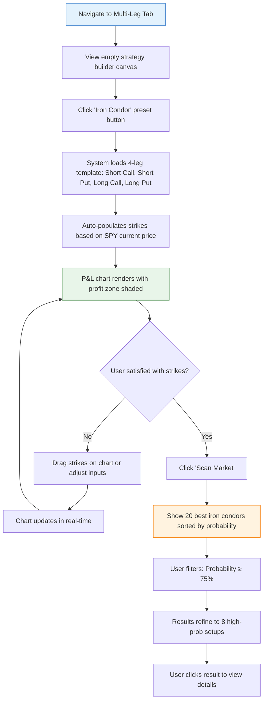
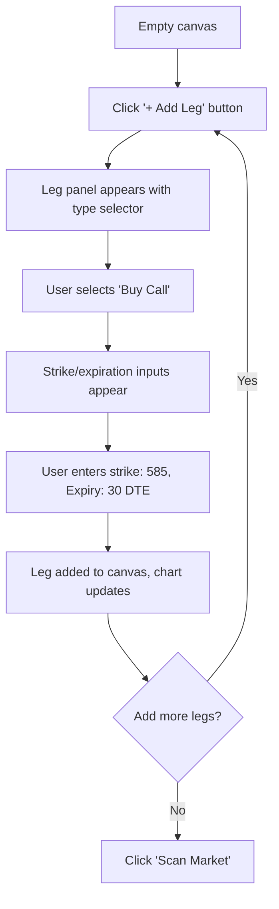
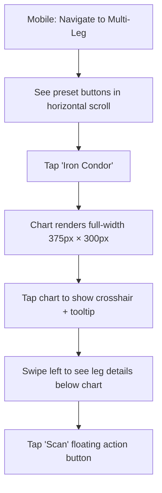

# UX Design: Multi-Leg Options Scan Tab Enhancement

**Feature**: #12 — Multi-Leg Options Scan Tab Enhancement  
**Epic**: #9 — Advanced Strategy Builder  
**Status**: Draft  
**Designer**: UX Designer Agent  
**Date**: 2026-02-16  
**Related PRD**: [PRD-9.md](../prd/PRD-9.md)

---

## Table of Contents

1. [Overview](#1-overview)
2. [User Research](#2-user-research)
3. [User Flows](#3-user-flows)
4. [Wireframes](#4-wireframes)
5. [Component Specifications](#5-component-specifications)
6. [Design System](#6-design-system)
7. [Interactions & Animations](#7-interactions--animations)
8. [Accessibility (WCAG 2.1 AA)](#8-accessibility-wcag-21-aa)
9. [Responsive Design](#9-responsive-design)
10. [Interactive Prototypes](#10-interactive-prototypes)
11. [Implementation Notes](#11-implementation-notes)
12. [Open Questions](#12-open-questions)
13. [References](#13-references)

---

## 1. Overview

### Feature Summary
Enhanced multi-leg options scanner with drag-and-drop strategy builder, real-time risk profile visualization (P&L charts), and preset strategies (iron condors, vertical spreads, calendar spreads). Users can construct complex multi-leg options strategies visually, see instant profit/loss projections, and filter results by probability of profit.

### Design Goals
1. **Visual Strategy Construction** — Drag-and-drop interface for building 2-4 leg strategies without typing
2. **Risk Clarity** — Full-width interactive P&L charts showing breakeven points, probability zones, and profit/loss at any price
3. **Quick Strategy Access** — One-click presets for common strategies (iron condor, bull call spread, etc.)
4. **Probability-Driven Filtering** — Filter scanned strategies by probability of profit threshold
5. **Mobile-Responsive** — Full functionality on tablet/mobile with touch-optimized controls

### Success Criteria
- Users build first multi-leg strategy in < 45 seconds (vs. 2+ minutes with manual entry)
- 80%+ of users use preset strategies as starting point
- Crosshair interaction shows P&L tooltip within 100ms
- Probability filtering reduces results to actionable setups (top 10-20%)
- Mobile users can view full P&L chart without horizontal scroll

---

## 2. User Research

### User Personas

#### Persona 1: "Strategy Sarah" — Options Spread Trader
- **Age**: 38 | **Experience**: 6 years options trading
- **Goals**: Build and compare 5-10 iron condors daily; find high probability setups with defined risk
- **Pain Points**: Manual leg entry is tedious; hard to visualize P&L before committing; forgets exact strikes for presets
- **Behaviors**: Trades iron condors 80% of time; scans SPY, QQQ, AAPL; checks probability of profit before entry
- **Needs**: Iron condor preset, visual P&L chart, probability filter ≥70%, mobile monitoring

#### Persona 2: "Vertical Victor" — Directional Spreader
- **Age**: 31 | **Experience**: 3 years
- **Goals**: Trade bull/bear call and put spreads on earnings; maximize probability with tight spreads
- **Pain Points**: Can't quickly see max profit/loss without calculator; rebuilding same spread structure repeatedly
- **Behaviors**: Trades verticals before earnings; uses 5-10 delta short leg; focuses on 60-70% probability
- **Needs**: Vertical spread presets (bull/bear), breakeven markers, quick strike adjustment

#### Persona 3: "Calendar Cal" — Time-Decay Strategist
- **Age**: 45 | **Experience**: 10+ years
- **Goals**: Harvest theta with calendar spreads; adjust based on volatility changes
- **Pain Points**: Calendar spreads require different expirations; no visual way to see time decay advantage
- **Behaviors**: Runs 3-5 calendar spreads monthly; adjusts strikes based on underlying movement
- **Needs**: Calendar spread preset, time decay visualization, mobile chart viewing

---

## 3. User Flows

### 3.1 Primary Flow: Build Strategy with Preset



**Detailed Steps**:
1. **User Action**: Clicks "Multi-Leg" tab from main navigation
   - **System Response**: Loads strategy builder canvas with preset buttons at top
   - **Screen**: [Screen 1: Strategy Builder Canvas](#wireframe-1-strategy-builder-canvas)

2. **User Action**: Clicks "Iron Condor" preset button
   - **System Response**: Populates 4 legs with default strikes (e.g., SPY @ 580: 575P/580P/585C/590C)
   - **Visual Feedback**: Legs appear with animations, chart draws P&L curve
   - **Duration**: 300ms animation

3. **User Action**: Hovers over P&L chart
   - **System Response**: Crosshair follows mouse, tooltip shows "At $582: +$145 profit"
   - **Performance**: <100ms update latency

4. **User Action**: Drags short call strike from 585→587
   - **System Response**: Chart redraws, max profit updates, breakeven shifts
   - **Validation**: Prevents strikes from crossing (short call > long call)

5. **User Action**: Clicks "Scan Market"
   - **System Response**: Queries backend for matching strategies, shows results table
   - **Loading State**: Skeleton cards during API call (~2s)

**Alternative Flows**:
- **5a. No Results**: Show empty state with suggestion to widen filters
- **5b. API Error**: Show error toast with "Retry" button
- **5c. Invalid Strategy**: Show warning banner "Short strikes must be between long strikes"

### 3.2 Secondary Flow: Build Custom Strategy from Scratch



### 3.3 Mobile Flow: View Strategy Chart



---

## 4. Wireframes

### Wireframe 1: Strategy Builder Canvas — Desktop (1440px)

```
┌─────────────────────────────────────────────────────────────────────────────┐
│  Scanner  │  ● Multi-Leg Builder  │  Portfolio  │  Alerts                   │
├─────────────────────────────────────────────────────────────────────────────┤
│                                                                             │
│  Multi-Leg Strategy Builder                                                 │
│  Build complex options strategies with visual risk profiles                 │
│                                                                             │
│  ┌─────────────────────────────────────────────────────────────────────────┐ │
│  │  PRESET STRATEGIES                                                      │ │
│  │  ┌──────────┐ ┌──────────┐ ┌──────────┐ ┌──────────┐ ┌──────────┐    │ │
│  │  │ Iron     │ │ Bull Call│ │ Bear Put │ │ Calendar │ │ Straddle │    │ │
│  │  │ Condor   │ │ Spread   │ │ Spread   │ │ Spread   │ │          │    │ │
│  │  │ ━━━━━━   │ │          │ │          │ │          │ │          │    │ │
│  │  │ 4 legs   │ │ 2 legs   │ │ 2 legs   │ │ 2 legs   │ │ 2 legs   │    │ │
│  │  └──────────┘ └──────────┘ └──────────┘ └──────────┘ └──────────┘    │ │
│  └─────────────────────────────────────────────────────────────────────────┘ │
│                                                                             │
│  ┌──────────────────── STRATEGY LEGS ──────────────────────────────────────┐ │
│  │                                                                          │ │
│  │  Underlying: [SPY ▼]  Current Price: $580.24  Expiration: [30 DTE ▼]   │ │
│  │                                                                          │ │
│  │  ┌─────────────────────────────────────────────────────────────────┐  │ │
│  │  │ Leg 1: BUY  1  PUT  @ $575  │  Premium: $2.45   │  [✕ Remove]  │  │ │
│  │  └─────────────────────────────────────────────────────────────────┘  │ │
│  │  ┌─────────────────────────────────────────────────────────────────┐  │ │
│  │  │ Leg 2: SELL 1  PUT  @ $580  │  Premium: $4.80   │  [✕ Remove]  │  │ │
│  │  └─────────────────────────────────────────────────────────────────┘  │ │
│  │  ┌─────────────────────────────────────────────────────────────────┐  │ │
│  │  │ Leg 3: SELL 1  CALL @ $585  │  Premium: $4.20   │  [✕ Remove]  │  │ │
│  │  └─────────────────────────────────────────────────────────────────┘  │ │
│  │  ┌─────────────────────────────────────────────────────────────────┐  │ │
│  │  │ Leg 4: BUY  1  CALL @ $590  │  Premium: $1.95   │  [✕ Remove]  │  │ │
│  │  └─────────────────────────────────────────────────────────────────┘  │ │
│  │                                                                          │ │
│  │  [+ Add Leg]                       [Clear All]      [Scan Market →]    │ │
│  └──────────────────────────────────────────────────────────────────────────┘ │
│                                                                             │
│  ┌────────────────── PROFIT/LOSS PROFILE ──────────────────────────────────┐ │
│  │                                                                          │ │
│  │  Strategy: Iron Condor    Max Profit: $460    Max Loss: $540            │ │
│  │  Breakevens: $577.40, $587.60    Probability of Profit: 68%             │ │
│  │                                                                          │ │
│  │   $600 │                                                                │ │
│  │        │            ╭────────────────╮  ← Max Profit Zone              │ │
│  │   $400 │           ╱│                │╲                                 │ │
│  │        │          ╱ │  PROFIT ZONE   │ ╲                                │ │
│  │   $200 │         ╱  │   (68% prob)   │  ╲                               │ │
│  │        │        ╱   │                │   ╲                              │ │
│  │     $0 ├───────●────┼────────────────┼────●──────  ← Breakeven         │ │
│  │        │      ╱ BE  │                │  BE ╲                            │ │
│  │  -$200 │     ╱      │                │      ╲                           │ │
│  │        │    ╱       │                │       ╲                          │ │
│  │  -$400 │   ╱        │                │        ╲                         │ │
│  │        │  ╱  LOSS   │                │  LOSS   ╲                        │ │
│  │  -$600 │ ╱   ZONE   │                │   ZONE   ╲                       │ │
│  │        └───────────────────────────────────────────────                 │ │
│  │        $570      $575  $580  $585  $590      $595                       │ │
│  │                       ↑ Current: $580.24                                │ │
│  │                                                                          │ │
│  │  [Crosshair shows: At $582.50 → Profit: +$320]                          │ │
│  └──────────────────────────────────────────────────────────────────────────┘ │
│                                                                             │
│  ┌─────────────────── SCAN FILTERS ─────────────────────────────────────────┐ │
│  │  Probability of Profit: [════●═══════] 70%                               │ │
│  │  Max Loss: [══●═════════] $500  |  Min Profit: [═══●════════] $400      │ │
│  │  DTE Range: [30 ▼] to [45 ▼]          [Reset] [Apply Filters]          │ │
│  └──────────────────────────────────────────────────────────────────────────┘ │
│                                                                             │
└─────────────────────────────────────────────────────────────────────────────┘
```

### Wireframe 2: P&L Chart with Crosshair Interaction (Detail)

```
┌────────────────────────────────────────────────────────────┐
│  Profit/Loss Profile                    [Export PNG] [⚙]   │
│                                                            │
│  ┌──────────────────────────────────────────────────────┐ │
│  │  $600                                               │ │
│  │       │                                              │ │
│  │  $400 │         ╭──────────────╮                    │ │
│  │       │        ╱                ╲                   │ │
│  │  $200 │       ╱   Profit Zone   ╲                  │ │
│  │       │      ╱     68% Prob      ╲                 │ │
│  │    $0 ├─────●──────────────────────●──────         │ │
│  │       │    ╱│                      │╲               │ │
│  │ -$200 │   ╱ │                      │ ╲              │ │
│  │       │  ╱  │   ┊                  │  ╲             │ │
│  │ -$400 │ ╱   │   ┊                  │   ╲            │ │
│  │       │╱    │   ┊                  │    ╲           │ │
│  │ -$600 │     └───┼──────────────────┼─────           │ │
│  │       └─────────┼──────────────────┼─────────       │ │
│  │            $575 ┊$580  $585  $590  $595            │ │
│  │                 ┊                                    │ │
│  │                 ┊  ← Crosshair at $580.50          │ │
│  │                 ┊                                    │ │
│  │           ┌─────┴──────────────┐                    │ │
│  │           │  At Price: $580.50 │                    │ │
│  │           │  P&L: +$385        │                    │ │
│  │           │  Delta: +0.12      │                    │ │
│  │           └────────────────────┘                    │ │
│  └──────────────────────────────────────────────────────┘ │
│                                                            │
│  Legend:  ● Breakeven  ━━ Profit Zone  ▓▓ Loss Zone       │
│           ┊ Crosshair  ↑ Current Price                    │
└────────────────────────────────────────────────────────────┘
```

### Wireframe 3: Scan Results Table

```
┌─────────────────────────────────────────────────────────────────────────────┐
│  Strategy Scan Results — 47 Iron Condors Found                              │
│  Sorted by: [Probability ▼]  Filter: [Probability ≥ 70%]                   │
│                                                                             │
│  ┌────┬──────────┬──────────┬──────────┬──────────┬──────────┬───────────┐ │
│  │ #  │ Symbol   │ Strikes  │ Max P/L  │ Prob %   │ PoP Wgt  │ Action    │ │
│  ├────┼──────────┼──────────┼──────────┼──────────┼──────────┼───────────┤ │
│  │ 1  │ SPY      │ 575/580  │ +$460    │ ●●●●○ 78%│ $358.80  │ [Details] │ │
│  │    │          │ 585/590  │ -$540    │          │          │ [Trade]   │ │
│  ├────┼──────────┼──────────┼──────────┼──────────┼──────────┼───────────┤ │
│  │ 2  │ QQQ      │ 480/485  │ +$425    │ ●●●●○ 76%│ $323.00  │ [Details] │ │
│  │    │          │ 495/500  │ -$575    │          │          │ [Trade]   │ │
│  ├────┼──────────┼──────────┼──────────┼──────────┼──────────┼───────────┤ │
│  │ 3  │ AAPL     │ 185/188  │ +$380    │ ●●●●○ 74%│ $281.20  │ [Details] │ │
│  │    │          │ 193/196  │ -$620    │          │          │ [Trade]   │ │
│  ├────┼──────────┼──────────┼──────────┼──────────┼──────────┼───────────┤ │
│  │ 4  │ TSLA     │ 240/245  │ +$510    │ ●●●●○ 72%│ $367.20  │ [Details] │ │
│  │    │          │ 255/260  │ -$490    │          │          │ [Trade]   │ │
│  └────┴──────────┴──────────┴──────────┴──────────┴──────────┴───────────┘ │
│                                                                             │
│  Showing 4 of 47 results  [Load More]                                       │
│                                                                             │
└─────────────────────────────────────────────────────────────────────────────┘
```

### Wireframe 4: Mobile View (375px)

```
┌───────────────────────────────────┐
│  ☰  Multi-Leg Builder         [⚙] │
├───────────────────────────────────┤
│                                   │
│  Presets (swipe →)                │
│  ┌──────┐┌──────┐┌──────┐┌──────┐│
│  │ Iron ││ Bull ││ Bear ││Strdd ││
│  │ Cond ││ Call ││ Put  ││le   ││
│  └──────┘└──────┘└──────┘└──────┘│
│                                   │
│  ┌─────────────────────────────┐ │
│  │ Underlying: SPY @ $580.24   │ │
│  │ Expiration: 30 DTE          │ │
│  └─────────────────────────────┘ │
│                                   │
│  Strategy Legs (4)   [+ Add Leg] │
│  ┌─────────────────────────────┐ │
│  │ BUY  1 PUT  @ $575   $2.45  │ │
│  │ SELL 1 PUT  @ $580   $4.80  │ │
│  │ SELL 1 CALL @ $585   $4.20  │ │
│  │ BUY  1 CALL @ $590   $1.95  │ │
│  └─────────────────────────────┘ │
│                                   │
│  P&L Profile                      │
│  ┌─────────────────────────────┐ │
│  │ $400│      ╱────╲            │ │
│  │     │     ╱      ╲           │ │
│  │  $0 ├────●────────●──        │ │
│  │     │   ╱          ╲         │ │
│  │-$400│  ╱            ╲        │ │
│  │     └──────────────────      │ │
│  │     $570  $580  $590         │ │
│  └─────────────────────────────┘ │
│                                   │
│  Max Profit: $460  Max Loss: $540│
│  Breakevens: $577.40, $587.60    │
│  Probability: 68%                │
│                                   │
│            ┌────────────┐        │
│            │ Scan Market│        │
│            └────────────┘        │
│                                   │
└───────────────────────────────────┘
```

---

## 5. Component Specifications

### 5.1 Preset Strategy Button
**Purpose**: One-click loading of common multi-leg strategy templates  
**Usage**: Top of strategy builder, horizontal scroll on mobile

**States**:
- **Default**: Card with strategy name, icon, leg count
- **Hover**: Lift shadow, blue border glow
- **Active**: Blue background, white text
- **Loading**: Spinner overlay, disabled

**Specifications**:
```css
.preset-button {
  width: 140px;
  height: 100px;
  padding: 16px;
  background: var(--bg-card);
  border: 1px solid var(--border-card);
  border-radius: 12px;
  cursor: pointer;
  transition: all 0.2s ease;
}

.preset-button:hover {
  border-color: var(--blue-primary);
  box-shadow: 0 4px 12px rgba(25, 118, 210, 0.2);
  transform: translateY(-2px);
}

.preset-button.active {
  background: var(--blue-primary);
  color: white;
}
```

**Content**:
- Strategy name (e.g., "Iron Condor")
- Icon/emoji (e.g., "🦅")
- Leg count label (e.g., "4 legs")

### 5.2 Strategy Leg Card
**Purpose**: Display single option leg with drag handle for reordering  
**Usage**: Strategy builder legs section

**States**:
- **Default**: Card with action (BUY/SELL), type (CALL/PUT), strike, premium
- **Dragging**: Opacity 0.6, cursor grabbing
- **Hover**: Show drag handle, light blue background
- **Error**: Red border if invalid (e.g., short strike > long strike)

**Specifications**:
```css
.leg-card {
  display: flex;
  align-items: center;
  gap: 12px;
  padding: 16px;
  background: var(--bg-elevated);
  border: 1px solid var(--border-card);
  border-radius: 8px;
  margin-bottom: 8px;
}

.leg-card:hover {
  background: rgba(25, 118, 210, 0.05);
}

.leg-card.error {
  border-color: var(--red);
}

.drag-handle {
  cursor: grab;
  opacity: 0;
  transition: opacity 0.2s;
}

.leg-card:hover .drag-handle {
  opacity: 1;
}
```

**Layout**:
```
[⋮⋮] BUY  [1 ▼] CALL @ [$585] Premium: $4.20  [✕]
 ↑    ↑     ↑      ↑       ↑          ↑        ↑
Drag Action Qty   Type   Strike   Display  Remove
```

### 5.3 P&L Chart with Crosshair
**Purpose**: Interactive profit/loss visualization with real-time tooltip  
**Usage**: Main chart area, updates on leg changes

**Features**:
- SVG-based line chart (800×400px desktop, 375×300px mobile)
- Crosshair follows mouse pointer with vertical/horizontal lines
- Tooltip shows price, P&L, delta at crosshair position
- Shaded profit zone (green), loss zones (red)
- Breakeven markers with labels
- Current price indicator (vertical dashed line)

**Specifications**:
```css
.payout-chart {
  width: 100%;
  height: 400px;
  background: var(--bg-card);
  border: 1px solid var(--border-card);
  border-radius: 12px;
  position: relative;
}

.crosshair-vertical {
  stroke: var(--text-muted);
  stroke-width: 1;
  stroke-dasharray: 4;
  pointer-events: none;
}

.chart-tooltip {
  position: absolute;
  padding: 8px 12px;
  background: rgba(19, 32, 70, 0.95);
  border: 1px solid var(--blue-border);
  border-radius: 6px;
  font-size: 12px;
  pointer-events: none;
  transform: translate(-50%, -110%);
}

.profit-zone {
  fill: rgba(102, 187, 106, 0.15);
}

.loss-zone {
  fill: rgba(239, 83, 80, 0.1);
}
```

**Interaction**:
- Mouse move: Update crosshair position, show tooltip
- Touch: Show crosshair on tap, hide after 2s
- Hover breakeven marker: Highlight label

### 5.4 Probability Slider
**Purpose**: Filter strategies by probability of profit percentage  
**Usage**: Scan filters section

**States**:
- **Default**: Slider track with thumb at position
- **Dragging**: Thumb enlarged, real-time value update
- **Disabled**: Gray colors, no interactions

**Specifications**:
```css
.probability-slider {
  width: 100%;
  height: 40px;
  position: relative;
}

.slider-track {
  height: 8px;
  background: var(--slider-track);
  border-radius: 4px;
}

.slider-fill {
  height: 8px;
  background: linear-gradient(90deg, var(--red), var(--amber), var(--green));
  border-radius: 4px;
}

.slider-thumb {
  width: 20px;
  height: 20px;
  background: white;
  border: 2px solid var(--blue-primary);
  border-radius: 50%;
  cursor: grab;
  transition: transform 0.2s;
}

.slider-thumb:active {
  transform: scale(1.2);
  cursor: grabbing;
}
```

**Value Display**:
- Label shows percentage: "70%"
- Color-coded: Red (0-30%), Amber (30-60%), Green (60-100%)

### 5.5 Scan Results Card
**Purpose**: Display scanned strategy with key metrics  
**Usage**: Results table/grid after scan

**Content**:
- Symbol (e.g., SPY)
- Strike prices (e.g., 575/580/585/590)
- Max profit/loss
- Probability of profit (visual bar + percentage)
- Probability-weighted profit (PoP × Max Profit)
- Action buttons (Details, Trade)

**Specifications**:
```css
.result-card {
  display: grid;
  grid-template-columns: 60px 100px 120px 120px 120px 140px;
  gap: 16px;
  padding: 16px;
  background: var(--bg-card);
  border: 1px solid var(--border-card);
  border-radius: 12px;
  transition: border-color 0.2s;
}

.result-card:hover {
  border-color: var(--blue-border);
}

.probability-bar {
  width: 100%;
  height: 6px;
  background: var(--slider-track);
  border-radius: 3px;
  overflow: hidden;
}

.probability-fill {
  height: 100%;
  background: var(--green);
  transition: width 0.3s ease;
}
```

---

## 6. Design System

### 6.1 Layout & Grid
- **Grid System**: 12-column responsive grid
- **Container Max Width**: 1400px (wide layout for charts)
- **Gutter Width**: 24px
- **Breakpoints**:
  - Mobile: 0-767px
  - Tablet: 768-1023px
  - Desktop: 1024-1440px
  - Wide Desktop: 1440px+

### 6.2 Typography
**Font Family** (from existing design system):
- Primary: 'JetBrains Mono', ui-monospace, monospace
- Fallback: SFMono-Regular, Menlo, Consolas

**Scale**:
- **H1**: 40px / 1.2 line-height / 700 weight (Page title)
- **H2**: 24px / 1.3 line-height / 600 weight (Section headers)
- **H3**: 18px / 1.4 line-height / 600 weight (Component titles)
- **Body**: 14px / 1.5 line-height / 400 weight (Default text)
- **Small**: 12px / 1.4 line-height / 400 weight (Labels, captions)
- **Mono Numbers**: 16px / 1.3 line-height / 500 weight (Prices, premiums)

### 6.3 Color Palette
**Primary Colors** (from globals.css):
- Primary Blue: #1976d2
- Light Blue: #64b5f6
- Blue Background: rgba(25, 118, 210, 0.12)
- Blue Border: rgba(25, 118, 210, 0.3)

**Semantic Colors**:
- Success/Profit: #66bb6a (Green)
- Danger/Loss: #ef5350 (Red)
- Warning: #f5a623 (Amber)
- Info: #29b6f6 (Cyan)

**Neutral Colors**:
- Background Base: #0b1224
- Background Elevated: #132046
- Card Background: rgba(9, 16, 31, 0.65)
- Border: rgba(255, 255, 255, 0.08)
- Text Primary: #e6edf7
- Text Secondary: #b7c3d9
- Text Muted: #94a3b8

**Chart Colors**:
- P&L Line: #1976d2
- Profit Zone: rgba(102, 187, 106, 0.15)
- Loss Zone: rgba(239, 83, 80, 0.1)
- Breakeven Marker: #f5a623
- Current Price Indicator: #ffffff

### 6.4 Spacing System
**Base Unit**: 8px

**Scale**:
- xs: 4px (tight spacing)
- sm: 8px (default gap)
- md: 16px (component padding)
- lg: 24px (section spacing)
- xl: 32px (large gaps)
- xxl: 48px (page margins)

### 6.5 Elevation (Shadows)
- **Level 1**: `0 2px 4px rgba(0,0,0,0.3)` (Cards)
- **Level 2**: `0 4px 12px rgba(0,0,0,0.4)` (Hover states)
- **Level 3**: `0 8px 24px rgba(0,0,0,0.5)` (Modals)
- **Glow**: `0 0 20px rgba(25, 118, 210, 0.4)` (Focus/active)

### 6.6 Border Radius
- **Small**: 8px (buttons, inputs)
- **Medium**: 12px (cards, preset buttons)
- **Large**: 16px (main sections)
- **Circle**: 50% (icons, avatars)

---

## 7. Interactions & Animations

### 7.1 Transitions
**Standard Duration**: 200ms  
**Easing**: ease-in-out

**Common Transitions**:
- Preset button hover: 200ms ease
- Leg card drag: 150ms ease-out
- Chart redraw: 300ms ease-in-out
- Tooltip appear: 100ms ease
- Slider thumb drag: 0ms (instant feedback)

### 7.2 Micro-Interactions

**Preset Button Click**:
1. Scale down to 0.95 (100ms)
2. Load spinner appears (200ms fade)
3. Legs populate with staggered animation (50ms delay each)
4. Chart draws from left to right (300ms)

**Leg Drag Reorder**:
1. Pick up: Opacity 0.6, lift shadow, cursor: grabbing
2. Drag: Ghost element follows cursor
3. Drop: Swap positions with 200ms ease, pulse animation on swap

**Crosshair Interaction**:
1. Mouse enter chart: Crosshair fades in (100ms)
2. Mouse move: Crosshair follows with <16ms latency (60fps)
3. Tooltip: Position updates, values change with number count-up (200ms)
4. Mouse leave: Crosshair fades out (100ms)

**Chart Update on Leg Change**:
1. User changes strike in input
2. P&L line morphs to new shape (300ms)
3. Breakeven markers slide to new positions (300ms)
4. Profit zone reshades (300ms)
5. Summary values count up/down (400ms)

### 7.3 Loading States

**Strategy Load**:
- Skeleton cards for legs (shimmer animation)
- Chart placeholder with pulse animation
- "Building strategy..." text

**Scan Results**:
- Skeleton result cards (3 rows)
- "Scanning market..." progress bar
- Estimated time: ~2-3 seconds

**Chart Render**:
- Gray placeholder with grid lines
- Axes draw first (100ms)
- P&L line animates from left to right (300ms)
- Zones fade in (200ms)

---

## 8. Accessibility (WCAG 2.1 AA)

### 8.1 Keyboard Navigation

**Tab Order**:
1. Preset strategy buttons (left to right)
2. Underlying/expiration selectors
3. Leg card inputs (top to bottom)
4. Add Leg button
5. Scan filters (sliders, inputs)
6. Scan Market button
7. Results table (row by row)

**Keyboard Shortcuts**:
- `Tab`: Navigate forward
- `Shift+Tab`: Navigate backward
- `Enter`: Activate preset button, submit scan
- `Escape`: Close modals, clear selection
- `Arrow Keys`: Adjust sliders (±1%), navigate table
- `Space`: Toggle checkboxes
- `Ctrl/Cmd + A`: Select all legs
- `Delete`: Remove focused leg

**Focus Indicators**:
- 2px solid blue outline (`outline: 2px solid #64b5f6`)
- Offset 2px from element (`outline-offset: 2px`)
- Visible on all interactive elements

### 8.2 Screen Readers

**ARIA Labels**:
- `aria-label="Iron Condor preset, 4 legs"` on preset buttons
- `aria-label="Strategy leg 1: Buy 1 put at $575"` on leg cards
- `aria-label="Profit/loss chart showing max profit $460, max loss $540"` on chart
- `aria-label="Probability of profit slider, currently 70%"` on slider
- `aria-live="polite"` on scan results count
- `aria-busy="true"` during loading states

**Live Regions**:
- Chart tooltip values: `aria-live="polite"` announces "At price $582, profit $320"
- Scan results: `aria-live="polite"` announces "47 strategies found"
- Error messages: `aria-live="assertive"` for critical errors

**Semantic HTML**:
- `<table>` for results grid
- `<button>` for all clickable actions
- `<input type="range">` for sliders
- `<label>` for all form inputs
- `<nav>` for tab navigation

### 8.3 Color Contrast

**Tested Combinations** (WCAG AA minimum 4.5:1 for normal text):
- Primary Text (#e6edf7) on Dark Background (#0b1224): **14.2:1** ✅
- Secondary Text (#b7c3d9) on Dark Background: **8.7:1** ✅
- Blue Primary (#1976d2) on Dark Background: **4.8:1** ✅
- Green Profit (#66bb6a) on Dark Background: **5.2:1** ✅
- Red Loss (#ef5350) on Dark Background: **4.9:1** ✅

**Non-Color Indicators**:
- Profit: Green + "+" prefix + upward triangle ▲
- Loss: Red + "−" prefix + downward triangle ▼
- Breakeven: Amber + "●" marker + "BE" label
- Probability: Visual bar + percentage text + descriptive label

### 8.4 Other Considerations

**Focus Management**:
- Opening modal: Focus moves to first input
- Closing modal: Focus returns to trigger button
- Scan complete: Focus moves to first result

**Error Identification**:
- Icon: ⚠️ (not just color)
- Text: Descriptive message "Short call strike must be greater than long call strike"
- Border: Red highlight on invalid input

**Resizable Text**:
- Layout tested at 200% browser zoom
- Text remains readable, no horizontal scroll
- Chart scales responsively

**Motion Sensitivity**:
```css
@media (prefers-reduced-motion: reduce) {
  * {
    animation-duration: 0.01ms !important;
    transition-duration: 0.01ms !important;
  }
}
```

---

## 9. Responsive Design

### 9.1 Mobile (<768px)

**Layout Changes**:
- **Preset Buttons**: Horizontal scroll container, 4 visible at once
- **Strategy Legs**: Full-width cards, simplified layout (icon + strike + remove)
- **P&L Chart**: 375×300px, touch-optimized (tap for crosshair)
- **Scan Filters**: Stacked vertically, sliders full-width
- **Results**: Card-based grid (1 column), swipeable

**Touch Targets**:
- Minimum 44×44px for all interactive elements
- Drag handles: 48×48px touch area
- Preset buttons: 120×80px minimum

**Font Adjustments**:
- H1: 32px (reduced from 40px)
- Body: 14px (base size, prevents zoom on input focus)
- Chart labels: 11px (legible on small screens)

**Simplifications**:
- Hide advanced metrics (delta, gamma) in leg cards
- Show only top 10 scan results initially (Load More button)
- Simplified tooltip (price + P&L only, no Greeks)

### 9.2 Tablet (768-1023px)

**Layout Changes**:
- **Preset Buttons**: 5 visible, horizontal scroll for more
- **Strategy Legs**: 2-column grid (2 legs per row)
- **P&L Chart**: 700×350px
- **Scan Filters**: 2-column grid (probability + max loss on row 1, min profit + DTE on row 2)
- **Results**: 2-column card grid

**Interaction**:
- Touch + mouse support
- Hover states enabled (for mouse)
- Tap/click for crosshair

### 9.3 Desktop (1024px+)

**Layout Changes**:
- **Full Features**: All presets visible, no scroll
- **Strategy Legs**: 4-column grid or list view (user preference)
- **P&L Chart**: 800×400px (full width)
- **Scan Filters**: Single row, all controls visible
- **Results**: Table view with 6 columns

**Interaction**:
- Mouse-optimized hover states
- Crosshair follows mouse continuously
- Keyboard shortcuts enabled

### 9.4 Responsive Breakpoints

```css
/* Mobile First */
.strategy-builder { padding: 16px; }

/* Tablet */
@media (min-width: 768px) {
  .strategy-builder { padding: 24px; }
  .preset-buttons { gap: 12px; }
  .payout-chart { height: 350px; }
}

/* Desktop */
@media (min-width: 1024px) {
  .strategy-builder { padding: 32px; }
  .preset-buttons { gap: 16px; }
  .payout-chart { height: 400px; }
}

/* Wide Desktop */
@media (min-width: 1440px) {
  .container { max-width: 1600px; }
  .payout-chart { height: 450px; }
}
```

---

## 10. Interactive Prototypes

> **⚠️ MANDATORY**: HTML/CSS prototype required per AGENTS.md validation.

### Prototype Links
- **[HTML/CSS Prototype](../prototypes/multi-leg-builder/index.html)** ✅ **MANDATORY**
  - Full-width P&L chart with crosshair interaction
  - Preset strategy buttons (Iron Condor, Bull Call, Bear Put, Calendar, Straddle)
  - Drag-and-drop leg builder (4 legs with reorder)
  - Real-time chart updates on leg changes
  - Probability slider filter
  - Responsive mobile/tablet/desktop layouts

### Prototype Scope

**Included** ✅:
- Primary flow: Preset selection → leg editing → chart visualization
- Crosshair interaction with tooltip (price, P&L, delta)
- Leg add/remove/reorder
- Probability slider with color-coded zones
- Breakeven markers on chart
- Mobile responsive layout (375px)
- Error state: Invalid strike configuration

**Simulated** ⚠️:
- Backend API calls (mock data for 4 preset strategies)
- Real-time option pricing (hardcoded premiums)
- Scan results (static 10 results, no actual market scan)

**Not Included** ❌:
- Live market data integration
- Trade execution workflow
- User authentication/portfolio tracking
- Advanced Greeks calculations (theta decay over time)

---

## 11. Implementation Notes

### 11.1 For Engineers

**Existing Components to Reuse**:
- Design system variables from `app/globals.css` (colors, fonts, spacing)
- Card containers from `app/components/scanner/` components
- Filter components from `app/components/scanner/FilterPanel.tsx`

**New Components to Create**:

1. **`MultiLegBuilder.tsx`** (Main container)
   - Path: `app/components/strategy/MultiLegBuilder.tsx`
   - Props: `onScan(strategy: MultiLegStrategy) => void`
   - State: `legs: StrategyLeg[]`, `chartData: PayoutData`

2. **`PresetStrategyButton.tsx`** (Preset selector)
   - Path: `app/components/strategy/PresetStrategyButton.tsx`
   - Props: `preset: PresetStrategy`, `onClick: () => void`, `active: boolean`
   - Animation: Lift shadow on hover, scale 0.95 on click

3. **`StrategyLegCard.tsx`** (Individual leg)
   - Path: `app/components/strategy/StrategyLegCard.tsx`
   - Props: `leg: StrategyLeg`, `onChange: (leg) => void`, `onRemove: () => void`
   - Features: Drag handle, inline editing, validation

4. **`PayoutChart.tsx`** (P&L visualization)
   - Path: `app/components/strategy/PayoutChart.tsx`
   - Props: `legs: StrategyLeg[]`, `currentPrice: number`, `width: number`, `height: number`
   - Library: Recharts or D3.js for SVG charting
   - Features: Crosshair, tooltip, zoom/pan on mobile

5. **`ProbabilitySlider.tsx`** (Filter control)
   - Path: `app/components/strategy/ProbabilitySlider.tsx`
   - Props: `value: number`, `onChange: (value) => void`, `min: number`, `max: number`
   - Styling: Color-coded fill (red → amber → green)

**CSS/Styling Approach**:
- Use CSS Modules for component-scoped styles
- Import design tokens from `app/globals.css` (`:root` variables)
- Follow existing naming convention (kebab-case for classes)
- Use Flexbox/Grid for layouts (avoid absolute positioning except tooltip)

**Data Types** (create in `app/types/strategy.ts`):
```typescript
interface StrategyLeg {
  id: string;
  action: 'BUY' | 'SELL';
  type: 'CALL' | 'PUT';
  strike: number;
  quantity: number;
  premium: number;
  expiration: string; // ISO date
}

interface PresetStrategy {
  id: string;
  name: string;
  description: string;
  legs: StrategyLeg[];
  icon: string;
}

interface PayoutData {
  pricePoints: number[]; // X-axis prices
  plValues: number[];    // Y-axis P&L
  breakevens: number[];  // Breakeven prices
  maxProfit: number;
  maxLoss: number;
  probabilityOfProfit: number;
}
```

**API Endpoints** (create in backend):
- `POST /api/strategy/calculate-payout` — Calculate P&L curve from legs
  - Request: `{ legs: StrategyLeg[], currentPrice: number }`
  - Response: `PayoutData`
- `POST /api/strategy/scan` — Scan market for matching strategies
  - Request: `{ legs: StrategyLeg[], filters: ScanFilters }`
  - Response: `{ results: StrategyResult[], count: number }`

**Chart Implementation** (using Recharts):
```tsx
import { LineChart, Line, XAxis, YAxis, ReferenceLine, Area } from 'recharts';

<LineChart width={800} height={400} data={chartData}>
  <XAxis dataKey="price" label="Underlying Price" />
  <YAxis label="P&L" />
  <Line type="monotone" dataKey="pl" stroke="#1976d2" strokeWidth={2} />
  <ReferenceLine x={currentPrice} stroke="#fff" strokeDasharray="4 4" />
  <ReferenceLine y={0} stroke="#94a3b8" />
  {breakevens.map(be => (
    <ReferenceLine key={be} x={be} stroke="#f5a623" label="BE" />
  ))}
  <Area dataKey="pl" fill="url(#profitGradient)" />
</LineChart>
```

**Drag-and-Drop** (using react-beautiful-dnd):
```tsx
import { DragDropContext, Droppable, Draggable } from 'react-beautiful-dnd';

<DragDropContext onDragEnd={handleDragEnd}>
  <Droppable droppableId="legs">
    {(provided) => (
      <div ref={provided.innerRef} {...provided.droppableProps}>
        {legs.map((leg, index) => (
          <Draggable key={leg.id} draggableId={leg.id} index={index}>
            {(provided) => (
              <div ref={provided.innerRef} {...provided.draggableProps}>
                <StrategyLegCard leg={leg} dragHandleProps={provided.dragHandleProps} />
              </div>
            )}
          </Draggable>
        ))}
        {provided.placeholder}
      </div>
    )}
  </Droppable>
</DragDropContext>
```

### 11.2 Assets Needed
- [x] Icons: Strategy icons (already using emoji: 🦅, 📈, 📉, 📅, 🎯)
- [ ] Chart grid lines SVG pattern
- [ ] Drag handle icon (⋮⋮)
- [ ] Loading spinner SVG (reuse existing from scanner)

### 11.3 Testing Checklist
- [ ] Test all 5 preset strategies load correctly
- [ ] Test leg add/remove/reorder (drag-and-drop)
- [ ] Test chart updates on leg changes (< 300ms)
- [ ] Test crosshair interaction (tooltip accuracy)
- [ ] Test probability slider (value updates chart filter)
- [ ] Test invalid configurations (short strike > long strike)
- [ ] Test scan API with various filters
- [ ] Test on Chrome, Firefox, Safari, Edge
- [ ] Test on iOS Safari, Android Chrome (mobile)
- [ ] Test keyboard navigation (tab order, arrow keys on sliders)
- [ ] Test screen reader (NVDA/JAWS) announcements
- [ ] Test at 200% zoom (responsive layout)
- [ ] Test with slow 3G network (loading states)
- [ ] Test with reduced motion preference (animations disabled)

---

## 12. Open Questions

| Question | Owner | Status | Resolution |
|----------|-------|--------|------------|
| Should we support 5+ leg strategies (e.g., broken wing butterfly)? | Product Manager | Open | TBD - Start with 2-4 legs, evaluate usage |
| What's the data source for probability calculations? | Backend Engineer | Open | TBD - IV-based model or historical data? |
| Should we persist custom strategies to user's saved presets? | Product Manager | Open | TBD - Phase 2 feature |
| Mobile: Should drag-and-drop work with touch, or use edit mode? | UX Designer | Resolved | Use edit mode with +/− buttons (no touch drag) |
| Chart: Should we show Greeks curves (delta, theta) in addition to P&L? | Product Manager | Resolved | No - Keep chart focused on P&L, show Greeks in summary |

---

## 13. References

### Design Inspiration
- [TastyTrade Strategy Builder](https://www.tastytrade.com) — Preset strategies, clean leg layout
- [Think or Swim Risk Profile](https://www.thinkorswim.com) — Interactive P&L charts with crosshair
- [OptionStrat](https://optionstrat.com) — Visual strategy builder, probability zones
- [Robinhood Options](https://robinhood.com) — Mobile-first options interface

### Research
- [Black-Scholes Model](https://en.wikipedia.org/wiki/Black%E2%80%93Scholes_model) — Options pricing foundation
- [Probability of Profit Calculation](https://www.projectfinance.com/pop-calculation/) — PoP methodology
- [Iron Condor Strategy Guide](https://www.optionsplaybook.com/option-strategies/iron-condor/) — Strategy breakdown

### Standards
- [WCAG 2.1 Guidelines](https://www.w3.org/WAI/WCAG21/quickref/) — Accessibility compliance
- [Chart.js Accessibility](https://www.chartjs.org/docs/latest/general/accessibility.html) — Chart a11y best practices
- [Drag and Drop Accessibility](https://www.w3.org/WAI/ARIA/apg/patterns/drag-and-drop/) — ARIA patterns for DnD

### Technical Documentation
- [Recharts Documentation](https://recharts.org/) — React charting library
- [react-beautiful-dnd](https://github.com/atlassian/react-beautiful-dnd) — Drag-and-drop library
- [Black-Scholes Calculator](https://github.com/jnPiyush/options-scanner/utils/blackScholes.ts) — Existing pricing utilities

---

**Generated by AgentX UX Designer Agent**  
**Last Updated**: 2026-02-16  
**Version**: 1.0
