```mermaid
flowchart TD
    A["🏠 Start: Any Tab"] --> B["User clicks 'Stock Scans' tab"]
    B --> C["📊 Stock Scans screen loads"]
    C --> D["User selects 'Technical' tab"]
    D --> E["User adjusts RSI slider (30-70)"]
    E --> F["User toggles 'MACD Bullish' filter"]
    F --> G{Auto-update enabled?}
    G -->|Yes| H["🔄 Results update automatically"]
    G -->|No| I["User clicks 'Apply Filters'"]
    I --> H
    H --> J["📋 Results table displays 47 stocks"]
    J --> K["User reviews mini chart for AAPL"]
    K --> L["User clicks 'View Options' button"]
    L --> M["✅ Single Options tab opens with AAPL pre-filled"]

    style A fill:#E3F2FD,stroke:#1565C0
    style H fill:#FFF3E0,stroke:#F57C00
    style M fill:#E8F5E9,stroke:#2E7D32
```

```mermaid
flowchart TD
    A["📊 Stock Scans screen"] --> B["User clicks 'Presets' dropdown"]
    B --> C["Menu shows: High RSI Oversold, Earnings This Week, etc."]
    C --> D["User selects 'High RSI Oversold'"]
    D --> E["🔄 Filters auto-populate: RSI < 30, Volume > 1M"]
    E --> F["Results update automatically"]
    F --> G{User satisfied?}
    G -->|Yes| H["✅ Continue to analysis"]
    G -->|No| I["User tweaks filters manually"]
    I --> F

    style A fill:#E3F2FD,stroke:#1565C0
    style E fill:#FFF3E0,stroke:#F57C00
    style H fill:#E8F5E9,stroke:#2E7D32
```

```mermaid
flowchart TD
    A["📊 Technical tab active"] --> B["User sets RSI > 70"]
    B --> C["User clicks 'Fundamental' tab"]
    C --> D["User sets Market Cap > $1B"]
    D --> E["User clicks 'Momentum' tab"]
    E --> F["User enables 'Earnings This Week'"]
    F --> G["Active filters badge shows '3 filters (AND logic)'"]
    G --> H["Results show stocks meeting ALL criteria"]
    H --> I{User wants OR logic?}
    I -->|Yes| J["User clicks 'Filter Logic' toggle"]
    J --> K["Badge changes to '3 filters (OR logic)'"]
    K --> L["Results show stocks meeting ANY criteria"]
    I -->|No| M["✅ Continue with results"]

    style A fill:#E3F2FD,stroke:#1565C0
    style H fill:#E8F5E9,stroke:#2E7D32
    style L fill:#E8F5E9,stroke:#2E7D32
```

# UX Design: Stock Scans Tab

**Feature**: #13  
**Epic**: #9  
**Status**: Review  
**Designer**: UX Designer Agent  
**Date**: 2026-02-16  
**Related PRD**: [PRD-9.md](../prd/PRD-9.md)

---

## Table of Contents

1. [Overview](#1-overview)
2. [User Research](#2-user-research)
3. [User Flows](#3-user-flows)
4. [Wireframes](#4-wireframes)
5. [Component Specifications](#5-component-specifications)
6. [Design System](#6-design-system)
7. [Interactions & Animations](#7-interactions--animations)
8. [Accessibility (WCAG 2.1 AA)](#8-accessibility-wcag-21-aa)
9. [Responsive Design](#9-responsive-design)
10. [Interactive Prototypes](#10-interactive-prototypes)
11. [Implementation Notes](#11-implementation-notes)
12. [Open Questions](#12-open-questions)
13. [References](#13-references)

---

## 1. Overview

### Feature Summary
The Stock Scans Tab enables traders to screen stocks using technical indicators (RSI, MACD, moving averages), fundamental metrics (market cap, P/E ratio, earnings growth), and momentum signals (unusual options activity, insider buying, earnings announcements). Users can combine filters, save preset scans, and seamlessly transition to options analysis for selected stocks.

### Design Goals
1. **Multi-dimensional filtering**: Provide intuitive tabbed interface for technical, fundamental, and momentum filters
2. **Quick insights**: Display real-time mini charts and key metrics in results table
3. **Seamless integration**: Enable one-click transition from stock scan results to options analysis
4. **Preset efficiency**: Offer pre-configured scans for common strategies

### Success Criteria
- Task completion rate for running first scan > 95%
- Average time to apply 3 filters < 15 seconds
- User satisfaction score for filter discoverability > 4.6/5
- Mobile usability score > 4.2/5

---

## 2. User Research

### User Personas (from PRD)

**Primary Persona: Active Trader (Alex)**
- **Goals**: Find high-probability trade setups quickly; combine technical and fundamental signals; identify stocks with unusual options activity
- **Pain Points**: Too many false signals; scattered data across multiple tools; slow to filter large watchlists
- **Technical Skill**: Advanced
- **Device Preference**: Desktop primary, mobile for quick checks

**Secondary Persona: Part-Time Investor (Jordan)**
- **Goals**: Screen for value opportunities; track earnings catalysts; avoid risky positions
- **Pain Points**: Overwhelmed by too many indicators; needs presets for common strategies
- **Technical Skill**: Intermediate
- **Device Preference**: Both

### User Needs
1. **Fast filtering**: Apply multiple criteria without page reloads or lag
2. **Visual confirmation**: See mini charts to validate technical setups at a glance
3. **Context switching**: Quickly move from stock screener to options chain for selected ticker
4. **Discovery**: Understand what each filter does without external research

---

## 3. User Flows

### 3.1 Primary Flow: Run Basic Stock Screen

**Trigger**: User clicks "Stock Scans" tab  
**Goal**: Find stocks matching technical criteria  
**Preconditions**: User is on Options Scanner app

**Flow Diagram**:


**Detailed Steps**:
1. **User Action**: Clicks "Stock Scans" tab in main navigation
   - **System Response**: Loads Stock Scans screen with default preset ("All Stocks")
   - **Screen**: [Screen 1: Stock Scans Default View](#screen-1-stock-scans-default-view)

2. **User Action**: Clicks "Technical" sub-tab in filter panel
   - **System Response**: Displays technical indicator controls (RSI, MACD, Moving Averages, Volume)
   - **Screen**: [Screen 2: Technical Filters](#screen-2-technical-filters)

3. **User Action**: Drags RSI slider to range 30-70
   - **System Response**: Shows filter badge "RSI: 30-70" in active filters area
   - **Validation**: Auto-update triggers if enabled (default: on)

4. **User Action**: Toggles "MACD Bullish" checkbox
   - **System Response**: Adds "MACD Bullish ✓" badge, updates count in badge (e.g., "2 filters applied")

5. **User Action**: Optional - Clicks "Apply Filters" button (if auto-update off)
   - **System Response**: Shows loading spinner, fetches results from `/api/stock-scan`
   - **API Call**: POST `/api/stock-scan` with filter payload

6. **Success State**: Results table displays filtered stocks with mini charts
   - **Screen**: [Screen 3: Results Table](#screen-3-results-table)

**Alternative Flows**:
- **6a. No Results Found**: Display empty state with suggestions to broaden filters
- **6b. API Error**: Show error toast "Failed to fetch results. Retry?" with retry button
- **6c. Slow Response (>3s)**: Show skeleton loaders in results table

### 3.2 Secondary Flow: Use Preset Scan

**Trigger**: User clicks preset dropdown  
**Goal**: Apply pre-configured filter combination

**Flow Diagram**:


**Detailed Steps**:
1. **User Action**: Clicks "Presets" dropdown in filter panel
   - **System Response**: Displays menu with 8 preset options
   - **Presets**:
     - High RSI Oversold (RSI < 30, Volume > 1M)
     - High RSI Overbought (RSI > 70)
     - MACD Bullish Crossover
     - Earnings This Week (Earnings date within 7 days)
     - Large Cap Value (Market Cap > $10B, P/E < 15)
     - Unusual Options Activity (OI/Volume ratio > 2.0)
     - Insider Buying (Insider purchases in last 30 days)
     - Momentum Breakout (Price > 50-day MA, Volume 2x avg)

2. **User Action**: Clicks "High RSI Oversold"
   - **System Response**: Populates filters, switches to Technical tab, applies filters
   - **Validation**: Shows "Preset: High RSI Oversold" badge

3. **User Action**: Optional - Modifies preset filters (e.g., changes RSI threshold to 35)
   - **System Response**: Badge changes to "Custom (modified from High RSI Oversold)"

**Error Scenarios**:
- **Scenario 1 - Preset Load Failure**: Show toast "Failed to load preset. Using default filters."
- **Scenario 2 - Conflicting Filters**: Warn user if manual edits contradict preset logic

### 3.3 Tertiary Flow: Combine Multi-Tab Filters

**Trigger**: User wants to stack filters across Technical, Fundamental, Momentum tabs  
**Goal**: Find stocks meeting multiple criteria categories

**Flow Diagram**:


**Detailed Steps**:
1. **User Action**: Applies filters in Technical tab (RSI > 70)
2. **User Action**: Switches to Fundamental tab, applies Market Cap filter
   - **System Response**: Active filters badge increments to "2 filters"
   - **Validation**: AND logic applied by default

3. **User Action**: Switches to Momentum tab, toggles "Earnings This Week"
   - **System Response**: Badge shows "3 filters (AND logic)"
   - **Results**: Only stocks matching ALL three criteria displayed

4. **User Action**: Clicks "Filter Logic" toggle switch
   - **System Response**: Changes logic to OR, badge updates to "3 filters (OR logic)"
   - **Results**: Stocks matching ANY of the three criteria displayed

**Alternative Flows**:
- **4a. Too Many Results with OR**: Suggest switching back to AND or narrowing filters
- **4b. Zero Results with AND**: Suggest trying OR logic or broadening individual filters

---

## 4. Wireframes

### Screen 1: Stock Scans Default View

**Purpose**: Entry point to stock screening  
**Context**: User navigates from Options Scanner or Strategy Builder tabs

**Layout**:
```
╔═══════════════════════════════════════════════════════════════════════════════╗
║ Options Scanner  |  Strategy Builder  |  ➔ Stock Scans  |  Portfolio          ║
╠═══════════════════════════════════════════════════════════════════════════════╣
║                                                                               ║
║  ┌─ Filter Panel ──────────────────────────────────────────────────────────┐ ║
║  │                                                                          │ ║
║  │  [Presets ▼]  [High RSI Oversold]   [Clear All]     [Auto-update ✓ On] │ ║
║  │                                                                          │ ║
║  │  ┌─────────────────────────────────────────────────────────────────┐   │ ║
║  │  │ Technical | Fundamental | Momentum                               │   │ ║
║  │  ├─────────────────────────────────────────────────────────────────┤   │ ║
║  │  │                                                                   │   │ ║
║  │  │  RSI Range:  [========●●========] 30 - 70                        │   │ ║
║  │  │  ℹ️ Relative Strength Index (oversold < 30, overbought > 70)     │   │ ║
║  │  │                                                                   │   │ ║
║  │  │  MACD Signal:  [ ] Bullish  [ ] Bearish  [ ] Neutral             │   │ ║
║  │  │                                                                   │   │ ║
║  │  │  Moving Averages:                                                 │   │ ║
║  │  │    [ ] Price > 50-day MA    [ ] Price > 200-day MA               │   │ ║
║  │  │    [ ] Golden Cross (50 MA > 200 MA)                             │   │ ║
║  │  │                                                                   │   │ ║
║  │  │  Volume Spike:  [●─────────] > 1.5x avg (default: off)           │   │ ║
║  │  │                                                                   │   │ ║
║  │  └───────────────────────────────────────────────────────────────────┘   │ ║
║  │                                                                          │ ║
║  │  Active Filters:  🔵 RSI: 30-70  🔵 Volume > 1M   [Filter Logic: AND ▼] │ ║
║  │                                                                          │ ║
║  └──────────────────────────────────────────────────────────────────────────┘ ║
║                                                                               ║
║  ┌─ Results (247 stocks) ─────────────────────────────────────────────────┐ ║
║  │                                                                          │ ║
║  │  Symbol | Name          | Price  | Change | RSI  | Chart    | Actions  │ ║
║  │  ─────────────────────────────────────────────────────────────────────  │ ║
║  │  AAPL   | Apple Inc.    | $182.5 | +2.3%  | 65.3 | 📈mini   | Options→ │ ║
║  │  MSFT   | Microsoft     | $410.2 | +1.1%  | 58.7 | 📈mini   | Options→ │ ║
║  │  TSLA   | Tesla Inc.    | $195.8 | -0.8%  | 42.1 | 📉mini   | Options→ │ ║
║  │  NVDA   | NVIDIA Corp.  | $735.4 | +3.9%  | 71.2 | 📈mini   | Options→ │ ║
║  │  ...    | ...           | ...    | ...    | ...  | ...      | ...      │ ║
║  │                                                                          │ ║
║  │  [← Previous]  Page 1 of 25  [Next →]                                   │ ║
║  │                                                                          │ ║
║  └──────────────────────────────────────────────────────────────────────────┘ ║
║                                                                               ║
╚═══════════════════════════════════════════════════════════════════════════════╝
```

**Responsive Behavior**:
- **Desktop (>1024px)**: Filter panel 40% width, results 60% width, side-by-side
- **Tablet (768-1024px)**: Filter panel collapses to drawer, results full width
- **Mobile (<768px)**: Filter panel slides up from bottom, results stack vertically

### Screen 2: Technical Filters

**Purpose**: Configure technical indicator filters  
**Context**: User selects Technical tab in filter panel

**Component Details**:
```
┌─ Technical Filters ──────────────────────────────────────┐
│                                                          │
│  RSI Range:  [========●●========] 30 - 70               │
│  ℹ️ Relative Strength Index (oversold < 30, overbought > 70) │
│  Quick: [<30 Oversold] [>70 Overbought] [40-60 Neutral] │
│                                                          │
│  MACD Signal: (select one or more)                      │
│    [✓] Bullish (MACD > Signal)                         │
│    [ ] Bearish (MACD < Signal)                         │
│    [ ] Neutral                                          │
│                                                          │
│  Moving Averages:                                       │
│    [✓] Price > 50-day MA                               │
│    [ ] Price > 200-day MA                              │
│    [ ] Golden Cross (50 MA crossed above 200 MA)       │
│    [ ] Death Cross (50 MA crossed below 200 MA)        │
│                                                          │
│  Volume Spike:                                          │
│    [●─────────────] > 1.0x average (default: off)       │
│    Range: 1.0x - 5.0x                                   │
│    ℹ️ Filter stocks with unusual volume activity        │
│                                                          │
│  Chart Pattern Detection: (coming soon)                 │
│    [ ] Head and Shoulders                               │
│    [ ] Double Top/Bottom                                │
│                                                          │
└──────────────────────────────────────────────────────────┘
```

**Interaction States**:
- **Hover**: Show tooltip with detailed explanation
- **Active**: Highlight slider/checkbox with blue accent
- **Disabled**: Gray out unavailable options (e.g., Chart Patterns - coming soon)

### Screen 3: Fundamental Filters

**Purpose**: Configure fundamental metric filters  
**Context**: User selects Fundamental tab in filter panel

**Component Details**:
```
┌─ Fundamental Filters ────────────────────────────────────┐
│                                                          │
│  Market Cap:                                            │
│    [ ] Micro (<$300M)   [✓] Small ($300M-$2B)          │
│    [✓] Mid ($2B-$10B)   [✓] Large (>$10B)              │
│    [ ] Mega (>$200B)                                    │
│                                                          │
│  P/E Ratio:  [====●──────────] < 25                     │
│  Range: 0 - 100+ (off by default)                       │
│  ℹ️ Price-to-Earnings ratio (lower = value, higher = growth) │
│                                                          │
│  Earnings Growth (YoY):                                 │
│    [●─────────────] > 0% (default: off)                 │
│    Range: -50% to +200%                                 │
│    ℹ️ Year-over-year earnings growth percentage         │
│                                                          │
│  Revenue Growth (YoY):                                  │
│    [●─────────────] > 0% (default: off)                 │
│                                                          │
│  Debt-to-Equity:                                        │
│    [●─────────────] < 2.0 (default: off)                │
│    ℹ️ Financial leverage ratio (lower = conservative)   │
│                                                          │
│  Sector:  [All ▼]                                       │
│    ☐ Technology    ☐ Healthcare    ☐ Financials       │
│    ☐ Energy        ☐ Consumer      ☐ Industrials      │
│                                                          │
│  Dividend Yield:                                        │
│    [●─────────────] > 0% (default: off)                 │
│    Range: 0% - 10%                                      │
│                                                          │
└──────────────────────────────────────────────────────────┘
```

### Screen 4: Momentum Filters

**Purpose**: Configure momentum and catalyst filters  
**Context**: User selects Momentum tab in filter panel

**Component Details**:
```
┌─ Momentum Filters ───────────────────────────────────────┐
│                                                          │
│  Unusual Options Activity:                              │
│    [✓] High Open Interest (OI > 2x avg volume)         │
│    [✓] IV Rank > 50 (elevated implied volatility)      │
│    [ ] Put/Call Ratio anomalies                        │
│    ℹ️ Detects unusual derivatives trading patterns      │
│                                                          │
│  Insider Activity:                                      │
│    [✓] Insider Buying (last 30 days)                   │
│    [ ] Insider Selling (last 30 days)                  │
│    [ ] 10b5-1 Plan purchases                           │
│    ℹ️ Tracks company insider transactions               │
│                                                          │
│  Corporate Events:                                      │
│    [✓] Earnings This Week (next 7 days)                │
│    [ ] Earnings Next Month                              │
│    [ ] Ex-Dividend Date (next 30 days)                 │
│    [ ] Analyst Upgrades (last 7 days)                  │
│                                                          │
│  Price Momentum:                                        │
│    [●─────────────] > +5% this week (default: off)      │
│    Range: -50% to +50%                                  │
│                                                          │
│  News Sentiment:  (coming soon)                         │
│    [ ] Positive sentiment                               │
│    [ ] Negative sentiment                               │
│                                                          │
└──────────────────────────────────────────────────────────┘
```

### Screen 5: Results Table (Detailed View)

**Purpose**: Display filtered stocks with actionable data  
**Context**: After applying filters

**Desktop Layout**:
```
┌─ Results (47 stocks match filters) ────────────────────────────────────────────────┐
│                                                                                    │
│  [Export CSV]  [Save Scan]  Sort by: [RSI ▼]  Show: [10 ▼] per page             │
│                                                                                    │
│  ┌────────────────────────────────────────────────────────────────────────────┐  │
│  │ Symbol | Name            | Price   | Change  | RSI  | MACD | Chart | Action││  │
│  ├────────────────────────────────────────────────────────────────────────────┤  │
│  │ AAPL   | Apple Inc.      | $182.52 | +2.3%↑ | 65.3 | Bull | [Mini] | [➔] │  │
│  │        | Tech • Large Cap│         | +$4.10  |      |      | Chart  | Opts│  │
│  │        | Earnings: Mar 1 │         |         |      |      |        |     │  │
│  ├────────────────────────────────────────────────────────────────────────────┤  │
│  │ MSFT   | Microsoft Corp. | $410.25 | +1.1%↑ | 58.7 | Neut | [Mini] | [➔] │  │
│  │        | Tech • Mega Cap │         | +$4.50  |      |      | Chart  | Opts│  │
│  │        | Insider Buy: Y  │         |         |      |      |        |     │  │
│  ├────────────────────────────────────────────────────────────────────────────┤  │
│  │ TSLA   | Tesla Inc.      | $195.80 | -0.8%↓ | 42.1 | Bear | [Mini] | [➔] │  │
│  │        | Auto • Large Cap│         | -$1.55  |      |      | Chart  | Opts│  │
│  │        | High OI: ⚠️      │         |         |      |      |        |     │  │
│  ├────────────────────────────────────────────────────────────────────────────┤  │
│  │ ...    | ...             | ...     | ...     | ...  | ...  | ...    | ... │  │
│  └────────────────────────────────────────────────────────────────────────────┘  │
│                                                                                    │
│  [← Previous]  Page 1 of 5  [Next →]                                              │
│                                                                                    │
└────────────────────────────────────────────────────────────────────────────────────┘

Mini Chart Format (hover to expand):
┌─────────────┐
│   /\  /\    │
│  /  \/  \   │  ← Sparkline (last 30 days)
│ /        \  │
└─────────────┘
```

**Mobile Layout** (<768px):
```
┌─ Results (47) ──────────────────┐
│                                 │
│ [Sort: RSI ▼]  [Filter]        │
│                                 │
│ ┌─────────────────────────────┐ │
│ │ AAPL  $182.52  +2.3%↑       │ │
│ │ Apple Inc. • Tech           │ │
│ │                             │ │
│ │ ┌───────────────────────┐   │ │
│ │ │    [Mini Chart]       │   │ │
│ │ └───────────────────────┘   │ │
│ │                             │ │
│ │ RSI: 65.3  MACD: Bull       │ │
│ │ Earnings: Mar 1             │ │
│ │                             │ │
│ │ [View Options →]            │ │
│ └─────────────────────────────┘ │
│                                 │
│ ┌─────────────────────────────┐ │
│ │ MSFT  $410.25  +1.1%↑       │ │
│ │ Microsoft • Tech            │ │
│ │ ...                         │ │
│ └─────────────────────────────┘ │
│                                 │
│ [Load More (37 remaining)]      │
│                                 │
└─────────────────────────────────┘
```

### Screen 6: Empty State

**Purpose**: Guide users when no results match filters  
**Context**: Filter combination returns zero stocks

**Layout**:
```
┌─ Results (0 stocks) ───────────────────────────────────────┐
│                                                            │
│                      🔍                                    │
│                                                            │
│              No stocks match your filters                  │
│                                                            │
│  Your current filters are too restrictive.                 │
│  Try one of these:                                         │
│                                                            │
│  • Remove some filters                                     │
│  • Switch from AND to OR logic                            │
│  • Broaden RSI range or other thresholds                  │
│  • Use a preset scan to start fresh                       │
│                                                            │
│  ┌────────────────┐  ┌────────────────┐                   │
│  │  Clear Filters │  │  Try Preset ▼  │                   │
│  └────────────────┘  └────────────────┘                   │
│                                                            │
│  Active filters:                                           │
│  🔵 RSI: 25-30  🔵 Market Cap > $100B                     │
│  🔵 MACD Bullish  🔵 Earnings Today                       │
│                                                            │
└────────────────────────────────────────────────────────────┘
```

---

## 5. Component Specifications

### 5.1 Filter Panel Component

**Component Name**: `<StockFilterPanel>`

**Props**:
```typescript
interface StockFilterPanelProps {
  activeTab: 'technical' | 'fundamental' | 'momentum';
  filters: FilterState;
  onFilterChange: (filters: FilterState) => void;
  onPresetSelect: (presetId: string) => void;
  autoUpdate: boolean;
  onAutoUpdateToggle: () => void;
}

interface FilterState {
  technical: TechnicalFilters;
  fundamental: FundamentalFilters;
  momentum: MomentumFilters;
  logic: 'AND' | 'OR';
}
```

**Behavior**:
- Auto-update enabled: Debounce filter changes by 500ms, then trigger API call
- Auto-update disabled: Show "Apply Filters" button, manual trigger required
- Preset selection: Populates all relevant filters, switches to appropriate tab
- Filter badges: Show active filters with clear (X) button for each

**Validation Rules**:
- RSI range: Min >= 0, Max <= 100, Min < Max
- Volume spike: 1.0x - 10.0x multiplier
- P/E ratio: 0 - 200 (or "N/A" for negative earnings)
- Earnings Growth: -100% to +500%

**Accessibility**:
- ARIA labels: All sliders have `aria-label` with current value
- Keyboard navigation: Tab order follows visual layout (left-to-right, top-to-bottom)
- Screen reader announcements: "Filter applied: RSI 30 to 70" when slider released
- Focus indicators: 2px blue outline on focus (WCAG 2.1 AA compliant contrast)

### 5.2 Results Table Component

**Component Name**: `<StockResultsTable>`

**Props**:
```typescript
interface StockResultsTableProps {
  stocks: StockResult[];
  sortBy: 'symbol' | 'price' | 'change' | 'rsi' | 'macd';
  sortOrder: 'asc' | 'desc';
  onSort: (column: string) => void;
  onViewOptions: (symbol: string) => void;
  pageSize: number;
  currentPage: number;
  totalResults: number;
}

interface StockResult {
  symbol: string;
  name: string;
  sector: string;
  marketCap: 'micro' | 'small' | 'mid' | 'large' | 'mega';
  price: number;
  changePercent: number;
  changeAbsolute: number;
  rsi: number;
  macdSignal: 'bullish' | 'bearish' | 'neutral';
  volumeSpike: number | null; // multiplier
  chartData: number[]; // last 30 days close prices
  catalysts: Catalyst[]; // earnings, insider, etc.
}

interface Catalyst {
  type: 'earnings' | 'insider_buy' | 'insider_sell' | 'high_oi' | 'analyst_upgrade';
  description: string;
  date?: string;
}
```

**Behavior**:
- **Sorting**: Click column header to sort (toggle asc/desc)
- **Pagination**: 10/25/50/100 per page options
- **Mini charts**: Render SVG sparkline on hover (expand to 300x200px tooltip)
- **View Options button**: Navigates to Single Options tab with `?symbol=AAPL` query param

**Loading States**:
- Skeleton loaders: 10 rows with animated gray blocks
- Progressive loading: Render first 10 results immediately, lazy load rest

**Accessibility**:
- Table semantics: `<table>`, `<thead>`, `<tbody>`, `<th>`, `<td>` with proper scope
- Sort indicators: ARIA live region announces "Sorted by RSI, ascending"
- Action buttons: `aria-label="View options for Apple Inc."`

### 5.3 Mini Chart Component

**Component Name**: `<StockMiniChart>`

**Props**:
```typescript
interface StockMiniChartProps {
  data: number[]; // close prices
  width: number;
  height: number;
  color: string; // green for positive trend, red for negative
  showTooltip?: boolean;
}
```

**Rendering**:
- **Default**: 80x30px SVG sparkline
- **Hover**: Expand to 300x200px with axis labels, gridlines, volume bars
- **Trend color**: Green if last price > first price, red otherwise
- **Performance**: Use canvas for >100 data points (fallback to SVG for <100)

**Accessibility**:
- Alt text: "Stock price chart for [Symbol]: [Trend description]"
- ARIA label: "Price trend: up 5.3% over 30 days"

### 5.4 Preset Dropdown Component

**Component Name**: `<PresetDropdown>`

**Props**:
```typescript
interface PresetDropdownProps {
  presets: Preset[];
  selectedPreset: string | null;
  onSelect: (presetId: string) => void;
  onSaveCustom?: () => void; // future: save user-created presets
}

interface Preset {
  id: string;
  name: string;
  description: string;
  filters: FilterState;
  icon?: string; // emoji or icon
}
```

**Default Presets**:
1. **High RSI Oversold** 🔴: RSI < 30, Volume > 1M
2. **High RSI Overbought** 🟢: RSI > 70
3. **MACD Bullish Crossover** 📈: MACD > Signal, Price > 50 MA
4. **Earnings This Week** 📅: Earnings date within 7 days
5. **Large Cap Value** 💼: Market Cap > $10B, P/E < 15, Div Yield > 2%
6. **Unusual Options Activity** ⚠️: OI/Volume > 2.0, IV Rank > 50
7. **Insider Buying** 👔: Insider purchases last 30 days
8. **Momentum Breakout** 🚀: Price > 50 MA, Volume 2x avg, RSI > 60

**Accessibility**:
- Keyboard navigation: Arrow keys navigate menu, Enter to select
- ARIA expanded: `aria-expanded="true"` when open
- Focus management: Return focus to dropdown button after selection

---

## 6. Design System

### 6.1 Color Palette

**Filter UI Colors**:
- Active filter badge: `#1976d2` (blue) background, `#64b5f6` (light blue) text
- Active filter badge background: `rgba(25, 118, 210, 0.12)`
- Filter border (active): `rgba(25, 118, 210, 0.3)`

**Signal Colors**:
- Bullish/Positive: `#66bb6a` (green)
- Bearish/Negative: `#ef5350` (red)
- Neutral: `#ffa726` (amber)
- Unusual activity: `#f5a623` (amber) with `rgba(245, 166, 35, 0.15)` background

**Chart Colors**:
- Price up: `#66bb6a` (green)
- Price down: `#ef5350` (red)
- Volume bars: `rgba(255, 255, 255, 0.3)` (gray)

**Background**:
- Panel background: `#0b1224` (dark blue)
- Card background: `#132046` (navy)

### 6.2 Typography

**Font Family**: `JetBrains Mono` (monospace for numbers), system font stack for text

**Type Scale**:
- H1 (section header): 24px, 600 weight
- H2 (card title): 20px, 600 weight
- H3 (subsection): 16px, 600 weight
- Body: 14px, 400 weight
- Caption (tooltips): 12px, 400 weight
- Numbers (prices, RSI): 16px, 500 weight, monospace

### 6.3 Spacing

**Spacing Scale** (existing from globals.css):
- xs: 4px (tight gaps)
- sm: 8px (form elements)
- md: 12px (card padding)
- lg: 16px (section padding)
- xl: 24px (panel padding)
- xxl: 32px (page margins)

### 6.4 Iconography

**Icons Used**:
- Filter active: 🔵 (blue circle badge)
- Price up: ↑ (green arrow)
- Price down: ↓ (red arrow)
- Chart: 📈 / 📉
- Info tooltip: ℹ️
- Clear filter: ✕ (close icon)
- Options action: → (right arrow)

**Icon Size**: 16px standard, 20px for action buttons

---

## 7. Interactions & Animations

### 7.1 Filter Panel Interactions

**Slider Drag**:
- **Animation**: Smooth thumb drag with 0.1s ease-out
- **Feedback**: Show current value tooltip above thumb while dragging
- **Completion**: Update active filter badge on drag release

**Checkbox Toggle**:
- **Animation**: Checkmark fades in with 0.15s ease
- **Feedback**: Checkbox background color transitions from transparent to blue
- **Sound**: Optional click sound (user preference)

**Tab Switching**:
- **Animation**: Content fades out (0.2s), new tab content fades in (0.3s)
- **Indicator**: Active tab underline slides to new position (0.3s ease-in-out)

**Preset Selection**:
- **Animation**: Dropdown slides down (0.2s), filters populate sequentially (stagger 50ms)
- **Feedback**: Brief blue flash on each populated filter (0.3s)

### 7.2 Results Table Interactions

**Row Hover**:
- **Animation**: Background color transitions to `rgba(255, 255, 255, 0.05)` (0.2s)
- **Feedback**: "View Options" button slides in from right (0.3s ease-out)
- **Cursor**: Pointer on hover

**Mini Chart Hover**:
- **Animation**: Scale up to 300x200px tooltip (0.25s ease-out)
- **Position**: Tooltip appears adjacent to cursor (follow pointer)
- **Delay**: 500ms hover delay before expanding

**Sort Column**:
- **Animation**: Rows re-order with staggered fade (0.4s)
- **Feedback**: Sort arrow icon rotates 180° (0.3s)
- **Performance**: Use CSS transforms for smooth 60fps animation

### 7.3 Loading States

**Skeleton Loaders**:
- **Animation**: Shimmer effect (1.5s loop, linear)
- **Pattern**: Gray blocks pulse from left to right
- **Duration**: Show for minimum 300ms (avoid flash for fast loads)

**Apply Filters Button**:
- **Animation**: Spinner rotates (0.8s loop)
- **State**: Button disabled with reduced opacity (0.6)
- **Completion**: Green checkmark appears briefly (0.5s) before showing results

### 7.4 Error States

**No Results**:
- **Animation**: Empty state icon bounces in (0.5s ease-out)
- **Suggestion buttons**: Fade in sequentially (stagger 100ms)

**API Error**:
- **Animation**: Error toast slides down from top (0.3s ease-out)
- **Auto-dismiss**: 5 seconds with progress bar
- **Retry button**: Pulse animation (1s loop) to draw attention

---

## 8. Accessibility (WCAG 2.1 AA)

### 8.1 Keyboard Navigation

**Tab Order**:
1. Main navigation tabs (Options Scanner → Strategy Builder → **Stock Scans** → Portfolio)
2. Preset dropdown
3. Auto-update toggle
4. Filter tabs (Technical | Fundamental | Momentum)
5. All filter controls (sliders, checkboxes, inputs) in visual order
6. Active filter badges (focusable for removal)
7. Results table header (sortable columns)
8. Result rows (each row is focusable)
9. "View Options" buttons
10. Pagination controls

**Keyboard Shortcuts**:
- `Tab` / `Shift+Tab`: Navigate focusable elements
- `Arrow keys`: Navigate filter tabs, move slider thumbs, navigate table rows
- `Enter` / `Space`: Activate buttons, toggle checkboxes
- `Escape`: Close dropdown menus, dismiss tooltips
- `/`: Focus search/filter input (future feature)

### 8.2 Screen Reader Support

**ARIA Labels**:
- Navigation: `<nav aria-label="Main navigation">`
- Filter panel: `<section aria-label="Stock filter panel">`
- Results table: `<table aria-label="Filtered stock results">`
- Sliders: `aria-label="RSI range slider, current value 30 to 70"`
- Checkboxes: `aria-label="Filter by MACD bullish signal"`
- Action buttons: `aria-label="View options for Apple Inc."`

**Live Regions**:
- Filter updates: `<div aria-live="polite">47 stocks match your filters</div>`
- Sort changes: `<div aria-live="polite">Sorted by RSI, descending</div>`
- Error messages: `<div role="alert" aria-live="assertive">Failed to fetch results</div>`

**Dynamic Content**:
- Results loading: `aria-busy="true"` on table container
- Expanded charts: `aria-expanded="true"` on mini chart hover
- Disabled states: `aria-disabled="true"` with grayed-out styling

### 8.3 Color Contrast

**Contrast Ratios** (WCAG 2.1 AA requires 4.5:1 for text, 3:1 for UI components):
- Text on dark background: `#e6edf7` on `#0b1224` = 13.5:1 ✓
- Filter badge text: `#64b5f6` on `#132046` = 5.8:1 ✓
- Active link: `#1976d2` on white = 4.7:1 ✓
- Positive (green): `#66bb6a` on dark = 7.2:1 ✓
- Negative (red): `#ef5350` on dark = 5.6:1 ✓

**Color Blindness Support**:
- Use symbols in addition to color: ↑/↓ arrows for price changes
- Bullish/bearish indicators: "Bull" / "Bear" text labels + color
- Unusual activity: ⚠️ icon + amber color

### 8.4 Focus Indicators

**Focus Styles**:
- All interactive elements: 2px solid `#1976d2` outline
- Offset: 2px from element edge
- Border radius: Matches element (buttons = 4px, inputs = 2px)
- Visible in all states (not removed with `:focus { outline: none }`)

**High Contrast Mode**:
- Test in Windows High Contrast mode
- Ensure focus indicators remain visible
- Use `forced-colors: active` media query for overrides

---

## 9. Responsive Design

### 9.1 Breakpoints

**Breakpoint Scale**:
- Mobile: 0 - 767px
- Tablet: 768px - 1023px
- Desktop: 1024px - 1439px
- Large Desktop: 1440px+

### 9.2 Mobile Optimizations (<768px)

**Filter Panel**:
- Collapses to bottom sheet (slides up on "Filters" button tap)
- Full-width tabs with swipe gesture support
- Larger touch targets (48x48px minimum)
- Sliders: 44px thumb size for easier dragging

**Results Table**:
- Card layout instead of table rows
- Stack columns vertically: Symbol/Price → Chart → Metrics → Action
- Infinite scroll instead of pagination
- "View Options" as full-width button in each card

**Navigation**:
- Hamburger menu for main tabs
- Sticky filter button at bottom (floating action button)

### 9.3 Tablet Optimizations (768-1023px)

**Filter Panel**:
- Collapsible drawer (slides in from left)
- 30% width when expanded, overlays results
- Swipe gesture to open/close

**Results Table**:
- Hybrid layout: Keep table structure, but reduce columns
- Hide less critical columns (e.g., MACD signal)
- Horizontal scroll for full table (with scroll indicator)

### 9.4 Desktop Enhancements (>1024px)

**Filter Panel**:
- Fixed position, 40% width, always visible
- Smooth scroll within panel if content overflows

**Results Table**:
- Full table with all columns visible
- Hover states more prominent (larger tooltips)
- Keyboard shortcuts visible in tooltips

### 9.5 Touch Interactions

**Gestures**:
- Swipe left/right: Navigate filter tabs
- Swipe down: Close filter bottom sheet (mobile)
- Pinch zoom: Expand mini charts (optional)
- Long press: Show context menu (future: save to watchlist)

**Touch Targets**:
- Minimum 44x44px for all buttons
- Slider thumbs: 32px on desktop, 44px on mobile
- Adequate spacing between touch targets (8px gap minimum)

---

## 10. Interactive Prototypes

### 10.1 Prototype Files

**Location**: `docs/ux/prototypes/stock-screener/`

**Files**:
- `index.html`: Main prototype entry point
- `styles.css`: Component styles matching design system
- `script.js`: Interactive filter behavior and mock data
- `mock-data.json`: Sample stock data (100 stocks)

**Features Demonstrated**:
1. ✅ Tabbed filter panel (Technical, Fundamental, Momentum)
2. ✅ RSI slider with real-time updates
3. ✅ MACD checkbox filters
4. ✅ Active filter badges with clear buttons
5. ✅ Preset dropdown with 8 options
6. ✅ Results table with sortable columns
7. ✅ Mini chart sparklines (SVG)
8. ✅ "View Options" button navigation
9. ✅ AND/OR filter logic toggle
10. ✅ Responsive layout (mobile/tablet/desktop)
11. ✅ Empty state for no results
12. ✅ Skeleton loaders
13. ✅ WCAG 2.1 AA compliant

### 10.2 Interactive Behaviors in Prototype

**Filter Panel**:
- RSI slider: Drag thumbs to set range, auto-update results (500ms debounce)
- MACD checkboxes: Toggle to filter by signal type
- Preset selection: Populate filters and switch tabs
- Clear all: Reset filters to defaults

**Results Table**:
- Column headers: Click to sort (toggle asc/desc with arrow icon)
- Row hover: Highlight row, show "View Options" button
- Mini chart hover: Expand to full chart tooltip (mock data)
- Pagination: Navigate pages (10 results per page)

**Responsive**:
- Resize browser to see mobile/tablet/desktop layouts
- Mobile: Filter panel becomes bottom sheet
- Tablet: Responsive table with horizontal scroll

### 10.3 Testing the Prototype

**Steps**:
1. Open `docs/ux/prototypes/stock-screener/index.html` in browser
2. Try filters: Drag RSI slider, toggle MACD checkboxes
3. Select preset: "High RSI Oversold" → Watch filters populate
4. Sort results: Click "RSI" column header
5. View mini chart: Hover over chart icon
6. Resize browser: Test mobile (<768px), tablet (768-1023px), desktop (>1024px)
7. Test keyboard: Tab through all controls, use arrow keys for slider
8. Test screen reader: NVDA/JAWS (Windows) or VoiceOver (Mac)

**Expected Behaviors**:
- Filter changes update results count immediately
- Sorting animates row reordering
- Mini charts expand on hover
- "View Options" button logs navigation action to console
- Mobile layout shows filter bottom sheet

**Known Limitations (Prototype Only)**:
- Mock data (100 stocks, not real-time)
- "View Options" button logs to console (doesn't navigate)
- Mini chart hover tooltip shows placeholder data
- API error states not simulated

---

## 11. Implementation Notes

### 11.1 API Contract

**Endpoint**: `POST /api/stock-scan`

**Request Payload**:
```json
{
  "filters": {
    "technical": {
      "rsi": { "min": 30, "max": 70 },
      "macd": ["bullish"],
      "movingAverages": {
        "priceAbove50MA": true,
        "priceAbove200MA": false,
        "goldenCross": false
      },
      "volumeSpike": { "enabled": false, "multiplier": 1.0 }
    },
    "fundamental": {
      "marketCap": ["small", "mid", "large"],
      "peRatio": { "enabled": false, "max": 25 },
      "earningsGrowth": { "enabled": false, "min": 0 },
      "sector": ["all"]
    },
    "momentum": {
      "unusualOptionsActivity": true,
      "insiderBuying": true,
      "earningsThisWeek": true,
      "priceMomentum": { "enabled": false, "percentChange": 5, "period": "week" }
    },
    "logic": "AND"
  },
  "pagination": {
    "page": 1,
    "pageSize": 10
  },
  "sort": {
    "column": "rsi",
    "order": "desc"
  }
}
```

**Response**:
```json
{
  "results": [
    {
      "symbol": "AAPL",
      "name": "Apple Inc.",
      "sector": "Technology",
      "marketCap": "large",
      "price": 182.52,
      "changePercent": 2.3,
      "changeAbsolute": 4.10,
      "rsi": 65.3,
      "macdSignal": "bullish",
      "volumeSpike": null,
      "chartData": [175.2, 177.8, ... /* 30 days */],
      "catalysts": [
        { "type": "earnings", "description": "Earnings report", "date": "2026-03-01" }
      ]
    }
  ],
  "totalResults": 47,
  "totalPages": 5,
  "currentPage": 1
}
```

**Error Responses**:
- `400 Bad Request`: Invalid filter parameters
- `500 Internal Server Error`: Data provider failure
- `503 Service Unavailable`: Rate limit exceeded

### 11.2 State Management

**React Context/Zustand Store**:
```typescript
interface StockScanState {
  // Filters
  filters: FilterState;
  activeTab: 'technical' | 'fundamental' | 'momentum';
  selectedPreset: string | null;
  autoUpdate: boolean;
  
  // Results
  results: StockResult[];
  totalResults: number;
  currentPage: number;
  pageSize: number;
  sortBy: string;
  sortOrder: 'asc' | 'desc';
  
  // UI state
  loading: boolean;
  error: string | null;
  
  // Actions
  setFilters: (filters: FilterState) => void;
  applyPreset: (presetId: string) => void;
  clearFilters: () => void;
  fetchResults: () => Promise<void>;
  setSort: (column: string) => void;
  setPage: (page: number) => void;
}
```

**Persistence**:
- Save filter state to localStorage: `stockScanFilters`
- Restore on tab load (debounce 1s to avoid flash)
- Clear on logout or explicit "Reset" action

### 11.3 Performance Optimizations

**Debouncing**:
- Filter changes: 500ms debounce before API call
- Slider drag: Only update on release (not every pixel)
- Search input (future): 300ms debounce

**Virtualization**:
- Results table: Use `react-window` for >100 results
- Render only visible rows + 5 buffer above/below

**Lazy Loading**:
- Mini chart data: Fetch on hover (not upfront)
- Chart images: Lazy load with `loading="lazy"` attribute

**Caching**:
- Cache API responses for 60 seconds (stale-while-revalidate)
- LocalStorage cache for preset configurations

### 11.4 Component Tree

```
<StockScansTab>
  ├─ <StockFilterPanel>
  │   ├─ <PresetDropdown>
  │   ├─ <AutoUpdateToggle>
  │   ├─ <FilterTabs>
  │   │   ├─ Technical
  │   │   ├─ Fundamental
  │   │   └─ Momentum
  │   ├─ <TechnicalFilters>
  │   │   ├─ <RSISlider>
  │   │   ├─ <MACDCheckboxes>
  │   │   ├─ <MovingAverageFilters>
  │   │   └─ <VolumeSpikeSlider>
  │   ├─ <FundamentalFilters>
  │   │   ├─ <MarketCapSelect>
  │   │   ├─ <PERatioSlider>
  │   │   ├─ <EarningsGrowthSlider>
  │   │   └─ <SectorSelect>
  │   ├─ <MomentumFilters>
  │   │   ├─ <UnusualOptionsCheckboxes>
  │   │   ├─ <InsiderActivityCheckboxes>
  │   │   ├─ <CorporateEventsCheckboxes>
  │   │   └─ <PriceMomentumSlider>
  │   └─ <ActiveFilterBadges>
  │       └─ <FilterBadge> (multiple)
  │
  └─ <StockResultsTable>
      ├─ <TableHeader>
      │   └─ <SortableColumn> (multiple)
      ├─ <TableBody>
      │   └─ <StockResultRow> (multiple)
      │       ├─ <StockMiniChart>
      │       └─ <ViewOptionsButton>
      └─ <Pagination>
```

### 11.5 Testing Strategy

**Unit Tests**:
- Filter validation logic (RSI range, P/E ratio)
- Preset filter mapping
- Sort/pagination logic
- Mock API responses

**Integration Tests**:
- Filter change → API call → Results update
- Preset selection → Filters populate → Results update
- Sorting → Results reorder
- Pagination → New results fetch

**E2E Tests (Playwright)**:
1. Load Stock Scans tab
2. Apply 3 filters (RSI, Market Cap, Earnings This Week)
3. Verify results table displays filtered stocks
4. Click "View Options" button
5. Verify navigation to Single Options tab with symbol pre-filled

**Accessibility Tests**:
- Axe DevTools scan (0 violations)
- Keyboard-only navigation test
- Screen reader test (NVDA/JAWS)
- Color contrast verification (WCAG 2.1 AA)

---

## 12. Open Questions

### 12.1 For Product Manager

1. **Preset customization**: Should users be able to save custom presets in v1?
   - **Recommendation**: Defer to v2 (requires backend user settings storage)

2. **Filter limits**: Maximum number of simultaneous filters?
   - **Recommendation**: No hard limit, but warn if >10 filters (may slow results)

3. **Data freshness**: Real-time updates or batch updates (e.g., every 15 minutes)?
   - **Recommendation**: Batch updates every 5 minutes (balance cost vs. UX)

### 12.2 For Architect

1. **Chart pattern detection**: Backend ML model or third-party API?
   - **Impact**: Affects UX (latency, accuracy, cost)

2. **Caching strategy**: Redis for filter results or database queries?
   - **Recommendation**: Redis with 60s TTL for hot queries

3. **Rate limiting**: Per-user or per-IP limits for `/api/stock-scan`?
   - **Recommendation**: Per-user (authenticated), per-IP (anonymous) with tiered limits

### 12.3 For Engineer

1. **Mini chart library**: Recharts, Victory, or custom SVG?
   - **Recommendation**: Custom SVG for performance (lightweight sparklines)

2. **State management**: Context API, Zustand, or Redux?
   - **Recommendation**: Zustand (lightweight, less boilerplate than Redux)

3. **Slider component**: Custom or use `@mui/material` Slider?
   - **Recommendation**: MUI Slider (accessible out-of-box, saves dev time)

---

## 13. References

### 13.1 Design Inspiration

- **Finviz Stock Screener**: Industry standard for technical filters
- **TradingView Screener**: Excellent chart integration
- **Yahoo Finance Screener**: Simple, mobile-friendly UX

### 13.2 Technical Documentation

- **RSI**: [Investopedia - Relative Strength Index](https://www.investopedia.com/terms/r/rsi.asp)
- **MACD**: [Investopedia - MACD Indicator](https://www.investopedia.com/terms/m/macd.asp)
- **Moving Averages**: [Investopedia - Simple Moving Average](https://www.investopedia.com/terms/s/sma.asp)

### 13.3 Accessibility Standards

- [WCAG 2.1 AA Guidelines](https://www.w3.org/WAI/WCAG21/quickref/)
- [ARIA Authoring Practices Guide](https://www.w3.org/WAI/ARIA/apg/)
- [WebAIM Color Contrast Checker](https://webaim.org/resources/contrastchecker/)

### 13.4 Related Documents

- [PRD-9.md](../prd/PRD-9.md): Product requirements for Options Scanner Epic
- [ADR-13.md](../adr/ADR-13.md): Technical architecture for Stock Scans feature (pending)
- [SPEC-13.md](../specs/SPEC-13.md): Detailed technical specification (pending)

---

## Approval

**UX Designer**: UX Designer Agent  
**Date**: 2026-02-16  
**Status**: ✅ Ready for Architect Review

**Next Steps**:
1. Solution Architect: Create ADR-13.md and SPEC-13.md
2. Engineer: Implement frontend components
3. Backend Engineer: Implement `/api/stock-scan` endpoint
4. QA: Run accessibility and E2E tests

---

**Change Log**:
- 2026-02-16: Initial UX design created
