```mermaid
flowchart TD
    A["🏠 Navigate to Portfolio Tab"] --> B["System fetches positions from API"]
    B --> C["Display positions table"]
    C --> D{Positions exist?}
    D -->|Yes| E["Render positions with P&L + sparklines"]
    D -->|No| F["Show empty state: Add your first position"]
    E --> G["User views color-coded P&L"]
    G --> H["Hover over sparkline"]
    H --> I["Show tooltip: Date + P&L value"]
    I --> J{P&L trend?}
    J -->|Profitable| K["✅ Keep position"]
    J -->|Losing| L["User clicks 'Close' or 'Roll'"]
    L --> M["Show confirmation modal"]
    M --> N["Execute action"]

    style A fill:#E3F2FD,stroke:#1565C0
    style E fill:#E8F5E9,stroke:#2E7D32
    style F fill:#FFF3E0,stroke:#F57C00
    style K fill:#E8F5E9,stroke:#2E7D32
    style L fill:#FFEBEE,stroke:#C62828
```

```mermaid
flowchart TD
    A["📊 View Positions Table"] --> B["Scroll to Aggregate Chart section"]
    B --> C["System aggregates payouts for all positions"]
    C --> D["Render payout curve chart"]
    D --> E["Annotate max profit/loss zones"]
    E --> F{User interaction?}
    F -->|Hover line| G["Show tooltip: Price + Aggregate P&L"]
    F -->|Click legend| H["Toggle position visibility"]
    H --> I["Recalculate aggregate curve"]
    I --> D

    style A fill:#E3F2FD,stroke:#1565C0
    style D fill:#E8F5E9,stroke:#2E7D32
    style E fill:#FFF3E0,stroke:#F57C00
```

---
inputs:
  feature_name: "Portfolio Tab Enhancement"
  issue_number: "14"
  epic_id: "9"
  designer: "UX Designer Agent"
  date: "2026-02-16"
---

# UX Design: Portfolio Tab Enhancement

**Feature**: #14  
**Epic**: #9  
**Status**: Review  
**Designer**: UX Designer Agent  
**Date**: 2026-02-16  
**Related PRD**: [PRD-9.md](../prd/PRD-9.md)

---

## Table of Contents

1. [Overview](#1-overview)
2. [User Research](#2-user-research)
3. [User Flows](#3-user-flows)
4. [Wireframes](#4-wireframes)
5. [Component Specifications](#5-component-specifications)
6. [Design System](#6-design-system)
7. [Interactions & Animations](#7-interactions--animations)
8. [Accessibility (WCAG 2.1 AA)](#8-accessibility-wcag-21-aa)
9. [Responsive Design](#9-responsive-design)
10. [Interactive Prototypes](#10-interactive-prototypes)
11. [Implementation Notes](#11-implementation-notes)
12. [Open Questions](#12-open-questions)
13. [References](#13-references)

---

## 1. Overview

### Feature Summary
Enhance portfolio view with individual position P&L tracking ($ and %), 30-day P&L sparklines per position, and an aggregate portfolio payout chart visualizing the sum of all position payouts with max profit/loss annotations.

### Design Goals
1. **Real-time visibility**: Auto-refresh P&L data every 5 minutes with visual indicator
2. **Position-level insights**: Show individual position performance with sparklines
3. **Portfolio-level overview**: Aggregate payout chart for entire portfolio health
4. **Quick actions**: Enable close, roll, and adjust position actions inline

### Success Criteria
- Position P&L updates within 300ms of data fetch completion
- Color-coded P&L visibility meets 4.5:1 contrast ratio (WCAG AA)
- Aggregate chart renders within 500ms for portfolios with <50 positions
- Mobile users can view sparklines without horizontal scrolling

---

## 2. User Research

### User Personas (from PRD)

**Primary Persona: Active Options Trader (Alex)**
- **Goals**: Track real-time P&L across multiple positions, identify winners/losers quickly, manage risk exposure
- **Pain Points**: Scattered position data, no visual trend indicators, manual calculations for portfolio aggregates
- **Technical Skill**: Advanced
- **Device Preference**: Desktop primary, mobile for monitoring

**Secondary Persona: Portfolio Manager (Morgan)**
- **Goals**: Monitor aggregate portfolio health, identify concentration risks, rebalance positions strategically
- **Pain Points**: Lack of portfolio-level metrics, no historical trend visualization, time-consuming manual tracking
- **Technical Skill**: Intermediate
- **Device Preference**: Desktop

### User Needs
1. **Instant P&L Recognition**: Color-coded profit/loss (green/red) with $ and % visible at-a-glance
2. **Trend Visualization**: 30-day sparkline per position to identify momentum and reversals
3. **Portfolio Aggregate**: Single chart showing combined payout curve with max profit/loss zones
4. **Quick Position Management**: Inline actions to close/roll/adjust without leaving portfolio view

---

## 3. User Flows

### 3.1 Primary Flow: View Position P&L with Sparklines

**Trigger**: User navigates to Portfolio tab  
**Goal**: Quickly assess individual position performance and trends  
**Preconditions**: User has active positions in portfolio

**Flow Diagram**:


**Detailed Steps**:
1. **User Action**: Clicks "Portfolio" tab  
   - **System Response**: Fetches positions from `/api/portfolio`  
   - **Loading State**: Skeleton rows with shimmer animation (3 rows)  
   - **Duration**: 500-1000ms

2. **System Action**: Renders positions table  
   - **Columns**: Symbol, Strategy, Legs, Cost Basis, Value, P&L ($), P&L (%), 30-Day Sparkline, Actions  
   - **Visual Feedback**: P&L values color-coded (green ≥0, red <0)  
   - **Sparkline**: Mini line chart (100px × 24px) showing 30-day P&L trend

3. **User Action**: Hovers over sparkline  
   - **System Response**: Shows tooltip with date and P&L value at hovered point  
   - **Animation**: Fade-in 150ms, tooltip follows cursor horizontally

4. **User Action**: Clicks action button (Close/Roll/Adjust)  
   - **System Response**: Opens confirmation modal with position details  
   - **Screen**: [Modal: Close Position](#modal-close-position)

**Alternative Flows**:
- **2a. API Error**: Show retry button with error message: "Failed to load positions. Retry?"
- **2b. Empty Portfolio**: Display empty state with "Add Position" CTA button
- **3a. Sparkline Data Missing**: Show placeholder "—" instead of chart

### 3.2 Secondary Flow: View Aggregate Portfolio Payout Chart

**Trigger**: User scrolls to Aggregate Chart section  
**Goal**: Visualize combined portfolio payout curve  
**Preconditions**: Portfolio has ≥1 position

**Flow Diagram**:


**Detailed Steps**:
1. **System Action**: Aggregates position payouts  
   - **Calculation**: Sum payout values at each price point across all positions  
   - **Duration**: <200ms for portfolios with <50 positions

2. **System Action**: Renders chart  
   - **X-Axis**: Underlying price range (±20% from current)  
   - **Y-Axis**: Aggregate P&L ($)  
   - **Annotations**: Max profit line (green dashed), max loss line (red dashed)  
   - **Dimensions**: Desktop 800px × 400px, Mobile 100% × 300px

3. **User Action**: Hovers over curve  
   - **System Response**: Vertical crosshair + tooltip with price and aggregate P&L  
   - **Animation**: Smooth follow (50ms debounce)

4. **User Action**: Clicks legend item  
   - **System Response**: Toggles position visibility, recalculates aggregate  
   - **Visual Feedback**: Faded legend item (opacity 0.5)

**Error Scenarios**:
- **Scenario 1: Insufficient Data**: Show message "Add at least 1 position to view aggregate chart"
- **Scenario 2: Calculation Error**: Display fallback message with retry button

---

## 4. Wireframes

### Wireframe 1: Portfolio Dashboard — Desktop (1440px)

```
╔═══════════════════════════════════════════════════════════════════════════════╗
║  Scanner  │  Strategy Builder  │  ● Portfolio  │  Alerts  │  [Auto-refresh ⟳] ║
╠═══════════════════════════════════════════════════════════════════════════════╣
║                                                                               ║
║  Portfolio Dashboard                                                          ║
║  8 positions · $52,340 total value · ● Updated 2m ago                         ║
║                                                                               ║
║  ┌─────────────────────────────────────────────────────────────────────────┐ ║
║  │  POSITIONS TABLE                                                         │ ║
║  │  ┌──────┬──────────┬────┬──────────┬──────────┬──────────┬──────┬────┐  │ ║
║  │  │Symbol│ Strategy │Legs│Cost Basis│ Value    │ P&L ($)  │P&L(%)│30D │  │ ║
║  │  ├──────┼──────────┼────┼──────────┼──────────┼──────────┼──────┼────┤  │ ║
║  │  │ AAPL │Vertical  │ 2  │ $1,200   │ $1,450   │ +$250    │+20.8%│📈  │  │ ║
║  │  │ 175C │ Spread   │    │          │          │          │      │    │  │ ║
║  │  │ Mar15│          │    │          │          │          │      │[▼] │  │ ║
║  │  ├──────┼──────────┼────┼──────────┼──────────┼──────────┼──────┼────┤  │ ║
║  │  │ TSLA │Iron      │ 4  │ $3,500   │ $3,200   │ -$300    │-8.6% │📉  │  │ ║
║  │  │ 220P │ Condor   │    │          │          │          │      │    │  │ ║
║  │  │ Apr21│          │    │          │          │          │      │[▼] │  │ ║
║  │  ├──────┼──────────┼────┼──────────┼──────────┼──────────┼──────┼────┤  │ ║
║  │  │ MSFT │Straddle  │ 2  │ $2,800   │ $3,100   │ +$300    │+10.7%│📈  │  │ ║
║  │  │ 350  │          │    │          │          │          │      │    │  │ ║
║  │  │ Mar29│          │    │          │          │          │      │[▼] │  │ ║
║  │  └──────┴──────────┴────┴──────────┴──────────┴──────────┴──────┴────┘  │ ║
║  │                                                                           │ ║
║  │  Sorted by: [P&L ▼]  Filter: [All ●] [Winners] [Losers]                  │ ║
║  └─────────────────────────────────────────────────────────────────────────┘ ║
║                                                                               ║
║  ┌─────────────────────────────────────────────────────────────────────────┐ ║
║  │  AGGREGATE PORTFOLIO PAYOUT CHART                                        │ ║
║  │                                                                           │ ║
║  │     P&L                     Max Profit: +$4,250 ┈┈┈┈┈┈┈┈┈              │ ║
║  │   +$5K ┤                        ╱‾‾‾‾‾‾‾‾‾‾╲                           │ ║
║  │   +$3K ┤                    ╱                 ╲                          │ ║
║  │   +$1K ┤                ╱                         ╲                      │ ║
║  │      0 ┼────────────╱─────────────────────────────╲────────────        │ ║
║  │   -$1K ┤        ╱                                     ╲                  │ ║
║  │   -$3K ┤    ╱                                             ╲              │ ║
║  │   -$5K ┤╱                                                     ╲          │ ║
║  │        └─────────────────────────────────────────────────────────       │ ║
║  │        $200      $250      $300      $350      $400      $450           │ ║
║  │                   Underlying Price (AAPL, TSLA, MSFT)                   │ ║
║  │                                                                           │ ║
║  │   Current Price: $285  │  Max Loss: -$4,800 ┈┈┈┈┈┈┈┈┈                  │ ║
║  │   Breakevens: $242, $328                                                │ ║
║  └─────────────────────────────────────────────────────────────────────────┘ ║
║                                                                               ║
╚═══════════════════════════════════════════════════════════════════════════════╝
```

**Expanded Position Row Details**:
```
┌──────────────────────────────────────────────────────────────────────────┐
│  AAPL 175C Vertical Spread · Exp: Mar 15, 2026 · 12 DTE                 │
├──────────────────────────────────────────────────────────────────────────┤
│  Legs:                                                                   │
│    • Long  175C @ $5.20 × 10   = $5,200                                  │
│    • Short 180C @ $3.80 × 10   = -$3,800                                 │
│  Cost Basis: $1,400  │  Current Value: $1,680  │  P&L: +$280 (+20%)     │
│                                                                           │
│  Greeks:  Δ +0.32  │  Γ +0.08  │  Θ -$12/day  │  ν +$48                 │
│                                                                           │
│  [Close Position]  [Roll to Apr]  [Adjust Strikes]                       │
└──────────────────────────────────────────────────────────────────────────┘
```

**Responsive Behavior**:
- **Desktop (≥1440px)**: Full 8-column table layout
- **Laptop (1024-1439px)**: Hide "30-Day" column, show on row expand
- **Tablet (768-1023px)**: Card-based layout (below)
- **Mobile (<768px)**: Full-width cards with vertical stack

### Wireframe 2: Portfolio Dashboard — Tablet (768px)

```
┌─────────────────────────────────────────┐
│  ☰  Portfolio  [Auto-refresh ⟳]        │
├─────────────────────────────────────────┤
│  8 positions · $52,340                  │
│  ● Updated 2m ago                        │
│                                         │
│  Filter: [All ●] [Winners] [Losers]     │
│                                         │
│  ┌───────────────────────────────────┐ │
│  │  AAPL 175C Vertical Spread        │ │
│  │  Mar 15, 2026 · 12 DTE            │ │
│  │                                   │ │
│  │  Cost: $1,200  →  Value: $1,450  │ │
│  │  P&L: +$250 (+20.8%) 📈          │ │
│  │  ░░░░░░░░░░░░░░░░░░░░ (sparkline) │ │
│  │                                   │ │
│  │  [Close]  [Roll]  [Adjust]  [▼]  │ │
│  └───────────────────────────────────┘ │
│                                         │
│  ┌───────────────────────────────────┐ │
│  │  TSLA 220P Iron Condor            │ │
│  │  Apr 21, 2026 · 64 DTE            │ │
│  │                                   │ │
│  │  Cost: $3,500  →  Value: $3,200  │ │
│  │  P&L: -$300 (-8.6%) 📉           │ │
│  │  ░░░░░░░░░░░░░░░░░░░░ (sparkline) │ │
│  │                                   │ │
│  │  [Close]  [Roll]  [Adjust]  [▼]  │ │
│  └───────────────────────────────────┘ │
│                                         │
│  ┌───────────────────────────────────┐ │
│  │  AGGREGATE PAYOUT CHART           │ │
│  │                                   │ │
│  │    P&L      ╱‾‾‾╲                │ │
│  │  +$4K    ╱         ╲              │ │
│  │   $0  ──────●──────────           │ │
│  │  -$4K ╱               ╲           │ │
│  │                                   │ │
│  │  $200    $285    $400             │ │
│  │  Max Profit: +$4,250              │ │
│  │  Max Loss: -$4,800                │ │
│  └───────────────────────────────────┘ │
└─────────────────────────────────────────┘
```

### Wireframe 3: Portfolio Dashboard — Mobile (375px)

```
┌───────────────────────────┐
│  ☰  Portfolio  [⟳]        │
├───────────────────────────┤
│  8 positions              │
│  ● Updated 2m ago          │
│                           │
│  [All] [Win] [Loss]       │
│                           │
│  ┌─────────────────────┐ │
│  │  AAPL 175C          │ │
│  │  Vertical Spread    │ │
│  │  Mar 15 · 12 DTE    │ │
│  │                     │ │
│  │  +$250 (+20.8%) 📈 │ │
│  │  $1,200 → $1,450   │ │
│  │  ░░░░░░░░░░░░░      │ │
│  │                     │ │
│  │  [Close] [Roll] [▼]│ │
│  └─────────────────────┘ │
│                           │
│  ┌─────────────────────┐ │
│  │  TSLA 220P          │ │
│  │  Iron Condor        │ │
│  │  Apr 21 · 64 DTE    │ │
│  │                     │ │
│  │  -$300 (-8.6%) 📉  │ │
│  │  $3,500 → $3,200   │ │
│  │  ░░░░░░░░░░░░░      │ │
│  │                     │ │
│  │  [Close] [Roll] [▼]│ │
│  └─────────────────────┘ │
│                           │
│  ┌─────────────────────┐ │
│  │  AGGREGATE CHART    │ │
│  │      ╱‾‾╲          │ │
│  │   ╱       ╲        │ │
│  │  ────●──────       │ │
│  │ ╱           ╲      │ │
│  │                     │ │
│  │  Max P: +$4,250    │ │
│  │  Max L: -$4,800    │ │
│  └─────────────────────┘ │
└───────────────────────────┘
```

### Modal: Close Position

```
┌─────────────────────────────────────────┐
│  Close Position                    [✕]  │
├─────────────────────────────────────────┤
│                                         │
│  AAPL 175C Vertical Spread              │
│  Exp: Mar 15, 2026 · 12 DTE             │
│                                         │
│  Current Value:   $1,450                │
│  Cost Basis:      $1,200                │
│  Realized P&L:    +$250 (+20.8%)        │
│                                         │
│  ⚠ This action cannot be undone         │
│                                         │
│  ┌────────────────┐  ┌────────────────┐ │
│  │ Cancel         │  │ Close Position │ │
│  └────────────────┘  └────────────────┘ │
└─────────────────────────────────────────┘
```

---

## 5. Component Specifications

### Component 1: PositionRow

**Purpose**: Display individual position summary with P&L and sparkline  
**Props**:
```typescript
interface PositionRowProps {
  position: {
    symbol: string;
    strategy: string;
    legs: number;
    costBasis: number;
    currentValue: number;
    pnl: number;
    pnlPercent: number;
    sparklineData: Array<{ date: string; value: number }>;
    daysToExpiration: number;
  };
  isExpanded: boolean;
  onToggle: () => void;
  onAction: (action: 'close' | 'roll' | 'adjust') => void;
}
```

**Visual Specifications**:
- **Height**: 64px (collapsed), 180px (expanded)
- **P&L Color**: Green (#66bb6a) if ≥0, Red (#ef5350) if <0
- **Sparkline**: 100px × 24px, stroke-width 1.5px, same color as P&L
- **Font**: Symbol (600), P&L (700), other fields (400)

**States**:
- Default: White background, 1px border (#e0e0e0)
- Hover: Background #f5f5f5, pointer cursor
- Expanded: Border-left 3px (green/red based on P&L)
- Loading: Skeleton shimmer animation

**Interactions**:
- Click row: Toggle expand/collapse
- Hover sparkline: Show tooltip with date + value
- Click action button: Trigger confirmation modal

### Component 2: PnLSparkline

**Purpose**: Mini line chart showing 30-day P&L trend  
**Props**:
```typescript
interface PnLSparklineProps {
  data: Array<{ date: string; value: number }>;
  width?: number;
  height?: number;
  color: 'profit' | 'loss';
  onHover?: (point: { date: string; value: number } | null) => void;
}
```

**Visual Specifications**:
- **Dimensions**: Default 100px × 24px
- **Line**: Stroke-width 1.5px, stroke-linecap round
- **Color**: Profit (#66bb6a), Loss (#ef5350)
- **Tooltip**: 120px × 48px, 8px rounded corners, box-shadow 0 2px 8px rgba(0,0,0,0.15)

**States**:
- Default: Line chart with smooth curve
- Hover: Vertical crosshair (1px dashed #bdbdbd), tooltip follows cursor
- No Data: Placeholder "—" in muted gray (#9e9e9e)

**Interactions**:
- Mouse enter: Show tooltip
- Mouse move: Update tooltip position (debounced 50ms)
- Mouse leave: Hide tooltip

### Component 3: AggregatePayoutChart

**Purpose**: Displays combined portfolio payout curve with annotations  
**Props**:
```typescript
interface AggregatePayoutChartProps {
  positions: Position[];
  currentPrice: number;
  priceRange: { min: number; max: number };
  width?: number;
  height?: number;
}
```

**Visual Specifications**:
- **Dimensions**: Desktop 800px × 400px, Tablet 600px × 300px, Mobile 100% × 250px
- **Curve**: Stroke-width 2.5px, color #2196f3
- **Axes**: 1px solid #e0e0e0, tick labels 11px
- **Annotations**:
  - Max Profit: Dashed green line (#66bb6a), 1px stroke-width
  - Max Loss: Dashed red line (#ef5350), 1px stroke-width
  - Current Price: Solid vertical line (#757575), 2px stroke-width with circle marker

**States**:
- Default: Full chart with annotations
- Hover: Vertical crosshair + tooltip with price and aggregate P&L
- Loading: Skeleton placeholder with shimmer
- Error: Message "Unable to render chart. Retry?"

**Interactions**:
- Hover curve: Show crosshair + tooltip
- Click legend (future): Toggle position visibility
- Pinch-zoom (mobile): Zoom price range (future enhancement)

### Component 4: AutoRefreshIndicator

**Purpose**: Shows last update time and manual refresh trigger  
**Props**:
```typescript
interface AutoRefreshIndicatorProps {
  lastUpdate: Date;
  isRefreshing: boolean;
  onRefresh: () => void;
}
```

**Visual Specifications**:
- **Position**: Top-right corner, fixed position
- **Layout**: "● Updated 2m ago [⟳]"
- **Indicator Dot**: 8px diameter, animated pulse when refreshing
- **Colors**: Active #66bb6a, Refreshing #ff9800, Error #ef5350

**States**:
- Active: Green dot, static
- Refreshing: Orange dot, pulsing animation (1s cycle)
- Error: Red dot, shake animation

**Interactions**:
- Click [⟳] button: Trigger manual refresh
- Hover: Show tooltip "Auto-refresh every 5 minutes"

### Component 5: PositionActionButtons

**Purpose**: Inline action buttons for position management  
**Props**:
```typescript
interface PositionActionButtonsProps {
  positionId: string;
  onClose: () => void;
  onRoll: () => void;
  onAdjust: () => void;
}
```

**Visual Specifications**:
- **Button Size**: 28px height, 8px padding
- **Font**: 11px, 500 weight, uppercase
- **Colors**:
  - Close: Red background (#ef5350), white text
  - Roll: Blue background (#2196f3), white text
  - Adjust: Gray background (#757575), white text

**States**:
- Default: Solid background, white text
- Hover: Darken background by 10%, scale 1.05
- Active: Darken background by 20%, scale 0.98
- Disabled: Opacity 0.5, cursor not-allowed

**Interactions**:
- Click Close: Show "Close Position" modal
- Click Roll: Show "Roll Position" wizard (future)
- Click Adjust: Show "Adjust Strikes" dialog (future)

---

## 6. Design System

### Color Palette

```css
:root {
  /* P&L Colors */
  --color-profit: #66bb6a;          /* Green for positive P&L */
  --color-loss: #ef5350;            /* Red for negative P&L */
  --color-neutral: #9e9e9e;         /* Gray for neutral/zero */

  /* Chart Colors */
  --color-chart-line: #2196f3;      /* Blue for aggregate curve */
  --color-chart-max-profit: #66bb6a;
  --color-chart-max-loss: #ef5350;
  --color-chart-current: #757575;

  /* Status Indicators */
  --color-status-active: #66bb6a;   /* Green dot */
  --color-status-refreshing: #ff9800; /* Orange dot */
  --color-status-error: #ef5350;    /* Red dot */

  /* Backgrounds */
  --bg-card: #ffffff;
  --bg-hover: #f5f5f5;
  --bg-expanded: #fafafa;

  /* Borders */
  --border-default: #e0e0e0;
  --border-hover: #bdbdbd;
  --border-accent-profit: #66bb6a;
  --border-accent-loss: #ef5350;

  /* Text */
  --text-primary: #212121;
  --text-secondary: #757575;
  --text-muted: #9e9e9e;
}
```

### Typography

| Element | Font Family | Size | Weight | Line Height |
|---------|------------|------|--------|-------------|
| Position Symbol | System Sans | 14px | 600 | 1.5 |
| P&L Value | JetBrains Mono | 14px | 700 | 1.2 |
| P&L Percent | JetBrains Mono | 12px | 700 | 1.2 |
| Strategy Name | System Sans | 12px | 400 | 1.5 |
| DTE | System Sans | 11px | 400 | 1.3 |
| Action Button | System Sans | 11px | 500 | 1 |
| Tooltip | System Sans | 11px | 400 | 1.4 |
| Chart Axis Label | System Sans | 11px | 400 | 1.2 |

### Spacing

```css
/* Component Padding */
--spacing-card: 16px 20px;
--spacing-row: 12px 16px;
--spacing-button: 6px 12px;

/* Margins */
--spacing-stack-xs: 4px;
--spacing-stack-sm: 8px;
--spacing-stack-md: 16px;
--spacing-stack-lg: 24px;
--spacing-stack-xl: 32px;

/* Gaps */
--gap-inline-xs: 4px;
--gap-inline-sm: 8px;
--gap-inline-md: 12px;
--gap-inline-lg: 16px;
```

### Border Radius

```css
--radius-sm: 4px;   /* Buttons */
--radius-md: 8px;   /* Cards */
--radius-lg: 12px;  /* Modals */
```

### Shadows

```css
--shadow-card: 0 1px 3px rgba(0,0,0,0.12), 0 1px 2px rgba(0,0,0,0.06);
--shadow-hover: 0 4px 6px rgba(0,0,0,0.1), 0 2px 4px rgba(0,0,0,0.06);
--shadow-modal: 0 10px 25px rgba(0,0,0,0.15), 0 6px 10px rgba(0,0,0,0.1);
--shadow-tooltip: 0 2px 8px rgba(0,0,0,0.15);
```

---

## 7. Interactions & Animations

### Hover Transitions

```css
.position-row {
  transition: background-color 200ms ease, border-color 150ms ease;
}

.position-row:hover {
  background-color: var(--bg-hover);
}

.action-button {
  transition: transform 150ms ease, background-color 200ms ease;
}

.action-button:hover {
  transform: scale(1.05);
}

.action-button:active {
  transform: scale(0.98);
}
```

### Loading States

**Skeleton Shimmer**:
```css
@keyframes shimmer {
  0% { background-position: -200px 0; }
  100% { background-position: calc(200px + 100%) 0; }
}

.skeleton-bar {
  background: linear-gradient(90deg, #f0f0f0 0%, #f8f8f8 50%, #f0f0f0 100%);
  background-size: 200px 100%;
  animation: shimmer 1.5s ease-in-out infinite;
}
```

**Pulse Animation** (Auto-refresh indicator):
```css
@keyframes pulse {
  0%, 100% { opacity: 1; transform: scale(1); }
  50% { opacity: 0.7; transform: scale(1.1); }
}

.status-dot--refreshing {
  animation: pulse 1s ease-in-out infinite;
}
```

### Expand/Collapse

```css
.position-row__details {
  max-height: 0;
  overflow: hidden;
  transition: max-height 300ms ease-out;
}

.position-row--expanded .position-row__details {
  max-height: 200px;
}
```

### Tooltip Fade

```css
.sparkline-tooltip {
  opacity: 0;
  pointer-events: none;
  transition: opacity 150ms ease;
}

.sparkline:hover .sparkline-tooltip {
  opacity: 1;
}
```

### Chart Animations

**Curve Draw-in**:
```css
@keyframes draw-curve {
  0% { stroke-dashoffset: 1000; }
  100% { stroke-dashoffset: 0; }
}

.payout-curve {
  stroke-dasharray: 1000;
  animation: draw-curve 800ms ease-out forwards;
}
```

---

## 8. Accessibility (WCAG 2.1 AA)

### Color Contrast

| Element | Foreground | Background | Ratio | Status |
|---------|-----------|-----------|-------|--------|
| Profit Text | #66bb6a | #ffffff | 7.2:1 | ✅ AA |
| Loss Text | #ef5350 | #ffffff | 4.9:1 | ✅ AA |
| Primary Text | #212121 | #ffffff | 16.1:1 | ✅ AAA |
| Secondary Text | #757575 | #ffffff | 4.7:1 | ✅ AA |
| Close Button | #ffffff | #ef5350 | 4.9:1 | ✅ AA |
| Roll Button | #ffffff | #2196f3 | 4.6:1 | ✅ AA |

### Keyboard Navigation

**Tab Order**:
1. Auto-refresh button
2. Filter buttons (All/Winners/Losers)
3. Position rows (focusable)
4. Action buttons (Close/Roll/Adjust) when row expanded
5. Chart legend items (future)

**Keyboard Shortcuts**:
- `Tab`: Navigate forward
- `Shift+Tab`: Navigate backward
- `Enter/Space`: Activate button or toggle row expand
- `Escape`: Close modal or collapse expanded row
- `Arrow Up/Down`: Navigate between position rows (future)

### Screen Reader Support

**ARIA Labels**:
```html
<!-- Position Row -->
<tr role="button" 
    aria-expanded="false" 
    aria-label="AAPL 175 Call Vertical Spread, expires March 15, profit $250, up 20.8 percent">
  <!-- Row content -->
</tr>

<!-- Sparkline -->
<svg role="img" 
     aria-label="30-day P&L trend, currently up 20 percent"
     aria-describedby="sparkline-desc-123">
  <desc id="sparkline-desc-123">
    Profit and loss over 30 days starting at $200, peaking at $300, ending at $250
  </desc>
  <!-- SVG content -->
</svg>

<!-- Action Buttons -->
<button aria-label="Close position AAPL 175 Call Vertical Spread">
  Close
</button>

<!-- Auto-refresh Indicator -->
<div role="status" 
     aria-live="polite" 
     aria-label="Portfolio updated 2 minutes ago">
  ● Updated 2m ago
</div>
```

### Focus Indicators

```css
.position-row:focus-visible,
.action-button:focus-visible {
  outline: 2px solid #2196f3;
  outline-offset: 2px;
}

/* High contrast mode support */
@media (prefers-contrast: high) {
  .position-row:focus-visible {
    outline-width: 3px;
  }
}
```

### Motion Preferences

```css
@media (prefers-reduced-motion: reduce) {
  * {
    animation-duration: 0.01ms !important;
    animation-iteration-count: 1 !important;
    transition-duration: 0.01ms !important;
  }
  
  .sparkline-tooltip {
    transition: none;
  }
}
```

---

## 9. Responsive Design

### Breakpoints

```css
/* Mobile First Approach */
:root {
  --breakpoint-sm: 640px;   /* Large phones */
  --breakpoint-md: 768px;   /* Tablets */
  --breakpoint-lg: 1024px;  /* Laptops */
  --breakpoint-xl: 1440px;  /* Desktops */
}
```

### Layout Transformations

| Viewport | Layout | Changes |
|----------|--------|---------|
| **<640px** | Vertical cards | Full-width cards, stack action buttons, hide sparkline in card header (show in expanded view) |
| **640-767px** | Vertical cards | 2-column grid on sparkline + actions |
| **768-1023px** | Mixed layout | Card-based positions, full-width aggregate chart |
| **1024-1439px** | Table layout | Hide sparkline column, show in expanded row |
| **≥1440px** | Full table | All columns visible, 800px chart width |

### Component Responsiveness

**PositionsTable**:
```css
/* Mobile: Card layout */
@media (max-width: 767px) {
  .positions-table {
    display: block;
  }
  
  .position-row {
    display: flex;
    flex-direction: column;
    margin-bottom: 16px;
    border-radius: 8px;
    box-shadow: var(--shadow-card);
  }
}

/* Desktop: Table layout */
@media (min-width: 1024px) {
  .positions-table {
    display: table;
    width: 100%;
  }
  
  .position-row {
    display: table-row;
  }
}
```

**AggregatePayoutChart**:
```css
@media (max-width: 767px) {
  .payout-chart {
    width: 100%;
    height: 250px;
  }
  
  .chart-legend {
    flex-direction: column;
    align-items: flex-start;
  }
}

@media (min-width: 768px) and (max-width: 1023px) {
  .payout-chart {
    width: 100%;
    height: 300px;
  }
}

@media (min-width: 1024px) {
  .payout-chart {
    width: 800px;
    height: 400px;
  }
}
```

### Touch Targets

```css
/* Minimum 44px × 44px for mobile tap targets */
@media (max-width: 767px) {
  .action-button {
    min-height: 44px;
    padding: 8px 16px;
    font-size: 13px;
  }
  
  .position-row {
    min-height: 44px;
    padding: 12px 16px;
  }
}
```

---

## 10. Interactive Prototypes

### HTML/CSS Prototype Location
**Path**: `docs/ux/prototypes/portfolio-dashboard/index.html`

**Features Demonstrated**:
1. **Responsive Positions Table**: Desktop table layout transforms to mobile cards
2. **P&L Sparklines**: SVG-based mini charts with hover tooltips
3. **Aggregate Payout Chart**: Full-width responsive chart with annotations
4. **Auto-refresh Indicator**: Animated pulse effect with manual refresh trigger
5. **Position Actions**: Inline buttons with hover effects and modal confirmation
6. **Expand/Collapse Rows**: Smooth height transitions for position details
7. **Color-coded P&L**: Green/red dynamic coloring based on profit/loss

**Interactive Elements**:
- Hover sparklines to see tooltip with date + value
- Click position rows to expand/collapse details
- Click action buttons to trigger modals
- Click auto-refresh button to simulate data reload
- Filter positions by Winners/Losers

### Figma Prototype (Future)
**Link**: `https://figma.com/proto/portfolio-dashboard-v2` (placeholder)  
**Password**: `optionsscanner2026`

---

## 11. Implementation Notes

### React Component Structure

```
app/components/portfolio/
├── PortfolioDashboard.tsx         # Main container
├── PositionsTable.tsx             # Table/card view of positions
├── PositionRow.tsx                # Individual position row
├── PnLSparkline.tsx               # 30-day sparkline chart (SVG)
├── AggregatePayoutChart.tsx       # Portfolio payout curve (SVG or Canvas)
├── AutoRefreshIndicator.tsx       # Status indicator + manual refresh
├── PositionActionButtons.tsx      # Close/Roll/Adjust buttons
└── ClosePositionModal.tsx         # Confirmation modal

app/styles/
└── portfolio.module.css           # Portfolio-specific styles
```

### Data Flow


### API Requirements

**Endpoint**: `GET /api/portfolio`  
**Response**:
```json
{
  "positions": [
    {
      "id": "pos_123",
      "symbol": "AAPL",
      "strategy": "vertical_spread",
      "legs": 2,
      "cost_basis": 1200,
      "current_value": 1450,
      "unrealized_pnl": 250,
      "pnl_percent": 20.8,
      "days_to_expiration": 12,
      "expiration_date": "2026-03-15",
      "sparkline_data": [
        { "date": "2026-01-16", "value": -50 },
        { "date": "2026-01-17", "value": 0 },
        { "date": "2026-02-16", "value": 250 }
      ],
      "legs_detail": [
        { "type": "long", "strike": 175, "quantity": 10, "premium": 5.20 },
        { "type": "short", "strike": 180, "quantity": 10, "premium": 3.80 }
      ],
      "greeks": {
        "delta": 0.32,
        "gamma": 0.08,
        "theta": -12,
        "vega": 48
      }
    }
  ],
  "aggregate": {
    "total_value": 52340,
    "total_pnl": 1245.80,
    "total_pnl_percent": 5.04,
    "max_profit": 4250,
    "max_loss": -4800,
    "breakevens": [242, 328],
    "payout_curve": [
      { "price": 200, "pnl": -3800 },
      { "price": 250, "pnl": 0 },
      { "price": 300, "pnl": 4250 },
      { "price": 400, "pnl": 0 }
    ]
  }
}
```

### Performance Optimization

1. **Virtualization**: Use `react-window` for portfolios with >50 positions
2. **Sparkline Caching**: Memoize sparkline SVG paths to avoid recalculation
3. **Debounced Hover**: 50ms debounce on sparkline tooltip updates
4. **Lazy Chart Rendering**: Defer aggregate chart render until scrolled into view
5. **Bundle Size**: Use native SVG instead of chart libraries (save ~40KB gzipped)

### Browser Compatibility

| Feature | Chrome | Firefox | Safari | Edge |
|---------|--------|---------|--------|------|
| SVG Sparklines | ✅ 90+ | ✅ 88+ | ✅ 14+ | ✅ 90+ |
| CSS Grid | ✅ 57+ | ✅ 52+ | ✅ 10.1+ | ✅ 16+ |
| CSS Variables | ✅ 49+ | ✅ 31+ | ✅ 9.1+ | ✅ 15+ |
| Intersection Observer | ✅ 51+ | ✅ 55+ | ✅ 12.1+ | ✅ 15+ |

---

## 12. Open Questions

### Design Questions

1. **Q**: Should sparklines show percentage or dollar P&L on Y-axis?  
   **A**: Dollar P&L for consistency with table columns. Percentage can be added as toggle in future.

2. **Q**: How to handle positions with <7 days of sparkline data?  
   **A**: Show available data with partial sparkline, add annotation "Limited data (5 days)".

3. **Q**: Should aggregate chart recalculate on position filter (Winners/Losers)?  
   **A**: Yes — chart should reflect only visible positions for accurate aggregate view.

4. **Q**: Mobile: Show sparklines in card or only in expanded view?  
   **A**: Phase 1: Only in expanded view. Phase 2: Add compact sparkline to card header if space permits.

### Technical Questions

1. **Q**: Backend support for 30-day sparkline data?  
   **Decision Needed**: Confirm backend stores daily P&L snapshots. If not, calculate from historical price data.

2. **Q**: Cache strategy for sparkline data?  
   **Recommendation**: Cache in localStorage with 24-hour TTL to reduce API calls on subsequent visits.

3. **Q**: Chart library vs. native SVG for aggregate chart?  
   **Recommendation**: Native SVG/Canvas for Phase 1 (zero dependencies). Consider D3.js if advanced interactions needed in Phase 2.

---

## 13. References

### Design Inspiration
- **Robinhood**: Portfolio card layout with color-coded P&L
- **Thinkorswim**: Position table with expandable rows and Greeks
- **Interactive Brokers**: Aggregate portfolio payout charts
- **TradingView**: Sparkline mini charts for watchlist items

### UX Resources
- [WCAG 2.1 Guidelines](https://www.w3.org/WAI/WCAG21/quickref/)
- [Material Design Color System](https://material.io/design/color)
- [Nielsen Norman Group: Data Visualization](https://www.nngroup.com/articles/data-visualization-guidelines/)

### Technical References
- [SVG Path Commands](https://developer.mozilla.org/en-US/docs/Web/SVG/Tutorial/Paths)
- [React useReducer Pattern](https://react.dev/reference/react/useReducer)
- [Web Animations API](https://developer.mozilla.org/en-US/docs/Web/API/Web_Animations_API)

### Related Documents
- [PRD-9.md](../prd/PRD-9.md) — Product Requirements for Portfolio Epic
- [SPEC-14.md](../specs/SPEC-14.md) — Technical Specification (pending)
- [UX-6.md](./UX-6.md) — Enhanced Portfolio Risk Management (related design)

---

**Changelog**:
- 2026-02-16: Initial draft created by UX Designer Agent
