```mermaid
flowchart TD
    A["🏠 Scanner Page"] --> B{"Filter Panel\nVisible?"}
    B -->|No| C["Click 'Advanced Filters' ▼"]
    B -->|Yes| D["Adjust Filters"]
    C --> D
    D --> E["Move IV Percentile Slider\n(e.g., 60-85)"]
    E --> F["Set DTE Range\n(e.g., 30-45 days)"]
    F --> G["Set Volume/OI > 1.5x"]
    G --> H["Set Delta Range\n(e.g., 0.20-0.40)"]
    H --> I{"Results Count\n> 0?"}
    I -->|Yes| J["📊 Results Table\nUpdates in Real-Time"]
    I -->|No| K["Show 'No results'\n+ Suggest widening filters"]
    J --> L["Click Row\nto View Chain"]
    K --> M["Widen Filters\nor Reset"]
    M --> D
    L --> N["🎯 Options Chain\nwith Greeks"]

    style A fill:#132046,stroke:#1976d2,color:#e6edf7
    style J fill:#1b5e20,stroke:#388e3c,color:#e8f5e9
    style K fill:#b71c1c,stroke:#d32f2f,color:#ffebee
    style N fill:#132046,stroke:#e38a00,color:#ffe2b8
```

```mermaid
flowchart TD
    A["📊 Filters Configured"] --> B["Click '💾 Save Preset'"]
    B --> C["Name Input Modal\n'Enter preset name'"]
    C --> D{Name Valid?}
    D -->|Yes| E["✅ Preset Saved\nToast: 'High IV Scan saved'"]
    D -->|Duplicate| F["⚠ Name exists\nOverwrite?"]
    D -->|5 limit| G["❌ Max 5 presets\nDelete one first"]
    E --> H["Preset Chip Appears\nin Presets Bar"]
    F -->|Yes| E
    F -->|No| C
    G --> I["Manage Presets Modal"]

    style A fill:#132046,stroke:#1976d2,color:#e6edf7
    style E fill:#1b5e20,stroke:#388e3c,color:#e8f5e9
    style G fill:#b71c1c,stroke:#d32f2f,color:#ffebee
```

---
inputs:
  feature_name: "Advanced Filtering & Screening System"
  issue_number: "2"
  epic_id: "1"
  designer: "UX Designer Agent"
  date: "2026-02-14"
---

# UX Design: Advanced Filtering & Screening System

**Feature**: #2  
**Epic**: #1  
**Status**: Draft  
**Designer**: UX Designer Agent  
**Date**: 2026-02-14  
**Related PRD**: [PRD-options-scanner-v2.md](../prd/PRD-options-scanner-v2.md)

---

## Table of Contents

1. [Overview](#1-overview)
2. [User Research](#2-user-research)
3. [User Flows](#3-user-flows)
4. [Wireframes](#4-wireframes)
5. [Component Specifications](#5-component-specifications)
6. [Design System](#6-design-system)
7. [Interactions & Animations](#7-interactions--animations)
8. [Accessibility (WCAG 2.1 AA)](#8-accessibility-wcag-21-aa)
9. [Responsive Design](#9-responsive-design)
10. [Interactive Prototypes](#10-interactive-prototypes)
11. [Implementation Notes](#11-implementation-notes)
12. [Open Questions](#12-open-questions)
13. [References](#13-references)

---

## 1. Overview

### Feature Summary

The Advanced Filtering & Screening System replaces the current basic scanner card with a powerful multi-dimensional filter panel that lets traders narrow 500+ options down to actionable opportunities in <2 seconds. Users can filter by IV Percentile (52-week), Volume/OI ratio, Greeks ranges (delta, theta, vega), and Days to Expiration, then save up to 5 custom presets for daily reuse.

### Design Goals

1. **Progressive disclosure**: Show basic filters (ticker, DTE) by default, expand to advanced filters on demand — avoid overwhelming beginners
2. **Instant feedback**: Real-time result count updates as sliders move, zero-delay filtering feels responsive
3. **Muscle memory**: One-click presets let daily traders apply their favorite scan in <2 seconds
4. **Visual clarity**: Color-code unusual metrics (Volume/OI >2.5x amber highlight, extreme IV red/green) so patterns pop immediately

### Success Criteria

- Task completion rate > 95%: User can apply 3+ filters and find results
- Average time to complete scan: <15 seconds (from page load to filtered results)
- Filter preset usage: >40% of returning users use presets by week 2
- Mobile usability: Same filter access on 320px viewports without horizontal scroll

---

## 2. User Research

### User Personas (from PRD)

**Primary Persona: Alex — Intermediate Retail Trader**
- **Goals**: Find high-IV options for premium selling strategies (iron condors, credit spreads)
- **Pain Points**: Current scanner shows flat list with no filtering, must manually check each ticker's IV
- **Technical Skill**: Intermediate — understands Greeks but needs tooltips for IV percentile
- **Device Preference**: Desktop primary (70%), mobile for monitoring (30%)
- **Daily Workflow**: Pre-market scan (8:30 AM), mid-day check (12 PM), post-close review (4:30 PM)

**Secondary Persona: Jordan — Active Day Trader**
- **Goals**: Spot unusual Volume/OI ratios for momentum plays, filter by delta for directional bets
- **Pain Points**: No way to filter by Volume/OI or sort by Greeks in current UI
- **Technical Skill**: Advanced — needs power-user shortcuts, not tooltips
- **Device Preference**: Desktop only (multi-monitor setup)

### User Needs

1. **Speed over completeness**: Traders want the top 10-20 results, not 500. Filters must aggressively narrow.
2. **Visual scanning**: Color-coded cells for IV/Volume let eyes catch outliers faster than reading numbers.
3. **Repeatability**: Daily scans use the same filters — presets eliminate repetitive setup.
4. **Education bridge**: Beginners need "?" tooltips explaining what IV percentile means before they trust the filter.

---

## 3. User Flows

### 3.1 Primary Flow: Apply Advanced Filters to Find Opportunities

**Trigger**: User clicks "Advanced Filters" button or opens Scanner page  
**Goal**: Find options matching specific IV, Volume/OI, Greeks, and DTE criteria  
**Preconditions**: Backend API reachable, cached data available

**Flow Diagram**:


**Detailed Steps**:

1. **User Action**: Opens Scanner page or clicks "Advanced Filters" toggle
   - **System Response**: Filter panel slides down (300ms ease-out) revealing 5 filter groups
   - **Screen**: [Screen 1: Filter Panel Expanded](#screen-1-scanner-with-filter-panel)

2. **User Action**: Drags IV Percentile dual-range slider to 60-85
   - **System Response**: Live result count badge updates: "47 results" → debounced 200ms
   - **Visual**: Slider thumb shows current value, track fills between handles

3. **User Action**: Clicks "30-45" DTE quick-select chip
   - **System Response**: Count updates: "47" → "23 results"
   - **Visual**: Selected chip turns blue, custom input stays accessible

4. **User Action**: Adjusts Volume/OI slider to >1.5x
   - **System Response**: Count updates: "23" → "15 results"
   - **Visual**: Rows with >2.5x ratio get amber highlight badge

5. **User Action**: Sets Delta range 0.20-0.40
   - **System Response**: Count updates: "15" → "8 results". Results table scrolls to top.
   - **Screen**: [Screen 2: Results Table with Active Filters](#screen-2-results-table)

6. **User Action**: Clicks a result row (e.g., AAPL Call $185 exp 3/21)
   - **System Response**: Navigates to options chain view for that ticker
   - **Screen**: Screen 3 (handled by Feature #5 - Yahoo Finance Integration)

**Alternative Flows**:
- **2a. Zero results**: Show empty state: "No options match your filters. Try widening IV Percentile or DTE range." with "Reset Filters" button
- **3a. Custom DTE**: User types "42" in custom input → system uses exact DTE value
- **5a. API error**: Show stale data warning banner: "Showing cached data (5 min old)" with retry button

### 3.2 Secondary Flow: Save and Load Filter Presets

**Trigger**: User clicks "Save Preset" after configuring filters  
**Goal**: Save current filter configuration for quick reuse  
**Preconditions**: User has at least one filter active

**Flow Diagram**:


**Detailed Steps**:

1. **User Action**: Clicks "Save Preset" button (floppy disk icon) in filter panel header
   - **System Response**: Shows inline name input: text field + "Save" button
   - **Validation**: 1-30 characters, no special characters

2. **User Action**: Types "High IV + Short DTE" and clicks Save
   - **System Response**: Toast notification "Preset saved", chip appears in presets bar
   - **Storage**: Saved to localStorage + synced to backend if authenticated

3. **Load Preset**: User clicks preset chip "High IV + Short DTE"
   - **System Response**: All filter values animate to saved positions (300ms), results update
   - **Visual**: Active preset chip gets blue ring outline

4. **Delete Preset**: User right-clicks or long-presses preset chip → "Delete" context menu
   - **System Response**: Confirmation: "Delete 'High IV + Short DTE'?" → removes chip

**Error Scenarios**:
- **Duplicate name**: "A preset named 'High IV' already exists. Replace it?" [Replace] [Cancel]
- **5 preset limit**: "You've reached the maximum of 5 presets. Delete one to save a new one." [Manage Presets]
- **localStorage full**: Falls back to session storage with warning toast

---

## 4. Wireframes

### Screen 1: Scanner with Filter Panel

**Purpose**: Main scanner page with advanced filter panel expanded  
**Context**: Desktop view (1400px container), dark theme

```
╔══════════════════════════════════════════════════════════════════════════════╗
║  Options Scanner                                          [🔍 Run Scan]    ║
║  Real-time trade analysis and portfolio tracking                           ║
╠══════════════════════════════════════════════════════════════════════════════╣
║                                                                            ║
║  ┌──── Presets Bar ─────────────────────────────────────────────────────┐  ║
║  │ [High IV Sell] [Earnings Play] [Delta Scalp] [+ Save Preset] [⚙]   │  ║
║  └─────────────────────────────────────────────────────────────────────┘  ║
║                                                                            ║
║  ┌──── Advanced Filters ──────────────────────── [Reset] [▲ Collapse] ─┐  ║
║  │                                                                      │  ║
║  │  IV Percentile (52wk)  ⓘ        Volume/OI Ratio  ⓘ                │  ║
║  │  ●━━━━━━━━━━━━━━━━━━●           ●━━━━━━━━━●                        │  ║
║  │  60              85              1.5x         10x                    │  ║
║  │  ■ 60-85%                       ■ > 1.5x                           │  ║
║  │                                                                      │  ║
║  │  Days to Expiration  ⓘ          Delta Range  ⓘ                     │  ║
║  │  [0-7] [30-45] [60-90] [LEAPS]  ●━━━━━━━━━●                        │  ║
║  │  Custom: [___]                   0.20        0.40                    │  ║
║  │  ■ 30-45 days                    ■ 0.20-0.40                        │  ║
║  │                                                                      │  ║
║  │  Theta Range  ⓘ                 Vega Range  ⓘ                      │  ║
║  │  ●━━━━━━━━━━━━●                 ●━━━━━━━━━━━━●                     │  ║
║  │  -$0.50      $0.00              $0.00        $2.00                   │  ║
║  │                                                                      │  ║
║  │  Option Type: [All ▼]  Moneyness: [All ▼]  Min Volume: [___]       │  ║
║  │                                                                      │  ║
║  └─────────────────────────────── 【 8 results match 】 ────────────────┘  ║
║                                                                            ║
║  ┌──── Results ────────────────────────────────────────────────────────┐  ║
║  │ Symbol ▼│Type│Strike│ Exp    │ IV%  │ Vol/OI │ Delta │ Bid  │ Ask  │  ║
║  │─────────┼────┼──────┼────────┼──────┼────────┼───────┼──────┼──────│  ║
║  │ AAPL    │Call│ $185 │ 03/21  │ 72%  │ ■ 3.2x │ 0.35  │$4.20│$4.35│  ║
║  │ TSLA    │Put │ $240 │ 03/14  │ 81%  │ ■ 5.1x │-0.28  │$6.10│$6.30│  ║
║  │ NVDA    │Call│ $720 │ 03/21  │ 68%  │   1.8x │ 0.32  │$12.5│$12.8│  ║
║  │ META    │Call│ $500 │ 04/18  │ 75%  │ ■ 2.8x │ 0.25  │$8.40│$8.65│  ║
║  │ AMZN    │Put │ $175 │ 03/21  │ 70%  │   1.6x │-0.22  │$3.80│$3.95│  ║
║  │ MSFT    │Call│ $410 │ 03/14  │ 64%  │ ■ 4.5x │ 0.38  │$5.60│$5.80│  ║
║  │ SPY     │Put │ $500 │ 04/18  │ 66%  │   1.9x │-0.30  │$7.20│$7.40│  ║
║  │ QQQ     │Call│ $440 │ 03/21  │ 71%  │ ■ 2.6x │ 0.33  │$6.90│$7.10│  ║
║  └─────────────────────────────────────────────────────────────────────┘  ║
║                                                                            ║
║  Updated 45 seconds ago via Yahoo Finance   [↻ Refresh]                   ║
║                                                                            ║
╚══════════════════════════════════════════════════════════════════════════════╝
```

**Key Design Decisions**:
- **Presets bar above filters**: Presets are the fastest action — one click applies saved filters
- **Filter panel collapsible**: Saves vertical space after filters are set; results table becomes primary view
- **Live result count at bottom of filter panel**: Gives immediate feedback, prevents empty-result surprise
- **Amber "■" badge on Volume/OI >2.5x**: Visual highlight for unusual activity without overwhelming the table
- **Sortable columns**: Click any column header to sort ascending/descending

### Screen 2: Results Table with Active Filters

**Purpose**: Compact filter state after applying filters, results prominent  
**Context**: Filter panel collapsed, showing filter summary chips

```
╔══════════════════════════════════════════════════════════════════════════════╗
║  Options Scanner                                          [🔍 Run Scan]    ║
╠══════════════════════════════════════════════════════════════════════════════╣
║                                                                            ║
║  ┌──── Active Filters ────────────────── [▼ Expand] [✕ Clear All] ─────┐  ║
║  │ [IV: 60-85%  ✕] [DTE: 30-45d ✕] [Vol/OI: >1.5x ✕] [Δ: .20-.40 ✕] │  ║
║  └─────────────────────────────────────────────────────────────────────┘  ║
║                                                                            ║
║  8 results  •  [High IV Sell ●]  [Earnings Play]  [+ Preset]              ║
║                                                                            ║
║  ┌─────────────────────────────────────────────────────────────────────┐  ║
║  │ ▸ AAPL Call $185 03/21 │ IV 72%│ Vol/OI ■3.2x│ Δ 0.35│ $4.20-4.35│  ║
║  │   └ Theta: -$0.12/day  Vega: $0.45  Gamma: 0.02  OI: 12,450      │  ║
║  │                                                                     │  ║
║  │ ▸ TSLA Put $240 03/14  │ IV 81%│ Vol/OI ■5.1x│ Δ-0.28│ $6.10-6.30│  ║
║  │   └ Theta: -$0.18/day  Vega: $0.82  Gamma: 0.01  OI: 8,200       │  ║
║  │                                                                     │  ║
║  │ ▸ NVDA Call $720 03/21  │ IV 68%│ Vol/OI  1.8x│ Δ 0.32│$12.5-12.8│  ║
║  │   └ Theta: -$0.22/day  Vega: $1.15  Gamma: 0.01  OI: 5,600       │  ║
║  │                                                                     │  ║
║  │ ... (5 more rows)                                                   │  ║
║  └─────────────────────────────────────────────────────────────────────┘  ║
║                                                                            ║
║  [Track Selected]  [Build Strategy ▸]  [Export CSV]                        ║
╚══════════════════════════════════════════════════════════════════════════════╝
```

**Key Design Decisions**:
- **Collapsed filter summary as chips**: Each active filter shown as dismissible chip (click ✕ to remove)
- **Expandable rows**: Click "▸" to reveal secondary Greeks (theta, vega, gamma, OI) without cluttering main table
- **Active preset indicator**: Blue dot "●" on currently active preset
- **Action bar at bottom**: Track, Build Strategy, Export — contextual to selected results

### Screen 3: Save Preset Modal

**Purpose**: Name and save current filter configuration  
**Context**: Inline modal below presets bar

```
╔══════════════════════════════════════════════════════════════════════════════╗
║  ┌──── Save Filter Preset ──────────────────────────────────────────────┐  ║
║  │                                                                      │  ║
║  │  Preset Name:                                                        │  ║
║  │  [High IV + Short DTE________________]                               │  ║
║  │                                                                      │  ║
║  │  Filters to save:                                                    │  ║
║  │  • IV Percentile: 60-85%                                             │  ║
║  │  • DTE: 30-45 days                                                   │  ║
║  │  • Volume/OI: > 1.5x                                                │  ║
║  │  • Delta: 0.20-0.40                                                  │  ║
║  │                                                                      │  ║
║  │  Remaining slots: 3 of 5                                 [Cancel]    │  ║
║  │                                                       [💾 Save]      │  ║
║  └──────────────────────────────────────────────────────────────────────┘  ║
╚══════════════════════════════════════════════════════════════════════════════╝
```

### Screen 4: Mobile Layout (375px)

**Purpose**: Responsive filter experience for mobile traders  
**Context**: Portrait mode, touch-optimized

```
╔═══════════════════════════════════╗
║ Options Scanner       [🔍 Scan]  ║
╠═══════════════════════════════════╣
║                                   ║
║ Presets:                          ║
║ [High IV] [Earnings] [+]         ║
║                                   ║
║ [▼ Advanced Filters (4 active)]  ║
║ ┌─────────────────────────────┐  ║
║ │ IV Percentile       60-85%  │  ║
║ │ ●━━━━━━━━━━━━━━━━━━━━━━●   │  ║
║ │                             │  ║
║ │ DTE      [0-7][30-45][60+]  │  ║
║ │                             │  ║
║ │ Volume/OI          > 1.5x  │  ║
║ │ ●━━━━━━━━━━━━━━━━━━━━━●    │  ║
║ │                             │  ║
║ │ Delta         0.20 - 0.40  │  ║
║ │ ●━━━━━━━━━━━●              │  ║
║ │                             │  ║
║ │        【 8 results 】       │  ║
║ └─────────────────────────────┘  ║
║                                   ║
║ ┌─────────────────────────────┐  ║
║ │ AAPL Call $185    IV: 72%   │  ║
║ │ 03/21  Vol/OI: ■3.2x       │  ║
║ │ Δ 0.35   $4.20-4.35        │  ║
║ │              [Track] [▸]    │  ║
║ ├─────────────────────────────┤  ║
║ │ TSLA Put $240     IV: 81%   │  ║
║ │ 03/14  Vol/OI: ■5.1x       │  ║
║ │ Δ -0.28  $6.10-6.30        │  ║
║ │              [Track] [▸]    │  ║
║ └─────────────────────────────┘  ║
║                                   ║
╚═══════════════════════════════════╝
```

**Mobile Design Decisions**:
- **Full-width filter panel**: Stacked vertically, no side-by-side filters
- **Touch-optimized sliders**: 44px touch targets (WCAG 2.5.5), larger thumb handles
- **Card-based results**: Replace table with stacked cards — easier to scan on mobile
- **Sticky result count**: "8 results" floats at bottom of filter panel

---

## 5. Component Specifications

### 5.1 RangeSlider: Dual-Handle Range Slider

**Purpose**: Filter by numeric ranges (IV percentile, delta, theta, vega, volume/OI)  
**Usage**: All range-based filters in filter panel

**States**:
- **Default**: Track unfilled, handles at min/max
- **Active**: Track fills between handles (blue), current values shown above handles
- **Hover**: Handle scales up 1.2x, tooltip with exact value
- **Disabled**: 50% opacity, handles not draggable
- **Error**: Red track if range is inverted (min > max)

**Specifications**:
```css
.range-slider {
  --track-height: 4px;
  --thumb-size: 20px;
  --track-color: rgba(255, 255, 255, 0.15);
  --fill-color: #1976d2;
  --thumb-color: #e6edf7;
  position: relative;
  width: 100%;
  height: 40px;
  padding: 8px 0;
}

.range-slider__track { /* background track */
  height: var(--track-height);
  background: var(--track-color);
  border-radius: 2px;
}

.range-slider__fill { /* filled area between handles */
  height: var(--track-height);
  background: var(--fill-color);
  border-radius: 2px;
}

.range-slider__thumb {
  width: var(--thumb-size);
  height: var(--thumb-size);
  border-radius: 50%;
  background: var(--thumb-color);
  border: 2px solid var(--fill-color);
  cursor: grab;
  transition: transform 0.15s ease;
}

.range-slider__thumb:hover {
  transform: scale(1.2);
}

.range-slider__value { /* floating value label */
  font-size: 11px;
  color: #94a3b8;
  font-family: 'JetBrains Mono', monospace;
}
```

**Touch Target**: 44px minimum (WCAG 2.5.5), achieved via invisible expanded hit area

### 5.2 FilterChip: Quick Select Chip

**Purpose**: Pre-defined DTE ranges and filter summary chips  
**Usage**: DTE quick-select (0-7, 30-45, 60-90, LEAPS), active filter summary

**States**:
- **Default**: Ghost style, border only
- **Selected**: Filled blue background, white text
- **Hover**: Background lighten 10%
- **Dismissible**: Active filter chip with "✕" button (used in collapsed filter summary)

**Specifications**:
```css
.filter-chip {
  display: inline-flex;
  align-items: center;
  gap: 6px;
  padding: 6px 12px;
  font-size: 12px;
  font-weight: 500;
  border-radius: 16px;
  border: 1px solid rgba(255, 255, 255, 0.2);
  background: transparent;
  color: #b7c3d9;
  cursor: pointer;
  transition: all 0.15s ease;
  font-family: 'JetBrains Mono', monospace;
}

.filter-chip--selected {
  background: #1976d2;
  border-color: #1976d2;
  color: white;
}

.filter-chip--dismissible {
  background: rgba(25, 118, 210, 0.15);
  border-color: rgba(25, 118, 210, 0.4);
  color: #64b5f6;
}

.filter-chip__dismiss {
  font-size: 14px;
  opacity: 0.6;
  margin-left: 4px;
}

.filter-chip__dismiss:hover {
  opacity: 1;
}
```

### 5.3 PresetChip: Saved Filter Preset

**Purpose**: One-click filter preset loading  
**Usage**: Presets bar above filter panel

**States**:
- **Default**: Ghost chip style
- **Active**: Blue ring outline, dot indicator
- **Hover**: Background lighten, show preset name in tooltip with filter summary
- **Context Menu**: Right-click → [Rename] [Delete] [Duplicate]

**Specifications**:
```css
.preset-chip {
  display: inline-flex;
  align-items: center;
  gap: 6px;
  padding: 8px 14px;
  font-size: 13px;
  font-weight: 600;
  border-radius: 8px;
  border: 1px solid rgba(255, 255, 255, 0.12);
  background: rgba(9, 16, 31, 0.65);
  color: #e6edf7;
  cursor: pointer;
  transition: all 0.2s ease;
}

.preset-chip--active {
  border-color: #1976d2;
  box-shadow: 0 0 0 1px #1976d2;
}

.preset-chip--active::before {
  content: '';
  width: 6px;
  height: 6px;
  border-radius: 50%;
  background: #1976d2;
}

.preset-chip:hover {
  background: rgba(25, 118, 210, 0.1);
}
```

### 5.4 ResultRow: Scanner Result Entry

**Purpose**: Single options opportunity in results table  
**Usage**: Results table rows, expandable for secondary Greeks

**States**:
- **Default**: Standard row
- **Hover**: Row background lightens
- **Expanded**: Shows secondary data (theta, vega, gamma, OI)
- **Highlighted**: Amber volume/OI badge for unusual activity (>2.5x)

**Specifications**:
```css
.result-row {
  display: grid;
  grid-template-columns: 90px 50px 70px 70px 60px 80px 60px 60px 60px;
  align-items: center;
  padding: 10px 12px;
  border-bottom: 1px solid rgba(255, 255, 255, 0.06);
  font-size: 13px;
  font-family: 'JetBrains Mono', monospace;
  cursor: pointer;
  transition: background 0.15s ease;
}

.result-row:hover {
  background: rgba(25, 118, 210, 0.08);
}

.result-row__iv--high { /* IV > 70 */
  color: #ef5350; /* red for expensive */
}

.result-row__iv--low { /* IV < 30 */
  color: #66bb6a; /* green for cheap */
}

.result-row__volume-badge {
  display: inline-flex;
  align-items: center;
  gap: 4px;
  padding: 2px 6px;
  border-radius: 4px;
  font-size: 11px;
  font-weight: 600;
}

.result-row__volume-badge--unusual { /* Vol/OI > 2.5x */
  background: rgba(245, 166, 35, 0.15);
  color: #f5a623;
  border: 1px solid rgba(245, 166, 35, 0.3);
}

.result-row__expansion {
  grid-column: 1 / -1;
  padding: 8px 12px 12px;
  font-size: 12px;
  color: #94a3b8;
  display: grid;
  grid-template-columns: repeat(4, 1fr);
  gap: 8px;
  border-top: 1px dashed rgba(255, 255, 255, 0.06);
}
```

### 5.5 InfoTooltip: Educational Tooltip

**Purpose**: Explain filter metrics for beginner traders  
**Usage**: "ⓘ" icon next to each filter label

**Content**:
- **IV Percentile**: "How expensive options are relative to the past year. 80+ means options are very expensive (good for selling). 20- means cheap (good for buying)."
- **Volume/OI Ratio**: "Today's trading volume divided by open contracts. Above 2.5x means unusual new interest — possible institutional activity."
- **Delta**: "How much the option price moves per $1 change in stock price. 0.30 = 30 cents per dollar. Calls are positive, puts are negative."
- **DTE**: "Days until the option expires. 30-45 days is popular for monthly income strategies."
- **Theta**: "How much time value the option loses per day. -$0.15 means the option loses 15 cents daily."
- **Vega**: "How much the option gains per 1% increase in volatility."

**Specifications**:
```css
.info-tooltip {
  position: relative;
  display: inline-flex;
  align-items: center;
  justify-content: center;
  width: 16px;
  height: 16px;
  border-radius: 50%;
  background: rgba(255, 255, 255, 0.08);
  color: #94a3b8;
  font-size: 10px;
  cursor: help;
  margin-left: 6px;
}

.info-tooltip__popup {
  position: absolute;
  bottom: calc(100% + 8px);
  left: 50%;
  transform: translateX(-50%);
  width: 280px;
  padding: 12px;
  background: #1a2744;
  border: 1px solid rgba(255, 255, 255, 0.15);
  border-radius: 8px;
  font-size: 12px;
  line-height: 1.5;
  color: #b7c3d9;
  box-shadow: 0 8px 24px rgba(0, 0, 0, 0.4);
  z-index: 100;
  pointer-events: none;
  opacity: 0;
  transition: opacity 0.2s ease;
}

.info-tooltip:hover .info-tooltip__popup,
.info-tooltip:focus .info-tooltip__popup {
  opacity: 1;
  pointer-events: auto;
}
```

### 5.6 ResultCountBadge: Live Filter Count

**Purpose**: Show how many results match current filter configuration  
**Usage**: Bottom of filter panel, updates in real-time

**Specifications**:
```css
.result-count-badge {
  display: inline-flex;
  align-items: center;
  gap: 6px;
  padding: 8px 16px;
  border-radius: 20px;
  background: rgba(25, 118, 210, 0.12);
  border: 1px solid rgba(25, 118, 210, 0.3);
  color: #64b5f6;
  font-size: 13px;
  font-weight: 600;
  font-family: 'JetBrains Mono', monospace;
  transition: all 0.3s ease;
}

.result-count-badge--zero {
  background: rgba(244, 67, 54, 0.12);
  border-color: rgba(244, 67, 54, 0.3);
  color: #ef5350;
}

.result-count-badge__number {
  font-size: 16px;
  font-weight: 700;
}
```

---

## 6. Design System

### 6.1 Layout & Grid
- **Grid System**: 12-column responsive grid
- **Container Max Width**: 1400px (matches existing `page.tsx`)
- **Gutter Width**: 16px
- **Breakpoints**:
  - Mobile: 0-767px
  - Tablet: 768-1023px
  - Desktop: 1024px+
  - Large Desktop: 1440px+

### 6.2 Typography (Existing System)
**Font Family**: 'JetBrains Mono', ui-monospace, SFMono-Regular, Menlo, monospace  
*Inherits from existing `globals.css`*

**Scale**:
- **H1**: 40px / 1.2 / 700 weight
- **H2**: 16px / 1.4 / 600 weight (section headers in existing UI)
- **H3**: 18px / 1.4 / 600 weight (card titles)
- **Body**: 14px / 1.5 / 400 weight
- **Small**: 13px / 1.4 / 400 weight (table cells)
- **Caption**: 12px / 1.3 / 400 weight (secondary data)
- **Mono Data**: 11px / 1.3 / 500 weight (filter values, prices)

### 6.3 Color Palette (Extended from Existing)

**Existing Colors** (from `globals.css`):
- Background: `#0b1224` (base), `#132046` (elevated)
- Text: `#e6edf7` (primary), `#b7c3d9` (secondary), `#94a3b8` (muted)
- Card: `rgba(9, 16, 31, 0.65)` + `1px solid rgba(255,255,255,0.08)`

**New Colors for Filtering**:
- Primary Blue: `#1976d2` (filter active, presets, CTA)
- Amber Unusual: `#f5a623` (Volume/OI >2.5x highlight)
- IV High (expensive): `#ef5350` (red)
- IV Low (cheap): `#66bb6a` (green)
- Success: `#4CAF50` (trade tracking, existing)
- Error/Danger: `#f44336` (existing)
- Slider Track: `rgba(255, 255, 255, 0.15)`
- Slider Fill: `#1976d2`

### 6.4 Spacing Scale
- `4px`: Micro (icon padding, chip dismiss gap)
- `8px`: Small (chip internal, row expansion gap)
- `12px`: Medium (card padding, section padding)
- `16px`: Large (grid gutter, filter group spacing)
- `24px`: XL (section margins, card-grid gap — matches existing)
- `32px`: XXL (diagnostics section margin-top — matches existing)

### 6.5 Elevation / Z-Index
- `z-0`: Results table, filter panel
- `z-10`: Sticky header, filter count badge
- `z-50`: Tooltips
- `z-100`: Modals (save preset)
- `z-200`: Toast notifications

---

## 7. Interactions & Animations

### 7.1 Filter Panel Toggle
- **Expand**: `max-height: 0 → auto` with `transition: max-height 300ms ease-out`
- **Collapse**: Reverse with `ease-in`
- **Content**: `opacity: 0 → 1` with `150ms delay` (prevents layout flash)

### 7.2 Slider Interaction
- **Drag**: Smooth value update via `requestAnimationFrame`, debounce API call by 200ms
- **Snap**: Optional snap-to-grid for IV (increments of 5), DTE chips snap immediately
- **Touch**: 44px hit area around thumb, prevent page scroll while dragging (touch-action: none)

### 7.3 Result Count Update
- **Number change**: `transform: scale(1.1)` pulse for 200ms when count changes
- **Zero results**: Badge smoothly transitions to red color scheme
- **Loading**: Shimmer/pulse animation on badge while API call in progress

### 7.4 Filter Chip Dismiss
- **Remove**: `opacity: 1 → 0`, `width: auto → 0` over 200ms, then DOM removal
- **Filter update**: Corresponding slider resets, results recount

### 7.5 Preset Load
- **Click**: All slider handles animate to saved positions (300ms spring)
- **Result update**: Table rows fade out (100ms) then new rows fade in (200ms)
- **Active indicator**: Blue ring appears with `box-shadow` transition (150ms)

### 7.6 Row Expansion
- **Click arrow**: Secondary row slides down with `max-height` transition (200ms)
- **Content**: Grid of theta/vega/gamma/OI fades in (150ms delay)

---

## 8. Accessibility (WCAG 2.1 AA)

### 8.1 Keyboard Navigation
- **Tab order**: Presets → Filter panel toggle → IV slider → DTE chips → Volume/OI slider → Delta slider → Theta slider → Vega slider → Option Type → Moneyness → Results table
- **Slider keyboard**: Arrow keys adjust by 1 unit, Shift+Arrow by 5 units, Home/End for min/max
- **DTE chips**: Space/Enter to toggle selection
- **Results table**: Arrow up/down to navigate rows, Enter to expand, Space to select for tracking

### 8.2 ARIA Attributes
```html
<!-- Range Slider -->
<div role="slider" aria-label="IV Percentile minimum"
     aria-valuemin="0" aria-valuemax="100" aria-valuenow="60"
     aria-valuetext="60 percent" tabindex="0">

<!-- Filter Chip -->
<button role="checkbox" aria-checked="true" aria-label="DTE 30-45 days">

<!-- Results Table -->
<table role="grid" aria-label="Filtered options results">
<tr role="row" aria-expanded="false" aria-label="AAPL Call $185 expiring March 21">

<!-- Info Tooltip -->
<button aria-describedby="iv-tooltip" aria-label="Learn about IV Percentile">ⓘ</button>
<div id="iv-tooltip" role="tooltip">...</div>

<!-- Live Result Count -->
<div role="status" aria-live="polite" aria-atomic="true">8 results match your filters</div>
```

### 8.3 Color Contrast
All text meets 4.5:1 contrast ratio against dark backgrounds:
- `#e6edf7` on `#0b1224` = 12.8:1 ✅
- `#94a3b8` on `#0b1224` = 5.7:1 ✅
- `#64b5f6` on `rgba(25,118,210,0.12)` = 5.2:1 ✅
- `#f5a623` on dark = 7.1:1 ✅ (amber unusual badge)

### 8.4 Screen Reader Announcements
- Filter change: "Filters updated. 8 results match." (via `aria-live="polite"`)
- Preset loaded: "Preset 'High IV Sell' applied. 12 results." 
- Row expanded: "AAPL details expanded. Theta negative 12 cents per day."

---

## 9. Responsive Design

### Desktop (1024px+)
- Filter panel: 2-column grid for filter groups
- Results: Full table with all columns visible
- Presets: Horizontal scroll if >4 presets

### Tablet (768-1023px)
- Filter panel: 2-column grid maintained, narrower
- Results: Hide Vega column, show on expansion
- Presets: Horizontal scroll

### Mobile (320-767px)
- Filter panel: Single column stack, full width
- Results: Card layout (no table), 1 card per row
- Presets: Horizontal scroll with gradient fade edges
- Sliders: Larger 24px thumb, 48px touch target
- DTE chips: Wrap to 2 rows if needed

### Breakpoint Behavior:
```css
/* Desktop: 2-column filters, table results */
@media (min-width: 1024px) {
  .filter-grid { grid-template-columns: 1fr 1fr; }
  .results-table { display: grid; } /* grid-based table */
  .results-cards { display: none; }
}

/* Tablet: 2-column filters, condensed table */
@media (min-width: 768px) and (max-width: 1023px) {
  .filter-grid { grid-template-columns: 1fr 1fr; }
  .result-row { grid-template-columns: 90px 50px 70px 60px 70px 60px; }
}

/* Mobile: stacked filters, card results */
@media (max-width: 767px) {
  .filter-grid { grid-template-columns: 1fr; }
  .results-table { display: none; }
  .results-cards { display: flex; flex-direction: column; gap: 12px; }
}
```

---

## 10. Interactive Prototypes

**MANDATORY**: HTML/CSS prototypes are located at:
- [`docs/ux/prototypes/filter-panel.html`](prototypes/filter-panel.html) — Full interactive filter panel with sliders, chips, presets, and results table. Open in browser.

---

## 11. Implementation Notes

### 11.1 Component Hierarchy (React)
```
<ScannerPage>
  <PresetsBar presets={presets} activePreset={id} onSelect={} onSave={} />
  <FilterPanel collapsed={boolean} onToggle={}>
    <FilterGroup label="IV Percentile" tooltip="...">
      <RangeSlider min={0} max={100} value={[60, 85]} onChange={} />
    </FilterGroup>
    <FilterGroup label="Days to Expiration">
      <ChipGroup options={DTE_RANGES} selected={} onChange={} />
      <NumberInput label="Custom" value={} onChange={} />
    </FilterGroup>
    <FilterGroup label="Volume/OI Ratio">
      <RangeSlider min={0.5} max={10} step={0.1} value={[1.5, 10]} />
    </FilterGroup>
    <FilterGroup label="Delta Range">
      <RangeSlider min={-1} max={1} step={0.05} value={[0.2, 0.4]} />
    </FilterGroup>
    <FilterGroup label="Theta Range">
      <RangeSlider min={-0.5} max={0} step={0.01} value={[-0.5, 0]} />
    </FilterGroup>
    <FilterGroup label="Vega Range">
      <RangeSlider min={0} max={2} step={0.05} value={[0, 2]} />
    </FilterGroup>
    <ResultCountBadge count={8} loading={false} />
  </FilterPanel>
  <ActiveFiltersBar filters={activeFilters} onRemove={} onClearAll={} />
  <ResultsTable data={results} onRowClick={} onTrack={} sortBy={} />
  <ResultsCards data={results} /> {/* Mobile only */}
  <ActionBar onTrackSelected={} onBuildStrategy={} onExportCSV={} />
</ScannerPage>
```

### 11.2 State Management
```typescript
interface FilterState {
  ivPercentile: [number, number]     // [60, 85]
  dte: number[] | 'custom'          // [30, 45] or DTE_RANGES key
  dteCustom: number | null           // 42
  volumeOIRatio: [number, number]    // [1.5, 10]
  delta: [number, number]            // [0.20, 0.40]
  theta: [number, number]            // [-0.50, 0]
  vega: [number, number]             // [0, 2.0]
  optionType: 'all' | 'call' | 'put'
  moneyness: 'all' | 'itm' | 'atm' | 'otm'
  minVolume: number | null
}

interface Preset {
  id: string
  name: string
  filters: FilterState
  createdAt: number
}
```

### 11.3 API Integration
- **Debounce**: 200ms after last slider change before calling `/api/scan?filters=...`
- **Caching**: Cache results by filter hash for 60 seconds
- **Error handling**: Show stale data with "Data cached X minutes ago" banner
- **URL sync**: Serialize filter state to URL query params for shareability

### 11.4 Performance Considerations
- **Virtualized table**: Use `react-window` for >100 results to avoid DOM bloat
- **Slider RAF**: Use `requestAnimationFrame` for smooth slider rendering, not setState on every pixel
- **Filter computation**: Client-side filtering when data is cached; server-side for fresh scans

---

## 12. Open Questions

| Question | Owner | Status | Resolution |
|----------|-------|--------|------------|
| Should IV percentile colors use traffic-light (red/yellow/green) or gradient? | UX Designer | Resolved | Use red (>70 expensive) / green (<30 cheap) with neutral gray in between |
| Should presets be synced to backend or localStorage only? | Engineer | Open | Recommend: localStorage for MVP, backend sync for authenticated users in Phase 4 |
| Should mobile card results show Track button or require detail view first? | UX Designer | Resolved | Show Track button directly on card for fast mobile action |
| Should zero-result state suggest specific filter widening? | UX Designer | Resolved | Yes, suggest widening the narrowest filter: "Try increasing IV Percentile range" |

---

## 13. References

- **PRD**: [PRD-options-scanner-v2.md](../prd/PRD-options-scanner-v2.md)
- **Competitor UX**: Barchart Options Screener, TradingView filter panel, Unusual Whales scanner
- **Design Patterns**: Progressive disclosure (Nielsen Norman), range slider best practices (Material Design)
- **WCAG 2.1 AA**: [W3C Accessibility Guidelines](https://www.w3.org/WAI/WCAG21/quickref/)
- **Existing Code**: [`app/page.tsx`](../../app/page.tsx), [`app/globals.css`](../../app/globals.css)

---

## Review & Approval

| Stakeholder | Role | Status | Date | Comments |
|-------------|------|--------|------|----------|
| UX Designer Agent | Author | Draft | 2026-02-14 | Ready for review |
| Engineering Lead | Technical Review | Pending | TBD | Component feasibility |
| Product Manager | Requirements Review | Pending | TBD | Acceptance criteria coverage |

---

**Generated by AgentX UX Designer Agent**  
**Last Updated**: 2026-02-14  
**Version**: 1.0
