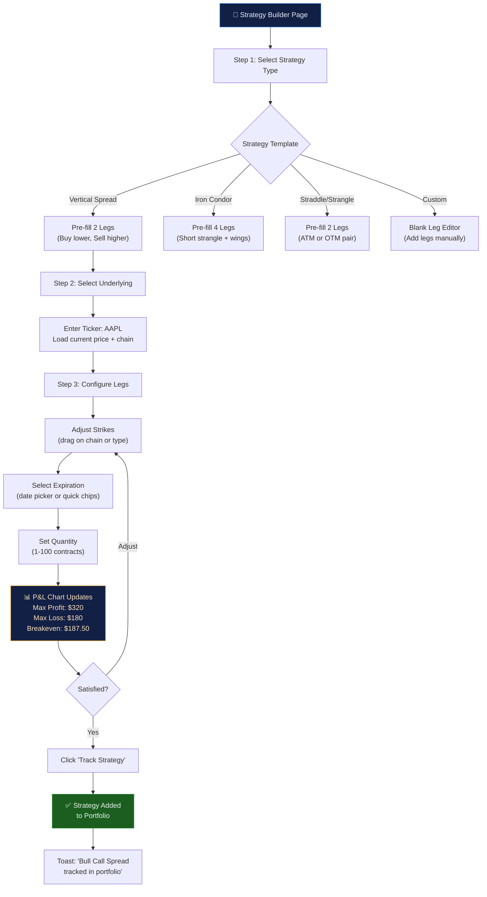
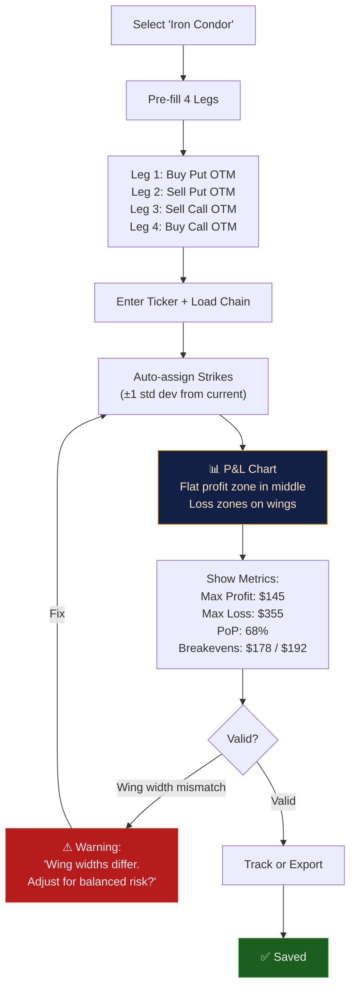

---
inputs:
  feature_name: "Multi-Leg Strategy Builder"
  issue_number: "3"
  epic_id: "1"
  designer: "UX Designer Agent"
  date: "2026-02-14"
---

# UX Design: Multi-Leg Strategy Builder

**Feature**: #3  
**Epic**: #1  
**Status**: Draft  
**Designer**: UX Designer Agent  
**Date**: 2026-02-14  
**Related PRD**: [PRD-options-scanner-v2.md](../prd/PRD-options-scanner-v2.md)

---

## Table of Contents

1. [Overview](#1-overview)
2. [User Research](#2-user-research)
3. [User Flows](#3-user-flows)
4. [Wireframes](#4-wireframes)
5. [Component Specifications](#5-component-specifications)
6. [Design System](#6-design-system)
7. [Interactions & Animations](#7-interactions--animations)
8. [Accessibility (WCAG 2.1 AA)](#8-accessibility-wcag-21-aa)
9. [Responsive Design](#9-responsive-design)
10. [Interactive Prototypes](#10-interactive-prototypes)
11. [Implementation Notes](#11-implementation-notes)
12. [Open Questions](#12-open-questions)
13. [References](#13-references)

---

## 1. Overview

### Feature Summary

The Multi-Leg Strategy Builder is a **visual wizard** that guides traders through building 2-4 leg options strategies (vertical spreads, iron condors, straddles/strangles, calendar/diagonal spreads, and butterflies). It provides real-time P&L visualization, auto-calculation of max profit/loss/breakeven, and one-click portfolio tracking. This replaces the current flat "Multi-Leg Opportunities" card grid with an interactive strategy construction tool.

### Design Goals

1. **Guided construction**: Template-first approach — user picks a strategy type, system pre-fills legs with sensible defaults, then user customizes
2. **Visual P&L**: Profit/loss chart is always visible as the user adjusts strikes and expirations — changes reflect instantly
3. **Risk clarity**: Max loss, max profit, breakeven(s), and probability of profit are always visible — never hidden behind a click
4. **Progressive complexity**: Beginners start with simple 2-leg spreads; advanced users can manually add/remove legs or switch to "Custom" mode

### Success Criteria

- 90%+ of users can build a vertical spread in <30 seconds using the guided wizard
- P&L chart renders within 200ms of any leg change
- Conversion rate: >30% of built strategies are tracked in portfolio
- Error prevention: 0% of submitted strategies have invalid leg combinations

---

## 2. User Research

### User Personas (from PRD)

**Primary: Alex — Intermediate Retail Trader**
- Understands basic spreads (bull call, bear put) but struggles to price them correctly
- Wants to see P&L visually before committing
- Builds 2-3 strategies per trading day, mostly vertical spreads and iron condors
- Needs validation: "Is this iron condor constructed correctly?"

**Secondary: Jordan — Active Day Trader**
- Builds complex 4-leg strategies (iron condors, butterflies) multiple times daily
- Needs speed: wants keyboard shortcuts, tab-through fields, quick strategy templates
- Expects auto-fill from current market prices (Yahoo Finance)
- Wants to compare 2 strategies side-by-side before executing

**Tertiary: Sam — Beginner Exploring Strategies**
- Just learned about spreads in a course, wants to practice building them
- Needs educational tooltips: "What is a vertical spread?" "Why does max loss matter?"
- Will make mistakes (wrong leg direction, inverted strikes) — needs clear validation messages

### User Needs

1. **Template-first**: Don't start with a blank 4-leg form. Start with "Pick: Vertical Spread, Iron Condor, Straddle..." then auto-fill legs
2. **Visual dominance**: The P&L chart should be the visual anchor — it's the #1 decision tool for traders
3. **Guardrails**: Prevent invalid strategies (e.g., iron condor with mismatched expirations) via real-time validation
4. **Speed for power-users**: Tab order through strike prices, Enter to submit, keyboard shortcuts for strategy type switching

---

## 3. User Flows

### 3.1 Primary Flow: Build a Vertical Spread

**Trigger**: User clicks "Build Strategy" from scanner results or navigation  
**Goal**: Construct a bull call spread with defined risk/reward  
**Preconditions**: Ticker data available from Yahoo Finance API



**Detailed Steps**:

1. **User Action**: Opens Strategy Builder page (via nav or "Build Strategy ▸" from scanner)
   - **System Response**: Shows strategy type selector with 5 template cards
   - **Screen**: [Screen 1: Strategy Type Selector](#screen-1-strategy-type-selector)

2. **User Action**: Clicks "Vertical Spread" card
   - **System Response**: Transitions to builder view. Leg table pre-fills:
     - Leg 1: Buy Call, Strike TBD, Quantity 1
     - Leg 2: Sell Call, Strike TBD, Quantity 1
   - **Visual**: Strategy type badge shows "Bull Call Spread" (auto-detected from leg configuration)

3. **User Action**: Types "AAPL" in ticker field (or arrives with ticker pre-selected from scanner)
   - **System Response**: Loads AAPL current price ($185.40), loads nearest expiration chain
   - **Auto-fill**: Leg 1 strike → ATM ($185), Leg 2 strike → OTM ($190), Expiration → nearest monthlies (30-45 DTE)

4. **User Action**: Adjusts Leg 2 strike from $190 to $195 by clicking on the chain visualization
   - **System Response**: P&L chart re-renders (200ms), metrics update:
     - Max Profit: $320 → $280
     - Max Loss: $180 → $220
     - Breakeven: $187.50 → $187.80
   - **Visual**: Chart green zone widens, red zone deepens

5. **User Action**: Clicks "Track Strategy" button
   - **System Response**: Strategy saved to portfolio, toast notification, redirects to portfolio view
   - **Screen**: Portfolio page with new spread position listed

### 3.2 Secondary Flow: Build Iron Condor

**Trigger**: User selects "Iron Condor" template  
**Goal**: Build 4-leg neutral strategy



### 3.3 Tertiary Flow: View P&L Chart Detail

**Trigger**: User has configured legs, wants deeper analysis  
**Goal**: Understand profit zones, breakevens, and risk at different prices

1. **Hover on chart**: Crosshair shows exact P&L at any underlying price
2. **Click "At Expiration" / "Now"**: Toggle between expiration P&L and current (with time value)
3. **Click "Export PNG"**: Download chart image for sharing
4. **Click price marker**: Jump to that strike in the options chain

---

## 4. Wireframes

### Screen 1: Strategy Type Selector

**Purpose**: Entry point — choose which strategy to build  
**Context**: Full page, clean selection interface

```
╔══════════════════════════════════════════════════════════════════════════════╗
║  Strategy Builder                                              [← Back]    ║
║  Build and analyze multi-leg options strategies                             ║
╠══════════════════════════════════════════════════════════════════════════════╣
║                                                                            ║
║  Choose a Strategy Template                                                ║
║                                                                            ║
║  ┌──────────────┐ ┌──────────────┐ ┌──────────────┐ ┌──────────────┐      ║
║  │   ↗↘         │ │   ═══════    │ │   ↑↑         │ │   ↗─↘        │      ║
║  │              │ │   ████████   │ │              │ │   │  │        │      ║
║  │  Vertical    │ │  Iron        │ │  Straddle/   │ │  Calendar/   │      ║
║  │  Spread      │ │  Condor      │ │  Strangle    │ │  Diagonal    │      ║
║  │              │ │              │ │              │ │              │      ║
║  │  2 legs      │ │  4 legs      │ │  2 legs      │ │  2 legs      │      ║
║  │  Directional │ │  Neutral     │ │  Volatility  │ │  Time decay  │      ║
║  │  Capped risk │ │  Range-bound │ │  IV play     │ │  Arbitrage   │      ║
║  └──────────────┘ └──────────────┘ └──────────────┘ └──────────────┘      ║
║                                                                            ║
║  ┌──────────────┐ ┌──────────────┐                                         ║
║  │   /\         │ │   + + + +    │                                         ║
║  │  /  \        │ │              │                                         ║
║  │  Butterfly   │ │  Custom      │                                         ║
║  │              │ │              │                                         ║
║  │  3 legs      │ │  1-4 legs    │                                         ║
║  │  Neutral     │ │  Any combo   │                                         ║
║  │  Low premium │ │  Full control│                                         ║
║  └──────────────┘ └──────────────┘                                         ║
║                                                                            ║
║  💡 Not sure? Start with Vertical Spread — it's the most common            ║
║     strategy for defined-risk directional trades.                           ║
║                                                                            ║
╚══════════════════════════════════════════════════════════════════════════════╝
```

### Screen 2: Strategy Builder — Vertical Spread (Main View)

**Purpose**: Core builder interface with legs, P&L chart, and metrics  
**Context**: Desktop, 2-column layout

```
╔══════════════════════════════════════════════════════════════════════════════╗
║  Strategy Builder          Bull Call Spread · AAPL         [← Templates]   ║
╠══════════════════════════════════════════════════════════════════════════════╣
║                                                                            ║
║  ┌─ Left Column (Leg Configuration) ──────────┐ ┌─ Right Column (P&L) ──┐ ║
║  │                                             │ │                       │ ║
║  │  Underlying: [AAPL ▼] $185.40  +0.8%       │ │  P&L at Expiration    │ ║
║  │  Expiration: [Mar 21, 2026 ▼] (35 DTE)     │ │                       │ ║
║  │                                             │ │  $400 ┤               │ ║
║  │  ── Leg 1 ──────────────────────────────    │ │       │    ╱──────    │ ║
║  │  [Buy ▼] [Call ▼] Strike: [$185 ▼]  x1     │ │  $200 ┤   ╱          │ ║
║  │  Mid: $4.28  Bid: $4.20  Ask: $4.35        │ │       │  ╱  profit   │ ║
║  │  Δ: 0.52  Θ: -$0.15  IV: 32.4%            │ │    $0─┤─╱────────    │ ║
║  │                                             │ │       ╱  breakeven   │ ║
║  │  ── Leg 2 ──────────────────────────────    │ │ -$200 ╱── loss       │ ║
║  │  [Sell ▼] [Call ▼] Strike: [$195 ▼]  x1    │ │       │              │ ║
║  │  Mid: $1.48  Bid: $1.40  Ask: $1.55        │ │ -$400 ┤              │ ║
║  │  Δ: 0.25  Θ: -$0.08  IV: 34.1%            │ │       ├──┤──┤──┤──┤  │ ║
║  │                                             │ │      175 180 185 195 │ ║
║  │  [+ Add Leg]                                │ │                       │ ║
║  │                                             │ │  ── Current Price ──  │ ║
║  │  ════════════════════════════════════════   │ │  AAPL: $185.40 │     │ ║
║  │                                             │ │                       │ ║
║  │  ┌ Strategy Metrics ─────────────────────┐ │ │  [At Expiration ▼]    │ ║
║  │  │ Max Profit    │ $280     (56% of risk) │ │ │  [Export PNG]         │ ║
║  │  │ Max Loss      │ $220     (cost basis)  │ │ │                       │ ║
║  │  │ Breakeven     │ $187.80                │ │ └───────────────────────┘ ║
║  │  │ Risk/Reward   │ 1 : 1.27              │ │                           ║
║  │  │ PoP           │ ~42%                   │ │                           ║
║  │  │ Net Debit     │ $2.80 ($280/contract)  │ │                           ║
║  │  └───────────────────────────────────────┘ │                           ║
║  │                                             │                           ║
║  │  [🎯 Track Strategy] [📄 Export CSV] [📤]  │                           ║
║  └─────────────────────────────────────────────┘                           ║
║                                                                            ║
╚══════════════════════════════════════════════════════════════════════════════╝
```

**Key Design Decisions**:
- **2-column layout**: Leg config on left, P&L chart on right — chart is always visible during adjustments
- **Strategy auto-detection**: "Bull Call Spread" badge updates if user changes Buy/Sell or Call/Put
- **Inline Greeks per leg**: Traders compare legs at a glance without expanding
- **Metrics panel below legs**: Max profit/loss/breakeven are always visible, not in a separate tab
- **Net debit/credit prominent**: Traders need to know the total capital required upfront

### Screen 3: Strategy Builder — Iron Condor (4 legs)

**Purpose**: 4-leg neutral strategy with wider profit zone visualization  
**Context**: Same layout, more legs shown

```
╔══════════════════════════════════════════════════════════════════════════════╗
║  Strategy Builder      Iron Condor · SPY             [← Templates]         ║
╠══════════════════════════════════════════════════════════════════════════════╣
║                                                                            ║
║  Underlying: [SPY ▼] $502.30  -0.2%                                       ║
║  Expiration: [Apr 18, 2026 ▼] (63 DTE)                                    ║
║                                                                            ║
║  ┌─ Legs ─────────────────────────────────┐ ┌─ P&L Chart ──────────────┐  ║
║  │                                         │ │                          │  ║
║  │  PUT SIDE              CALL SIDE        │ │  $200 ┤    ████████      │  ║
║  │  ── Leg 1 (Buy) ──    ── Leg 3 (Sell) ─│ │       │   ╱        ╲     │  ║
║  │  Buy Put $480  x1     Sell Call $520 x1 │ │  $100 ┤  ╱ profit   ╲    │  ║
║  │  $1.20  Δ:-0.12      $1.85  Δ:0.18     │ │       │ ╱  zone      ╲   │  ║
║  │                                         │ │   $0 ─┤╱──────────────╲  │  ║
║  │  ── Leg 2 (Sell) ──   ── Leg 4 (Buy) ─│ │       ╱ $488    $517   ╲  │  ║
║  │  Sell Put $490  x1    Buy Call $530  x1 │ │ -$200─╱───breakevens───╲ │  ║
║  │  $2.40  Δ:-0.20      $0.90  Δ:0.10     │ │ -$400─┤               ┤  │  ║
║  │                                         │ │       ├─┤──┤──┤──┤──┤─┤  │  ║
║  │  Wing width: $10 (put) / $10 (call) ✅  │ │     470 490 502 520 540  │  ║
║  └─────────────────────────────────────────┘ └──────────────────────────┘  ║
║                                                                            ║
║  ┌─ Strategy Metrics ──────────────────────────────────────────────────┐   ║
║  │ Max Profit │ $145 (net credit)  │ PoP        │ 68%                  │   ║
║  │ Max Loss   │ $355               │ Breakevens │ $488.55 / $517.45    │   ║
║  │ Risk/Reward│ 1 : 0.41           │ Net Credit │ $1.45 ($145/contract)│   ║
║  └─────────────────────────────────────────────────────────────────────┘   ║
║                                                                            ║
║  ⚠️ IV Crush Notice: Earnings on 4/25. Consider closing before earnings.   ║
║                                                                            ║
║  [🎯 Track Strategy] [📄 Export CSV] [📤 Share]                            ║
║                                                                            ║
╚══════════════════════════════════════════════════════════════════════════════╝
```

### Screen 4: Strategy Builder — Mobile Layout (375px)

**Purpose**: Stacked mobile view of the strategy builder  
**Context**: Portrait mode, P&L chart above legs

```
╔═══════════════════════════════════╗
║ Strategy Builder      [← Back]   ║
║ Bull Call Spread · AAPL           ║
╠═══════════════════════════════════╣
║                                   ║
║ ┌─ P&L Chart ──────────────────┐ ║
║ │ $400 ┤                       │ ║
║ │      │       ╱──────         │ ║
║ │ $200 ┤      ╱                │ ║
║ │      │     ╱                 │ ║
║ │  $0 ─┤───╱──────────        │ ║
║ │      │  ╱   $187.80 BE      │ ║
║ │-$200 ┤ ╱                    │ ║
║ │      ├──┤──┤──┤──┤──┤       │ ║
║ │     175 180 185 190 195     │ ║
║ └──────────────────────────────┘ ║
║                                   ║
║ ┌─ Metrics ────────────────────┐ ║
║ │ Max Profit  $280  (56%)      │ ║
║ │ Max Loss    $220             │ ║
║ │ Breakeven   $187.80          │ ║
║ │ Net Debit   $2.80/contract   │ ║
║ └──────────────────────────────┘ ║
║                                   ║
║ Ticker: [AAPL ▼]    $185.40     ║
║ Exp: [Mar 21 ▼] (35 DTE)       ║
║                                   ║
║ ── Leg 1 ─────────────────────  ║
║ [Buy ▼] [Call ▼] [$185 ▼] x1   ║
║ Mid: $4.28  Δ: 0.52            ║
║                                   ║
║ ── Leg 2 ─────────────────────  ║
║ [Sell ▼] [Call ▼] [$195 ▼] x1  ║
║ Mid: $1.48  Δ: 0.25            ║
║                                   ║
║ [+ Add Leg]                      ║
║                                   ║
║ [🎯 Track Strategy]              ║
║ [📄 Export]  [📤 Share]          ║
║                                   ║
╚═══════════════════════════════════╝
```

**Mobile Design Decisions**:
- **Chart on top**: P&L chart is the hero — moves above legs for instant visual feedback
- **Metrics strip**: Compact horizontal grid above leg configuration
- **Single-column legs**: Full-width leg cards
- **Sticky action bar**: "Track Strategy" button sticky at bottom of viewport

---

## 5. Component Specifications

### 5.1 StrategyTypeCard: Template Selector

**Purpose**: Visual card for each strategy type in the selector screen  
**States**: Default, Hover, Selected (navigates to builder)

```css
.strategy-type-card {
  display: flex;
  flex-direction: column;
  align-items: center;
  gap: 8px;
  padding: 24px 20px;
  background: var(--bg-card); /* rgba(9, 16, 31, 0.65) */
  border: 1px solid rgba(255, 255, 255, 0.08);
  border-radius: 16px;
  cursor: pointer;
  transition: all 0.2s ease;
  text-align: center;
  min-width: 160px;
}

.strategy-type-card:hover {
  border-color: rgba(25, 118, 210, 0.4);
  background: rgba(25, 118, 210, 0.08);
  transform: translateY(-2px);
  box-shadow: 0 8px 24px rgba(0, 0, 0, 0.3);
}

.strategy-type-card__icon {
  font-size: 32px;
  height: 48px;
  display: flex;
  align-items: center;
}

.strategy-type-card__name {
  font-size: 15px;
  font-weight: 600;
  color: #e6edf7;
}

.strategy-type-card__meta {
  font-size: 11px;
  color: #94a3b8;
  line-height: 1.4;
}
```

### 5.2 LegRow: Individual Strategy Leg

**Purpose**: Configurable leg row with Buy/Sell toggle, Call/Put selector, Strike picker  
**States**: Default, Editing, Invalid (red border), Disabled (for template-locked legs)

```css
.leg-row {
  display: grid;
  grid-template-columns: 80px 80px 100px 60px auto;
  gap: 8px;
  align-items: center;
  padding: 12px 16px;
  background: rgba(255, 255, 255, 0.03);
  border: 1px solid rgba(255, 255, 255, 0.08);
  border-radius: 10px;
  margin-bottom: 8px;
  transition: border-color 0.15s ease;
}

.leg-row:hover {
  border-color: rgba(255, 255, 255, 0.15);
}

.leg-row--invalid {
  border-color: rgba(239, 83, 80, 0.5);
  background: rgba(239, 83, 80, 0.05);
}

.leg-row__action {
  font-size: 12px;
  font-family: var(--font-mono);
  padding: 6px 10px;
  border-radius: 6px;
  border: 1px solid rgba(255, 255, 255, 0.15);
  background: rgba(255, 255, 255, 0.05);
  color: #e6edf7;
  cursor: pointer;
}

.leg-row__action--buy {
  border-color: rgba(102, 187, 106, 0.4);
  color: #66bb6a;
}

.leg-row__action--sell {
  border-color: rgba(239, 83, 80, 0.4);
  color: #ef5350;
}

.leg-row__greeks {
  font-size: 11px;
  color: #94a3b8;
  display: flex;
  gap: 12px;
  margin-top: 4px;
  grid-column: 1 / -1;
}
```

### 5.3 PLChart: Profit/Loss Visualization

**Purpose**: SVG-based P&L chart showing profit zones, loss zones, breakevens, and current price  
**States**: Default (at expiration), Hover (crosshair), Loading (shimmer)

```css
.pl-chart {
  width: 100%;
  aspect-ratio: 4 / 3;
  background: rgba(9, 16, 31, 0.8);
  border: 1px solid rgba(255, 255, 255, 0.08);
  border-radius: 12px;
  padding: 16px;
  position: relative;
}

.pl-chart__profit-zone {
  fill: rgba(76, 175, 80, 0.15);
  stroke: #4CAF50;
  stroke-width: 2;
}

.pl-chart__loss-zone {
  fill: rgba(244, 67, 54, 0.15);
  stroke: #f44336;
  stroke-width: 2;
}

.pl-chart__breakeven-line {
  stroke: #f5a623;
  stroke-width: 1;
  stroke-dasharray: 4 4;
}

.pl-chart__current-price {
  stroke: #e6edf7;
  stroke-width: 1;
  stroke-dasharray: 2 2;
}

.pl-chart__crosshair {
  stroke: rgba(255, 255, 255, 0.3);
  stroke-width: 1;
  pointer-events: none;
}

.pl-chart__tooltip {
  position: absolute;
  padding: 8px 12px;
  background: #1a2744;
  border: 1px solid rgba(255, 255, 255, 0.15);
  border-radius: 8px;
  font-size: 12px;
  color: #e6edf7;
  pointer-events: none;
  z-index: 10;
}
```

### 5.4 MetricsPanel: Strategy Summary

**Purpose**: Key risk/reward metrics displayed as a compact grid  
**States**: Default, Updating (value flash on change)

```css
.metrics-panel {
  display: grid;
  grid-template-columns: repeat(3, 1fr);
  gap: 1px;
  background: rgba(255, 255, 255, 0.06);
  border-radius: 10px;
  overflow: hidden;
  margin-top: 16px;
}

.metrics-panel__item {
  padding: 12px 14px;
  background: rgba(9, 16, 31, 0.65);
}

.metrics-panel__label {
  font-size: 11px;
  color: #94a3b8;
  text-transform: uppercase;
  letter-spacing: 0.3px;
  margin-bottom: 4px;
}

.metrics-panel__value {
  font-size: 16px;
  font-weight: 700;
  color: #e6edf7;
  transition: transform 0.2s ease;
}

.metrics-panel__value--profit {
  color: #66bb6a;
}

.metrics-panel__value--loss {
  color: #ef5350;
}

.metrics-panel__value--updating {
  transform: scale(1.1);
}

.metrics-panel__subtitle {
  font-size: 10px;
  color: #64748b;
  margin-top: 2px;
}
```

### 5.5 StrikePicker: Options Chain Strike Selector

**Purpose**: Dropdown or visual strip for selecting strikes from the live chain  
**States**: Open, Closed, Loading (chain fetching)

```css
.strike-picker {
  position: relative;
}

.strike-picker__trigger {
  display: flex;
  align-items: center;
  gap: 6px;
  padding: 6px 10px;
  font-size: 13px;
  font-family: var(--font-mono);
  font-weight: 600;
  background: rgba(255, 255, 255, 0.05);
  border: 1px solid rgba(255, 255, 255, 0.15);
  border-radius: 6px;
  color: #e6edf7;
  cursor: pointer;
}

.strike-picker__dropdown {
  position: absolute;
  top: calc(100% + 4px);
  left: 0;
  width: 240px;
  max-height: 280px;
  overflow-y: auto;
  background: #1a2744;
  border: 1px solid rgba(255, 255, 255, 0.15);
  border-radius: 10px;
  box-shadow: 0 12px 40px rgba(0, 0, 0, 0.5);
  z-index: 50;
}

.strike-picker__option {
  display: grid;
  grid-template-columns: 60px 50px 50px 40px;
  gap: 4px;
  padding: 8px 12px;
  font-size: 12px;
  cursor: pointer;
  border-bottom: 1px solid rgba(255, 255, 255, 0.04);
}

.strike-picker__option:hover {
  background: rgba(25, 118, 210, 0.1);
}

.strike-picker__option--atm {
  background: rgba(25, 118, 210, 0.08);
  border-left: 2px solid #1976d2;
}
```

### 5.6 ValidationBanner: Strategy Validation Warnings

**Purpose**: Inline warnings for invalid or suboptimal strategy configurations

```css
.validation-banner {
  display: flex;
  align-items: center;
  gap: 8px;
  padding: 10px 14px;
  border-radius: 8px;
  font-size: 12px;
  line-height: 1.4;
  margin-top: 12px;
}

.validation-banner--warning {
  background: rgba(245, 166, 35, 0.1);
  border: 1px solid rgba(245, 166, 35, 0.3);
  color: #f5a623;
}

.validation-banner--error {
  background: rgba(244, 67, 54, 0.1);
  border: 1px solid rgba(244, 67, 54, 0.3);
  color: #ef5350;
}

.validation-banner--info {
  background: rgba(25, 118, 210, 0.1);
  border: 1px solid rgba(25, 118, 210, 0.3);
  color: #64b5f6;
}

.validation-banner__icon {
  font-size: 16px;
  flex-shrink: 0;
}
```

---

## 6. Design System

### 6.1 Layout (Strategy Builder Specific)

**Desktop (1024px+)**:
- 2-column: Left 55% (legs + metrics), Right 45% (P&L chart)
- Strategy type selector: 4-column grid of cards

**Tablet (768-1023px)**:
- 2-column maintained, 50/50 split
- Strategy type selector: 3-column grid

**Mobile (<768px)**:
- Single column: Chart on top → Metrics → Legs → Actions
- Strategy type selector: 2-column grid

### 6.2 Colors (Extended for Strategy Builder)

Inherits all colors from UX-2 design system plus:

| Token | Value | Usage |
|-------|-------|-------|
| `--profit-zone` | `rgba(76, 175, 80, 0.15)` | P&L chart profit fill |
| `--loss-zone` | `rgba(244, 67, 54, 0.15)` | P&L chart loss fill |
| `--profit-stroke` | `#4CAF50` | Profit line on chart |
| `--loss-stroke` | `#f44336` | Loss line on chart |
| `--breakeven` | `#f5a623` | Breakeven dashed lines |
| `--buy-color` | `#66bb6a` | Buy leg indicator |
| `--sell-color` | `#ef5350` | Sell leg indicator |
| `--current-price` | `#e6edf7` | Current underlying price marker |

### 6.3 P&L Chart Color Coding

- **Green zone** (above $0 line): `rgba(76, 175, 80, 0.15)` fill, `#4CAF50` border
- **Red zone** (below $0 line): `rgba(244, 67, 54, 0.15)` fill, `#f44336` border
- **Breakeven lines**: `#f5a623` dashed (4-4 dasharray)
- **Current price marker**: `#e6edf7` dashed (2-2 dasharray) with label
- **Crosshair on hover**: `rgba(255, 255, 255, 0.3)` vertical + horizontal

---

## 7. Interactions & Animations

### 7.1 Strategy Type Selection
- **Card hover**: `translateY(-2px)` + blue border glow + shadow deepens (200ms)
- **Card click**: Card scales down `0.98` briefly (100ms) then navigates to builder view

### 7.2 P&L Chart Rendering
- **Initial render**: P&L line draws from left to right (600ms ease-out path animation)
- **Strike change**: Chart re-renders with morph animation — old line morphs to new position (300ms)
- **Hover crosshair**: Follows cursor with 16ms throttle, shows tooltip with exact P&L at price

### 7.3 Leg Configuration
- **Add leg**: New row slides in from top with `opacity: 0→1` + `translateY(-10px→0)` (200ms)
- **Remove leg**: Row slides out with `opacity: 1→0` + `height: auto→0` (200ms)
- **Buy/Sell toggle**: Color transition green↔red (150ms)
- **Strike change**: Metrics panel values flash briefly with `scale(1.1)` pulse (200ms)

### 7.4 Metrics Update
- **Value change**: Number animates from old to new (count-up/down, 300ms)
- **Profit increase**: Value flashes green briefly
- **Loss increase**: Value flashes red briefly

### 7.5 Track Strategy
- **Button click**: Button text changes to "✓ Tracked!" with green background (300ms) → then navigates to portfolio
- **Toast**: "Bull Call Spread (AAPL) added to portfolio" slides up from bottom

---

## 8. Accessibility (WCAG 2.1 AA)

### 8.1 Keyboard Navigation
- **Tab order**: Strategy type cards → Ticker input → Expiration picker → Leg 1 fields (Action, Type, Strike, Qty) → Leg 2 fields → Add Leg → Metrics (read-only) → Track button → Export button
- **Strategy cards**: Arrow keys to navigate, Enter/Space to select
- **Strike picker**: Arrow Up/Down to browse strikes, Enter to select, Escape to close
- **P&L chart**: Not keyboard-interactive (decorative visualization), but metrics are tabbable

### 8.2 ARIA Attributes
```html
<!-- Strategy Type Card -->
<button role="radio" aria-checked="false" aria-label="Vertical Spread: 2 legs, directional, capped risk">

<!-- Leg Row -->
<fieldset aria-label="Leg 1 configuration">
  <select aria-label="Action: Buy or Sell">
  <select aria-label="Option type: Call or Put">
  <button aria-haspopup="listbox" aria-expanded="false" aria-label="Strike price: $185">

<!-- P&L Chart -->
<figure role="img" aria-label="Profit and loss chart at expiration. Max profit $280 above $195. Max loss $220 below $185. Breakeven at $187.80.">

<!-- Metrics -->
<dl aria-label="Strategy metrics">
  <dt>Max Profit</dt><dd>$280</dd>
  <dt>Max Loss</dt><dd>$220</dd>

<!-- Validation -->
<div role="alert" aria-live="assertive">Wing widths differ. Adjust for balanced risk?</div>
```

### 8.3 Color Contrast
- Profit green `#66bb6a` on dark `#0b1224`: 6.8:1 ✅
- Loss red `#ef5350` on dark `#0b1224`: 5.1:1 ✅
- Breakeven amber `#f5a623` on dark: 7.1:1 ✅
- P&L chart fills use color + pattern (profit zone has subtle diagonal lines) for color-blind users

### 8.4 Screen Reader Announcements
- Strategy selection: "Vertical Spread selected. 2 legs pre-filled."
- Strike change: "Strike changed to $195. Max profit now $280. Max loss $220."
- Validation: "Warning: Wing widths differ. Adjust for balanced risk?"
- Track: "Strategy tracked. Bull Call Spread AAPL added to portfolio."

---

## 9. Responsive Design

### Desktop (1024px+)
- 2-column layout: Legs (55%) | P&L Chart (45%)
- Strategy type selector: 4 cards per row + 2 below
- Full metrics grid (3x2)

### Tablet (768-1023px)
- 2-column layout: 50/50 split
- Strategy type selector: 3 cards per row
- Metrics: 3-column grid maintained

### Mobile (320-767px)
- Single column, stacked:
  1. P&L Chart (hero, full width, fixed aspect 4:3)
  2. Metrics strip (2x2 grid, compact)
  3. Ticker + Expiration selectors
  4. Leg cards (full width, stacked)
  5. Action buttons (sticky bottom bar)
- Strategy type selector: 2 cards per row
- Strike picker: Full-screen bottom sheet instead of dropdown
- Leg Greeks hidden by default, expandable

```css
@media (max-width: 767px) {
  .builder-layout {
    flex-direction: column;
  }
  .pl-chart {
    aspect-ratio: 16 / 10; /* wider on mobile */
    order: -1; /* chart first */
  }
  .metrics-panel {
    grid-template-columns: repeat(2, 1fr);
  }
  .leg-row {
    grid-template-columns: 1fr 1fr;
    gap: 6px;
  }
  .leg-row__greeks {
    display: none; /* expand on tap */
  }
  .action-bar--sticky {
    position: sticky;
    bottom: 0;
    padding: 12px;
    background: rgba(11, 18, 36, 0.95);
    backdrop-filter: blur(8px);
  }
}
```

---

## 10. Interactive Prototypes

**MANDATORY**: HTML/CSS prototypes located at:
- [`docs/ux/prototypes/strategy-builder.html`](prototypes/strategy-builder.html) — Full interactive strategy builder with template selection, leg configuration, P&L chart, and metrics panel. Open in browser.

---

## 11. Implementation Notes

### 11.1 Component Hierarchy (React)
```
<StrategyBuilderPage>
  <!-- Step 1: Template Selection -->
  <StrategyTypeSelector onSelect={setType}>
    <StrategyTypeCard type="vertical" />
    <StrategyTypeCard type="ironCondor" />
    <StrategyTypeCard type="straddle" />
    <StrategyTypeCard type="calendar" />
    <StrategyTypeCard type="butterfly" />
    <StrategyTypeCard type="custom" />
  </StrategyTypeSelector>

  <!-- Step 2: Builder -->
  <BuilderLayout>
    <LeftColumn>
      <TickerInput value={ticker} onChange={} onChainLoad={} />
      <ExpirationPicker dates={chainDates} selected={exp} onChange={} />
      <LegList>
        <LegRow leg={leg1} onChange={} onRemove={} chain={chain} />
        <LegRow leg={leg2} onChange={} onRemove={} chain={chain} />
        {/* Dynamic additional legs */}
        <AddLegButton onClick={addLeg} disabled={legs.length >= 4} />
      </LegList>
      <MetricsPanel metrics={calculatedMetrics} />
      <ValidationBanner warnings={validationWarnings} />
      <ActionBar onTrack={} onExport={} onShare={} />
    </LeftColumn>
    <RightColumn>
      <PLChart legs={legs} currentPrice={price} />
    </RightColumn>
  </BuilderLayout>
</StrategyBuilderPage>
```

### 11.2 State Management
```typescript
interface StrategyState {
  type: 'vertical' | 'ironCondor' | 'straddle' | 'strangle' | 'calendar' | 'butterfly' | 'custom'
  ticker: string
  currentPrice: number
  expiration: string
  legs: Leg[]
}

interface Leg {
  id: string
  action: 'buy' | 'sell'
  optionType: 'call' | 'put'
  strike: number
  quantity: number
  expiration: string  // For calendar/diagonal spreads
  bid: number
  ask: number
  mid: number
  delta: number
  theta: number
  gamma: number
  vega: number
  iv: number
}

interface CalculatedMetrics {
  maxProfit: number
  maxLoss: number
  breakevens: number[]
  riskReward: number
  probabilityOfProfit: number
  netDebitCredit: number
  strategyLabel: string  // Auto-detected: "Bull Call Spread", "Iron Condor", etc.
}
```

### 11.3 P&L Calculation
- **At expiration**: Iterate price range (underlying ±30%), calculate intrinsic value for each leg
- **Before expiration**: Use Black-Scholes to estimate option prices at various underlying prices
- **Breakeven**: Solve for P&L = 0 using bisection method on the P&L curve
- **PoP**: Estimated from delta of short strikes (or Monte Carlo for complex strategies)

### 11.4 Strategy Auto-Detection
```typescript
function detectStrategy(legs: Leg[]): string {
  if (legs.length === 2) {
    if (legs[0].optionType === legs[1].optionType) return 'Vertical Spread'
    if (legs[0].strike === legs[1].strike && legs[0].expiration === legs[1].expiration) return 'Straddle'
    if (legs[0].strike !== legs[1].strike) return 'Strangle'
  }
  if (legs.length === 4) {
    // Check for iron condor pattern
    const puts = legs.filter(l => l.optionType === 'put')
    const calls = legs.filter(l => l.optionType === 'call')
    if (puts.length === 2 && calls.length === 2) return 'Iron Condor'
    // Check for butterfly
    // ...
  }
  return 'Custom Strategy'
}
```

### 11.5 Performance
- **P&L chart**: Render via `<canvas>` or lightweight SVG — avoid heavy charting libs for <200ms updates
- **Chain loading**: Cache options chains per ticker+expiration for 60 seconds
- **Debounce**: Quantity changes debounced 100ms before recalculating metrics

---

## 12. Open Questions

| Question | Owner | Status | Resolution |
|----------|-------|--------|------------|
| Should we support comparing 2 strategies side-by-side? | PM | Open | Recommend: Phase 2 feature — adds complexity |
| What charting library for P&L? Lightweight canvas vs. Recharts? | Engineer | Open | Recommend: Custom canvas for speed, or lightweight SVG path |
| Should "Track Strategy" auto-close the builder? | UX Designer | Resolved | Yes, redirect to portfolio with toast. User can return via nav. |
| Should beginners see a "Strategy Guide" panel alongside the builder? | PM | Open | Recommend: Collapsible educational sidebar for P1 |

---

## 13. References

- **PRD**: [PRD-options-scanner-v2.md](../prd/PRD-options-scanner-v2.md) — Feature 2: Multi-Leg Strategy Builder
- **Related UX**: [UX-2.md](UX-2.md) — Advanced Filtering (shares design system)
- **Competitor Reference**: Tastytrade strategy builder, ThinkorSwim analyze tab, OptionStrat.com visual builder
- **P&L Chart Patterns**: OptionStrat-style profit zones, TastyTrade P&L at expiration
- **Design System**: Shared dark theme from [UX-2 Design System](UX-2.md#6-design-system)

---

## Review & Approval

| Stakeholder | Role | Status | Date | Comments |
|-------------|------|--------|------|----------|
| UX Designer Agent | Author | Draft | 2026-02-14 | Ready for review |
| Engineering Lead | Technical Review | Pending | TBD | P&L charting feasibility |
| Product Manager | Requirements Review | Pending | TBD | Acceptance criteria coverage |

---

**Generated by AgentX UX Designer Agent**  
**Last Updated**: 2026-02-14  
**Version**: 1.0
