---
inputs:
  feature_name: "Modular Data Provider Architecture"
  issue_number: "4"
  epic_id: "1"
  designer: "UX Designer Agent"
  date: "2026-02-15"
---

# UX Design: Modular Data Provider Architecture

**Feature**: #4 — Modular Data Provider Architecture  
**Epic**: #1 — Advanced Options Scanner Platform  
**Priority**: P1 (Should Have)  
**Created**: 2026-02-15  
**Status**: Complete  
**Designer**: UX Designer Agent  
**Related PRD**: [PRD-options-scanner-v2.md](../prd/PRD-options-scanner-v2.md) (Feature 9, US-9.1 – US-9.4)

---

## Table of Contents

1. [Overview](#1-overview)
2. [User Research](#2-user-research)
3. [User Flows](#3-user-flows)
4. [Wireframes](#4-wireframes)
5. [Component Specifications](#5-component-specifications)
6. [Design System](#6-design-system)
7. [Interactions & Animations](#7-interactions--animations)
8. [Accessibility (WCAG 2.1 AA)](#8-accessibility-wcag-21-aa)
9. [Responsive Design](#9-responsive-design)
10. [Interactive Prototypes](#10-interactive-prototypes)
11. [Implementation Notes](#11-implementation-notes)
12. [References](#12-references)

---

## 1. Overview

### Problem Statement

Platform administrators currently have no frontend mechanism to add, configure, or switch between market data providers (Yahoo Finance, Alpaca, Tradier). Provider changes require code deployments, and there is zero visibility into provider health, rate-limit consumption, or cost. When a provider goes down, users experience complete data loss with no automatic recovery.

### Design Goals

1. **Self-service configuration**: Admins add, edit, and remove data providers from a Settings page without engineering involvement
2. **Transparent health**: Real-time provider status, latency, error rate, and rate-limit gauges visible at a glance
3. **Seamless failover**: Users see a brief notification banner when failover occurs — never a blank screen
4. **Cost awareness**: Monthly cost estimator helps admins choose cost-effective provider combinations
5. **Security first**: API keys are masked by default, with reveal-on-click and encrypted backend storage

### Success Metrics

| Metric | Target | Measurement |
|--------|--------|-------------|
| Provider setup time | < 120 seconds (from click "Add" to successful connection test) | Task timer in usability test |
| Failover perception | < 3 seconds visible disruption | Frontend latency instrumentation |
| Settings page task completion | > 90% first-attempt success | Usability test pass rate |
| Admin satisfaction (SUS) | > 80 | System Usability Scale survey |
| Error recovery rate | 100% of users can diagnose and fix a misconfigured provider | Usability scenario test |

---

## 2. User Research

### User Personas

**Persona 1: Dana — Platform Administrator**
- **Role**: DevOps-adjacent engineer who manages the scanner platform for a small trading team
- **Goals**: Configure multiple data providers, set failover order, monitor usage to stay within rate limits
- **Pain Points**: Currently must SSH into backend to change provider configs; no visibility into which provider is active
- **Technical Skill**: High — comfortable with API keys, OAuth flows, JSON configs
- **Device**: Desktop only (admin tasks during work hours)
- **Frequency**: Weekly configuration checks, daily health monitoring

**Persona 2: Marcus — Active Day Trader (End User)**
- **Role**: Power user who doesn't manage providers but is affected by provider outages
- **Goals**: Uninterrupted data feed during market hours; wants to know when data source changes
- **Pain Points**: Has experienced blank screens when Yahoo Finance was rate-limited; didn't know why
- **Technical Skill**: Intermediate — understands "provider" concept but doesn't configure them
- **Device**: Desktop primary, mobile for monitoring
- **Frequency**: Daily during market hours (9:30 AM – 4:00 PM ET)

**Persona 3: Sarah — Risk-Conscious Team Lead**
- **Role**: Manages a team of 5 traders; oversees platform costs and reliability
- **Goals**: Track monthly API costs across providers, ensure 99.9% uptime via redundant providers
- **Pain Points**: No cost visibility; surprised by overage charges; no way to compare provider reliability
- **Technical Skill**: Moderate — reads dashboards but delegates configuration to Dana
- **Device**: Desktop, reviews weekly reports on tablet
- **Frequency**: Weekly cost/health reviews, monthly provider evaluations

### User Needs

1. **Visibility over control**: Most users (Marcus, Sarah) need to *see* provider status, not configure it — design for read-heavy, write-rare
2. **Confidence in changes**: Dana needs clear feedback that a new provider config works before it goes live — test connection is critical
3. **Cost predictability**: Sarah needs monthly cost projections before committing to a provider mix
4. **Non-disruptive failover**: Marcus needs continuity — failover should feel invisible except for a brief banner

---

## 3. User Flows

### 3.1 Primary Flow: Add and Configure a New Data Provider

**Trigger**: Admin navigates to Settings → Data Providers and clicks "Add Provider"  
**Goal**: Register a new data provider with valid credentials and assign priority  
**Preconditions**: User has admin role, backend API reachable

```mermaid
flowchart TD
    A["⚙ Settings Page"] --> B["Click 'Data Providers' Tab"]
    B --> C["Provider List View\n(existing providers shown)"]
    C --> D["Click '+ Add Provider'"]
    D --> E["Add Provider Modal Opens"]
    E --> F["Fill Form:\nName, Type, API Key, Base URL"]
    F --> G["Click 'Test Connection'"]
    G --> H{"Connection\nSuccessful?"}
    H -->|Yes| I["✅ Green checkmark\n'Connection verified'"]
    H -->|No| J["❌ Error message\n'Invalid API key' / 'Timeout'"]
    I --> K["Click 'Save Provider'"]
    J --> L["Fix credentials\nand retry"]
    L --> G
    K --> M["Provider Card Appears\nin List (status: Active)"]
    M --> N["Drag to Set Priority\nOrder"]
    N --> O["🎯 Provider Configured\nand Ready"]

    style A fill:#1a1a2e,stroke:#00d4ff,color:#e6edf7
    style I fill:#1a3a1a,stroke:#4ade80,color:#e8f5e9
    style J fill:#3a1a1a,stroke:#ef4444,color:#ffebee
    style O fill:#1a1a2e,stroke:#00d4ff,color:#e6edf7
```



**Detailed Steps**:

1. **User Action**: Navigates to Settings → Data Providers tab
   - **System Response**: Displays provider list with cards showing name, type, status, and metrics summary
   - **Screen**: [Screen 1: Provider Settings Page](#screen-1-provider-settings-page)

2. **User Action**: Clicks "+ Add Provider" button (top-right of provider list)
   - **System Response**: Modal slides in from right (300ms ease-out) with form fields
   - **Screen**: [Screen 2: Add Provider Modal](#screen-2-add-provider-modal)

3. **User Action**: Selects provider type from dropdown (Yahoo Finance, Alpaca, Tradier, Custom)
   - **System Response**: Form dynamically updates — shows type-specific fields (e.g., OAuth for Alpaca, API key for Yahoo)
   - **Validation**: Provider name required (1–50 chars), API key required, base URL auto-populated per type

4. **User Action**: Enters API key and clicks "Test Connection"
   - **System Response**: Button shows spinner (pulse animation), sends HEAD request to provider endpoint
   - **Success (< 3s)**: Green checkmark + "Connection verified (latency: 142ms)"
   - **Failure**: Red X + specific error ("401 Unauthorized — check API key" or "Timeout after 10s — check base URL")
   - **Screen**: [Screen 3: Connection Test States](#screen-3-connection-test-states)

5. **User Action**: Clicks "Save Provider" (enabled only after successful test)
   - **System Response**: Modal closes, new provider card appears in list with slide-in animation
   - **Toast**: "Alpaca provider added successfully"

6. **User Action**: Drags new provider card to desired priority position
   - **System Response**: Cards reorder with 200ms spring animation, priority numbers update
   - **Backend**: PUT `/api/providers/priority` with new order array

### 3.2 Secondary Flow: Automatic Failover with User Notification

**Trigger**: Primary provider returns 3 consecutive errors (circuit breaker trips)  
**Goal**: Switch to secondary provider transparently, notify user  
**Preconditions**: At least 2 providers configured, secondary provider healthy

```mermaid
flowchart TD
    A["📊 Scanner Active\n(Primary: Yahoo)"] --> B{"Yahoo API\nError?"}
    B -->|1st error| C["Retry after 1s"]
    C --> B
    B -->|3rd consecutive error| D["🔄 Circuit Breaker Trips\n(Yahoo → cooldown 5min)"]
    D --> E["Switch to Secondary\n(Alpaca)"]
    E --> F["📢 Notification Banner\n'Switched to Alpaca\n(Yahoo unavailable)'"]
    F --> G["Data Resumes\nvia Alpaca"]
    G --> H{"Yahoo Cooldown\nExpired?"}
    H -->|Yes| I["Health Check Yahoo"]
    I --> J{"Yahoo\nHealthy?"}
    J -->|Yes| K["Switch Back to Yahoo\nUpdate Banner: 'Restored'"]
    J -->|No| L["Extend Cooldown\n+5 min"]
    L --> H
    H -->|No| G

    style A fill:#1a1a2e,stroke:#00d4ff,color:#e6edf7
    style D fill:#3a2a1a,stroke:#fbbf24,color:#fef3c7
    style F fill:#3a2a1a,stroke:#fbbf24,color:#fef3c7
    style K fill:#1a3a1a,stroke:#4ade80,color:#e8f5e9
```



**User-Facing Behavior**:

1. **During failover (< 500ms)**: Brief loading shimmer on data cells — no blank screen
2. **Banner appears**: Amber notification bar at top of scanner: "⚠ Data source switched to Alpaca (Yahoo Finance unavailable). Retrying in 5 minutes."
3. **Banner actions**: [Dismiss] [View Provider Status]
4. **On recovery**: Banner turns green: "✅ Yahoo Finance restored. Data source switched back." Auto-dismisses after 10 seconds.

### 3.3 Tertiary Flow: Review Provider Metrics and Cost

**Trigger**: Admin or team lead visits Settings → Data Providers to review usage  
**Goal**: Understand provider health, cost, and rate-limit consumption

```mermaid
flowchart TD
    A["⚙ Settings Page"] --> B["Data Providers Tab"]
    B --> C["View Provider Cards\n(status + mini metrics)"]
    C --> D{"Want\nDetails?"}
    D -->|Quick check| E["Read card metrics:\nlatency, error rate, calls/hr"]
    D -->|Deep dive| F["Click 'View Metrics'\non a provider card"]
    F --> G["Provider Detail Panel\nExpands Below Card"]
    G --> H["View Charts:\n• Calls/hour (24h)\n• Error rate trend\n• Latency percentiles"]
    G --> I["View Cost Estimator:\n• Calls this month\n• Projected cost\n• Rate limit gauge"]
    H --> J["Compare Providers\n(toggle comparison table)"]
    I --> K["Set Rate Limit Alert\nThreshold"]

    style A fill:#1a1a2e,stroke:#00d4ff,color:#e6edf7
    style G fill:#1a1a2e,stroke:#00d4ff,color:#e6edf7
```



---

## 4. Wireframes

### Screen 1: Provider Settings Page

**Purpose**: Main settings page showing all configured data providers  
**Context**: Desktop view (1400px container), dark theme, admin user

```
╔══════════════════════════════════════════════════════════════════════════════════╗
║  ⚙ Settings                                                                    ║
╠══════════════════════════════════════════════════════════════════════════════════╣
║                                                                                 ║
║  [General]  [Data Providers ●]  [Notifications]  [Account]                     ║
║  ─────────────────────────────────────────────────────────────────────────────  ║
║                                                                                 ║
║  Data Providers                                            [+ Add Provider]    ║
║  Configure and manage market data sources                                       ║
║                                                                                 ║
║  ┌─── Provider 1 ─────────────────────────────────────────────────────────┐    ║
║  │  ⓵  🟢 Yahoo Finance              Primary     [Edit] [⋮]            │    ║
║  │      Type: REST API  •  Status: Connected  •  Uptime: 99.8%          │    ║
║  │                                                                        │    ║
║  │  ┌──────────┐  ┌──────────┐  ┌──────────┐  ┌──────────────────────┐  │    ║
║  │  │ Latency  │  │ Errors   │  │ Calls/hr │  │ Rate Limit           │  │    ║
║  │  │  142ms   │  │  0.2%    │  │   847    │  │ ████████░░  78%     │  │    ║
║  │  │  avg     │  │  24h     │  │  current │  │ 847 / 1,000 per hr  │  │    ║
║  │  └──────────┘  └──────────┘  └──────────┘  └──────────────────────┘  │    ║
║  │                                                      [View Metrics]   │    ║
║  └────────────────────────────────────────────────────────────────────────┘    ║
║                                                                                 ║
║  ┌─── Provider 2 ─────────────────────────────────────────────────────────┐    ║
║  │  ⓶  🟡 Alpaca Markets            Secondary    [Edit] [⋮]            │    ║
║  │      Type: REST API  •  Status: Connected  •  Uptime: 99.5%          │    ║
║  │                                                                        │    ║
║  │  ┌──────────┐  ┌──────────┐  ┌──────────┐  ┌──────────────────────┐  │    ║
║  │  │ Latency  │  │ Errors   │  │ Calls/hr │  │ Rate Limit           │  │    ║
║  │  │  210ms   │  │  0.8%    │  │    23    │  │ ██░░░░░░░░  12%     │  │    ║
║  │  │  avg     │  │  24h     │  │  current │  │ 23 / 200 per hr     │  │    ║
║  │  └──────────┘  └──────────┘  └──────────┘  └──────────────────────┘  │    ║
║  │                                                      [View Metrics]   │    ║
║  └────────────────────────────────────────────────────────────────────────┘    ║
║                                                                                 ║
║  ┌─── Provider 3 ─────────────────────────────────────────────────────────┐    ║
║  │  ⓷  🔴 Tradier                   Disabled     [Edit] [⋮]            │    ║
║  │      Type: REST API  •  Status: Auth Failed  •  Uptime: —            │    ║
║  │                                                                        │    ║
║  │  ⚠ Authentication failed. Update API key to re-enable.    [Fix Now]   │    ║
║  └────────────────────────────────────────────────────────────────────────┘    ║
║                                                                                 ║
║  ┌─── Monthly Cost Summary ───────────────────────────────────────────────┐    ║
║  │  Estimated Cost: $12.40 / month         Calls this period: 142,300    │    ║
║  │  ████████████████████░░░░░░░░░░  62% of budget ($20 limit)           │    ║
║  │  Yahoo: $8.20 (66%)  •  Alpaca: $4.20 (34%)  •  Tradier: $0.00      │    ║
║  └────────────────────────────────────────────────────────────────────────┘    ║
║                                                                                 ║
╚══════════════════════════════════════════════════════════════════════════════════╝
```

**Key Design Decisions**:
- **Priority numbers (①②③)**: Visible drag handles for reordering; double as priority indicators
- **Status dots**: 🟢 Connected, 🟡 Degraded/Secondary, 🔴 Error/Disabled — traffic-light pattern universally understood
- **Inline mini-metrics**: Four key stats on each card avoid need to drill into details for quick checks
- **Rate limit gauge**: Visual bar shows consumption at a glance; amber at 75%, red at 90%
- **Error card collapsed**: Failed providers show error banner with one-click fix action
- **Monthly cost summary**: Persistent footer card keeps cost visible on every settings visit

### Screen 2: Add Provider Modal

**Purpose**: Form to register a new data provider  
**Context**: Modal overlay (560px wide), dark theme

```
╔══════════════════════════════════════════════════════════╗
║  Add Data Provider                              [✕]     ║
╠══════════════════════════════════════════════════════════╣
║                                                          ║
║  Provider Name *                                         ║
║  [Alpaca Markets_________________________]               ║
║                                                          ║
║  Provider Type *                                         ║
║  [▼ Select type...                       ]               ║
║     ┌────────────────────────────────────┐               ║
║     │  Yahoo Finance (REST)              │               ║
║     │  Alpaca Markets (REST + WebSocket) │               ║
║     │  Tradier (REST)                    │               ║
║     │  Custom Provider                   │               ║
║     └────────────────────────────────────┘               ║
║                                                          ║
║  ── Authentication ──────────────────────                ║
║                                                          ║
║  API Key *                                               ║
║  [••••••••••••••••••••••••]        [👁 Show]             ║
║                                                          ║
║  API Secret (if required)                                ║
║  [••••••••••••••••••••••••]        [👁 Show]             ║
║                                                          ║
║  ── Endpoint ────────────────────────────                ║
║                                                          ║
║  Base URL *                                              ║
║  [https://paper-api.alpaca.markets/v2___]                ║
║  ℹ Auto-populated for known provider types               ║
║                                                          ║
║  ── Connection Test ─────────────────────                ║
║                                                          ║
║  [🔌 Test Connection]                                    ║
║                                                          ║
║  ⬜ No test run yet                                      ║
║                                                          ║
║  ─────────────────────────────────────────               ║
║  [Cancel]                          [Save Provider]       ║
║                           (disabled until test passes)   ║
║                                                          ║
╚══════════════════════════════════════════════════════════╝
```

**Key Design Decisions**:
- **Type-driven form**: Selecting a provider type auto-fills base URL and shows relevant auth fields
- **Masked API keys**: Credentials masked by default with toggle reveal — prevents shoulder surfing
- **Test before save**: "Save Provider" button disabled until connection test passes — prevents broken configs
- **Auto-populated URLs**: Reduces manual entry errors for known provider types

### Screen 3: Connection Test States

**Purpose**: Visual feedback during and after connection testing  
**Context**: Inline within Add Provider modal

```
┌─── State: Testing ────────────────────────────────────┐
│                                                        │
│  [⟳ Testing Connection...]                            │
│  ████████████░░░░░░░░░░░░  Connecting to Alpaca...    │
│                                                        │
└────────────────────────────────────────────────────────┘

┌─── State: Success ────────────────────────────────────┐
│                                                        │
│  ✅ Connection Verified                                │
│  Latency: 142ms  •  Provider: Alpaca Markets v2       │
│  Endpoints checked: getQuote ✓  getOptionsChain ✓     │
│                                                        │
│  [Re-test]                          [Save Provider]    │
│                                                        │
└────────────────────────────────────────────────────────┘

┌─── State: Failure ────────────────────────────────────┐
│                                                        │
│  ❌ Connection Failed                                  │
│  Error: 401 Unauthorized                               │
│  Suggestion: Verify your API key is active and has     │
│  "market data" permissions enabled.                    │
│                                                        │
│  [Re-test]                          [Save Provider]    │
│                                  (disabled — fix error) │
└────────────────────────────────────────────────────────┘

┌─── State: Timeout ────────────────────────────────────┐
│                                                        │
│  ⚠ Connection Timed Out (10s)                         │
│  The provider did not respond. Check:                  │
│  • Base URL is correct                                 │
│  • Provider service is online                          │
│  • Network/firewall allows outbound HTTPS              │
│                                                        │
│  [Re-test]                          [Save Provider]    │
│                                  (disabled — fix error) │
└────────────────────────────────────────────────────────┘
```

### Screen 4: Provider Detail Panel (Expanded Metrics)

**Purpose**: Detailed metrics view when admin clicks "View Metrics" on a provider card  
**Context**: Panel expands below the provider card, 24-hour data

```
╔══════════════════════════════════════════════════════════════════════════════════╗
║  ┌─── Yahoo Finance — Detailed Metrics ──────────────────── [Collapse ▲] ───┐ ║
║  │                                                                            │ ║
║  │  ┌─── Calls per Hour (24h) ──────────────────────────────────────────┐    │ ║
║  │  │     1000 ┤                                                        │    │ ║
║  │  │      800 ┤      ╭─╮    ╭───╮                    ╭──╮             │    │ ║
║  │  │      600 ┤  ╭───╯ ╰────╯   ╰──╮            ╭───╯  ╰──╮         │    │ ║
║  │  │      400 ┤──╯                  ╰────────────╯          ╰──       │    │ ║
║  │  │      200 ┤                                                        │    │ ║
║  │  │        0 ┤                                                        │    │ ║
║  │  │          └──────────────────────────────────────────────────       │    │ ║
║  │  │          6AM     9AM     12PM    3PM     6PM     9PM    12AM      │    │ ║
║  │  └───────────────────────────────────────────────────────────────────┘    │ ║
║  │                                                                            │ ║
║  │  ┌─── Error Rate (24h) ──────┐  ┌─── Latency Distribution ──────────┐    │ ║
║  │  │  0.2% avg (target < 1%)   │  │  P50: 120ms  P95: 310ms          │    │ ║
║  │  │  ▁▁▁▁▂▁▁▁█▁▁▁▁▁▁▁▁▁▁▁▁  │  │  P99: 580ms  Max: 1,240ms       │    │ ║
║  │  │  Peak: 2.1% at 10:32 AM   │  │  ████████████████░░░░  Good      │    │ ║
║  │  └───────────────────────────┘  └──────────────────────────────────┘    │ ║
║  │                                                                            │ ║
║  │  ┌─── Cost Estimator ────────────────────────────────────────────────┐    │ ║
║  │  │  This Month       Calls: 142,300    Est. Cost: $8.20             │    │ ║
║  │  │  Projected (30d)  Calls: 215,000    Est. Cost: $12.40            │    │ ║
║  │  │  Rate: $0.00006 / call    Plan: Free Tier (limit: 500K/mo)      │    │ ║
║  │  └───────────────────────────────────────────────────────────────────┘    │ ║
║  │                                                                            │ ║
║  │  ┌─── Rate Limit Status ────────────────────────────────────────────┐    │ ║
║  │  │  Per Hour:   ████████████████████████░░░░░░  78%  (847/1,000)   │    │ ║
║  │  │  Per Day:    ████████████░░░░░░░░░░░░░░░░░░  42%  (8.4K/20K)   │    │ ║
║  │  │  Per Month:  ██████░░░░░░░░░░░░░░░░░░░░░░░░  28%  (142K/500K)  │    │ ║
║  │  │                                                                    │    │ ║
║  │  │  ⚠ Alert threshold: 80%    [Set Alert ⓘ]                         │    │ ║
║  │  └───────────────────────────────────────────────────────────────────┘    │ ║
║  │                                                                            │ ║
║  └────────────────────────────────────────────────────────────────────────────┘ ║
╚══════════════════════════════════════════════════════════════════════════════════╝
```

### Screen 5: Failover Notification Banner

**Purpose**: Non-intrusive notification when provider failover occurs  
**Context**: Banner appears at top of scanner page, below navigation

```
┌─── Failover Banner (Warning) ──────────────────────────────────────────────────┐
│  ⚠  Data source switched to Alpaca (Yahoo Finance unavailable).               │
│     Retrying in 4:32.  Data may have slightly different formatting.            │
│                                                        [View Status] [Dismiss] │
└────────────────────────────────────────────────────────────────────────────────-┘

┌─── Recovery Banner (Success) ──────────────────────────────────────────────────┐
│  ✅  Yahoo Finance restored. Data source switched back to primary provider.    │
│                                                                     [Dismiss]  │
└────────────────────────────────────────────────────────────────────────────────-┘
```

### Screen 6: Provider Comparison Table

**Purpose**: Side-by-side comparison to help admins evaluate providers  
**Context**: Accessible from "Compare Providers" button on settings page

```
╔══════════════════════════════════════════════════════════════════════════════════╗
║  Provider Comparison                                        [Close ✕]          ║
╠══════════════════════════════════════════════════════════════════════════════════╣
║                                                                                 ║
║  Metric            │ Yahoo Finance  │ Alpaca Markets │ Tradier              ║
║  ──────────────────┼────────────────┼────────────────┼──────────────────    ║
║  Status            │ 🟢 Active      │ 🟡 Standby     │ 🔴 Auth Error       ║
║  Priority          │ ① Primary      │ ② Secondary    │ ③ Disabled          ║
║  Avg Latency       │ 142ms          │ 210ms          │ —                    ║
║  P95 Latency       │ 310ms          │ 480ms          │ —                    ║
║  Error Rate (24h)  │ 0.2%           │ 0.8%           │ —                    ║
║  Uptime (30d)      │ 99.8%          │ 99.5%          │ —                    ║
║  Calls Today       │ 8,420          │ 230            │ 0                    ║
║  Rate Limit        │ 78% used       │ 12% used       │ —                    ║
║  Est. Monthly Cost │ $8.20          │ $4.20          │ $0.00                ║
║  Auth Type         │ API Key        │ API Key+Secret │ OAuth 2.0           ║
║  WebSocket Support │ ✕ No           │ ✓ Yes          │ ✓ Yes                ║
║  Options Chain     │ ✓ Yes          │ ✓ Yes          │ ✓ Yes                ║
║  Historical IV     │ ✓ Yes          │ ✕ No           │ ✓ Yes                ║
║  ──────────────────┼────────────────┼────────────────┼──────────────────    ║
║  Recommendation    │ Best for cost  │ Best failover  │ Fix auth first       ║
║                                                                                 ║
║                                                  [Export CSV] [Close]           ║
╚══════════════════════════════════════════════════════════════════════════════════╝
```

### Screen 7: Mobile Layout (375px)

**Purpose**: Responsive provider settings for tablet/mobile admin access  
**Context**: Portrait mode, touch-optimized

```
╔═══════════════════════════════════╗
║ ⚙ Settings              [← Back] ║
╠═══════════════════════════════════╣
║                                    ║
║ [General] [Providers ●] [Account] ║
║                                    ║
║ Data Providers     [+ Add]        ║
║                                    ║
║ ┌──────────────────────────────┐  ║
║ │ ⓵ 🟢 Yahoo Finance          │  ║
║ │    Primary  •  142ms  •  0.2%│  ║
║ │    Rate: ████████░░ 78%      │  ║
║ │              [Edit] [Metrics]│  ║
║ ├──────────────────────────────┤  ║
║ │ ⓶ 🟡 Alpaca Markets         │  ║
║ │    Secondary  •  210ms       │  ║
║ │    Rate: ██░░░░░░░░ 12%      │  ║
║ │              [Edit] [Metrics]│  ║
║ ├──────────────────────────────┤  ║
║ │ ⓷ 🔴 Tradier                │  ║
║ │    Disabled  •  Auth Failed  │  ║
║ │                    [Fix Now] │  ║
║ └──────────────────────────────┘  ║
║                                    ║
║ ┌──────────────────────────────┐  ║
║ │ Monthly Cost: $12.40         │  ║
║ │ ████████████░░░░░  62%       │  ║
║ │ of $20 budget                │  ║
║ └──────────────────────────────┘  ║
║                                    ║
╚═══════════════════════════════════╝
```

**Mobile Design Decisions**:
- **Stacked cards**: Full-width cards replace the desktop grid layout
- **Priority reorder**: Long-press card to activate reorder mode (haptic feedback), then drag
- **Collapsed metrics**: Only show latency and rate-limit bar; full metrics accessible via "Metrics" button
- **Bottom sheet modal**: "Add Provider" opens as bottom sheet (not centered modal) for better reach

---

## 5. Component Specifications

### 5.1 ProviderCard

**Purpose**: Display a configured provider's status, metrics, and actions  
**Usage**: Provider Settings page, rendered for each configured provider

**Props**:
| Prop | Type | Required | Description |
|------|------|----------|-------------|
| `provider` | `DataProvider` | Yes | Provider configuration object |
| `priority` | `number` | Yes | Display priority (1 = primary) |
| `onEdit` | `() => void` | Yes | Opens edit modal |
| `onDelete` | `() => void` | Yes | Triggers delete confirmation |
| `onViewMetrics` | `() => void` | Yes | Expands metrics panel |
| `onDragStart` | `DragEvent` | No | Drag-and-drop reorder handler |
| `isExpanded` | `boolean` | No | Whether metrics panel is shown |

**States**:
- **Default**: Card with status dot, type, metrics summary, action buttons
- **Hover**: Subtle border glow (`box-shadow: 0 0 0 1px rgba(0, 212, 255, 0.3)`)
- **Dragging**: Card lifts with shadow (`box-shadow: 0 8px 32px rgba(0,0,0,0.4)`), 3% scale up, 60% opacity on origin
- **Error**: Red left border (4px), inline error message with "Fix Now" CTA
- **Disabled**: 50% opacity, status label "Disabled", no metrics shown
- **Loading**: Shimmer animation on metrics cells during data fetch

**Specifications**:
```css
.provider-card {
  background: #1a1a2e;
  border: 1px solid rgba(255, 255, 255, 0.08);
  border-radius: 12px;
  padding: 20px 24px;
  margin-bottom: 12px;
  transition: box-shadow 200ms ease, transform 200ms ease;
  cursor: grab;
}
.provider-card:hover {
  box-shadow: 0 0 0 1px rgba(0, 212, 255, 0.3);
}
.provider-card--error {
  border-left: 4px solid #ef4444;
}
.provider-card--dragging {
  box-shadow: 0 8px 32px rgba(0, 0, 0, 0.4);
  transform: scale(1.03);
  opacity: 0.9;
  z-index: 10;
}
```

### 5.2 ConnectionTestButton

**Purpose**: Test provider credentials and endpoint connectivity  
**Usage**: Add/Edit Provider modal

**States**:
- **Idle**: `[🔌 Test Connection]` — primary outline button
- **Testing**: `[⟳ Testing...]` — spinner animation, button disabled, progress bar pulses
- **Success**: `[✅ Verified (142ms)]` — green text, checkmark icon, "Save" button enables
- **Failure**: `[❌ Failed]` — red text, error description below, "Save" remains disabled
- **Timeout**: `[⚠ Timed Out]` — amber text, checklist of things to verify

**Specifications**:
```css
.connection-test-btn {
  padding: 10px 20px;
  border: 1px solid #00d4ff;
  border-radius: 8px;
  background: transparent;
  color: #00d4ff;
  font-weight: 500;
  cursor: pointer;
  transition: all 200ms ease;
  min-width: 180px;
}
.connection-test-btn:hover {
  background: rgba(0, 212, 255, 0.1);
}
.connection-test-btn--testing {
  color: rgba(255, 255, 255, 0.6);
  cursor: wait;
  border-color: rgba(255, 255, 255, 0.2);
}
.connection-test-btn--success {
  color: #4ade80;
  border-color: #4ade80;
}
.connection-test-btn--failure {
  color: #ef4444;
  border-color: #ef4444;
}
```

### 5.3 RateLimitGauge

**Purpose**: Visualize rate-limit consumption as a horizontal bar with threshold markers  
**Usage**: Provider card mini-metrics, detail panel

**Props**:
| Prop | Type | Required | Description |
|------|------|----------|-------------|
| `current` | `number` | Yes | Current usage count |
| `limit` | `number` | Yes | Provider rate limit |
| `period` | `'hour' \| 'day' \| 'month'` | Yes | Rate limit window |
| `alertThreshold` | `number` | No | Percentage to trigger warning (default: 80) |

**Visual Rules**:
- 0–74%: Fill color `#00d4ff` (accent blue)
- 75–89%: Fill color `#fbbf24` (warning amber)
- 90–100%: Fill color `#ef4444` (error red), pulse animation
- Threshold marker: Dashed vertical line at alert threshold

**Specifications**:
```css
.rate-limit-gauge {
  height: 8px;
  background: rgba(255, 255, 255, 0.08);
  border-radius: 4px;
  overflow: hidden;
  position: relative;
}
.rate-limit-gauge__fill {
  height: 100%;
  border-radius: 4px;
  transition: width 600ms ease, background-color 300ms ease;
}
.rate-limit-gauge__fill--normal { background: #00d4ff; }
.rate-limit-gauge__fill--warning { background: #fbbf24; }
.rate-limit-gauge__fill--critical {
  background: #ef4444;
  animation: pulse 1.5s ease-in-out infinite;
}
@keyframes pulse {
  0%, 100% { opacity: 1; }
  50% { opacity: 0.6; }
}
```

### 5.4 FailoverBanner

**Purpose**: Non-intrusive notification when provider failover occurs  
**Usage**: Top of scanner page, below navigation bar

**Props**:
| Prop | Type | Required | Description |
|------|------|----------|-------------|
| `type` | `'warning' \| 'success'` | Yes | Banner variant |
| `primaryProvider` | `string` | Yes | Name of the failed/restored provider |
| `fallbackProvider` | `string` | No | Name of the active fallback |
| `retryCountdown` | `number` | No | Seconds until retry (warning only) |
| `onDismiss` | `() => void` | Yes | Close handler |
| `onViewStatus` | `() => void` | No | Navigate to provider settings |

**States**:
- **Warning**: Amber background (`rgba(251, 191, 36, 0.1)`), amber left border, countdown timer
- **Success**: Green background (`rgba(74, 222, 128, 0.1)`), green left border, auto-dismiss after 10s

**Specifications**:
```css
.failover-banner {
  padding: 12px 20px;
  border-radius: 8px;
  display: flex;
  align-items: center;
  gap: 12px;
  margin: 8px 0;
  animation: slideDown 300ms ease-out;
}
.failover-banner--warning {
  background: rgba(251, 191, 36, 0.1);
  border-left: 4px solid #fbbf24;
  color: #fef3c7;
}
.failover-banner--success {
  background: rgba(74, 222, 128, 0.1);
  border-left: 4px solid #4ade80;
  color: #dcfce7;
}
@keyframes slideDown {
  from { transform: translateY(-100%); opacity: 0; }
  to { transform: translateY(0); opacity: 1; }
}
```

### 5.5 ProviderFormModal

**Purpose**: Add or edit a data provider configuration  
**Usage**: Triggered by "Add Provider" button or "Edit" on a provider card

**Form Fields**:
| Field | Type | Required | Validation | Default |
|-------|------|----------|------------|---------|
| `name` | `text` | Yes | 1–50 chars, unique across providers | — |
| `type` | `select` | Yes | One of: `yahoo`, `alpaca`, `tradier`, `custom` | — |
| `apiKey` | `password` | Yes | Non-empty, min 10 chars | — |
| `apiSecret` | `password` | Conditional | Required for Alpaca | — |
| `baseUrl` | `url` | Yes | Valid HTTPS URL | Auto-populated by type |
| `enabled` | `toggle` | No | — | `true` |

**Behavior**:
- Selecting a type auto-fills `baseUrl` and shows/hides conditional fields
- "Save Provider" disabled until connection test passes
- On edit mode: pre-fills all fields, API key shown as `••••••••` with reveal toggle
- Form resets on modal close (no persisted draft)
- ESC key or overlay click closes modal with unsaved changes confirmation if dirty

### 5.6 ProviderPriorityList

**Purpose**: Drag-and-drop reorderable list of provider cards  
**Usage**: Provider Settings page

**Behavior**:
- Cards are draggable via the priority number handle (⓵⓶⓷)
- On drag over a card, a 2px blue insertion line appears between cards
- On drop, cards animate to new positions (200ms spring easing)
- Priority numbers update automatically after reorder
- Backend PATCH request sent on drop with debounce (500ms — in case user does rapid reordering)
- Keyboard accessible: Focus card → Space to pick up → Arrow keys to move → Space to drop

---

## 6. Design System

### Color Tokens

| Token | Value | Usage |
|-------|-------|-------|
| `--bg-base` | `#0a0a0a` | Page background |
| `--bg-surface` | `#1a1a2e` | Card backgrounds, modals |
| `--bg-surface-hover` | `#242445` | Card hover state |
| `--bg-elevated` | `#252540` | Dropdown menus, tooltips |
| `--accent-primary` | `#00d4ff` | Primary actions, active states, links |
| `--accent-secondary` | `#7c3aed` | Secondary accents (purple, used sparingly) |
| `--status-success` | `#4ade80` | Connected, test passed, recovery banner |
| `--status-warning` | `#fbbf24` | Degraded, approaching limit, failover banner |
| `--status-error` | `#ef4444` | Auth failure, connection error, critical rate limit |
| `--status-info` | `#60a5fa` | Informational badges, tooltips |
| `--text-primary` | `#e6edf7` | Headings, primary content |
| `--text-secondary` | `rgba(255, 255, 255, 0.6)` | Labels, descriptions, metadata |
| `--text-disabled` | `rgba(255, 255, 255, 0.3)` | Disabled inputs, inactive items |
| `--border-default` | `rgba(255, 255, 255, 0.08)` | Card borders, dividers |
| `--border-focus` | `#00d4ff` | Focus rings, active inputs |

### Typography

| Style | Font | Size | Weight | Line Height | Usage |
|-------|------|------|--------|-------------|-------|
| Page Title | Inter | 24px | 600 | 32px | "Data Providers" heading |
| Section Title | Inter | 18px | 600 | 24px | "Monthly Cost Summary" |
| Card Title | Inter | 16px | 500 | 22px | Provider name in card |
| Body | Inter | 14px | 400 | 20px | Descriptions, form labels |
| Caption | Inter | 12px | 400 | 16px | Metric labels, help text |
| Mono | JetBrains Mono | 13px | 400 | 18px | API keys, URLs, latency values |

### Spacing Scale

| Token | Value | Usage |
|-------|-------|-------|
| `--space-xs` | 4px | Inline icon margins |
| `--space-sm` | 8px | Between metric cells |
| `--space-md` | 12px | Between cards |
| `--space-lg` | 20px | Card padding |
| `--space-xl` | 24px | Section padding |
| `--space-2xl` | 32px | Between page sections |

### Icon Set

| Icon | Usage | Source |
|------|-------|--------|
| `plug` | Test connection button | Lucide |
| `shield-check` | Connected / verified | Lucide |
| `shield-alert` | Auth error | Lucide |
| `grip-vertical` | Drag handle | Lucide |
| `chevron-down` | Expand metrics | Lucide |
| `eye` / `eye-off` | Toggle API key visibility | Lucide |
| `trash-2` | Delete provider | Lucide |
| `edit-3` | Edit provider | Lucide |
| `bar-chart-3` | View metrics | Lucide |
| `alert-triangle` | Warning / rate limit | Lucide |

---

## 7. Interactions & Animations

### 7.1 Provider Card Drag-and-Drop

| Phase | Duration | Easing | Description |
|-------|----------|--------|-------------|
| Lift | 150ms | ease-out | Card scales to 1.03, shadow deepens, origin shows ghost (40% opacity) |
| Move | realtime | — | Card follows cursor/touch with 2px insertion line indicator |
| Drop | 200ms | spring(1, 0.8) | Card settles into new position, other cards slide to fill gaps |
| Revert (invalid) | 200ms | ease-in | Card returns to original position with bounce |

### 7.2 Connection Test Progress

| Phase | Duration | Easing | Description |
|-------|----------|--------|-------------|
| Initiate | 0ms | — | Button text changes to "Testing...", spinner appears |
| Progress bar | indeterminate | linear | Blue bar slides left-to-right (3s loop) until response |
| Success | 300ms | ease-out | Progress bar fills to 100% green, checkmark fades in |
| Failure | 300ms | ease-out | Progress bar turns red, X icon fades in, error slides down |

### 7.3 Failover Banner

| Phase | Duration | Easing | Description |
|-------|----------|--------|-------------|
| Enter | 300ms | ease-out | Slides down from top, pushes content down |
| Countdown tick | 1s intervals | — | Countdown text updates (4:32 → 4:31) |
| Transition (warning → success) | 400ms | ease-in-out | Background cross-fades from amber to green |
| Auto-dismiss (success) | 10s + 300ms | ease-in | Fades out and collapses height after 10 seconds |

### 7.4 Modal Transitions

| Phase | Duration | Easing | Description |
|-------|----------|--------|-------------|
| Open | 300ms | ease-out | Overlay fades in (0→0.5 opacity), modal slides from right |
| Close | 200ms | ease-in | Modal slides right, overlay fades out |
| Form field focus | 150ms | ease-out | Border color transitions to `--accent-primary` |
| Type select change | 200ms | ease-out | Conditional fields fade in/out with height animation |

### 7.5 Metrics Panel Expand/Collapse

| Phase | Duration | Easing | Description |
|-------|----------|--------|-------------|
| Expand | 350ms | ease-out | Panel height animates from 0 to auto, content fades in |
| Collapse | 250ms | ease-in | Content fades out (150ms), then height collapses (250ms) |
| Chart data load | 300ms | ease-out | Chart bars/lines draw progressively from left to right |

---

## 8. Accessibility (WCAG 2.1 AA)

### Keyboard Navigation

| Action | Key(s) | Behavior |
|--------|--------|----------|
| Navigate between provider cards | `Tab` / `Shift+Tab` | Focus moves to next/previous card's first action |
| Open card actions menu | `Enter` or `Space` on `[⋮]` | Opens dropdown with Edit, Delete, Disable |
| Drag-and-drop reorder | `Space` → `↑/↓` → `Space` | Pick up card, move in list, drop at position |
| Open Add Provider modal | `Enter` on `[+ Add Provider]` | Modal opens, focus moves to first form field |
| Close modal | `Escape` | Closes modal, returns focus to trigger button |
| Test connection | `Enter` on test button | Initiates test, announces result via live region |
| Toggle API key visibility | `Enter` on `[👁 Show]` | Toggles between masked/visible, announces state |
| Dismiss failover banner | `Enter` on `[Dismiss]` | Removes banner, focus returns to main content |

### ARIA Implementation

```html
<!-- Provider card -->
<article role="listitem" aria-label="Yahoo Finance provider, primary, connected">
  <div role="group" aria-label="Provider metrics">
    <span aria-label="Average latency: 142 milliseconds">142ms</span>
    <span aria-label="Error rate: 0.2 percent over 24 hours">0.2%</span>
  </div>
</article>

<!-- Rate limit gauge -->
<div role="progressbar"
     aria-valuenow="78"
     aria-valuemin="0"
     aria-valuemax="100"
     aria-label="Rate limit usage: 78 percent, 847 of 1000 calls per hour">
</div>

<!-- Failover banner -->
<div role="alert" aria-live="assertive">
  Data source switched to Alpaca. Yahoo Finance unavailable. Retrying in 4 minutes.
</div>

<!-- Connection test result -->
<div aria-live="polite" aria-atomic="true">
  Connection verified. Latency: 142 milliseconds.
</div>

<!-- Drag-and-drop list -->
<div role="list" aria-label="Data providers, ordered by priority. Use arrow keys to reorder.">
  <div role="listitem" aria-grabbed="false" aria-roledescription="sortable provider">
    ...
  </div>
</div>

<!-- Provider form modal -->
<dialog aria-labelledby="modal-title" aria-modal="true">
  <h2 id="modal-title">Add Data Provider</h2>
  ...
</dialog>
```

### Color Contrast Requirements

| Element | Foreground | Background | Ratio | Requirement |
|---------|-----------|------------|-------|-------------|
| Card title on surface | `#e6edf7` | `#1a1a2e` | 12.8:1 | ✅ AAA |
| Secondary text on surface | `rgba(255,255,255,0.6)` | `#1a1a2e` | 7.2:1 | ✅ AA |
| Accent on surface | `#00d4ff` | `#1a1a2e` | 8.1:1 | ✅ AAA |
| Success text on surface | `#4ade80` | `#1a1a2e` | 8.5:1 | ✅ AAA |
| Warning text on banner bg | `#fbbf24` | `rgba(251,191,36,0.1)` on `#0a0a0a` | 8.9:1 | ✅ AAA |
| Error text on surface | `#ef4444` | `#1a1a2e` | 5.4:1 | ✅ AA |
| Disabled text on surface | `rgba(255,255,255,0.3)` | `#1a1a2e` | 3.2:1 | ⚠ Decorative only |

### Screen Reader Announcements

| Event | Announcement | Priority |
|-------|-------------|----------|
| Provider added | "Provider [name] added as priority [n]" | `polite` |
| Provider deleted | "Provider [name] removed" | `polite` |
| Connection test start | "Testing connection to [name]..." | `polite` |
| Connection test success | "Connection verified. Latency [n] milliseconds." | `polite` |
| Connection test failure | "Connection failed. Error: [message]" | `assertive` |
| Failover triggered | "Data source switched to [fallback]. [primary] unavailable." | `assertive` |
| Failover recovered | "[primary] restored. Data source switched back." | `polite` |
| Priority reorder | "[name] moved to priority [n]" | `polite` |
| Rate limit warning | "Rate limit at [n] percent for [provider]" | `polite` |

### Focus Management

- Modal open: focus trapped inside modal; first field (`name`) receives focus
- Modal close: focus returns to the triggering element (Add/Edit button)
- Banner dismiss: focus moves to main content area
- Delete confirmation: focus moves to "Cancel" button (safer default)
- Form validation error: focus moves to first invalid field, error read aloud

---

## 9. Responsive Design

### Breakpoints

| Breakpoint | Width | Layout Changes |
|------------|-------|----------------|
| Desktop Large | ≥ 1400px | Full layout, metrics in 4-column grid |
| Desktop | 1024–1399px | Full layout, metrics in 3-column grid |
| Tablet | 768–1023px | Settings tabs become scrollable, metrics in 2 columns |
| Mobile | 375–767px | Single-column cards, bottom-sheet modal, stacked metrics |
| Small Mobile | < 375px | Condensed cards, abbreviations (ms, %, /hr) |

### Layout Adaptations

**Desktop (≥ 1024px)**:
- Settings tabs: horizontal top bar
- Provider cards: full-width with inline metrics row (4 columns)
- Metrics detail panel: expands below card, full width
- Add Provider modal: centered overlay (560px wide)
- Comparison table: full table layout

**Tablet (768–1023px)**:
- Settings tabs: horizontal, scrollable if needed
- Provider cards: full-width, metrics wrap to 2×2 grid
- Metrics detail panel: full-width, charts stack vertically
- Add Provider modal: centered overlay (90% width, max 560px)
- Comparison table: horizontal scroll with sticky first column

**Mobile (< 768px)**:
- Settings tabs: horizontal scroll with active indicator
- Provider cards: full-width, condensed (no inline metrics — just status + rate bar)
- Metrics detail panel: full-screen overlay
- Add Provider modal: bottom sheet (slides up from bottom, 95% height)
- Comparison table: card-based comparison (one provider per card, swipeable)
- Drag-and-drop: long-press to initiate (350ms), haptic feedback on supported devices

### Touch Target Sizes

| Element | Desktop Size | Mobile Size | WCAG 2.5.5 |
|---------|-------------|-------------|-------------|
| Action buttons (Edit, Delete) | 32×32px | 44×44px | ✅ |
| Drag handle | 24×40px | 44×44px | ✅ |
| Settings tab | text-based | 44px min height | ✅ |
| Toggle (Show/Hide key) | 24×24px | 44×44px | ✅ |
| Banner dismiss button | 24×24px | 44×44px | ✅ |

---

## 10. Interactive Prototypes

### HTML/CSS Prototypes

| Prototype | File | Description |
|-----------|------|-------------|
| Provider Settings Page | [prototypes/provider-settings.html](prototypes/provider-settings.html) | Full settings page with provider cards, metrics, drag handles, and monthly cost summary |

### Prototype Scope

The interactive prototype demonstrates:
1. **Provider card layout** — Status dots, inline metrics, rate-limit gauges
2. **Add Provider modal** — Type-driven form, connection test states (idle → testing → success/failure)
3. **Drag-and-drop reorder** — Visual indicators for reordering provider priority
4. **Failover banner** — Warning and success variants with countdown timer
5. **Rate limit gauge** — Color transitions at 75% and 90% thresholds
6. **Responsive layout** — Desktop, tablet, and mobile breakpoints
7. **Dark theme** — Full implementation using design system color tokens

### Prototype Usage

```bash
# Open in browser
open docs/ux/prototypes/provider-settings.html

# Or serve locally for hot-reload
npx serve docs/ux/prototypes/
```

---

## 11. Implementation Notes

### Component Hierarchy

```
SettingsPage
├── SettingsTabs (General | Data Providers | Notifications | Account)
└── DataProvidersTab
    ├── ProviderHeader ("Data Providers" + [+ Add Provider] button)
    ├── ProviderPriorityList (drag-and-drop container)
    │   ├── ProviderCard (for each provider)
    │   │   ├── ProviderStatusDot (🟢🟡🔴)
    │   │   ├── ProviderMetricsSummary
    │   │   │   ├── MetricCell ("Latency", "Errors", "Calls/hr")
    │   │   │   └── RateLimitGauge
    │   │   └── ProviderActions ([Edit] [⋮ More])
    │   └── ProviderDetailPanel (expanded metrics, charts)
    │       ├── CallsPerHourChart (24h line chart)
    │       ├── ErrorRateChart (24h bar chart)
    │       ├── LatencyDistribution (P50/P95/P99)
    │       ├── CostEstimator
    │       └── RateLimitDetail (per hour/day/month)
    ├── MonthlyCostSummary (footer card)
    └── ProviderComparisonTable (toggle-able)

ProviderFormModal (shared by Add + Edit)
├── ProviderNameInput
├── ProviderTypeSelect (with conditional fields)
├── AuthenticationSection
│   ├── ApiKeyInput (masked)
│   ├── ApiSecretInput (conditional, masked)
│   └── OAuthButton (conditional)
├── EndpointSection
│   └── BaseUrlInput (auto-populated)
├── ConnectionTestSection
│   ├── ConnectionTestButton
│   └── ConnectionTestResult
└── FormActions ([Cancel] [Save Provider])

FailoverBanner (global, renders at top of layout)
├── BannerIcon (⚠ or ✅)
├── BannerMessage (provider names + countdown)
└── BannerActions ([View Status] [Dismiss])
```

### State Management

```typescript
// Provider types
interface DataProvider {
  id: string;
  name: string;
  type: 'yahoo' | 'alpaca' | 'tradier' | 'custom';
  status: 'connected' | 'degraded' | 'error' | 'disabled';
  priority: number;
  config: {
    apiKey: string;       // Encrypted, masked in UI
    apiSecret?: string;   // Encrypted, conditional
    baseUrl: string;
  };
  metrics: ProviderMetrics;
  createdAt: string;
  updatedAt: string;
}

interface ProviderMetrics {
  latencyAvg: number;       // ms
  latencyP95: number;       // ms
  latencyP99: number;       // ms
  errorRate: number;        // 0-1 (percentage as decimal)
  callsPerHour: number;
  callsToday: number;
  callsThisMonth: number;
  uptimePercent: number;    // 30-day
  rateLimits: {
    hourly: { current: number; limit: number };
    daily: { current: number; limit: number };
    monthly: { current: number; limit: number };
  };
  estimatedMonthlyCost: number; // USD
}

interface FailoverState {
  isActive: boolean;
  failedProvider: string | null;
  activeProvider: string | null;
  retryAt: Date | null;
  reason: string | null;
}

// Connection test
type ConnectionTestStatus = 'idle' | 'testing' | 'success' | 'failure' | 'timeout';

interface ConnectionTestResult {
  status: ConnectionTestStatus;
  latency?: number;         // ms, on success
  error?: string;           // Error message, on failure
  providerVersion?: string; // e.g., "Alpaca Markets v2"
  endpointsChecked?: {
    name: string;           // e.g., "getQuote"
    passed: boolean;
  }[];
}
```

### API Endpoints

| Method | Endpoint | Description |
|--------|----------|-------------|
| `GET` | `/api/providers` | List all configured providers with metrics |
| `POST` | `/api/providers` | Add a new provider |
| `PUT` | `/api/providers/:id` | Update provider configuration |
| `DELETE` | `/api/providers/:id` | Remove a provider |
| `PATCH` | `/api/providers/priority` | Reorder provider priorities |
| `POST` | `/api/providers/:id/test` | Test provider connection |
| `GET` | `/api/providers/:id/metrics` | Get detailed metrics (24h) |
| `GET` | `/api/providers/failover/status` | Get current failover state |
| `PUT` | `/api/providers/:id/rate-alert` | Set rate limit alert threshold |

### Data Fetching Strategy

- **Provider list**: SWR with 30-second revalidation (metrics change frequently)
- **Metrics detail**: Lazy-loaded on panel expand, SWR with 60-second revalidation
- **Failover status**: WebSocket subscription (`ws://api/providers/failover/ws`) for real-time
- **Connection test**: Single POST request, 10-second timeout, no caching
- **Priority reorder**: Optimistic update (reorder immediately, PATCH in background, rollback on error)

### Error Handling

| Scenario | UI Behavior |
|----------|-------------|
| Settings page API error | Show error state card: "Unable to load providers. [Retry]" |
| Add provider 409 (duplicate name) | Inline form error: "A provider named X already exists" |
| Connection test timeout | Show timeout state with troubleshooting checklist |
| Priority reorder fails | Toast error + rollback card positions to previous order |
| Metrics endpoint down | Show "Metrics unavailable" placeholder in panel |
| WebSocket disconnect (failover) | Fall back to 10-second polling for failover status |

### Performance Budget

| Metric | Target | Measurement |
|--------|--------|-------------|
| Settings page LCP | < 1.5s | Largest Contentful Paint (provider card) |
| Time to Interactive | < 2.0s | First provider card fully interactive |
| Bundle size (settings route) | < 45KB gzipped | Route-level code splitting |
| Drag-and-drop jank | 0 frames dropped | 60fps during drag, requestAnimationFrame |
| Modal open time | < 100ms | From click to first paint of modal |

---

## 12. References

### PRD User Stories

| Story | Description | UX Coverage |
|-------|-------------|-------------|
| US-9.1 | Configure data providers via frontend settings | Screens 1–3, ProviderFormModal, ProviderCard |
| US-9.2 | Provider abstraction layer (IDataProvider) | Backend-only — no direct UX; type dropdown reflects available types |
| US-9.3 | Automatic failover experience | Screen 5 (FailoverBanner), Flow 3.2 |
| US-9.4 | Track provider usage and costs | Screen 4 (Metrics Panel), Screen 6 (Comparison), RateLimitGauge |

### Design Patterns Referenced

- **Settings page layout**: Inspired by Vercel Dashboard settings, Stripe Dashboard
- **Drag-and-drop reorder**: `@dnd-kit/sortable` library pattern (React)
- **Connection test flow**: Inspired by database connection wizards (Prisma Studio, pgAdmin)
- **Rate limit gauge**: Linear gauge pattern from Datadog, Grafana dashboards
- **Failover banner**: Non-modal notification pattern (GitHub Actions status, Vercel deployments)

### Related Documents

| Document | Link |
|----------|------|
| PRD | [PRD-options-scanner-v2.md](../prd/PRD-options-scanner-v2.md) |
| Architecture Decision Record | [ADR-2.md](../adr/ADR-2.md) |
| Tech Spec | [SPEC-2.md](../specs/SPEC-2.md) |
| UX: Advanced Filtering | [UX-2.md](UX-2.md) |
| HTML Prototype | [prototypes/provider-settings.html](prototypes/provider-settings.html) |

### Tools & Libraries

| Tool | Purpose |
|------|---------|
| `@dnd-kit/core` + `@dnd-kit/sortable` | Accessible drag-and-drop for provider reorder |
| `recharts` or `@visx/xychart` | Metrics charts (calls/hour, error rate) |
| `swr` | Data fetching with revalidation for provider list/metrics |
| `lucide-react` | Icon set (plug, shield, grip, etc.) |
| `framer-motion` | Card lift/drop animations, modal transitions |
| `zod` | Form validation schema for provider config |
