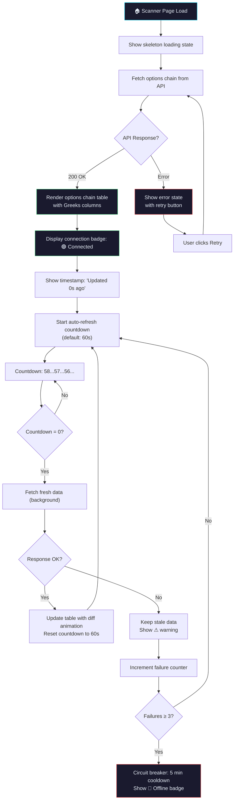
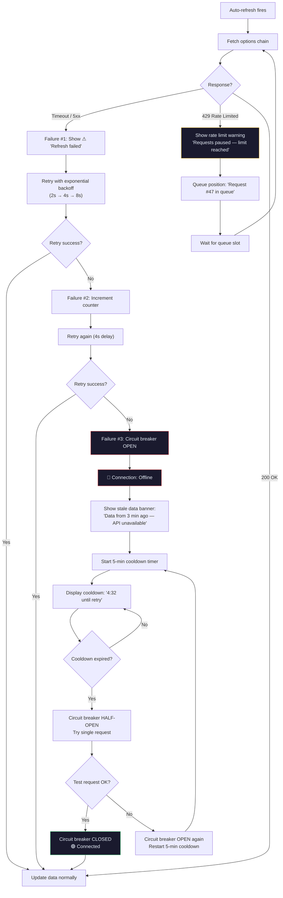
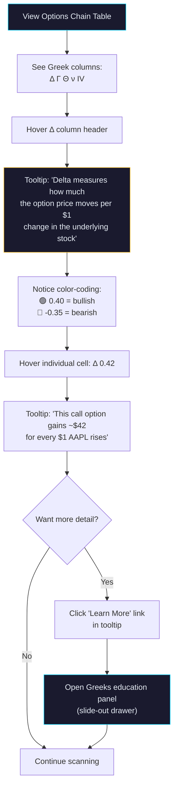
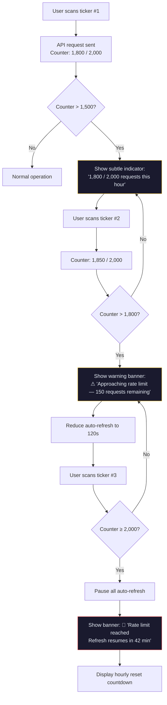

# UX Design: Real-Time Yahoo Finance Data Integration

**Feature**: #5 — Real-Time Yahoo Finance Data Integration  
**Epic**: #1 — Advanced Options Scanner Platform  
**Priority**: P0 (Must Have)  
**Created**: 2026-02-15  
**Status**: Complete  
**Designer**: UX Designer Agent  
**Related PRD**: [PRD-options-scanner-v2.md](../prd/PRD-options-scanner-v2.md#feature-3-real-time-yahoo-finance-data-integration)

---

## Table of Contents

1. [Overview](#1-overview)
2. [User Research](#2-user-research)
3. [User Flows](#3-user-flows)
4. [Wireframes](#4-wireframes)
5. [Component Specifications](#5-component-specifications)
6. [Design System](#6-design-system)
7. [Interactions & Animations](#7-interactions--animations)
8. [Accessibility (WCAG 2.1 AA)](#8-accessibility-wcag-21-aa)
9. [Responsive Design](#9-responsive-design)
10. [Interactive Prototypes](#10-interactive-prototypes)
11. [Implementation Notes](#11-implementation-notes)
12. [References](#12-references)

---

## 1. Overview

### Problem Statement

The options scanner currently lacks reliable real-time data integration. Traders cannot see when data was last refreshed, whether the API connection is healthy, or if they are viewing stale prices. When Yahoo Finance rate limits or outages occur, the UI provides no feedback — results silently stop updating, eroding user trust. Additionally, the options chain table (see `app/page.tsx` lines 30-50) polls every 60 seconds but does not display Greeks (delta, gamma, theta, vega) per contract, forcing traders to cross-reference external tools.

### Design Goals

1. **Data trust** — Always show data freshness (timestamp + countdown) so traders know exactly how current their data is
2. **Connection transparency** — Display connection status (connected / degraded / offline) prominently; never leave users guessing
3. **Graceful degradation** — When Yahoo API fails, show cached data with clear stale-data warnings; never show empty screens
4. **Greeks at a glance** — Display all five Greeks per contract with color-coding and tooltip explanations for beginners
5. **Rate limit awareness** — Proactively warn users when approaching the 2,000 req/hour limit; prevent silent failures

### Success Metrics

- Users identify data staleness within 2 seconds of viewing the scanner
- Connection status change (connected → degraded) is noticed by 90%+ of users within 5 seconds
- Stale data warning banner achieves >95% visibility (eye-tracking heuristic)
- Greeks tooltip interaction rate: >30% of new users hover at least one tooltip in first session
- Auto-refresh toggle adoption: >50% of active users configure refresh interval by week 2
- Error recovery (retry button click → successful reload): >80% success rate

---

## 2. User Research

### Personas

#### Persona 1: "Speed Sam" — Active Day Trader
- **Age**: 31 | **Experience**: 5+ years
- **Goals**: Act on options opportunities within seconds of spotting them; needs data as fresh as possible
- **Pain Points**: Cannot tell if scanner data is 30 seconds old or 10 minutes old; has been burned by acting on stale prices
- **Behaviors**: Monitors 5-8 active tickers simultaneously during market hours; refreshes manually 20+ times/day
- **Needs**: Visible last-updated timestamp, auto-refresh countdown, sub-60s refresh for active tickers, connection health indicator
- **Device**: Desktop only (3-monitor trading setup)

#### Persona 2: "Cautious Claire" — Risk-Aware Intermediate Trader
- **Age**: 42 | **Experience**: 3 years
- **Goals**: Understand Greeks before entering any position; never trade on stale or unreliable data
- **Pain Points**: Doesn't know what delta means without a tooltip; current scanner shows no Greek values at all
- **Behaviors**: Checks scanner 3-4 times daily (pre-market, open, midday, close); reads every tooltip before first trade
- **Needs**: Greeks column with color-coding, beginner-friendly tooltips, stale data banner, clear error messages explaining what went wrong
- **Device**: Desktop primary (60%), tablet secondary (40%)

#### Persona 3: "Budget Ben" — Cost-Conscious Free-Tier User
- **Age**: 25 | **Experience**: 1 year
- **Goals**: Use the free Yahoo Finance tier without hitting rate limits; get reliable data without paying for premium feeds
- **Pain Points**: Doesn't understand why data sometimes stops updating; worried about hidden costs or API bans
- **Behaviors**: Uses the scanner during market hours only; scans 2-3 tickers per session; checks back hourly
- **Needs**: Rate limit indicator ("1,247 / 2,000 requests used this hour"), queue position feedback during high traffic, clear messaging about Yahoo free-tier limitations
- **Device**: Mobile primary (70%), desktop secondary (30%)

---

## 3. User Flows

### Flow 1: Normal Data Loading & Auto-Refresh

**Trigger**: User navigates to Scanner page with active internet connection  
**Goal**: View live options chain data with continuous auto-refresh  
**Preconditions**: Yahoo Finance API reachable, rate limit not exceeded



### Flow 2: Graceful Degradation — API Failure & Circuit Breaker

**Trigger**: Yahoo Finance API returns errors or times out  
**Goal**: Continue showing cached data with clear warnings  
**Preconditions**: Previous successful data fetch exists in cache



### Flow 3: Greeks Exploration (Beginner)

**Trigger**: New user sees Greeks columns in options chain table  
**Goal**: Understand what each Greek means and how to interpret color-coding  
**Preconditions**: Options chain loaded with Greeks data



### Flow 4: Rate Limit Management

**Trigger**: User scans multiple tickers rapidly, approaching 2,000 req/hour limit  
**Goal**: Inform user of rate limit status and throttle gracefully



---

## 4. Wireframes

### Wireframe 1: Options Chain Table with Greeks & Data Freshness — Desktop (1440px)

```
┌──────────────────────────────────────────────────────────────────────────┐
│  Scanner  │  Strategy Builder  │  Portfolio  │  Alerts                  │
├──────────────────────────────────────────────────────────────────────────┤
│                                                                          │
│  Options Scanner                           🟢 Connected  ·  AAPL        │
│  Updated 12s ago  ·  Next refresh in 48s   [⟳ Auto-Refresh: ON ▼]      │
│                                                                          │
│  ┌──────────────────────────────────────────────────────────────────┐   │
│  │ ⚠ DATA DELAY: Yahoo Finance free tier provides 15-20 min       │   │
│  │   delayed data. Prices may not reflect current market.          │   │
│  │                                        [Dismiss]  [Learn More] │   │
│  └──────────────────────────────────────────────────────────────────┘   │
│                                                                          │
│  Expiration: [Feb 21 ▼] [Feb 28] [Mar 7] [Mar 21] [All]               │
│  Filter: [Calls ●] [Puts] [Both]    Strike Range: [170] — [200]       │
│                                                                          │
│  ┌──────────────────────────────────────────────────────────────────┐   │
│  │ OPTIONS CHAIN TABLE                                              │   │
│  │ ┌────────┬───────┬───────┬──────┬──────┬───────┬──────┬──────┐  │   │
│  │ │ Strike │  Bid  │  Ask  │ Vol  │  OI  │  Δ ⓘ │ Θ ⓘ │ IV ⓘ│  │   │
│  │ ├────────┼───────┼───────┼──────┼──────┼───────┼──────┼──────┤  │   │
│  │ │ 180 C  │ 12.40 │ 12.65 │ 2.4K │ 18K  │ 🟢.72│-0.15 │ 32% │  │   │
│  │ │ 185 C  │  8.20 │  8.45 │ 5.1K │ 24K  │ 🟢.58│-0.18 │ 34% │  │   │
│  │ │ 190 C  │  4.80 │  5.05 │ 8.9K │ 31K  │ 🟢.42│-0.21 │ 36% │  │   │
│  │ │ 195 C  │  2.30 │  2.55 │ 3.2K │ 15K  │ 🟡.28│-0.16 │ 38% │  │   │
│  │ │ 200 C  │  0.85 │  1.10 │ 1.8K │  9K  │ 🟡.15│-0.09 │ 41% │  │   │
│  │ │ 205 C  │  0.22 │  0.35 │  420 │  4K  │ 🔴.06│-0.04 │ 45% │  │   │
│  │ └────────┴───────┴───────┴──────┴──────┴───────┴──────┴──────┘  │   │
│  │                                                                  │   │
│  │  Showing 6 of 24 strikes  ·  Greeks color: 🟢 ITM  🟡 ATM  🔴 OTM  │
│  └──────────────────────────────────────────────────────────────────┘   │
│                                                                          │
│  ┌─── Rate Limit ─────────────────────────────┐                        │
│  │ 📊 1,247 / 2,000 requests this hour  ████░░│                        │
│  └────────────────────────────────────────────┘                        │
└──────────────────────────────────────────────────────────────────────────┘
```

### Wireframe 2: Connection Status Widget (Detail — All 3 States)

```
┌──────────────────────────────────────────────────────────────┐
│  STATE 1: Connected                                          │
│  ┌───────────────────────────────────────────────────────┐   │
│  │  🟢 Connected  ·  Updated 12s ago  ·  Refresh in 48s │   │
│  └───────────────────────────────────────────────────────┘   │
│                                                              │
│  STATE 2: Degraded (1-2 failures)                            │
│  ┌───────────────────────────────────────────────────────┐   │
│  │  🟡 Degraded  ·  Last successful update 2m ago       │   │
│  │  Retrying... (attempt 2/3)                            │   │
│  └───────────────────────────────────────────────────────┘   │
│                                                              │
│  STATE 3: Offline (circuit breaker open)                     │
│  ┌───────────────────────────────────────────────────────┐   │
│  │  🔴 Offline  ·  Showing cached data from 5m ago      │   │
│  │  Reconnecting in 4:32  ·  [Retry Now]                │   │
│  └───────────────────────────────────────────────────────┘   │
└──────────────────────────────────────────────────────────────┘
```

### Wireframe 3: Stale Data Warning Banner (Detail)

```
┌─────────────────────────────────────────────────────────────────┐
│  LEVEL 1: Informational (data 1-5 min old)                      │
│  ┌──────────────────────────────────────────────────────────┐   │
│  │ ⓘ Data is 2 minutes old. Auto-refresh paused due to     │   │
│  │   connection issue. [Retry Now]                 [Dismiss]│   │
│  └──────────────────────────────────────────────────────────┘   │
│                                                                 │
│  LEVEL 2: Warning (data 5-15 min old)                           │
│  ┌──────────────────────────────────────────────────────────┐   │
│  │ ⚠ Stale data — last updated 8 minutes ago. Prices may   │   │
│  │   not reflect current market conditions.                 │   │
│  │   [Retry Now]  [Use Cached Data]                [Dismiss]│   │
│  └──────────────────────────────────────────────────────────┘   │
│                                                                 │
│  LEVEL 3: Critical (data >15 min old or API offline)            │
│  ┌──────────────────────────────────────────────────────────┐   │
│  │ 🛑 API Offline — showing cached data from 22 minutes    │   │
│  │   ago. Do NOT make trading decisions on this data.       │   │
│  │   Circuit breaker active. Reconnecting in 3:18.          │   │
│  │   [Retry Now]                                            │   │
│  └──────────────────────────────────────────────────────────┘   │
└─────────────────────────────────────────────────────────────────┘
```

### Wireframe 4: Auto-Refresh Controls (Detail)

```
┌──────────────────────────────────────────────┐
│  Auto-Refresh Settings                       │
│                                              │
│  ┌──────────────────────────────────┐        │
│  │  [⟳ Auto-Refresh: ON  ▼]        │        │
│  │                                  │        │
│  │  ┌────────────────────────────┐  │        │
│  │  │  ● 30 seconds             │  │        │
│  │  │  ● 60 seconds (default)   │  │        │
│  │  │  ● 120 seconds            │  │        │
│  │  │  ● 5 minutes              │  │        │
│  │  │  ○ Off (manual only)      │  │        │
│  │  └────────────────────────────┘  │        │
│  └──────────────────────────────────┘        │
│                                              │
│  Active Tickers:                             │
│  AAPL (48s) · TSLA (12s) · SPY (55s)       │
└──────────────────────────────────────────────┘
```

### Wireframe 5: Greek Tooltip — Expanded (Detail)

```
┌────────────────────────────────────────────┐
│  Hovering cell: Δ 0.42                     │
│                                            │
│  ┌──────────────────────────────────────┐  │
│  │  Delta (Δ) = 0.42                    │  │
│  │                                      │  │
│  │  This call option gains ~$42 for     │  │
│  │  every $1 increase in AAPL stock.    │  │
│  │                                      │  │
│  │  ──────────────────────────────      │  │
│  │  Color Guide:                        │  │
│  │  🟢 0.60-1.00 = Deep ITM             │  │
│  │  🟢 0.40-0.59 = ITM                  │  │
│  │  🟡 0.30-0.39 = ATM                  │  │
│  │  🔴 0.01-0.29 = OTM                  │  │
│  │                                      │  │
│  │  [Learn More →]                      │  │
│  └──────────────────────────────────────┘  │
└────────────────────────────────────────────┘
```

### Wireframe 6: Loading / Skeleton State

```
┌──────────────────────────────────────────────────────────────────────┐
│  Options Scanner                          ⚪ Connecting...           │
│  Loading data...                          [⟳ Auto-Refresh: --]      │
│                                                                      │
│  Expiration: [░░░░░░░] [░░░░░░] [░░░░░░] [░░░░░░]                  │
│                                                                      │
│  ┌──────────────────────────────────────────────────────────────┐   │
│  │ ┌────────┬───────┬───────┬──────┬──────┬──────┬──────┬────┐ │   │
│  │ │ Strike │  Bid  │  Ask  │ Vol  │  OI  │  Δ   │  Θ   │ IV │ │   │
│  │ ├────────┼───────┼───────┼──────┼──────┼──────┼──────┼────┤ │   │
│  │ │ ░░░░░░ │ ░░░░░ │ ░░░░░ │ ░░░░ │ ░░░░ │ ░░░░ │ ░░░░ │ ░░ │ │   │
│  │ │ ░░░░░░ │ ░░░░░ │ ░░░░░ │ ░░░░ │ ░░░░ │ ░░░░ │ ░░░░ │ ░░ │ │   │
│  │ │ ░░░░░░ │ ░░░░░ │ ░░░░░ │ ░░░░ │ ░░░░ │ ░░░░ │ ░░░░ │ ░░ │ │   │
│  │ │ ░░░░░░ │ ░░░░░ │ ░░░░░ │ ░░░░ │ ░░░░ │ ░░░░ │ ░░░░ │ ░░ │ │   │
│  │ │ ░░░░░░ │ ░░░░░ │ ░░░░░ │ ░░░░ │ ░░░░ │ ░░░░ │ ░░░░ │ ░░ │ │   │
│  │ └────────┴───────┴───────┴──────┴──────┴──────┴──────┴────┘ │   │
│  │                                                              │   │
│  │  Loading options chain...  ████████░░░░░░░░░░  52%          │   │
│  └──────────────────────────────────────────────────────────────┘   │
└──────────────────────────────────────────────────────────────────────┘
```

### Wireframe 7: Error State with Retry

```
┌──────────────────────────────────────────────────────────────────────┐
│  Options Scanner                          🔴 Offline                 │
│  Last updated 5m ago                      [⟳ Auto-Refresh: PAUSED]  │
│                                                                      │
│  ┌──────────────────────────────────────────────────────────────┐   │
│  │ 🛑 Unable to load options chain data                        │   │
│  │                                                              │   │
│  │   Yahoo Finance API is not responding. This may be due to:  │   │
│  │   • Temporary server outage                                  │   │
│  │   • Rate limit exceeded (2,000 req/hour)                    │   │
│  │   • Network connectivity issue                               │   │
│  │                                                              │   │
│  │   Showing last cached data (5 minutes old).                 │   │
│  │   Circuit breaker will attempt reconnection in 3:42.         │   │
│  │                                                              │   │
│  │   [🔄 Retry Now]         [📋 View Cached Data]              │   │
│  └──────────────────────────────────────────────────────────────┘   │
│                                                                      │
│  ┌── Cached Data (stale) ───────────────────────────────────────┐   │
│  │ ┌────────┬───────┬───────┬──────┬──────┬──────┬──────┬────┐  │   │
│  │ │ Strike │  Bid  │  Ask  │ Vol  │  OI  │  Δ   │  Θ   │ IV │  │   │
│  │ ├────────┼───────┼───────┼──────┼──────┼──────┼──────┼────┤  │   │
│  │ │ 180 C  │ 12.40 │ 12.65 │ 2.4K │ 18K  │ .72  │-0.15 │32% │  │   │
│  │ │ (dimmed, entire table at 60% opacity)                     │  │   │
│  │ └────────┴───────┴───────┴──────┴──────┴──────┴──────┴────┘  │   │
│  └──────────────────────────────────────────────────────────────┘   │
└──────────────────────────────────────────────────────────────────────┘
```

### Wireframe 8: Mobile Options Chain (375px)

```
┌─────────────────────────┐
│  ≡  Scanner          👤 │
├─────────────────────────┤
│                         │
│  🟢 Connected           │
│  Updated 12s ago        │
│  Refresh: 48s [⟳]      │
│                         │
│  AAPL  $191.24          │
│  Exp: [Feb 21 ▼]       │
│  [Calls ●] [Puts]      │
│                         │
│  ┌───────────────────┐  │
│  │ 185 Call           │  │
│  │ Bid 8.20 Ask 8.45 │  │
│  │ Vol 5.1K  OI 24K  │  │
│  │ Δ 🟢.58  Θ -0.18  │  │
│  │ IV 34%   Γ  0.04  │  │
│  └───────────────────┘  │
│                         │
│  ┌───────────────────┐  │
│  │ 190 Call           │  │
│  │ Bid 4.80 Ask 5.05 │  │
│  │ Vol 8.9K  OI 31K  │  │
│  │ Δ 🟢.42  Θ -0.21  │  │
│  │ IV 36%   Γ  0.05  │  │
│  └───────────────────┘  │
│                         │
│  ┌───────────────────┐  │
│  │ 195 Call           │  │
│  │ Bid 2.30 Ask 2.55 │  │
│  │ Vol 3.2K  OI 15K  │  │
│  │ Δ 🟡.28  Θ -0.16  │  │
│  │ IV 38%   Γ  0.03  │  │
│  └───────────────────┘  │
│                         │
│  ── Rate Limit ──       │
│  1,247 / 2,000  ████░░  │
│                         │
└─────────────────────────┘
```

---

## 5. Component Specifications

### Component: ConnectionStatusBadge

**Purpose**: Always-visible indicator showing Yahoo Finance API connection health.

**States**:

| State | Icon | Color | Label | Subtext |
|-------|------|-------|-------|---------|
| Connected | 🟢 | `#4ade80` | "Connected" | "Updated {N}s ago" |
| Degraded | 🟡 | `#fbbf24` | "Degraded" | "Retrying... (attempt {N}/3)" |
| Offline | 🔴 | `#ef4444` | "Offline" | "Reconnecting in {M:SS}" |
| Connecting | ⚪ | `#94a3b8` | "Connecting..." | "Establishing connection" |

**Props**:
```typescript
interface ConnectionStatusBadgeProps {
  status: 'connected' | 'degraded' | 'offline' | 'connecting';
  lastUpdated: Date | null;
  failureCount: number;
  cooldownRemaining: number; // seconds, 0 if not in cooldown
  onRetryClick: () => void;
}
```

**Behavior**:
- Badge is sticky-positioned in the scanner header (always visible)
- Transitions between states animate with 300ms color fade
- Offline state pulses gently (1s interval) to draw attention without alarm
- "Retry Now" button only visible in Offline state
- `lastUpdated` displays relative time ("12s ago", "2m ago", "5m ago")

---

### Component: DataFreshnessBar

**Purpose**: Shows last update timestamp, auto-refresh countdown timer, and refresh controls.

**Layout**:
```
[Updated 12s ago]  ·  [Next refresh in 48s ████████░░]  ·  [⟳ Auto-Refresh: 60s ▼]
```

**Props**:
```typescript
interface DataFreshnessBarProps {
  lastUpdated: Date | null;
  refreshInterval: 30 | 60 | 120 | 300 | null; // null = manual only
  countdownRemaining: number; // seconds
  isRefreshing: boolean;
  onRefreshNow: () => void;
  onIntervalChange: (interval: number | null) => void;
}
```

**Behavior**:
- Countdown updates every second; progress bar fills left-to-right
- When `isRefreshing` is true, show spinner icon replacing countdown
- Clicking "Updated Xs ago" text triggers manual refresh
- Interval dropdown opens on click (not hover) for mobile compatibility
- "Updated" timestamp color changes: green (<60s), amber (60-300s), red (>300s)

---

### Component: StaleDataBanner

**Purpose**: Persistent warning banner shown when data exceeds freshness threshold.

**Levels**:

| Level | Trigger | Color | Icon | Dismissible? |
|-------|---------|-------|------|-------------|
| Info | Data 1-5 min old | `#00d4ff` (accent) | ⓘ | Yes |
| Warning | Data 5-15 min old | `#fbbf24` (warning) | ⚠ | Yes |
| Critical | Data >15 min old or API offline | `#ef4444` (error) | 🛑 | No |

**Props**:
```typescript
interface StaleDataBannerProps {
  level: 'info' | 'warning' | 'critical';
  staleMinutes: number;
  circuitBreakerActive: boolean;
  cooldownRemaining: number;
  onRetry: () => void;
  onDismiss: () => void;
}
```

**Behavior**:
- Banner slides in from top with 300ms animation
- Critical banners cannot be dismissed (user safety)
- Shows actionable buttons: "Retry Now", "Use Cached Data" (warning), "Dismiss" (info)
- Multiple stale tickers show single consolidated banner, not one per ticker

---

### Component: OptionsChainTable

**Purpose**: Primary data table showing options contracts with Greeks, pricing, and volume.

**Columns**:

| Column | Width | Sortable | Tooltip | Format |
|--------|-------|----------|---------|--------|
| Strike | 80px | Yes | Strike price of the contract | `$XXX.XX` |
| Type | 50px | Yes | Call (C) or Put (P) | Badge |
| Bid | 70px | Yes | Highest buy price | `$X.XX` |
| Ask | 70px | Yes | Lowest sell price | `$X.XX` |
| Volume | 70px | Yes | Contracts traded today | `X.XK` |
| Open Interest | 70px | Yes | Total open contracts | `X.XK` |
| Delta (Δ) | 65px | Yes | Price sensitivity to underlying | `±0.XX` with color |
| Gamma (Γ) | 65px | Yes | Delta's rate of change | `0.XXX` |
| Theta (Θ) | 65px | Yes | Time decay per day | `-$X.XX` |
| Vega (ν) | 65px | Yes | Sensitivity to IV change | `$X.XX` |
| IV | 55px | Yes | Implied volatility | `XX%` |

**Props**:
```typescript
interface OptionsChainTableProps {
  contracts: OptionContract[];
  isStale: boolean;
  isLoading: boolean;
  sortBy: string;
  sortDirection: 'asc' | 'desc';
  onSort: (column: string) => void;
  onContractClick: (contract: OptionContract) => void;
}
```

**Behavior**:
- Column headers show ⓘ icon for Greeks; hover triggers educational tooltip
- Rows highlight on hover with `rgba(0, 212, 255, 0.08)` background
- When `isStale` is true, table renders at 60% opacity with striped overlay
- Skeleton rows show during initial load; subsequent refreshes update in-place
- Delta color-coding: green (>0.4 ITM), yellow (0.3-0.4 ATM), red (<0.3 OTM)
- Volume cells exceeding 2.5× average OI get amber highlight (unusual activity)
- Click on row opens contract detail panel (future feature hookpoint)

---

### Component: RateLimitIndicator

**Purpose**: Shows current API usage against the 2,000 req/hour Yahoo Finance limit.

**Props**:
```typescript
interface RateLimitIndicatorProps {
  currentUsage: number;
  maxLimit: number; // 2000
  resetTime: Date;
  isThrottled: boolean;
}
```

**Visual States**:

| Usage Range | Color | Bar Fill | Label |
|-------------|-------|----------|-------|
| 0-75% | `#4ade80` (green) | Proportional | "1,247 / 2,000" |
| 75-90% | `#fbbf24` (amber) | Proportional | "1,800 / 2,000 — Approaching limit" |
| 90-100% | `#ef4444` (red) | Full | "1,950 / 2,000 — Near limit" |
| 100% | `#ef4444` (red, pulsing) | Full + overflow | "Rate limited — Resets in 42 min" |

**Behavior**:
- Compact bar shown at bottom of scanner section
- Expands on hover to show reset countdown and request breakdown
- When throttled, auto-refresh interval automatically increases to 120s
- Persisted in session storage; resets on hour boundary

---

### Component: GreekTooltip

**Purpose**: Educational tooltip shown on hover over any Greek value or column header.

**Props**:
```typescript
interface GreekTooltipProps {
  greek: 'delta' | 'gamma' | 'theta' | 'vega' | 'iv';
  value: number;
  symbol: string;         // e.g. "AAPL"
  strikePrice: number;
  contractType: 'call' | 'put';
}
```

**Content Map**:

| Greek | Header Tooltip | Cell Tooltip Template |
|-------|---------------|----------------------|
| Delta (Δ) | "Measures option price change per $1 move in the underlying" | "This {type} gains ~${value×100} per $1 {symbol} {direction}" |
| Gamma (Γ) | "Rate at which delta changes — higher near ATM strikes" | "Delta will change by {value} for each $1 move" |
| Theta (Θ) | "Time decay — how much value the option loses per day" | "This option loses ~${abs(value)} per day to time decay" |
| Vega (ν) | "Sensitivity to implied volatility — higher = more IV exposure" | "A 1% IV increase adds ~${value} to this option's price" |
| IV | "Implied Volatility — market's expectation of future price movement" | "{value}% IV — {comparison} vs. 20-day average" |

**Behavior**:
- 200ms delay before showing (prevents flicker on mouse pass-through)
- Tooltip dismisses on mouse leave or Escape key
- "Learn More →" link at bottom opens full Greek education drawer (deferred)
- Touch devices: tap to show, tap elsewhere to dismiss

---

### Component: RefreshCountdownRing

**Purpose**: Circular progress indicator showing time until next auto-refresh.

**Props**:
```typescript
interface RefreshCountdownRingProps {
  totalSeconds: number;     // e.g. 60
  remainingSeconds: number; // e.g. 48
  isPaused: boolean;
  size: 'sm' | 'md';       // sm=24px, md=36px
}
```

**Behavior**:
- SVG ring depletes clockwise as time passes (full ring = just refreshed)
- Shows remaining seconds as text in center (md size only)
- When paused, ring freezes and shows pause icon
- Ring color matches freshness: green → amber → red as it depletes

---

## 6. Design System

### Color Tokens

| Token | Value | Usage |
|-------|-------|-------|
| `--bg-base` | `#0a0a0a` | Page background |
| `--bg-surface` | `#1a1a2e` | Card / panel backgrounds |
| `--bg-surface-hover` | `#252545` | Card hover state |
| `--bg-skeleton` | `linear-gradient(90deg, #1a1a2e 25%, #252545 50%, #1a1a2e 75%)` | Skeleton shimmer |
| `--accent` | `#00d4ff` | Primary interactive elements, info banners |
| `--accent-hover` | `#00b8e6` | Hover state for accent elements |
| `--success` | `#4ade80` | Connected state, ITM delta, positive values |
| `--warning` | `#fbbf24` | Degraded state, ATM delta, rate limit approaching |
| `--error` | `#ef4444` | Offline state, OTM delta, critical alerts |
| `--text-primary` | `#e6edf7` | Headings, primary values |
| `--text-secondary` | `#b7c3d9` | Labels, descriptions, timestamps |
| `--text-muted` | `#94a3b8` | Placeholder text, disabled states |
| `--border-card` | `rgba(255,255,255,0.08)` | Card borders |
| `--border-active` | `rgba(0,212,255,0.3)` | Active / focused card borders |
| `--row-hover` | `rgba(0,212,255,0.08)` | Table row hover |
| `--row-stale` | `rgba(255,255,255,0.03)` | Stale data row overlay |
| `--unusual-volume` | `rgba(251,191,36,0.15)` | Unusual volume highlight |

### Typography

| Element | Size | Weight | Family | Color |
|---------|------|--------|--------|-------|
| Page title | 28px | 700 | JetBrains Mono | `--text-primary` |
| Freshness text | 13px | 400 | JetBrains Mono | `--text-secondary` |
| Table header | 12px | 600 | JetBrains Mono | `--text-muted` |
| Table cell (price) | 14px | 500 | JetBrains Mono | `--text-primary` |
| Table cell (Greek) | 14px | 600 | JetBrains Mono | Dynamic (green/yellow/red) |
| Greek tooltip title | 14px | 700 | JetBrains Mono | `--text-primary` |
| Greek tooltip body | 13px | 400 | system-ui | `--text-secondary` |
| Banner text | 14px | 500 | system-ui | Varies by level |
| Rate limit label | 12px | 500 | JetBrains Mono | `--text-muted` |
| Connection badge | 13px | 600 | JetBrains Mono | Dynamic (green/yellow/red) |
| Countdown number | 14px | 700 | JetBrains Mono | `--text-primary` |

### Spacing

| Context | Value |
|---------|-------|
| Page padding | 24px (desktop), 16px (mobile) |
| Card padding | 16px |
| Table cell padding | 8px 12px |
| Section gap | 24px |
| Banner padding | 12px 16px |
| Tooltip padding | 12px 16px |
| Connection badge padding | 6px 12px |
| Rate limit bar height | 6px |
| Greek column min-width | 55px |

### Border Radius

| Element | Radius |
|---------|--------|
| Cards / panels | 12px |
| Banners | 8px |
| Tooltips | 8px |
| Connection badge | 20px (pill) |
| Rate limit bar | 3px |
| Table rows | 0px (sharp edges for density) |
| Buttons | 8px |
| Dropdown menu | 8px |

### Shadows

| Element | Shadow |
|---------|--------|
| Tooltip | `0 8px 24px rgba(0,0,0,0.4)` |
| Dropdown menu | `0 4px 16px rgba(0,0,0,0.3)` |
| Stale overlay | Inset `0 0 0 2px rgba(251,191,36,0.2)` |
| Critical banner | `0 2px 8px rgba(239,68,68,0.2)` |

---

## 7. Interactions & Animations

### Data Update Flash

When a cell value changes on refresh:
- Cell background flashes `rgba(0,212,255,0.2)` for 600ms then fades out
- If value increased: text briefly turns `#4ade80` (green) for 1s
- If value decreased: text briefly turns `#ef4444` (red) for 1s
- Uses `transition: background-color 0.6s ease-out, color 1s ease-out`

### Skeleton Loading

- Shimmer animation: gradient slides left-to-right across skeleton placeholders
- Duration: 1.5s per cycle, infinite repeat
- Keyframes: `background-position: -200% 0` → `200% 0`
- Skeleton blocks match exact cell dimensions for layout stability (no CLS)

### Connection Status Transitions

| From → To | Animation |
|-----------|-----------|
| Connecting → Connected | Badge scales from `0.95` to `1.0` with green color fade (300ms) |
| Connected → Degraded | Badge icon pulses once, color fades green → amber (300ms) |
| Degraded → Offline | Badge icon shakes (2 cycles, 100ms each), color fades amber → red |
| Offline → Connected | Badge scales up `1.0` → `1.1` → `1.0` (bounce), color fades red → green (400ms) |

### Stale Data Banner

- **Entrance**: Slides down from top with `translateY(-100%)` → `translateY(0)` over 300ms, `ease-out`
- **Dismiss**: Slides up with `translateY(0)` → `translateY(-100%)` over 200ms, `ease-in`
- **Level change** (info → warning): Cross-fade colors over 400ms; icon pulses once
- **Critical pulse**: Border alternates opacity 0.5 → 1.0 every 2s (subtle, not aggressive)

### Auto-Refresh Countdown

- Countdown ring depletes smoothly (CSS `stroke-dashoffset` transition, 1s linear per tick)
- At 0s: ring fills instantly + icon rotates 360° (refresh spinner)
- On manual refresh click: icon spins one full rotation (400ms)
- When paused: ring freezes, opacity drops to 0.6, shows pause icon

### Rate Limit Bar

- Fill width transitions with `transition: width 0.5s ease`
- Color transitions between green → amber → red as thresholds cross (400ms fade)
- At 100%: bar pulses opacity 0.7 → 1.0 every 1.5s
- Reset: bar empties left-to-right over 500ms

### Table Row Interactions

- Hover: background fades to `--row-hover` over 150ms
- Sort click: column header gets underline + sort arrow rotates (200ms)
- Stale mode: rows get crosshatch overlay pattern at 10% opacity

---

## 8. Accessibility (WCAG 2.1 AA)

### Color Contrast

All text/background combinations meet minimum 4.5:1 contrast ratio:

| Element | Foreground | Background | Ratio |
|---------|-----------|------------|-------|
| Primary text on surface | `#e6edf7` | `#1a1a2e` | 11.2:1 ✅ |
| Secondary text on surface | `#b7c3d9` | `#1a1a2e` | 7.8:1 ✅ |
| Muted text on surface | `#94a3b8` | `#1a1a2e` | 5.1:1 ✅ |
| Green (connected) on surface | `#4ade80` | `#1a1a2e` | 6.9:1 ✅ |
| Amber (warning) on surface | `#fbbf24` | `#1a1a2e` | 8.4:1 ✅ |
| Red (error) on surface | `#ef4444` | `#1a1a2e` | 4.6:1 ✅ |
| Banner text on warning bg | `#1a1a2e` | `#fbbf24` | 8.4:1 ✅ |

Connection status and stale data indicators always use **both color AND text labels** — never rely on color alone:
- 🟢 "Connected" (not just a green dot)
- ⚠ "Stale data — last updated 8 minutes ago" (not just an amber bar)
- 🛑 "API Offline" (not just a red indicator)

### Keyboard Navigation

**Tab Order**:
1. Connection status badge (shows status on focus via `aria-live`)
2. Auto-refresh dropdown toggle
3. Expiration tabs
4. Call/Put filter toggle
5. Strike range inputs
6. Table column headers (sortable — Enter/Space to sort)
7. Table rows (Enter to open detail, arrow keys for row navigation)
8. Rate limit indicator (shows expanded detail on focus)
9. Stale data banner buttons ("Retry Now", "Dismiss")

**Keyboard Shortcuts**:
| Key | Action |
|-----|--------|
| `R` | Manual refresh (when table is focused) |
| `Escape` | Dismiss banner / close tooltip |
| `Arrow Up/Down` | Navigate table rows |
| `Arrow Left/Right` | Navigate between expiration tabs |
| `Enter` / `Space` | Activate focused button or sort column |
| `Tab` / `Shift+Tab` | Move through interactive elements |

### Screen Reader Support

```html
<!-- Connection Status -->
<div role="status" aria-live="polite" aria-label="Data connection status: Connected. Last updated 12 seconds ago.">
  🟢 Connected · Updated 12s ago
</div>

<!-- Stale Data Banner -->
<div role="alert" aria-live="assertive" aria-label="Warning: Data is 8 minutes old. Prices may not reflect current market.">
  ⚠ Stale data — last updated 8 minutes ago
</div>

<!-- Auto-Refresh Countdown -->
<div role="timer" aria-label="Next data refresh in 48 seconds">
  Refresh in 48s
</div>

<!-- Greek Column Header -->
<th scope="col" aria-label="Delta. Measures option price change per 1 dollar move in the underlying. Click to sort.">
  Δ <button aria-label="Delta info tooltip">ⓘ</button>
</th>

<!-- Greek Cell -->
<td aria-label="Delta: 0.42, in the money">
  <span class="greek-value greek-value--itm">0.42</span>
</td>

<!-- Rate Limit -->
<div role="progressbar" aria-valuenow="1247" aria-valuemin="0" aria-valuemax="2000"
     aria-label="API usage: 1,247 of 2,000 requests this hour">
  1,247 / 2,000
</div>

<!-- Options Chain Table -->
<table aria-label="Options chain for AAPL, February 21 expiration, calls">
  <thead>
    <tr>
      <th scope="col" aria-sort="none">Strike</th>
      <th scope="col" aria-sort="ascending">Volume</th>
      ...
    </tr>
  </thead>
</table>
```

### Focus Indicators

- All interactive elements show `2px solid #00d4ff` outline on focus
- `outline-offset: 2px` for clear visibility against dark backgrounds
- Focus ring animates in over 100ms (`transition: outline-offset 0.1s ease`)
- Connection badge and rate limit bar show expanded detail view on focus (same as hover)

### Motion Preferences

```css
@media (prefers-reduced-motion: reduce) {
  /* Disable non-essential animations */
  .skeleton-shimmer { animation: none; }
  .connection-badge-pulse { animation: none; }
  .data-flash { transition: none; }
  .countdown-ring { transition: none; }
  .banner-enter { animation: none; opacity: 1; }

  /* Keep essential state transitions but make them instant */
  .connection-status { transition-duration: 0ms; }
  .stale-banner { transition-duration: 0ms; }
}
```

---

## 9. Responsive Design

### Desktop (≥1024px)

- Full options chain table with all 11 columns visible
- Connection status badge + freshness bar inline in header
- Stale data banner spans full width above table
- Rate limit indicator as compact bar below table
- Greek tooltips positioned to the right of cells
- Auto-refresh dropdown opens downward

### Tablet (768px–1023px)

- Table shows 8 columns: Strike, Bid, Ask, Vol, OI, Delta, Theta, IV
- Gamma and Vega hidden (accessible via row expansion tap)
- Connection badge and freshness bar stack vertically
- Stale data banner wraps to 2 lines if needed
- Greek tooltips open as bottom sheets on tap
- Rate limit moves into a collapsible section

### Mobile (<768px)

- Options chain displayed as **card stack** instead of table
- Each card shows: Strike, Bid/Ask, Vol/OI, Delta, Theta, IV, Gamma, Vega
- Connection badge pinned to top of viewport (sticky)
- Freshness bar simplified: "12s ago · 48s" (compact)
- Stale data banner becomes full-width alert with stacked buttons
- Auto-refresh dropdown becomes a bottom sheet selector
- Greek tooltips open as full-width bottom sheets (larger tap targets)
- Rate limit as horizontal bar at bottom of card list
- Swipe down on card list triggers manual refresh (pull-to-refresh pattern)

### Breakpoint Details

| Breakpoint | Layout | Table Format | Greek Columns | Connection Badge |
|------------|--------|-------------|---------------|-----------------|
| ≥1440px | Full 12-col grid | 11-column table | All 5 Greeks | Inline with freshness bar |
| 1024–1439px | 12-col grid | 11-column table | All 5 Greeks | Inline, compact text |
| 768–1023px | 8-col grid | 8-column table | Δ, Θ, IV only | Stacked above table |
| 376–767px | 4-col grid | Card stack | All (in card) | Sticky top bar |
| ≤375px | 4-col grid | Card stack (compact) | Δ, Θ, IV only | Sticky top bar |

### Touch Interactions (Mobile/Tablet)

| Gesture | Action |
|---------|--------|
| Pull down | Manual refresh (with haptic feedback on iOS) |
| Tap Greek value | Open tooltip as bottom sheet |
| Tap connection badge | Expand status detail panel |
| Long press table row | Open contract detail (future feature) |
| Swipe left on card | Reveal quick-action buttons |
| Tap stale banner | Expand full error details |

---

## 10. Interactive Prototypes

### Prototype Location

**File**: `docs/ux/prototypes/data-integration.html`

### Prototype Features

- Connection status badge with all 3 states (click to cycle: Connected → Degraded → Offline)
- Auto-refresh countdown ring with configurable interval dropdown
- Options chain table with sortable columns and Greek color-coding
- Skeleton loading state (toggle via button)
- Stale data warning banner (3 levels, click to escalate)
- Rate limit progress bar (draggable to simulate usage)
- Greek tooltips on hover (all 5 Greeks with contextual explanations)
- Error state with retry button
- Responsive: desktop (1440px), tablet (768px), mobile (375px) via viewport toggle
- Data flash animation on simulated refresh
- WCAG 2.1 AA compliant (keyboard navigable, screen reader labels)

### Prototype Usage

1. Open `docs/ux/prototypes/data-integration.html` in a browser
2. Use the control panel at the top to simulate different states
3. Click "Simulate Refresh" to see data flash animations
4. Click connection badge to cycle through states
5. Drag rate limit slider to see threshold color changes
6. Hover Greek column headers and cell values for tooltips
7. Resize browser window to see responsive breakpoints

---

## 11. Implementation Notes

### React Component Hierarchy

```
ScannerPage
├── DataFreshnessBar
│   ├── ConnectionStatusBadge
│   ├── LastUpdatedTimestamp
│   ├── RefreshCountdownRing
│   └── AutoRefreshDropdown
├── StaleDataBanner (conditional)
├── OptionsChainControls
│   ├── ExpirationTabs
│   ├── CallPutToggle
│   └── StrikeRangeInputs
├── OptionsChainTable (desktop/tablet)
│   ├── SortableColumnHeader (×11)
│   │   └── GreekTooltip (for Greek columns)
│   └── OptionsChainRow (×N)
│       └── GreekCell (×5 per row)
│           └── GreekTooltip (on hover)
├── OptionsChainCardList (mobile)
│   └── OptionsChainCard (×N)
│       └── GreekBadge (×5 per card)
├── RateLimitIndicator
└── ErrorState (conditional: replaces table when no cached data)
    └── RetryButton
```

### TypeScript Interfaces

```typescript
type ConnectionStatus = 'connecting' | 'connected' | 'degraded' | 'offline';

type StaleLevel = 'fresh' | 'info' | 'warning' | 'critical';

interface DataFreshnessState {
  lastUpdated: Date | null;
  staleLevel: StaleLevel;
  connectionStatus: ConnectionStatus;
  failureCount: number;
  circuitBreakerActive: boolean;
  cooldownRemaining: number;       // seconds
}

interface RateLimitState {
  currentUsage: number;
  maxLimit: number;                // 2000
  resetTime: Date;
  isThrottled: boolean;
  throttleLevel: 'none' | 'approaching' | 'near' | 'exceeded';
}

interface AutoRefreshConfig {
  enabled: boolean;
  intervalSeconds: 30 | 60 | 120 | 300;
}

interface OptionContract {
  symbol: string;
  strike: number;
  type: 'call' | 'put';
  expiration: string;              // ISO 8601
  bid: number;
  ask: number;
  volume: number;
  openInterest: number;
  greeks: ContractGreeks;
  impliedVolatility: number;       // 0-1 (e.g. 0.32 = 32%)
  lastUpdated: string;             // ISO 8601
}

interface ContractGreeks {
  delta: number;                   // -1.0 to 1.0
  gamma: number;                   // 0 to ~0.1
  theta: number;                   // usually negative
  vega: number;                    // usually positive
}

interface GreekColorConfig {
  delta: {
    itm: string;                   // >0.4 → #4ade80
    atm: string;                   // 0.3-0.4 → #fbbf24
    otm: string;                   // <0.3 → #ef4444
  };
  theta: {
    low: string;                   // >-0.10 → #4ade80
    medium: string;                // -0.10 to -0.25 → #fbbf24
    high: string;                  // <-0.25 → #ef4444
  };
}

interface CircuitBreakerState {
  status: 'closed' | 'open' | 'half-open';
  failureCount: number;
  lastFailure: Date | null;
  cooldownEnd: Date | null;
  maxFailures: 3;
  cooldownMs: 300000;              // 5 minutes
}
```

### Custom Hooks

```typescript
// Core data fetching with circuit breaker, retry, and caching
useYahooFinanceData(ticker: string, expiration: string): {
  contracts: OptionContract[];
  isLoading: boolean;
  isStale: boolean;
  staleLevel: StaleLevel;
  error: Error | null;
  refresh: () => void;
  lastUpdated: Date | null;
}

// Connection health monitoring
useConnectionStatus(): {
  status: ConnectionStatus;
  failureCount: number;
  circuitBreaker: CircuitBreakerState;
  retryNow: () => void;
}

// Auto-refresh lifecycle management
useAutoRefresh(config: AutoRefreshConfig): {
  countdownRemaining: number;
  isPaused: boolean;
  pause: () => void;
  resume: () => void;
  setInterval: (seconds: number) => void;
}

// Rate limit tracking
useRateLimit(): {
  usage: number;
  limit: number;
  resetTime: Date;
  isThrottled: boolean;
  throttleLevel: 'none' | 'approaching' | 'near' | 'exceeded';
}

// Data freshness calculation
useDataFreshness(lastUpdated: Date | null): {
  staleLevel: StaleLevel;
  staleMinutes: number;
  relativeTime: string;           // "12s ago", "2m ago"
}
```

### Circuit Breaker Logic

```
State Machine:
  CLOSED → (failure) → count failures → (count ≥ 3) → OPEN
  OPEN → (5 min cooldown expires) → HALF-OPEN
  HALF-OPEN → (test request succeeds) → CLOSED
  HALF-OPEN → (test request fails) → OPEN (restart cooldown)

Retry Strategy:
  Attempt 1: immediate
  Attempt 2: 2 second delay
  Attempt 3: 4 second delay (exponential backoff)
  After 3 failures: circuit breaker opens

Cache Strategy:
  - Cache key: `{ticker}:{expiration}`
  - Cache TTL: 60 seconds for active tickers
  - Stale cache: served when API unavailable (no TTL during outage)
  - Cache invalidation: on successful refresh only
```

### Data Flow

1. `useYahooFinanceData()` initiates fetch on mount and on interval tick
2. Request passes through `useRateLimit()` gate — if throttled, request is queued
3. Request passes through circuit breaker — if OPEN, returns cached data + stale indicator
4. On success: update cache, reset failure count, update `lastUpdated`
5. On failure: increment failure count, invoke retry with backoff, serve cached data
6. After 3 failures: set circuit breaker to OPEN, start 5-min cooldown
7. `useConnectionStatus()` derives status from failure count and circuit breaker state
8. `useDataFreshness()` computes stale level from `lastUpdated` timestamp
9. UI updates: `ConnectionStatusBadge`, `StaleDataBanner`, `RateLimitIndicator` react to state

### API Endpoints (Backend Reference)

- `GET /api/options/chain?ticker={AAPL}&expiration={2026-02-21}` → `OptionContract[]`
- `GET /api/options/expirations?ticker={AAPL}` → `string[]` (available expirations)
- `GET /api/health/yahoo` → `{ status: 'ok' | 'degraded' | 'down', latency: number }`
- `GET /api/rate-limit` → `{ usage: number, limit: number, resetAt: string }`

### Performance Considerations

- Skeleton screens match exact table dimensions to prevent Cumulative Layout Shift (CLS = 0)
- Options chain table uses `React.memo` on rows — only re-render cells whose values changed
- Greek tooltip content is lazily loaded (not rendered until hover)
- Rate limit counter stored in `sessionStorage` to persist across page navigations
- Auto-refresh uses `requestAnimationFrame` for countdown accuracy (not `setInterval`)
- Connection status stored in React context (single source of truth for all components)
- Stale data banner renders once per page, not per ticker (consolidated view)

---

## 12. References

- PRD: [PRD-options-scanner-v2.md](../prd/PRD-options-scanner-v2.md#feature-3-real-time-yahoo-finance-data-integration)
- Issue: [#5 Real-Time Yahoo Finance Data Integration](https://github.com/mkspwr12/options-scanner-frontend/issues/5)
- Existing scanner UI: `app/page.tsx`, `app/components/scanner/ScannerSection.tsx`
- Design system: `app/globals.css`
- Related UX: [UX-2 Advanced Filtering](UX-2.md) (scanner page layout), [UX-6 Portfolio Risk](UX-6.md) (Greek display patterns)
- Yahoo Finance API: [Rate Limits](https://developer.yahoo.com/) — 2,000 req/hour free tier
- Circuit Breaker Pattern: Martin Fowler's [Circuit Breaker](https://martinfowler.com/bliki/CircuitBreaker.html)
- WCAG 2.1 AA: [W3C Guidelines](https://www.w3.org/WAI/WCAG21/quickref/)
