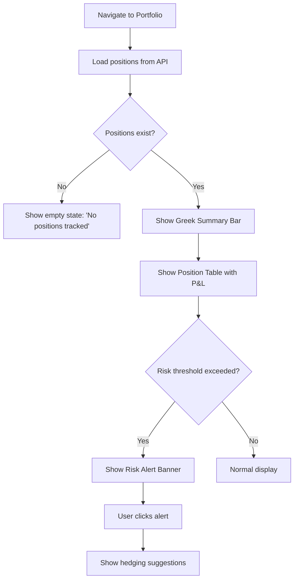
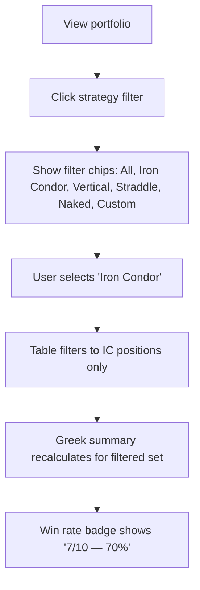
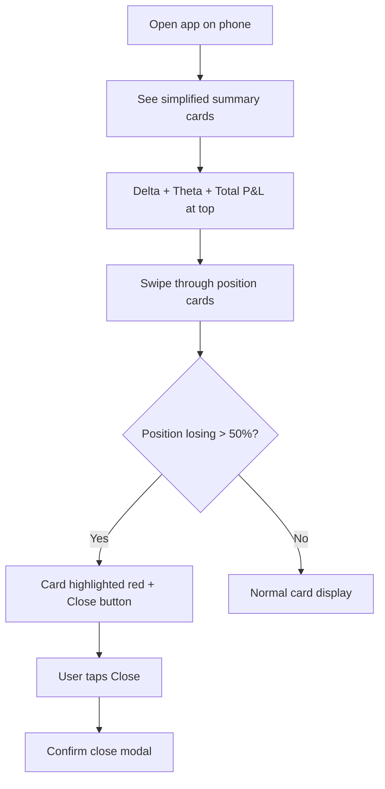

# UX Design: Enhanced Portfolio Risk Management

**Feature**: #6 — Enhanced Portfolio Risk Management  
**Epic**: #1 — Advanced Options Scanner Platform  
**Priority**: P0 (Must Have)  
**Created**: 2025-02-14  
**Status**: Complete  

---

## 1. Overview

### Problem Statement
Active options traders manage multiple positions across strategies (verticals, condors, straddles) but lack a unified view of portfolio-level risk. Current portfolio displays (see `app/page.tsx` lines 448-477) show flat per-position P&L cards without aggregated Greeks, risk alerts, or strategy tagging. Traders must manually sum Greeks across positions and use spreadsheets to track risk exposure.

### Design Goals
1. **Aggregate risk visibility** — Show portfolio-wide delta, gamma, theta, vega at a glance
2. **P&L clarity** — Per-position unrealized P&L with color-coded winners/losers
3. **Strategy attribution** — Tag and filter positions by strategy type, track win rates
4. **Proactive risk management** — Threshold-based alerts for Greek limits
5. **Mobile-first monitoring** — Simplified view for on-the-go risk checks

### Success Metrics
- Traders identify risk exposure within 3 seconds of loading portfolio
- Risk alert setup completes in < 30 seconds
- Mobile users monitor full portfolio without horizontal scrolling

---

## 2. User Research

### Personas

#### Persona 1: "Defensive Dan" — Risk-Focused Trader
- **Age**: 48 | **Experience**: 10+ years
- **Goals**: Never lose more than 2% of capital in a day; keep delta neutral
- **Pain Points**: Must manually calculate total Greeks; gets surprised by large moves
- **Behaviors**: Checks portfolio Greeks every 30 minutes during market hours
- **Needs**: Prominent Greek summaries, threshold alerts, risk heatmap

#### Persona 2: "Multi-Strat Maria" — Strategy Diversifier
- **Age**: 35 | **Experience**: 5 years
- **Goals**: Run multiple strategy types simultaneously; track which strategies perform best
- **Pain Points**: Can't see performance by strategy; all positions look the same
- **Behaviors**: Runs 3-5 strategies at once; reviews weekly performance
- **Needs**: Strategy tags, group-by-strategy view, win rate tracking

#### Persona 3: "Mobile Mike" — On-the-Go Monitor
- **Age**: 29 | **Experience**: 2 years
- **Goals**: Quick portfolio check during commute; act on urgent P&L changes
- **Pain Points**: Desktop-optimized tables are unreadable on phone; too many columns
- **Behaviors**: Checks portfolio 10+ times per day on phone; rarely trades from mobile
- **Needs**: Card-based mobile layout, key numbers only (delta, theta, P&L), quick close

---

## 3. User Flows

### Flow 1: Portfolio Risk Overview



### Flow 2: Filter by Strategy Tag



### Flow 3: Mobile Portfolio Check



---

## 4. Wireframes

### Wireframe 1: Portfolio Dashboard — Desktop (1440px)

```
┌─────────────────────────────────────────────────────────────────────┐
│  Scanner  │  Strategy Builder  │  ● Portfolio  │  Alerts           │
├─────────────────────────────────────────────────────────────────────┤
│                                                                     │
│  Portfolio Risk Management                                          │
│  12 positions · $24,680 total value · Updated 15s ago               │
│                                                                     │
│  ┌────────────────────────────────────────────────────────────────┐ │
│  │  GREEK SUMMARY BAR                                             │ │
│  │  ┌──────────┐ ┌──────────┐ ┌──────────┐ ┌──────────┐         │ │
│  │  │ Δ Delta  │ │ Γ Gamma  │ │ Θ Theta  │ │ ν Vega   │         │ │
│  │  │  +0.42   │ │  +0.08   │ │ -$45/day │ │  +$120   │         │ │
│  │  │ ●● Low   │ │ ●  Low   │ │ ●●●Med   │ │ ●●  Med  │         │ │
│  │  └──────────┘ └──────────┘ └──────────┘ └──────────┘         │ │
│  └────────────────────────────────────────────────────────────────┘ │
│                                                                     │
│  ┌───────── P&L SUMMARY ──────────┐  ┌──── RISK ALERT ──────────┐ │
│  │  Total P&L: +$1,245.80 (+5.04%)│  │  ⚠ Delta +0.42 nearing  │ │
│  │  Today:     +$182.30            │  │    threshold ±0.50       │ │
│  │  Winners: 8  Losers: 4          │  │  [Adjust] [Dismiss]     │ │
│  └─────────────────────────────────┘  └──────────────────────────┘ │
│                                                                     │
│  Strategy: [All ●] [Iron Condor] [Vertical] [Straddle] [Naked]    │
│                                                                     │
│  ┌────────────────────────────────────────────────────────────────┐ │
│  │ POSITION TABLE                                                 │ │
│  │ ┌──────┬────────────────┬──────┬──────┬──────┬──────┬───────┐ │ │
│  │ │ Tag  │ Position       │ P&L  │ P&L% │  Δ   │  Θ   │ Act  │ │ │
│  │ ├──────┼────────────────┼──────┼──────┼──────┼──────┼───────┤ │ │
│  │ │  IC  │ AAPL 185/190   │+$285 │+18.2%│+0.08 │-$4.2 │ [X]  │ │ │
│  │ │  IC  │   195/200 IC   │      │      │      │      │      │ │ │
│  │ ├──────┼────────────────┼──────┼──────┼──────┼──────┼───────┤ │ │
│  │ │  VS  │ TSLA 250/260   │-$120 │-8.5% │+0.15 │-$6.8 │ [X]  │ │ │
│  │ │      │  Bull Call      │      │      │      │      │      │ │ │
│  │ ├──────┼────────────────┼──────┼──────┼──────┼──────┼───────┤ │ │
│  │ │  ST  │ SPY 580 Str    │+$450 │+32.1%│-0.02 │-$12  │ [X]  │ │ │
│  │ │      │                │      │      │      │      │      │ │ │
│  │ └──────┴────────────────┴──────┴──────┴──────┴──────┴───────┘ │ │
│  │                                                                │ │
│  │  Sorted by: [P&L ▼]  Show: [All] [Winners] [Losers]            │ │
│  └────────────────────────────────────────────────────────────────┘ │
│                                                                     │
│  ┌──── STRATEGY PERFORMANCE ─────────────────────────────────────┐ │
│  │  Iron Condor    7W / 3L  70% WR   +$1,820 total              │ │
│  │  Vertical       4W / 2L  67% WR   +$640 total                │ │
│  │  Straddle       1W / 2L  33% WR   -$215 total                │ │
│  └────────────────────────────────────────────────────────────────┘ │
└─────────────────────────────────────────────────────────────────────┘
```

### Wireframe 2: Greek Summary Bar (Detail)

```
┌──────────────────────────────────────────────────────┐
│  Portfolio Greeks                    [Set Thresholds] │
│                                                       │
│  ┌──────────────┐ ┌──────────────┐                   │
│  │  Δ  Delta    │ │  Γ  Gamma    │                   │
│  │              │ │              │                   │
│  │   +0.42      │ │   +0.08      │                   │
│  │  ─────●──    │ │  ●──────     │                   │
│  │  -2  0  +2   │ │  0    0.5    │                   │
│  │  ●●○ Low     │ │  ●○○ Low     │                   │
│  └──────────────┘ └──────────────┘                   │
│  ┌──────────────┐ ┌──────────────┐                   │
│  │  Θ  Theta    │ │  ν  Vega     │                   │
│  │              │ │              │                   │
│  │   -$45/day   │ │   +$120      │                   │
│  │  ──────●──   │ │  ────●───    │                   │
│  │  -100  0     │ │  0    200    │                   │
│  │  ●●●○ Med    │ │  ●●○ Med     │                   │
│  └──────────────┘ └──────────────┘                   │
└──────────────────────────────────────────────────────┘
```

### Wireframe 3: Risk Alert Configuration Modal

```
┌────────────────────────────────────────────┐
│  ⚙ Risk Alert Thresholds         [✕]      │
│                                             │
│  Portfolio Delta                            │
│  Alert when |delta| exceeds:                │
│  ┌────────────────────────────────┐        │
│  │  ──────────●────              │        │
│  │  0.5   1.0   [ 2.0 ]   3.0   │        │
│  └────────────────────────────────┘        │
│                                             │
│  Daily Theta Decay                          │
│  Alert when theta exceeds:                  │
│  ┌────────────────────────────────┐        │
│  │  ──────────────●──            │        │
│  │  $25    $50    [ $100 ]  $200 │        │
│  └────────────────────────────────┘        │
│                                             │
│  Position P&L                               │
│  Alert when position loss exceeds:          │
│  ┌────────────────────────────────┐        │
│  │  ──────●────────              │        │
│  │  -25%  [ -50% ]   -75%  -100%│        │
│  └────────────────────────────────┘        │
│                                             │
│  Notification:                              │
│  [✓] In-app banner  [✓] Email               │
│                                             │
│  [Cancel]              [Save Thresholds]    │
└────────────────────────────────────────────┘
```

### Wireframe 4: Mobile Portfolio (375px)

```
┌─────────────────────────┐
│  ≡  Portfolio        👤 │
├─────────────────────────┤
│                         │
│  ┌───────────────────┐  │
│  │ QUICK SUMMARY     │  │
│  │ Δ +0.42  Θ -$45   │  │
│  │ P&L: +$1,245.80   │  │
│  │ ▲ +$182.30 today  │  │
│  └───────────────────┘  │
│                         │
│  ⚠ Delta nearing limit  │
│                         │
│  Filter: [All▼]        │
│                         │
│  ┌───────────────────┐  │
│  │ AAPL Iron Condor  │  │
│  │ 185/190/195/200   │  │
│  │                   │  │
│  │ P&L: +$285 +18.2% │  │
│  │ Δ: +0.08  Θ: -$4  │  │
│  │                   │  │
│  │         [Close ✕] │  │
│  └───────────────────┘  │
│                         │
│  ┌───────────────────┐  │
│  │ TSLA Bull Call    │  │
│  │ 250/260           │  │
│  │                   │  │
│  │ P&L: -$120 -8.5%  │  │
│  │ Δ: +0.15  Θ: -$7  │  │
│  │                   │  │
│  │         [Close ✕] │  │
│  └───────────────────┘  │
│                         │
│  ┌───────────────────┐  │
│  │ SPY Long Straddle │  │
│  │ 580 Call + Put    │  │
│  │                   │  │
│  │ P&L: +$450 +32.1% │  │
│  │ Δ: -0.02  Θ: -$12 │  │
│  │                   │  │
│  │         [Close ✕] │  │
│  └───────────────────┘  │
│                         │
│  ─── Strategy Stats ─── │
│  IC: 70% WR (7/10)     │
│  VS: 67% WR (4/6)      │
│  ST: 33% WR (1/3)      │
│                         │
└─────────────────────────┘
```

---

## 5. Component Specifications

### Component: GreekSummaryCard

**States**: Normal (green dot), Warning (amber dot), Critical (red dot + pulse)

```css
/* Greek Summary Card */
.greek-summary-card {
  background: var(--bg-card);                /* rgba(9,16,31,0.65) */
  border: 1px solid var(--border-card);      /* rgba(255,255,255,0.08) */
  border-radius: 12px;
  padding: 16px 20px;
  display: flex;
  flex-direction: column;
  gap: 8px;
  min-width: 140px;
  transition: border-color 0.2s ease;
}

.greek-summary-card--warning {
  border-color: rgba(245, 166, 35, 0.4);
  background: rgba(245, 166, 35, 0.06);
}

.greek-summary-card--critical {
  border-color: rgba(239, 83, 80, 0.5);
  background: rgba(239, 83, 80, 0.08);
  animation: pulse-border 2s ease-in-out infinite;
}

@keyframes pulse-border {
  0%, 100% { border-color: rgba(239, 83, 80, 0.5); }
  50%      { border-color: rgba(239, 83, 80, 0.9); }
}

.greek-summary-card__symbol {
  font-size: 12px;
  color: var(--text-muted);                  /* #94a3b8 */
  text-transform: uppercase;
  letter-spacing: 0.5px;
}

.greek-summary-card__value {
  font-size: 22px;
  font-weight: 700;
  font-family: 'JetBrains Mono', monospace;
  color: var(--text-primary);                /* #e6edf7 */
}

.greek-summary-card__bar {
  height: 4px;
  background: rgba(255,255,255,0.06);
  border-radius: 2px;
  position: relative;
}

.greek-summary-card__bar-fill {
  height: 100%;
  border-radius: 2px;
  transition: width 0.4s ease;
}

.greek-summary-card__risk {
  font-size: 11px;
  display: flex;
  align-items: center;
  gap: 4px;
}

.risk-dot {
  width: 6px; height: 6px;
  border-radius: 50%;
}

.risk-dot--low    { background: #66bb6a; }
.risk-dot--medium { background: #f5a623; }
.risk-dot--high   { background: #ef5350; }
```

### Component: PositionRow

**States**: Default, Winner highlight, Loser highlight, Closing (loading)

```css
/* Position Row */
.position-row {
  display: grid;
  grid-template-columns: 56px 2fr 100px 80px 80px 80px 60px;
  gap: 12px;
  align-items: center;
  padding: 14px 16px;
  background: rgba(255,255,255,0.02);
  border: 1px solid rgba(255,255,255,0.06);
  border-radius: 10px;
  transition: all 0.15s ease;
  cursor: default;
}

.position-row:hover {
  background: rgba(255,255,255,0.04);
  border-color: rgba(255,255,255,0.12);
}

.position-row--winner {
  border-left: 3px solid #66bb6a;
}

.position-row--loser {
  border-left: 3px solid #ef5350;
}

.position-row__tag {
  font-size: 11px;
  font-weight: 600;
  padding: 3px 8px;
  border-radius: 4px;
  text-align: center;
  text-transform: uppercase;
  letter-spacing: 0.3px;
}

.tag--ic   { background: rgba(25,118,210,0.15); color: #64b5f6; }
.tag--vs   { background: rgba(76,175,80,0.15);  color: #81c784; }
.tag--st   { background: rgba(245,166,35,0.15); color: #ffb74d; }
.tag--nk   { background: rgba(239,83,80,0.15);  color: #ef9a9a; }
.tag--cst  { background: rgba(255,255,255,0.08); color: #94a3b8; }

.position-row__symbol {
  font-size: 14px;
  font-weight: 600;
  color: var(--text-primary);
}

.position-row__detail {
  font-size: 11px;
  color: var(--text-muted);
  margin-top: 2px;
}

.position-row__pl {
  font-size: 14px;
  font-weight: 700;
  font-family: 'JetBrains Mono', monospace;
}

.position-row__pl--positive { color: #66bb6a; }
.position-row__pl--negative { color: #ef5350; }

.position-row__greek {
  font-size: 13px;
  font-family: 'JetBrains Mono', monospace;
  color: var(--text-secondary);
}

.position-row__close-btn {
  padding: 6px 10px;
  font-size: 11px;
  font-family: 'JetBrains Mono', monospace;
  border-radius: 6px;
  border: 1px solid rgba(239,83,80,0.3);
  background: transparent;
  color: #ef5350;
  cursor: pointer;
  transition: all 0.15s;
}

.position-row__close-btn:hover {
  background: rgba(239,83,80,0.15);
  border-color: #ef5350;
}
```

### Component: StrategyFilterChip

**States**: Default, Active, Hover

```css
/* Strategy Filter Chip */
.strategy-chip {
  padding: 6px 14px;
  font-size: 12px;
  font-family: 'JetBrains Mono', monospace;
  font-weight: 500;
  border-radius: 20px;
  border: 1px solid rgba(255,255,255,0.12);
  background: transparent;
  color: var(--text-muted);
  cursor: pointer;
  transition: all 0.15s ease;
  white-space: nowrap;
}

.strategy-chip:hover {
  border-color: rgba(25,118,210,0.4);
  color: var(--text-primary);
}

.strategy-chip--active {
  border-color: var(--blue);
  background: rgba(25,118,210,0.12);
  color: var(--blue-light);
}

.strategy-chip__count {
  font-size: 10px;
  margin-left: 4px;
  opacity: 0.7;
}
```

### Component: RiskAlertBanner

**States**: Info, Warning, Critical (auto-dismiss after action)

```css
/* Risk Alert Banner */
.risk-alert {
  display: flex;
  align-items: center;
  gap: 12px;
  padding: 12px 16px;
  border-radius: 10px;
  font-size: 13px;
  line-height: 1.4;
  animation: slide-in 0.3s ease;
}

@keyframes slide-in {
  from { opacity: 0; transform: translateY(-8px); }
  to   { opacity: 1; transform: translateY(0); }
}

.risk-alert--warning {
  background: rgba(245,166,35,0.1);
  border: 1px solid rgba(245,166,35,0.3);
  color: var(--amber);
}

.risk-alert--critical {
  background: rgba(239,83,80,0.12);
  border: 1px solid rgba(239,83,80,0.4);
  color: #ef9a9a;
}

.risk-alert__action {
  margin-left: auto;
  display: flex;
  gap: 8px;
}

.risk-alert__btn {
  padding: 4px 12px;
  font-size: 11px;
  font-family: 'JetBrains Mono', monospace;
  border-radius: 6px;
  cursor: pointer;
  transition: all 0.15s;
}

.risk-alert__btn--primary {
  background: rgba(245,166,35,0.2);
  border: 1px solid rgba(245,166,35,0.4);
  color: var(--amber);
}

.risk-alert__btn--dismiss {
  background: transparent;
  border: 1px solid rgba(255,255,255,0.1);
  color: var(--text-muted);
}
```

### Component: StrategyPerformanceBar

```css
/* Strategy Performance Bar */
.strategy-perf {
  display: flex;
  align-items: center;
  gap: 16px;
  padding: 12px 16px;
  background: rgba(255,255,255,0.02);
  border: 1px solid rgba(255,255,255,0.06);
  border-radius: 10px;
}

.strategy-perf__name {
  font-size: 13px;
  font-weight: 600;
  min-width: 120px;
  color: var(--text-primary);
}

.strategy-perf__bar-wrap {
  flex: 1;
  height: 8px;
  background: rgba(255,255,255,0.06);
  border-radius: 4px;
  overflow: hidden;
  display: flex;
}

.strategy-perf__bar-win {
  height: 100%;
  background: #66bb6a;
  transition: width 0.4s ease;
}

.strategy-perf__bar-loss {
  height: 100%;
  background: #ef5350;
  transition: width 0.4s ease;
}

.strategy-perf__stats {
  font-size: 12px;
  font-family: 'JetBrains Mono', monospace;
  color: var(--text-secondary);
  min-width: 100px;
  text-align: right;
}

.strategy-perf__pnl {
  font-size: 13px;
  font-weight: 700;
  font-family: 'JetBrains Mono', monospace;
  min-width: 80px;
  text-align: right;
}

.strategy-perf__pnl--positive { color: #66bb6a; }
.strategy-perf__pnl--negative { color: #ef5350; }
```

### Component: MobilePositionCard

```css
/* Mobile Position Card */
.mobile-position-card {
  background: var(--bg-card);
  border: 1px solid var(--border-card);
  border-radius: 14px;
  padding: 14px;
  display: flex;
  flex-direction: column;
  gap: 10px;
}

.mobile-position-card--losing {
  border-color: rgba(239,83,80,0.3);
  background: rgba(239,83,80,0.05);
}

.mobile-position-card__header {
  display: flex;
  justify-content: space-between;
  align-items: center;
}

.mobile-position-card__symbol {
  font-size: 15px;
  font-weight: 700;
  color: var(--text-primary);
}

.mobile-position-card__tag {
  font-size: 10px;
  font-weight: 600;
  padding: 2px 8px;
  border-radius: 4px;
}

.mobile-position-card__strikes {
  font-size: 12px;
  color: var(--text-muted);
}

.mobile-position-card__metrics {
  display: grid;
  grid-template-columns: 1fr 1fr;
  gap: 8px;
}

.mobile-position-card__metric-label {
  font-size: 10px;
  color: var(--text-muted);
  text-transform: uppercase;
}

.mobile-position-card__metric-value {
  font-size: 14px;
  font-weight: 700;
  font-family: 'JetBrains Mono', monospace;
}

.mobile-position-card__close {
  padding: 10px;
  font-size: 13px;
  font-family: 'JetBrains Mono', monospace;
  font-weight: 600;
  border: 1px solid rgba(239,83,80,0.3);
  border-radius: 8px;
  background: transparent;
  color: #ef5350;
  cursor: pointer;
  text-align: center;
  transition: all 0.15s;
}

.mobile-position-card__close:hover {
  background: rgba(239,83,80,0.15);
}
```

---

## 6. Design System

### Grid & Layout
- **Desktop**: 12-column grid, 24px gutter, max-width 1400px
- **Tablet** (768px-1023px): 8-column grid, 16px gutter
- **Mobile** (< 768px): 4-column grid, 12px gutter

### Color Palette (extends existing dark theme)

| Token | Value | Usage |
|-------|-------|-------|
| `--bg-base` | `#0b1224` | Page background |
| `--bg-card` | `rgba(9,16,31,0.65)` | Card backgrounds |
| `--border-card` | `rgba(255,255,255,0.08)` | Card borders |
| `--text-primary` | `#e6edf7` | Headings, values |
| `--text-secondary` | `#b7c3d9` | Secondary text |
| `--text-muted` | `#94a3b8` | Labels, metadata |
| `--risk-low` | `#66bb6a` | Low risk indicator |
| `--risk-medium` | `#f5a623` | Medium risk / warnings |
| `--risk-high` | `#ef5350` | High risk / critical alerts |
| `--profit` | `#4CAF50` | P&L positive |
| `--loss` | `#f44336` | P&L negative |
| `--blue` | `#1976d2` | Primary actions |
| `--blue-light` | `#64b5f6` | Links, active chips |

### Typography

| Element | Size | Weight | Family |
|---------|------|--------|--------|
| Page title | 32px | 700 | JetBrains Mono |
| Section heading | 16px | 600 | JetBrains Mono |
| Greek value | 22px | 700 | JetBrains Mono |
| Table text | 13-14px | 400-600 | JetBrains Mono |
| Labels | 10-12px | 500 | JetBrains Mono |
| Mobile card title | 15px | 700 | JetBrains Mono |

### Spacing
- Card padding: 16px
- Section gap: 24px (desktop), 16px (mobile)
- Row gap: 8px
- Component gap: 12px

---

## 7. Interactions & Animations

### Greek Value Transitions
- Values animate with `transform: scale(1.1)` for 200ms on data update
- Color transitions between risk levels fade over 300ms
- Bar fills animate with `transition: width 0.4s ease`

### Risk Alert Entrance
- Slide in from top with `translateY(-8px)` over 300ms
- Critical alerts pulse border color via `@keyframes pulse-border`

### Position Sorting
- Rows reorder with 250ms `transition: transform`
- New positions slide in from left with opacity fade

### Strategy Filter
- Chip selection triggers 200ms background/border transition
- Table content cross-fades with 200ms opacity transition
- Greek summary recalculates with value scale animation

### Close Position
- Button shows loading spinner on click
- Row fades out with `opacity: 0; height: 0` over 300ms after confirmation
- Greek summary animates to updated values

---

## 8. Accessibility (WCAG 2.1 AA)

### Color Contrast
- All text meets 4.5:1 ratio against dark backgrounds
- Risk indicators use both color AND text labels ("Low", "Medium", "High")
- P&L uses both color AND +/- symbols

### Keyboard Navigation
- Tab order: Greek cards → Strategy filters → Position rows → Action buttons
- Enter/Space activates buttons, toggles filters
- Arrow keys navigate position table rows
- Escape dismisses modals and alerts

### Screen Reader Support
- Greek cards: `role="status" aria-label="Portfolio Delta: plus 0.42, risk level low"`
- Risk alerts: `role="alert" aria-live="assertive"`
- Position table: `<table>` with `<th scope="col">` headers
- Strategy filters: `role="tablist"` with `aria-selected`
- P&L values: `aria-label="Profit $285 positive 18.2 percent"`

### Focus Indicators
- 2px solid `#64b5f6` outline on all interactive elements
- `outline-offset: 2px` for clear visibility

---

## 9. Responsive Design

### Desktop (≥1024px)
- Full Greek summary bar (4 cards in a row)
- Position table with all 7 columns
- Strategy performance section below table
- Risk alerts inline

### Tablet (768px-1023px)
- Greek summary: 2×2 grid
- Position table: hide Gamma column, compress Tag column
- Strategy performance: 2-column layout

### Mobile (<768px)
- Quick summary card: Delta + Theta + Total P&L only
- Positions as stacked cards (not table)
- Each card shows: Symbol, Strategy tag, P&L, Delta, Theta, Close button
- Strategy filters as horizontal scroll chips
- Strategy performance: single column with compact bars

### Breakpoint Details

| Breakpoint | Layout | Greek Columns | Position Display |
|------------|--------|---------------|------------------|
| ≥1440px | Full 12-col | 4 in row | 7-column table |
| 1024-1439px | 12-col | 4 in row | 6-column table |
| 768-1023px | 8-col | 2×2 grid | 5-column table |
| 376-767px | 4-col | Summary bar | Card stack |
| ≤375px | 4-col | Inline delta+theta | Card stack, compact |

---

## 10. Interactive Prototype

**Prototype location**: `docs/ux/prototypes/portfolio-risk.html`

### Prototype Features
- Interactive Greek summary cards with risk-level animations
- Filterable position table with strategy tags
- P&L sorting (ascending/descending)
- Strategy filter chips with live table filtering
- Risk alert banner with dismiss/adjust actions
- Strategy performance bars with win/loss visualization
- Responsive: desktop/tablet/mobile breakpoints
- Risk threshold configuration modal
- Close position flow with confirmation
- WCAG 2.1 AA compliant

---

## 11. Implementation Notes

### React Component Hierarchy

```
PortfolioPage
├── GreekSummaryBar
│   └── GreekSummaryCard (×4: delta, gamma, theta, vega)
├── PLSummaryCard
├── RiskAlertBanner (conditional)
├── StrategyFilterBar
│   └── StrategyChip (×N)
├── PositionTable (desktop)
│   └── PositionRow (×N)
│       └── ClosePositionButton
├── MobilePositionList (mobile)
│   └── MobilePositionCard (×N)
├── StrategyPerformanceSection
│   └── StrategyPerformanceBar (×N)
└── RiskThresholdModal (conditional)
```

### TypeScript Interfaces

```typescript
interface PortfolioGreeks {
  delta: number;
  gamma: number;
  theta: number;     // daily decay in $
  vega: number;
}

type RiskLevel = 'low' | 'medium' | 'high';

interface GreekThresholds {
  delta: { warning: number; critical: number };  // e.g., 1.5 / 2.0
  theta: { warning: number; critical: number };  // e.g., 75 / 100
  vega: { warning: number; critical: number };
}

type StrategyTag = 'iron-condor' | 'vertical-spread' | 'straddle' | 'strangle' | 'naked' | 'custom';

interface Position {
  id: string;
  symbol: string;
  strategyTag: StrategyTag;
  legs: PositionLeg[];
  entryPrice: number;
  currentPrice: number;
  unrealizedPL: number;
  unrealizedPLPercent: number;
  greeks: PortfolioGreeks;
  openDate: string;  // ISO 8601
  expiration: string;
}

interface PositionLeg {
  action: 'buy' | 'sell';
  type: 'call' | 'put';
  strike: number;
  quantity: number;
  entryMid: number;
  currentMid: number;
}

interface StrategyPerformance {
  tag: StrategyTag;
  wins: number;
  losses: number;
  winRate: number;
  totalPL: number;
}

interface RiskAlert {
  id: string;
  type: 'warning' | 'critical';
  metric: 'delta' | 'theta' | 'vega' | 'position-loss';
  currentValue: number;
  threshold: number;
  message: string;
  dismissed: boolean;
}
```

### Risk Level Calculation

```
function getRiskLevel(greek: string, value: number, thresholds: GreekThresholds): RiskLevel {
  const t = thresholds[greek];
  const absValue = Math.abs(value);
  if (absValue >= t.critical) return 'high';
  if (absValue >= t.warning) return 'medium';
  return 'low';
}
```

### Data Flow
1. `usePortfolioPositions()` hook fetches positions from API every 60s
2. `usePortfolioGreeks()` aggregates greeks across all positions client-side
3. `useRiskAlerts()` evaluates thresholds and generates alert objects
4. Strategy tag stored per position in database; win rate computed client-side from closed positions history

### API Endpoints (backend reference)
- `GET /api/portfolio/positions` → Position[]
- `GET /api/portfolio/greeks` → PortfolioGreeks
- `POST /api/portfolio/positions/{id}/close` → { closedPosition }
- `GET /api/portfolio/performance` → StrategyPerformance[]
- `GET /api/portfolio/alerts/thresholds` → GreekThresholds
- `PUT /api/portfolio/alerts/thresholds` → GreekThresholds

---

## 12. Open Questions

1. **Hedge suggestions**: Should the risk alert banner suggest specific hedge trades (e.g., "Buy 2 SPY puts to reduce delta by 0.30")?
2. **Historical Greeks chart**: Should we show a time-series of portfolio delta over the past 30 days? (Deferred to P2)
3. **VaR calculation**: Value at Risk was mentioned in the PRD but deferred — should we reserve UI space for it?

---

## 13. References

- PRD: [PRD-options-scanner-v2.md](../prd/PRD-options-scanner-v2.md#feature-4-enhanced-portfolio-risk-management)
- Issue: [#6 Enhanced Portfolio Risk Management](https://github.com/mkspwr12/options-scanner-frontend/issues/6)
- Existing portfolio UI: `app/page.tsx` lines 448-477
- Design system: `app/globals.css`
- Skill reference: [Skill #29 UX/UI Design](../../.github/skills/design/ux-ui-design/SKILL.md)
